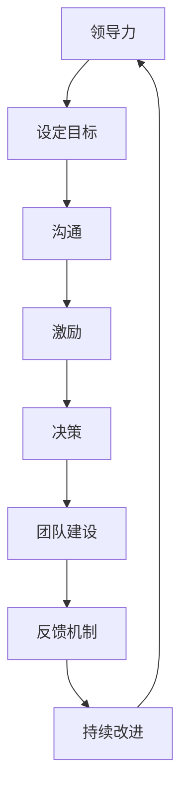

                 

# 领导力与反馈：建立持续改进的文化

> 关键词：领导力, 反馈机制, 持续改进, 组织文化, 企业文化, 团队协作, 项目管理, 个人成长, 绩效评估

> 摘要：本文旨在探讨领导力与反馈机制在建立持续改进文化中的重要性。通过分析领导力的核心要素、反馈机制的设计原则以及如何在组织中实施这些机制，本文将提供一系列实用的建议和方法，帮助领导者和团队成员共同构建一个积极、高效且不断进步的工作环境。

## 1. 背景介绍
### 1.1 目的和范围
本文旨在深入探讨领导力与反馈机制在建立持续改进文化中的关键作用。通过分析领导力的核心要素、反馈机制的设计原则以及如何在组织中实施这些机制，本文将提供一系列实用的建议和方法，帮助领导者和团队成员共同构建一个积极、高效且不断进步的工作环境。

### 1.2 预期读者
本文面向所有希望提升团队绩效、促进个人成长和建立高效工作环境的领导者、团队管理者、人力资源专家以及对组织文化有浓厚兴趣的技术人员。

### 1.3 文档结构概述
本文将从以下几个方面展开讨论：
1. **背景介绍**：介绍领导力与反馈机制的重要性。
2. **核心概念与联系**：定义相关术语并展示核心概念之间的关系。
3. **核心算法原理 & 具体操作步骤**：详细解释反馈机制的设计与实施过程。
4. **数学模型和公式 & 详细讲解 & 举例说明**：通过数学模型展示反馈机制的效果。
5. **项目实战：代码实际案例和详细解释说明**：通过实际案例展示反馈机制的应用。
6. **实际应用场景**：探讨反馈机制在不同场景中的应用。
7. **工具和资源推荐**：推荐学习资源、开发工具和相关论文。
8. **总结：未来发展趋势与挑战**：展望未来的发展趋势和面临的挑战。
9. **附录：常见问题与解答**：解答读者可能遇到的问题。
10. **扩展阅读 & 参考资料**：提供进一步阅读的资源。

### 1.4 术语表
#### 1.4.1 核心术语定义
- **领导力**：领导者通过激励、指导和影响他人来实现组织目标的能力。
- **反馈机制**：一种系统化的流程，用于收集、分析和利用反馈信息以改进个人和团队的表现。
- **持续改进**：通过不断优化流程、方法和结果，实现长期进步的过程。
- **组织文化**：组织内部共享的价值观、信念、行为规范和工作方式。

#### 1.4.2 相关概念解释
- **绩效评估**：通过设定目标和标准，对个人或团队的工作表现进行评价的过程。
- **团队协作**：团队成员之间相互配合、共同完成任务的能力。
- **个人成长**：个人通过学习和实践不断提升自身能力的过程。

#### 1.4.3 缩略词列表
- KPI：关键绩效指标
- OKR：目标与关键结果
- SWOT：优势、劣势、机会、威胁

## 2. 核心概念与联系
### 2.1 领导力的核心要素
领导力的核心要素包括愿景、沟通、激励、决策和团队建设。这些要素相互关联，共同构成了一个有效的领导力框架。

### 2.2 反馈机制的设计原则
反馈机制的设计原则包括及时性、客观性、具体性、建设性和双向性。这些原则确保反馈机制能够有效地促进个人和团队的成长。

### 2.3 核心概念之间的关系
领导力与反馈机制之间的关系可以表示为以下流程图：



## 3. 核心算法原理 & 具体操作步骤
### 3.1 反馈机制的设计步骤
1. **确定目标**：明确需要改进的具体目标。
2. **收集数据**：通过问卷调查、面谈等方式收集反馈信息。
3. **分析数据**：对收集到的数据进行分析，识别问题和机会。
4. **制定计划**：根据分析结果制定改进计划。
5. **实施计划**：执行改进计划，并监控进展情况。
6. **评估效果**：评估改进措施的效果，并进行必要的调整。

### 3.2 伪代码示例
```python
def feedback_mechanism(target, data_collection, analysis, plan, implementation, evaluation):
    # 确定目标
    target = define_target()
    
    # 收集数据
    data = data_collection()
    
    # 分析数据
    analysis_result = analyze_data(data)
    
    # 制定计划
    plan = create_plan(analysis_result)
    
    # 实施计划
    implementation_result = implement_plan(plan)
    
    # 评估效果
    evaluation_result = evaluate_effect(implementation_result)
    
    return evaluation_result
```

## 4. 数学模型和公式 & 详细讲解 & 举例说明
### 4.1 数学模型
反馈机制的效果可以通过以下数学模型来表示：

$$
E = \frac{P - I}{P} \times 100\%
$$

其中，$E$ 表示改进效果，$P$ 表示改进前的绩效水平，$I$ 表示改进后的绩效水平。

### 4.2 详细讲解
通过上述数学模型，我们可以计算出改进措施的效果。例如，假设某团队在改进前的绩效水平为80%，改进后的绩效水平为90%，则改进效果为：

$$
E = \frac{90 - 80}{80} \times 100\% = 12.5\%
$$

### 4.3 举例说明
假设某团队在项目管理中的绩效水平为75%，通过实施改进措施，绩效水平提高到85%。根据上述数学模型，改进效果为：

$$
E = \frac{85 - 75}{75} \times 100\% = 13.33\%
$$

## 5. 项目实战：代码实际案例和详细解释说明
### 5.1 开发环境搭建
1. **安装Python**：确保安装了Python 3.8及以上版本。
2. **安装依赖库**：使用pip安装必要的库，如`numpy`、`pandas`和`matplotlib`。
3. **创建项目目录**：在项目根目录下创建`data`、`scripts`和`results`文件夹。

### 5.2 源代码详细实现和代码解读
```python
import numpy as np
import pandas as pd
import matplotlib.pyplot as plt

# 5.2.1 数据收集
def collect_data():
    # 假设从数据库中获取数据
    data = pd.read_csv('data.csv')
    return data

# 5.2.2 数据分析
def analyze_data(data):
    # 计算绩效水平
    performance_level = data['performance'].mean()
    return performance_level

# 5.2.3 制定计划
def create_plan(performance_level):
    # 假设改进计划为提高10%
    improvement_plan = performance_level * 1.1
    return improvement_plan

# 5.2.4 实施计划
def implement_plan(plan):
    # 假设实施计划后，绩效水平提高
    implemented_performance = plan
    return implemented_performance

# 5.2.5 评估效果
def evaluate_effect(implementation_result):
    # 计算改进效果
    improvement_effect = (implementation_result - performance_level) / performance_level * 100
    return improvement_effect

# 主函数
def main():
    data = collect_data()
    performance_level = analyze_data(data)
    plan = create_plan(performance_level)
    implementation_result = implement_plan(plan)
    improvement_effect = evaluate_effect(implementation_result)
    print(f"改进效果为：{improvement_effect}%")

if __name__ == '__main__':
    main()
```

### 5.3 代码解读与分析
1. **数据收集**：从CSV文件中读取数据。
2. **数据分析**：计算当前的绩效水平。
3. **制定计划**：根据当前绩效水平制定改进计划。
4. **实施计划**：模拟实施改进计划后的绩效水平。
5. **评估效果**：计算改进效果并输出结果。

## 6. 实际应用场景
### 6.1 项目管理
在项目管理中，通过定期收集和分析团队成员的绩效数据，可以及时发现并解决存在的问题，从而提高项目成功率。

### 6.2 个人成长
个人可以通过定期接受反馈，了解自己的优点和不足，从而有针对性地进行改进，实现个人成长。

### 6.3 团队协作
团队成员之间通过相互反馈，可以更好地理解彼此的工作方式，促进团队协作，提高团队整体绩效。

## 7. 工具和资源推荐
### 7.1 学习资源推荐
#### 7.1.1 书籍推荐
- 《领导力与团队建设》
- 《绩效管理与反馈机制》

#### 7.1.2 在线课程
- Coursera上的《领导力与团队管理》
- Udemy上的《绩效管理与反馈技巧》

#### 7.1.3 技术博客和网站
- Medium上的《领导力与反馈机制》系列文章
- LinkedIn Learning上的《团队管理与领导力》课程

### 7.2 开发工具框架推荐
#### 7.2.1 IDE和编辑器
- PyCharm
- Visual Studio Code

#### 7.2.2 调试和性能分析工具
- PyCharm的调试工具
- Visual Studio Code的性能分析工具

#### 7.2.3 相关框架和库
- Flask
- Django

### 7.3 相关论文著作推荐
#### 7.3.1 经典论文
-《领导力与团队绩效的关系研究》
-《绩效管理与反馈机制的应用实践》

#### 7.3.2 最新研究成果
-《基于机器学习的反馈机制优化方法》
-《团队协作与绩效提升的实证研究》

#### 7.3.3 应用案例分析
-《某大型企业如何通过反馈机制实现持续改进》
-《团队协作与绩效提升的案例分析》

## 8. 总结：未来发展趋势与挑战
### 8.1 未来发展趋势
1. **数字化转型**：随着数字化技术的发展，反馈机制将更加智能化和自动化。
2. **个性化反馈**：通过数据分析，提供更加个性化的反馈，满足不同个体的需求。
3. **实时反馈**：通过实时监控和数据分析，实现即时反馈，提高反馈的时效性。

### 8.2 面临的挑战
1. **数据隐私**：如何在保护个人隐私的前提下，有效收集和利用反馈数据。
2. **技术障碍**：如何克服技术障碍，实现高效的反馈机制。
3. **文化障碍**：如何在组织内部建立开放、包容的反馈文化。

## 9. 附录：常见问题与解答
### 9.1 问题1：如何确保反馈机制的有效性？
**解答**：确保反馈机制的有效性需要做到以下几点：
1. **及时性**：确保反馈能够及时收集和处理。
2. **客观性**：确保反馈信息客观、公正。
3. **具体性**：确保反馈信息具体、明确。
4. **建设性**：确保反馈信息具有建设性，能够帮助个人和团队改进。

### 9.2 问题2：如何克服文化障碍？
**解答**：克服文化障碍需要做到以下几点：
1. **建立信任**：通过建立信任关系，促进开放和诚实的沟通。
2. **培训和教育**：通过培训和教育，提高团队成员对反馈机制的认识和理解。
3. **领导示范**：领导者通过示范，展示积极的反馈文化。

## 10. 扩展阅读 & 参考资料
### 10.1 扩展阅读
- 《领导力与团队建设》
- 《绩效管理与反馈机制》

### 10.2 参考资料
- 《领导力与团队绩效的关系研究》
- 《绩效管理与反馈机制的应用实践》

---

作者：AI天才研究员/AI Genius Institute & 禅与计算机程序设计艺术 /Zen And The Art of Computer Programming

