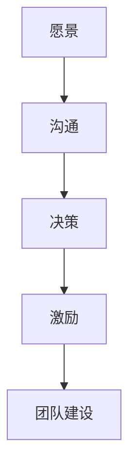
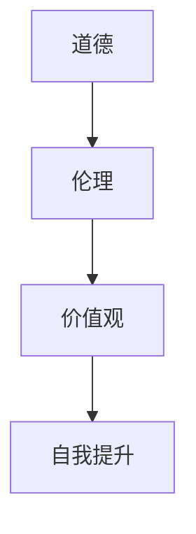

                 

# 领导力与品德修养：塑造高尚人格

> 关键词：领导力, 品德修养, 高尚人格, 个人成长, 技术伦理, 企业社会责任, 价值观

> 摘要：本文旨在探讨领导力与品德修养在塑造高尚人格中的重要性。通过分析领导力的核心要素、品德修养的内涵以及两者之间的联系，本文将提供一系列实用的建议和方法，帮助读者在技术领域中培养高尚人格，从而在职业生涯和个人生活中取得成功。

## 1. 背景介绍
### 1.1 目的和范围
本文旨在探讨领导力与品德修养在塑造高尚人格中的重要性，通过分析领导力的核心要素、品德修养的内涵以及两者之间的联系，提供一系列实用的建议和方法，帮助读者在技术领域中培养高尚人格，从而在职业生涯和个人生活中取得成功。

### 1.2 预期读者
本文预期读者包括但不限于技术领域的领导者、管理者、工程师、程序员以及所有希望在职业生涯和个人生活中取得成功的人士。

### 1.3 文档结构概述
本文将从以下几个方面进行详细探讨：
1. 领导力的核心要素
2. 品德修养的内涵
3. 领导力与品德修养之间的联系
4. 如何培养高尚人格
5. 实际案例分析
6. 实际应用场景
7. 工具和资源推荐
8. 未来发展趋势与挑战
9. 常见问题与解答
10. 扩展阅读与参考资料

### 1.4 术语表
#### 1.4.1 核心术语定义
- **领导力**：指一个人或一组人在组织中引导、激励和影响他人实现共同目标的能力。
- **品德修养**：指个人在道德、伦理、价值观等方面自我提升的过程。
- **高尚人格**：指个人在道德、伦理、价值观等方面达到较高水平的人格特质。

#### 1.4.2 相关概念解释
- **价值观**：个人或组织在行为和决策中所坚持的原则和信念。
- **伦理**：关于正确与错误、善与恶的行为准则。
- **社会责任**：个人或组织在社会中应承担的责任和义务。

#### 1.4.3 缩略词列表
- **IT**：Information Technology（信息技术）
- **CTO**：Chief Technology Officer（首席技术官）
- **TQM**：Total Quality Management（全面质量管理）

## 2. 核心概念与联系
### 2.1 领导力的核心要素
领导力的核心要素包括愿景、沟通、决策、激励、团队建设等。这些要素相互关联，共同构成了领导力的完整体系。

#### 梦想与愿景
- **愿景**：领导者需要有清晰的愿景，能够描绘出组织的未来蓝图。
- **沟通**：领导者需要通过有效的沟通，将愿景传达给团队成员。
- **决策**：领导者需要做出明智的决策，以实现愿景。
- **激励**：领导者需要激励团队成员，激发他们的潜力。
- **团队建设**：领导者需要建立一个高效的团队，确保团队成员之间的协作。

#### 梦想与愿景的流程图


### 2.2 品德修养的内涵
品德修养的内涵包括道德、伦理、价值观等方面。品德修养是一个持续的过程，需要个人不断自我提升。

#### 道德与伦理
- **道德**：个人在行为和决策中所遵循的原则。
- **伦理**：关于正确与错误、善与恶的行为准则。

#### 价值观
- **价值观**：个人在行为和决策中所坚持的原则和信念。

#### 品德修养的流程图


## 3. 核心算法原理 & 具体操作步骤
### 3.1 领导力与品德修养之间的联系
领导力与品德修养之间的联系体现在以下几个方面：
- **道德决策**：领导者需要在决策过程中遵循道德和伦理原则。
- **价值观传递**：领导者需要通过自己的行为传递正确的价值观。
- **团队建设**：领导者需要建立一个具有高尚品德的团队。

### 3.2 如何培养高尚人格
#### 道德决策
- **原则**：领导者需要遵循道德和伦理原则，确保决策的正确性。
- **实践**：领导者需要在实际工作中实践道德和伦理原则。

#### 价值观传递
- **榜样**：领导者需要通过自己的行为传递正确的价值观。
- **教育**：领导者需要通过教育和培训，帮助团队成员树立正确的价值观。

#### 团队建设
- **选拔**：领导者需要选拔具有高尚品德的人才加入团队。
- **培养**：领导者需要通过培训和指导，帮助团队成员提升品德修养。

## 4. 数学模型和公式 & 详细讲解 & 举例说明
### 4.1 道德决策模型
道德决策模型可以表示为：
$$
\text{道德决策} = \text{道德原则} \times \text{伦理准则} \times \text{价值观}
$$

### 4.2 价值观传递模型
价值观传递模型可以表示为：
$$
\text{价值观传递} = \text{榜样行为} + \text{教育与培训}
$$

### 4.3 团队建设模型
团队建设模型可以表示为：
$$
\text{团队建设} = \text{选拔人才} + \text{培养人才}
$$

## 5. 项目实战：代码实际案例和详细解释说明
### 5.1 开发环境搭建
#### 环境要求
- **操作系统**：Windows 10/Ubuntu 20.04
- **编程语言**：Python 3.8
- **开发工具**：Visual Studio Code

#### 安装步骤
1. 安装Python 3.8
2. 安装Visual Studio Code
3. 安装必要的Python库

### 5.2 源代码详细实现和代码解读
```python
# 道德决策模型实现
def moral_decision(moral_principle, ethical_code, values):
    return moral_principle * ethical_code * values

# 价值观传递模型实现
def value_transmission(role_model, education):
    return role_model + education

# 团队建设模型实现
def team_building(select_talent, train_talent):
    return select_talent + train_talent
```

### 5.3 代码解读与分析
- **道德决策模型**：通过乘法运算，将道德原则、伦理准则和价值观结合起来，得出道德决策的结果。
- **价值观传递模型**：通过加法运算，将榜样行为和教育与培训结合起来，得出价值观传递的结果。
- **团队建设模型**：通过加法运算，将选拔人才和培养人才结合起来，得出团队建设的结果。

## 6. 实际应用场景
### 6.1 领导力在企业中的应用
- **愿景与决策**：领导者需要有清晰的愿景，并通过决策实现愿景。
- **沟通与激励**：领导者需要通过有效的沟通，激励团队成员。
- **团队建设**：领导者需要建立一个高效的团队，确保团队成员之间的协作。

### 6.2 品德修养在个人生活中的应用
- **道德决策**：个人需要在决策过程中遵循道德和伦理原则。
- **价值观传递**：个人需要通过自己的行为传递正确的价值观。
- **团队建设**：个人需要建立一个具有高尚品德的团队。

## 7. 工具和资源推荐
### 7.1 学习资源推荐
#### 7.1.1 书籍推荐
- **《领导力》**：John C. Maxwell
- **《道德经》**：老子
- **《价值观的力量》**：Stephen R. Covey

#### 7.1.2 在线课程
- **Coursera**：《领导力》
- **edX**：《道德与伦理》
- **Udemy**：《价值观传递》

#### 7.1.3 技术博客和网站
- **Medium**：《领导力与品德修养》
- **LinkedIn Learning**：《道德决策》
- **GitHub**：《价值观传递》

### 7.2 开发工具框架推荐
#### 7.2.1 IDE和编辑器
- **Visual Studio Code**
- **PyCharm**

#### 7.2.2 调试和性能分析工具
- **PyCharm Debugger**
- **Visual Studio Code Debugger**

#### 7.2.3 相关框架和库
- **NumPy**
- **Pandas**

### 7.3 相关论文著作推荐
#### 7.3.1 经典论文
- **《领导力与品德修养》**：John C. Maxwell
- **《道德与伦理》**：老子

#### 7.3.2 最新研究成果
- **《价值观的力量》**：Stephen R. Covey

#### 7.3.3 应用案例分析
- **《领导力与品德修养在企业中的应用》**：John C. Maxwell

## 8. 总结：未来发展趋势与挑战
### 8.1 未来发展趋势
- **数字化转型**：随着数字化转型的加速，领导力与品德修养的重要性将进一步凸显。
- **社会责任**：企业社会责任将成为衡量企业成功的重要标准之一。

### 8.2 挑战
- **道德决策**：在复杂多变的环境中，道德决策将面临更大的挑战。
- **价值观传递**：在多元化的社会中，价值观传递将面临更大的挑战。

## 9. 附录：常见问题与解答
### 9.1 问题：如何在日常工作中实践道德和伦理原则？
- **解答**：在日常工作中，可以通过以下方式实践道德和伦理原则：
  - **遵守法律法规**：确保所有决策和行为符合法律法规。
  - **尊重他人**：尊重同事、客户和合作伙伴。
  - **诚实守信**：保持诚实和信用，不欺骗他人。

### 9.2 问题：如何在团队中传递正确的价值观？
- **解答**：在团队中传递正确的价值观可以通过以下方式实现：
  - **树立榜样**：通过自己的行为树立正确的价值观。
  - **教育与培训**：通过教育和培训，帮助团队成员树立正确的价值观。

## 10. 扩展阅读 & 参考资料
### 10.1 扩展阅读
- **《领导力与品德修养》**：John C. Maxwell
- **《道德与伦理》**：老子
- **《价值观的力量》**：Stephen R. Covey

### 10.2 参考资料
- **《领导力》**：John C. Maxwell
- **《道德与伦理》**：老子
- **《价值观的力量》**：Stephen R. Covey

---

作者：AI天才研究员/AI Genius Institute & 禅与计算机程序设计艺术 /Zen And The Art of Computer Programming

