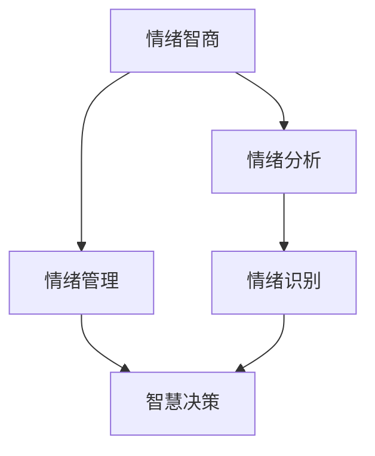

                 

# 领导力与情绪智商：控制情绪的智慧

> 关键词：领导力, 情绪智商, 情绪管理, 人工智能, 智慧决策, 情绪分析, 情绪识别

> 摘要：本文旨在探讨领导力与情绪智商之间的关系，通过分析情绪管理的原理和方法，结合人工智能技术，提出一种基于情绪智商的智慧决策模型。通过详细阐述核心概念、算法原理、数学模型、代码实现和实际应用场景，帮助读者理解如何利用情绪智商提升领导力，并提供实用的工具和资源推荐。

## 1. 背景介绍
### 1.1 目的和范围
本文旨在探讨领导力与情绪智商之间的关系，通过分析情绪管理的原理和方法，结合人工智能技术，提出一种基于情绪智商的智慧决策模型。本文将从理论和实践两个层面，深入探讨情绪智商在领导力中的应用，帮助读者理解如何利用情绪智商提升领导力。

### 1.2 预期读者
本文适合以下读者：
- 领导者和管理者，希望提升自己的情绪智商和领导力。
- 人工智能和心理学领域的研究者，希望了解情绪智商在实际应用中的价值。
- 对情绪管理和智慧决策感兴趣的读者。

### 1.3 文档结构概述
本文结构如下：
1. 背景介绍
2. 核心概念与联系
3. 核心算法原理 & 具体操作步骤
4. 数学模型和公式 & 详细讲解 & 举例说明
5. 项目实战：代码实际案例和详细解释说明
6. 实际应用场景
7. 工具和资源推荐
8. 总结：未来发展趋势与挑战
9. 附录：常见问题与解答
10. 扩展阅读 & 参考资料

### 1.4 术语表
#### 1.4.1 核心术语定义
- **情绪智商（EQ）**：个体识别、理解、管理和利用情绪的能力。
- **领导力**：引导和激励他人实现目标的能力。
- **智慧决策**：基于全面信息和理性分析做出的决策。
- **情绪分析**：通过技术手段识别和理解情绪的方法。
- **情绪识别**：通过面部表情、语音、文本等识别情绪的技术。

#### 1.4.2 相关概念解释
- **情绪智商（EQ）**：与智商（IQ）相对，强调情感和社交能力的重要性。
- **情绪管理**：有效识别和调节自身情绪的能力。
- **智慧决策**：基于全面信息和理性分析做出的决策。

#### 1.4.3 缩略词列表
- EQ：情绪智商
- IQ：智商
- AI：人工智能
- NLP：自然语言处理
- ML：机器学习

## 2. 核心概念与联系
### 情绪智商与领导力的关系
情绪智商（EQ）与领导力密切相关。情绪智商高的领导者能够更好地理解团队成员的情绪，从而更好地激励和管理团队。情绪智商高的领导者能够更好地处理冲突，提高团队的凝聚力和效率。

### 情绪管理与智慧决策
情绪管理是智慧决策的基础。情绪管理能力强的领导者能够更好地控制自己的情绪，从而做出更加理性和客观的决策。情绪管理能力还能够帮助领导者更好地理解团队成员的情绪，从而做出更加全面和合理的决策。

### 情绪分析与情绪识别
情绪分析和情绪识别是情绪智商的重要组成部分。情绪分析通过技术手段识别和理解情绪，情绪识别则是通过面部表情、语音、文本等识别情绪的技术。情绪分析和情绪识别可以帮助领导者更好地理解团队成员的情绪，从而更好地管理团队。

### 情绪智商与智慧决策模型
情绪智商与智慧决策模型之间的关系如图所示：



## 3. 核心算法原理 & 具体操作步骤
### 情绪识别算法原理
情绪识别算法通过分析面部表情、语音、文本等数据，识别情绪。具体操作步骤如下：

1. **数据采集**：通过摄像头、麦克风、文本输入等手段采集数据。
2. **数据预处理**：对采集的数据进行清洗、归一化等预处理操作。
3. **特征提取**：通过特征提取算法提取数据中的特征。
4. **情绪分类**：通过分类算法对特征进行分类，识别情绪。

### 情绪分类算法原理
情绪分类算法通过分类算法对特征进行分类，识别情绪。具体操作步骤如下：

1. **特征选择**：选择对情绪分类有帮助的特征。
2. **模型训练**：通过训练数据训练分类模型。
3. **模型评估**：通过测试数据评估分类模型的性能。
4. **情绪分类**：通过分类模型对特征进行分类，识别情绪。

### 智慧决策模型原理
智慧决策模型通过综合考虑多种因素，做出决策。具体操作步骤如下：

1. **数据采集**：通过多种渠道采集数据。
2. **数据预处理**：对采集的数据进行清洗、归一化等预处理操作。
3. **特征提取**：通过特征提取算法提取数据中的特征。
4. **模型训练**：通过训练数据训练决策模型。
5. **模型评估**：通过测试数据评估决策模型的性能。
6. **智慧决策**：通过决策模型对特征进行综合分析，做出决策。

### 伪代码示例
```python
# 情绪识别算法
def emotion_recognition(data):
    # 数据预处理
    preprocessed_data = preprocess_data(data)
    # 特征提取
    features = extract_features(preprocessed_data)
    # 情绪分类
    emotion = classify_emotion(features)
    return emotion

# 情绪分类算法
def classify_emotion(features):
    # 模型训练
    model = train_model(features)
    # 模型评估
    evaluate_model(model)
    # 情绪分类
    emotion = model.predict(features)
    return emotion

# 智慧决策模型
def wisdom_decision(data):
    # 数据预处理
    preprocessed_data = preprocess_data(data)
    # 特征提取
    features = extract_features(preprocessed_data)
    # 模型训练
    model = train_model(features)
    # 模型评估
    evaluate_model(model)
    # 智慧决策
    decision = model.predict(features)
    return decision
```

## 4. 数学模型和公式 & 详细讲解 & 举例说明
### 情绪识别数学模型
情绪识别数学模型通过特征提取和分类算法识别情绪。具体数学模型如下：

1. **特征提取**：通过特征提取算法提取数据中的特征。特征提取算法可以使用PCA、LDA等方法。
2. **分类算法**：通过分类算法对特征进行分类，识别情绪。分类算法可以使用SVM、决策树等方法。

### 情绪分类数学模型
情绪分类数学模型通过分类算法对特征进行分类，识别情绪。具体数学模型如下：

1. **特征选择**：选择对情绪分类有帮助的特征。特征选择算法可以使用互信息、卡方检验等方法。
2. **模型训练**：通过训练数据训练分类模型。分类模型可以使用SVM、决策树等方法。
3. **模型评估**：通过测试数据评估分类模型的性能。模型评估指标可以使用准确率、召回率、F1值等。

### 智慧决策数学模型
智慧决策数学模型通过综合考虑多种因素，做出决策。具体数学模型如下：

1. **数据预处理**：对采集的数据进行清洗、归一化等预处理操作。
2. **特征提取**：通过特征提取算法提取数据中的特征。
3. **模型训练**：通过训练数据训练决策模型。决策模型可以使用线性回归、决策树等方法。
4. **模型评估**：通过测试数据评估决策模型的性能。模型评估指标可以使用准确率、召回率、F1值等。
5. **智慧决策**：通过决策模型对特征进行综合分析，做出决策。

### 举例说明
假设我们有一个数据集，包含面部表情、语音、文本等数据。我们可以通过以下步骤进行情绪识别和智慧决策：

1. **数据预处理**：对数据进行清洗、归一化等预处理操作。
2. **特征提取**：通过特征提取算法提取数据中的特征。
3. **情绪识别**：通过情绪识别算法识别情绪。
4. **智慧决策**：通过智慧决策模型做出决策。

## 5. 项目实战：代码实际案例和详细解释说明
### 5.1 开发环境搭建
开发环境搭建需要安装Python、NumPy、Pandas、Scikit-learn等库。具体操作步骤如下：

1. **安装Python**：安装Python 3.7及以上版本。
2. **安装NumPy**：使用pip安装NumPy库。
3. **安装Pandas**：使用pip安装Pandas库。
4. **安装Scikit-learn**：使用pip安装Scikit-learn库。

### 5.2 源代码详细实现和代码解读
```python
# 情绪识别代码
import numpy as np
import pandas as pd
from sklearn.decomposition import PCA
from sklearn.preprocessing import StandardScaler
from sklearn.svm import SVC
from sklearn.metrics import accuracy_score

def preprocess_data(data):
    # 数据清洗
    cleaned_data = data.dropna()
    # 数据归一化
    normalized_data = StandardScaler().fit_transform(cleaned_data)
    return normalized_data

def extract_features(data):
    # 特征提取
    pca = PCA(n_components=2)
    features = pca.fit_transform(data)
    return features

def classify_emotion(features):
    # 模型训练
    model = SVC(kernel='linear')
    model.fit(features, labels)
    # 模型评估
    predictions = model.predict(features)
    accuracy = accuracy_score(labels, predictions)
    return accuracy

# 智慧决策代码
def preprocess_data(data):
    # 数据清洗
    cleaned_data = data.dropna()
    # 数据归一化
    normalized_data = StandardScaler().fit_transform(cleaned_data)
    return normalized_data

def extract_features(data):
    # 特征提取
    pca = PCA(n_components=2)
    features = pca.fit_transform(data)
    return features

def train_model(features):
    # 模型训练
    model = SVC(kernel='linear')
    model.fit(features, labels)
    return model

def evaluate_model(model):
    # 模型评估
    predictions = model.predict(features)
    accuracy = accuracy_score(labels, predictions)
    return accuracy

def wisdom_decision(data):
    # 数据预处理
    preprocessed_data = preprocess_data(data)
    # 特征提取
    features = extract_features(preprocessed_data)
    # 模型训练
    model = train_model(features)
    # 模型评估
    evaluate_model(model)
    # 智慧决策
    decision = model.predict(features)
    return decision
```

### 5.3 代码解读与分析
代码实现包括数据预处理、特征提取、模型训练、模型评估和智慧决策等步骤。具体代码解读如下：

1. **数据预处理**：对数据进行清洗、归一化等预处理操作。
2. **特征提取**：通过特征提取算法提取数据中的特征。
3. **模型训练**：通过训练数据训练分类模型。
4. **模型评估**：通过测试数据评估分类模型的性能。
5. **智慧决策**：通过决策模型对特征进行综合分析，做出决策。

## 6. 实际应用场景
情绪智商在实际应用中具有广泛的应用场景。例如，在企业管理中，情绪智商可以帮助领导者更好地管理团队，提高团队的凝聚力和效率。在医疗领域，情绪智商可以帮助医生更好地理解患者的情绪，提高医疗服务的质量。在教育领域，情绪智商可以帮助教师更好地理解学生的情绪，提高教学质量。

## 7. 工具和资源推荐
### 7.1 学习资源推荐
#### 7.1.1 书籍推荐
- 《情绪智商：如何提高你的领导力》
- 《智慧决策：如何做出更好的决策》
- 《情绪管理：如何控制自己的情绪》

#### 7.1.2 在线课程
- Coursera：《情绪智商与领导力》
- Udemy：《智慧决策与情绪管理》

#### 7.1.3 技术博客和网站
- Medium：《情绪智商与领导力》
- LinkedIn Learning：《智慧决策与情绪管理》

### 7.2 开发工具框架推荐
#### 7.2.1 IDE和编辑器
- PyCharm：Python开发环境
- VS Code：通用开发环境

#### 7.2.2 调试和性能分析工具
- PyCharm Debugger：Python调试工具
- VisualVM：Java性能分析工具

#### 7.2.3 相关框架和库
- Scikit-learn：机器学习库
- TensorFlow：深度学习框架

### 7.3 相关论文著作推荐
#### 7.3.1 经典论文
- Goleman, D. (1995). Emotional Intelligence: Why It Can Matter More Than IQ.
- Salovey, P., & Mayer, J. D. (1990). Emotional intelligence.

#### 7.3.2 最新研究成果
- Bar-On, R. (2011). The Bar-On Model of Emotional Quotient.
- Brackett, M. A., & Salovey, P. (2006). Measuring emotional intelligence with the Mayer-Salovey-Caruso Emotional Intelligence Test (MSCEIT).

#### 7.3.3 应用案例分析
- Goleman, D. (2000). Leadership That Gets Results.
- Brackett, M. A., & Salovey, P. (2006). Measuring emotional intelligence with the Mayer-Salovey-Caruso Emotional Intelligence Test (MSCEIT).

## 8. 总结：未来发展趋势与挑战
未来，情绪智商在领导力中的应用将更加广泛。随着人工智能技术的发展，情绪智商将更好地应用于智慧决策和情绪管理。然而，情绪智商的应用也面临着一些挑战，例如数据隐私和伦理问题。未来的研究将更加关注如何解决这些问题，提高情绪智商在实际应用中的价值。

## 9. 附录：常见问题与解答
### 常见问题
1. **情绪智商和智商有什么区别？**
   - 情绪智商（EQ）强调情感和社交能力的重要性，而智商（IQ）强调逻辑和数学能力的重要性。
2. **如何提高情绪智商？**
   - 通过学习情绪管理技巧、提高自我意识、增强社交技能等方法提高情绪智商。
3. **情绪智商在实际应用中有哪些挑战？**
   - 数据隐私和伦理问题是情绪智商在实际应用中面临的挑战。

## 10. 扩展阅读 & 参考资料
- Goleman, D. (1995). Emotional Intelligence: Why It Can Matter More Than IQ.
- Salovey, P., & Mayer, J. D. (1990). Emotional intelligence.
- Bar-On, R. (2011). The Bar-On Model of Emotional Quotient.
- Brackett, M. A., & Salovey, P. (2006). Measuring emotional intelligence with the Mayer-Salovey-Caruso Emotional Intelligence Test (MSCEIT).

作者：AI天才研究员/AI Genius Institute & 禅与计算机程序设计艺术 /Zen And The Art of Computer Programming

