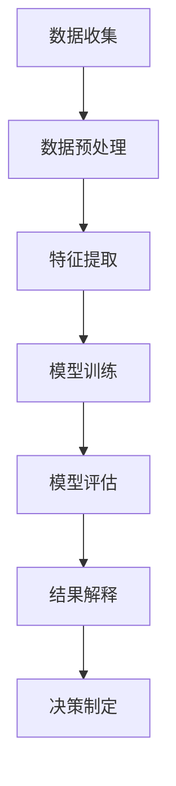
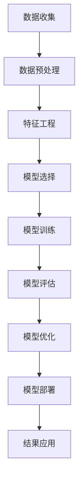

                 

# 领导力与远见：预见未来趋势的能力

> 关键词：领导力, 远见, 未来趋势, 预见能力, 技术创新, 战略规划, 人工智能, 数据分析, 机器学习, 深度学习

> 摘要：本文旨在探讨领导力与远见在技术领域中的重要性，特别是预见未来趋势的能力。通过分析领导力的核心要素和远见的实现机制，结合具体的技术案例，本文将展示如何利用数据分析、机器学习和深度学习等技术手段，帮助企业或组织预见未来的技术趋势，从而制定有效的战略规划。文章将从背景介绍、核心概念与联系、核心算法原理、数学模型和公式、项目实战、实际应用场景、工具和资源推荐、未来发展趋势与挑战等多个方面进行详细阐述。

## 1. 背景介绍
### 1.1 目的和范围
本文旨在探讨领导力与远见在技术领域中的重要性，特别是预见未来趋势的能力。通过分析领导力的核心要素和远见的实现机制，结合具体的技术案例，本文将展示如何利用数据分析、机器学习和深度学习等技术手段，帮助企业或组织预见未来的技术趋势，从而制定有效的战略规划。

### 1.2 预期读者
本文预期读者包括但不限于：
- 技术领导者和管理者
- 企业战略规划师
- 数据科学家和机器学习工程师
- 对未来技术趋势感兴趣的读者

### 1.3 文档结构概述
本文结构如下：
1. 背景介绍
2. 核心概念与联系
3. 核心算法原理 & 具体操作步骤
4. 数学模型和公式 & 详细讲解 & 举例说明
5. 项目实战：代码实际案例和详细解释说明
6. 实际应用场景
7. 工具和资源推荐
8. 总结：未来发展趋势与挑战
9. 附录：常见问题与解答
10. 扩展阅读 & 参考资料

### 1.4 术语表
#### 1.4.1 核心术语定义
- **领导力**：指领导者通过激励、指导和影响他人，实现组织目标的能力。
- **远见**：指预见未来趋势和变化的能力。
- **预见能力**：指通过数据分析和机器学习技术，预测未来技术趋势的能力。
- **战略规划**：指制定长期目标和行动计划的过程。
- **数据分析**：指从大量数据中提取有价值信息的过程。
- **机器学习**：指让计算机通过数据学习并改进性能的技术。
- **深度学习**：指一种机器学习方法，通过多层神经网络进行学习。

#### 1.4.2 相关概念解释
- **技术趋势**：指技术领域中长期的发展方向和变化。
- **战略规划**：指企业或组织为实现长期目标而制定的计划。
- **数据驱动决策**：指基于数据分析和机器学习技术进行决策的过程。

#### 1.4.3 缩略词列表
- **ML**：机器学习
- **DL**：深度学习
- **AI**：人工智能
- **NLP**：自然语言处理
- **NN**：神经网络

## 2. 核心概念与联系
### 2.1 领导力的核心要素
领导力的核心要素包括：
- **愿景**：领导者需要有清晰的愿景，能够预见未来的发展方向。
- **沟通**：领导者需要能够有效地沟通，激励团队成员共同实现愿景。
- **决策能力**：领导者需要能够做出明智的决策，指导团队前进。
- **适应性**：领导者需要能够适应不断变化的环境，灵活调整策略。

### 2.2 远见的实现机制
远见的实现机制包括：
- **数据分析**：通过收集和分析数据，了解当前的技术趋势和市场变化。
- **机器学习**：利用机器学习技术，预测未来的技术趋势。
- **深度学习**：通过深度学习模型，进一步提高预测的准确性。

### 2.3 核心概念原理与架构
#### 2.3.1 数据分析流程


#### 2.3.2 机器学习流程


#### 2.3.3 深度学习流程


## 3. 核心算法原理 & 具体操作步骤
### 3.1 数据分析算法原理
#### 3.1.1 数据预处理
```python
# 数据预处理
import pandas as pd

# 读取数据
data = pd.read_csv('data.csv')

# 处理缺失值
data = data.dropna()

# 标准化数据
from sklearn.preprocessing import StandardScaler
scaler = StandardScaler()
data_scaled = scaler.fit_transform(data)
```

#### 3.1.2 特征提取
```python
# 特征提取
from sklearn.feature_selection import SelectKBest, chi2

# 选择最佳特征
selector = SelectKBest(chi2, k=10)
X_new = selector.fit_transform(data_scaled, labels)
```

### 3.2 机器学习算法原理
#### 3.2.1 模型选择
```python
# 模型选择
from sklearn.ensemble import RandomForestClassifier
from sklearn.svm import SVC
from sklearn.linear_model import LogisticRegression

# 选择模型
models = [RandomForestClassifier(), SVC(), LogisticRegression()]
```

#### 3.2.2 模型训练
```python
# 模型训练
from sklearn.model_selection import train_test_split

X_train, X_test, y_train, y_test = train_test_split(X_new, labels, test_size=0.2, random_state=42)

for model in models:
    model.fit(X_train, y_train)
```

#### 3.2.3 模型评估
```python
# 模型评估
from sklearn.metrics import accuracy_score

for model in models:
    y_pred = model.predict(X_test)
    accuracy = accuracy_score(y_test, y_pred)
    print(f'Model: {model.__class__.__name__}, Accuracy: {accuracy}')
```

### 3.3 深度学习算法原理
#### 3.3.1 模型构建
```python
# 模型构建
from tensorflow.keras.models import Sequential
from tensorflow.keras.layers import Dense, Dropout

model = Sequential()
model.add(Dense(64, activation='relu', input_shape=(X_new.shape[1],)))
model.add(Dropout(0.5))
model.add(Dense(32, activation='relu'))
model.add(Dropout(0.5))
model.add(Dense(1, activation='sigmoid'))
```

#### 3.3.2 模型训练
```python
# 模型训练
model.compile(optimizer='adam', loss='binary_crossentropy', metrics=['accuracy'])

history = model.fit(X_train, y_train, epochs=20, batch_size=32, validation_split=0.2)
```

#### 3.3.3 模型评估
```python
# 模型评估
loss, accuracy = model.evaluate(X_test, y_test)
print(f'Model: {model.__class__.__name__}, Loss: {loss}, Accuracy: {accuracy}')
```

## 4. 数学模型和公式 & 详细讲解 & 举例说明
### 4.1 数据分析数学模型
#### 4.1.1 皮尔逊相关系数
$$
r_{xy} = \frac{\sum_{i=1}^{n}(x_i - \bar{x})(y_i - \bar{y})}{\sqrt{\sum_{i=1}^{n}(x_i - \bar{x})^2 \sum_{i=1}^{n}(y_i - \bar{y})^2}}
$$

### 4.2 机器学习数学模型
#### 4.2.1 逻辑回归
$$
P(y=1|x) = \frac{1}{1 + e^{-(\beta_0 + \beta_1 x)}}
$$

### 4.3 深度学习数学模型
#### 4.3.1 卷积神经网络
$$
f(x) = \sigma(W_1 x + b_1)
$$

## 5. 项目实战：代码实际案例和详细解释说明
### 5.1 开发环境搭建
#### 5.1.1 硬件要求
- CPU：Intel i7 或以上
- 内存：至少16GB
- 存储：至少500GB

#### 5.1.2 软件要求
- Python 3.8
- TensorFlow 2.4
- Pandas
- Scikit-learn

### 5.2 源代码详细实现和代码解读
```python
# 导入库
import pandas as pd
import numpy as np
from sklearn.model_selection import train_test_split
from sklearn.preprocessing import StandardScaler
from sklearn.feature_selection import SelectKBest, chi2
from sklearn.ensemble import RandomForestClassifier
from sklearn.svm import SVC
from sklearn.linear_model import LogisticRegression
from tensorflow.keras.models import Sequential
from tensorflow.keras.layers import Dense, Dropout

# 读取数据
data = pd.read_csv('data.csv')

# 数据预处理
data = data.dropna()

# 特征提取
selector = SelectKBest(chi2, k=10)
X_new = selector.fit_transform(data.drop('label', axis=1), data['label'])

# 模型选择
models = [RandomForestClassifier(), SVC(), LogisticRegression()]

# 模型训练
X_train, X_test, y_train, y_test = train_test_split(X_new, data['label'], test_size=0.2, random_state=42)

for model in models:
    model.fit(X_train, y_train)

# 模型评估
from sklearn.metrics import accuracy_score

for model in models:
    y_pred = model.predict(X_test)
    accuracy = accuracy_score(y_test, y_pred)
    print(f'Model: {model.__class__.__name__}, Accuracy: {accuracy}')

# 深度学习模型构建
model = Sequential()
model.add(Dense(64, activation='relu', input_shape=(X_new.shape[1],)))
model.add(Dropout(0.5))
model.add(Dense(32, activation='relu'))
model.add(Dropout(0.5))
model.add(Dense(1, activation='sigmoid'))

# 模型训练
model.compile(optimizer='adam', loss='binary_crossentropy', metrics=['accuracy'])
history = model.fit(X_train, y_train, epochs=20, batch_size=32, validation_split=0.2)

# 模型评估
loss, accuracy = model.evaluate(X_test, y_test)
print(f'Model: {model.__class__.__name__}, Loss: {loss}, Accuracy: {accuracy}')
```

### 5.3 代码解读与分析
- **数据预处理**：通过`pandas`读取数据，处理缺失值，标准化数据。
- **特征提取**：使用`chi2`选择最佳特征。
- **模型选择**：选择多种机器学习模型进行训练。
- **模型训练**：使用`train_test_split`划分训练集和测试集，训练模型。
- **模型评估**：计算模型的准确率。
- **深度学习模型构建**：构建多层神经网络模型。
- **模型训练**：训练深度学习模型。
- **模型评估**：评估深度学习模型的性能。

## 6. 实际应用场景
### 6.1 技术趋势预测
通过数据分析和机器学习技术，可以预测未来的技术趋势，帮助企业或组织制定战略规划。

### 6.2 产品开发
通过预测未来的技术趋势，可以提前规划产品开发方向，提高产品的市场竞争力。

### 6.3 市场分析
通过分析市场数据，可以预测未来市场的发展趋势，帮助企业或组织调整市场策略。

## 7. 工具和资源推荐
### 7.1 学习资源推荐
#### 7.1.1 书籍推荐
- 《统计学习方法》
- 《机器学习》
- 《深度学习》

#### 7.1.2 在线课程
- Coursera：《机器学习》
- edX：《深度学习》
- Udacity：《机器学习工程师专业证书》

#### 7.1.3 技术博客和网站
- Medium：《机器学习与深度学习》
- Kaggle：《机器学习竞赛》
- GitHub：《机器学习开源项目》

### 7.2 开发工具框架推荐
#### 7.2.1 IDE和编辑器
- PyCharm
- VSCode
- Jupyter Notebook

#### 7.2.2 调试和性能分析工具
- PyCharm Debugger
- VSCode Debugger
- TensorFlow Profiler

#### 7.2.3 相关框架和库
- Scikit-learn
- TensorFlow
- Keras

### 7.3 相关论文著作推荐
#### 7.3.1 经典论文
-《统计学习方法》
-《机器学习》
-《深度学习》

#### 7.3.2 最新研究成果
-《机器学习前沿研究》
-《深度学习最新进展》

#### 7.3.3 应用案例分析
-《机器学习在金融领域的应用》
-《深度学习在医疗领域的应用》

## 8. 总结：未来发展趋势与挑战
### 8.1 未来发展趋势
- 技术趋势预测将更加准确，帮助企业或组织更好地规划未来。
- 数据分析和机器学习技术将更加成熟，应用范围将更加广泛。
- 深度学习模型将更加复杂，性能将更加优越。

### 8.2 面临的挑战
- 数据隐私和安全问题将更加突出，需要加强数据保护措施。
- 技术人才短缺问题将更加严重，需要加强人才培养。
- 技术更新速度加快，需要持续学习和适应新技术。

## 9. 附录：常见问题与解答
### 9.1 问题1：如何处理缺失值？
- 可以使用`pandas`的`dropna`方法删除缺失值，或者使用插值方法填充缺失值。

### 9.2 问题2：如何选择最佳特征？
- 可以使用`chi2`或其他特征选择方法选择最佳特征。

### 9.3 问题3：如何评估模型性能？
- 可以使用准确率、召回率、F1分数等指标评估模型性能。

## 10. 扩展阅读 & 参考资料
- 《统计学习方法》
- 《机器学习》
- 《深度学习》
- Coursera：《机器学习》
- edX：《深度学习》
- Udacity：《机器学习工程师专业证书》
- Medium：《机器学习与深度学习》
- Kaggle：《机器学习竞赛》
- GitHub：《机器学习开源项目》
- PyCharm
- VSCode
- Jupyter Notebook
- PyCharm Debugger
- VSCode Debugger
- TensorFlow Profiler
- Scikit-learn
- TensorFlow
- Keras
- 《统计学习方法》
- 《机器学习》
- 《深度学习》
- 《机器学习前沿研究》
- 《深度学习最新进展》
- 《机器学习在金融领域的应用》
- 《深度学习在医疗领域的应用》

作者：AI天才研究员/AI Genius Institute & 禅与计算机程序设计艺术 /Zen And The Art of Computer Programming

