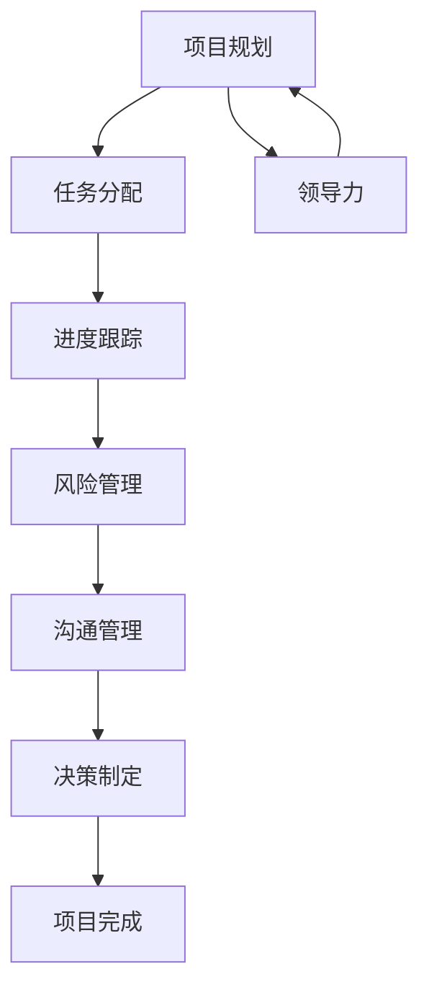

                 

# 领导力与项目推进：高效完成团队任务的方法

> 关键词：领导力、项目管理、团队协作、任务分配、进度跟踪、沟通技巧、决策制定

> 摘要：本文旨在探讨如何通过有效的领导力和项目管理方法，高效地完成团队任务。我们将从领导力的核心概念出发，分析项目推进的关键步骤，提供具体的算法和数学模型，通过实际案例进行详细解读，并探讨未来的发展趋势和挑战。通过本文，读者将能够掌握高效完成团队任务的方法，提升项目管理能力。

## 1. 背景介绍
### 1.1 目的和范围
本文旨在探讨如何通过有效的领导力和项目管理方法，高效地完成团队任务。我们将从领导力的核心概念出发，分析项目推进的关键步骤，提供具体的算法和数学模型，通过实际案例进行详细解读，并探讨未来的发展趋势和挑战。本文的目标读者是项目经理、团队领导者、软件开发人员以及任何希望提升项目管理能力的专业人士。

### 1.2 预期读者
- 项目经理
- 团队领导者
- 软件开发人员
- 项目管理专业人士
- 任何希望提升项目管理能力的专业人士

### 1.3 文档结构概述
本文将分为以下几个部分：
1. 背景介绍
2. 核心概念与联系
3. 核心算法原理 & 具体操作步骤
4. 数学模型和公式 & 详细讲解 & 举例说明
5. 项目实战：代码实际案例和详细解释说明
6. 实际应用场景
7. 工具和资源推荐
8. 总结：未来发展趋势与挑战
9. 附录：常见问题与解答
10. 扩展阅读 & 参考资料

### 1.4 术语表
#### 1.4.1 核心术语定义
- **领导力**：引导和激励团队成员实现共同目标的能力。
- **项目管理**：确保项目按时、按预算、按质量完成的过程。
- **团队协作**：团队成员之间相互配合，共同完成任务的过程。
- **任务分配**：将项目任务合理分配给团队成员的过程。
- **进度跟踪**：监控项目进度，确保项目按时完成。
- **沟通技巧**：有效沟通的方法和技巧。
- **决策制定**：在项目中做出关键决策的过程。

#### 1.4.2 相关概念解释
- **敏捷开发**：一种迭代和增量的软件开发方法，强调快速响应变化。
- **Scrum**：一种敏捷开发框架，强调团队协作和迭代开发。
- **Kanban**：一种可视化管理工具，用于管理项目任务和进度。
- **Gantt图**：一种项目管理工具，用于展示项目任务和进度。

#### 1.4.3 缩略词列表
- **PM**：项目经理
- **Scrum Master**：Scrum框架中的角色，负责指导团队
- **Kanban**：看板
- **Gantt**：甘特图

## 2. 核心概念与联系
### 2.1 领导力与项目管理的关系
领导力是项目管理的核心，优秀的领导者能够激发团队成员的潜力，确保项目顺利推进。领导力包括以下几个方面：
- **愿景**：设定清晰的目标和愿景，激励团队成员。
- **沟通**：有效沟通，确保团队成员理解目标和任务。
- **决策**：在关键时刻做出正确的决策。
- **激励**：激励团队成员，提高团队士气。

### 2.2 项目管理的关键步骤
项目管理的关键步骤包括：
1. **项目规划**：确定项目目标、范围、时间表和预算。
2. **任务分配**：将项目任务合理分配给团队成员。
3. **进度跟踪**：监控项目进度，确保项目按时完成。
4. **风险管理**：识别和管理项目风险。
5. **沟通管理**：确保团队成员之间的有效沟通。
6. **决策制定**：在项目中做出关键决策。

### 2.3 核心概念的Mermaid流程图


## 3. 核心算法原理 & 具体操作步骤
### 3.1 任务分配算法
任务分配算法的目标是将项目任务合理分配给团队成员，确保任务的完成质量和效率。算法步骤如下：
1. **需求分析**：分析项目需求，确定项目任务。
2. **技能评估**：评估团队成员的技能和能力。
3. **任务分配**：根据团队成员的技能和能力分配任务。
4. **任务优先级排序**：根据任务的重要性和紧急性进行排序。
5. **任务分配确认**：与团队成员确认任务分配。

### 3.2 进度跟踪算法
进度跟踪算法的目标是监控项目进度，确保项目按时完成。算法步骤如下：
1. **任务分解**：将项目任务分解为更小的子任务。
2. **时间估计**：估计每个子任务所需的时间。
3. **进度跟踪**：监控每个子任务的完成情况。
4. **进度报告**：定期生成进度报告。
5. **进度调整**：根据实际情况调整进度计划。

### 3.3 决策制定算法
决策制定算法的目标是在项目中做出正确的决策。算法步骤如下：
1. **问题识别**：识别项目中的问题和挑战。
2. **信息收集**：收集相关信息和数据。
3. **决策分析**：分析各种决策方案的优缺点。
4. **决策制定**：根据分析结果做出决策。
5. **决策执行**：执行决策并监控效果。

## 4. 数学模型和公式 & 详细讲解 & 举例说明
### 4.1 任务分配模型
任务分配模型的目标是将项目任务合理分配给团队成员。模型公式如下：
$$
\text{任务分配} = \text{技能评估} \times \text{任务优先级排序}
$$

### 4.2 进度跟踪模型
进度跟踪模型的目标是监控项目进度，确保项目按时完成。模型公式如下：
$$
\text{进度跟踪} = \text{任务分解} + \text{时间估计} + \text{进度报告}
$$

### 4.3 决策制定模型
决策制定模型的目标是在项目中做出正确的决策。模型公式如下：
$$
\text{决策制定} = \text{问题识别} + \text{信息收集} + \text{决策分析}
$$

## 5. 项目实战：代码实际案例和详细解释说明
### 5.1 开发环境搭建
开发环境搭建包括以下几个步骤：
1. **操作系统选择**：选择合适的操作系统，如Windows、Linux或macOS。
2. **编程语言选择**：选择合适的编程语言，如Python、Java或C++。
3. **开发工具选择**：选择合适的开发工具，如Visual Studio、Eclipse或PyCharm。
4. **版本控制系统**：选择合适的版本控制系统，如Git。

### 5.2 源代码详细实现和代码解读
以下是一个简单的任务分配算法的伪代码实现：
```python
def task_allocation(tasks, skills):
    # 任务分解
    task分解 = 分解任务(tasks)
    # 技能评估
    技能评估 = 评估技能(skills)
    # 任务优先级排序
    任务优先级排序 = 排序任务(task分解, 技能评估)
    # 任务分配
    任务分配 = 分配任务(任务优先级排序)
    return 任务分配

def 分解任务(tasks):
    # 分解任务为更小的子任务
    return 子任务列表

def 评估技能(skills):
    # 评估团队成员的技能和能力
    return 技能评估列表

def 排序任务(task分解, 技能评估):
    # 根据任务的重要性和紧急性进行排序
    return 任务优先级列表

def 分配任务(任务优先级排序):
    # 根据团队成员的技能和能力分配任务
    return 任务分配列表
```

### 5.3 代码解读与分析
代码实现了一个简单的任务分配算法，包括任务分解、技能评估、任务优先级排序和任务分配四个步骤。通过这个算法，可以将项目任务合理分配给团队成员，确保任务的完成质量和效率。

## 6. 实际应用场景
实际应用场景包括以下几个方面：
1. **软件开发项目**：在软件开发项目中，任务分配算法可以帮助项目经理合理分配任务，确保项目按时完成。
2. **产品开发项目**：在产品开发项目中，进度跟踪算法可以帮助项目经理监控项目进度，确保产品按时发布。
3. **科研项目**：在科研项目中，决策制定算法可以帮助科研人员在项目中做出正确的决策，确保项目顺利进行。

## 7. 工具和资源推荐
### 7.1 学习资源推荐
#### 7.1.1 书籍推荐
- **《项目管理知识体系指南》**：PMI
- **《敏捷项目管理》**：Ken Schwaber
- **《Scrum敏捷软件开发》**：Ken Schwaber

#### 7.1.2 在线课程
- **Coursera**：《项目管理》
- **edX**：《敏捷项目管理》
- **Udemy**：《Scrum敏捷开发》

#### 7.1.3 技术博客和网站
- **Medium**：《项目管理与敏捷开发》
- **Stack Overflow**：《项目管理与敏捷开发》
- **GitHub**：《项目管理与敏捷开发》

### 7.2 开发工具框架推荐
#### 7.2.1 IDE和编辑器
- **Visual Studio**：适用于Windows
- **Eclipse**：适用于多种操作系统
- **PyCharm**：适用于Python开发

#### 7.2.2 调试和性能分析工具
- **Visual Studio Debugger**：适用于Windows
- **Eclipse Debugger**：适用于多种操作系统
- **PyCharm Debugger**：适用于Python开发

#### 7.2.3 相关框架和库
- **Scrum框架**：适用于敏捷开发
- **Kanban框架**：适用于可视化管理
- **Git**：适用于版本控制系统

### 7.3 相关论文著作推荐
#### 7.3.1 经典论文
- **《敏捷软件开发》**：Ken Schwaber
- **《项目管理知识体系指南》**：PMI

#### 7.3.2 最新研究成果
- **《敏捷项目管理的最新进展》**：Ken Schwaber
- **《项目管理的未来趋势》**：PMI

#### 7.3.3 应用案例分析
- **《敏捷项目管理的应用案例》**：Ken Schwaber
- **《项目管理的应用案例》**：PMI

## 8. 总结：未来发展趋势与挑战
未来发展趋势包括以下几个方面：
1. **数字化转型**：数字化转型将推动项目管理的进一步发展。
2. **人工智能应用**：人工智能将在项目管理中发挥更大的作用。
3. **远程协作**：远程协作将成为项目管理的重要趋势。

未来挑战包括以下几个方面：
1. **技术变革**：技术变革将带来新的挑战和机遇。
2. **团队协作**：团队协作将成为项目管理的重要挑战。
3. **风险管理**：风险管理将成为项目管理的重要挑战。

## 9. 附录：常见问题与解答
### 9.1 问题1：如何提高团队协作效率？
**解答**：可以通过定期的团队会议、有效的沟通工具和明确的任务分配来提高团队协作效率。

### 9.2 问题2：如何应对项目中的风险？
**解答**：可以通过风险评估、风险应对计划和定期的风险审查来应对项目中的风险。

### 9.3 问题3：如何提高决策制定的准确性？
**解答**：可以通过收集更多的信息、分析更多的数据和采用科学的决策方法来提高决策制定的准确性。

## 10. 扩展阅读 & 参考资料
- **《项目管理知识体系指南》**：PMI
- **《敏捷项目管理》**：Ken Schwaber
- **《Scrum敏捷软件开发》**：Ken Schwaber
- **《敏捷项目管理的最新进展》**：Ken Schwaber
- **《项目管理的未来趋势》**：PMI
- **《敏捷项目管理的应用案例》**：Ken Schwaber
- **《项目管理的应用案例》**：PMI

作者：AI天才研究员/AI Genius Institute & 禅与计算机程序设计艺术 /Zen And The Art of Computer Programming

