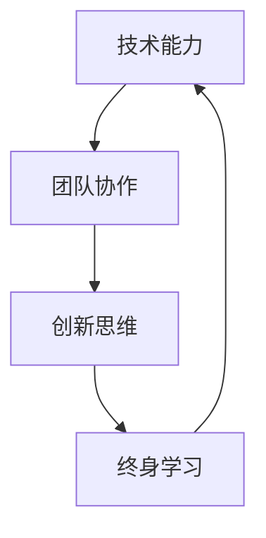

                 

# 领导力修炼笔记：00后职场新星的逆袭之路

> 关键词：00后、职场新星、逆袭之路、领导力、技术能力、团队协作、创新思维、终身学习

> 摘要：本文旨在探讨00后职场新星如何通过技术能力、团队协作、创新思维和终身学习等多方面修炼，实现职场逆袭。我们将通过分析案例、讲解核心概念、展示具体操作步骤、数学模型和公式，以及实战代码案例，帮助读者理解并掌握这些关键技能。文章结构紧凑，逻辑清晰，适合技术爱好者和职场新人阅读。

## 1. 背景介绍
### 1.1 目的和范围
本文旨在探讨00后职场新星如何通过技术能力、团队协作、创新思维和终身学习等多方面修炼，实现职场逆袭。我们将通过分析案例、讲解核心概念、展示具体操作步骤、数学模型和公式，以及实战代码案例，帮助读者理解并掌握这些关键技能。

### 1.2 预期读者
本文预期读者包括但不限于：
- 00后职场新人
- 技术爱好者
- 职场新人
- 团队领导者
- 教育工作者

### 1.3 文档结构概述
本文结构如下：
1. 背景介绍
2. 核心概念与联系
3. 核心算法原理 & 具体操作步骤
4. 数学模型和公式 & 详细讲解 & 举例说明
5. 项目实战：代码实际案例和详细解释说明
6. 实际应用场景
7. 工具和资源推荐
8. 总结：未来发展趋势与挑战
9. 附录：常见问题与解答
10. 扩展阅读 & 参考资料

### 1.4 术语表
#### 1.4.1 核心术语定义
- **00后**：指2000年左右出生的人。
- **职场新星**：指在职场上表现出色、具有潜力的新一代人才。
- **逆袭**：指通过努力和智慧，从不利的处境中脱颖而出。

#### 1.4.2 相关概念解释
- **技术能力**：指掌握和运用技术的能力。
- **团队协作**：指团队成员之间有效合作的能力。
- **创新思维**：指能够提出新颖想法和解决方案的能力。
- **终身学习**：指持续学习和提升自我能力的过程。

#### 1.4.3 缩略词列表
- **API**：Application Programming Interface（应用程序编程接口）
- **IDE**：Integrated Development Environment（集成开发环境）
- **UI/UX**：User Interface/User Experience（用户界面/用户体验）

## 2. 核心概念与联系
### 2.1 技术能力
技术能力是00后职场新星逆袭的基础。通过不断学习和实践，他们可以掌握各种技术工具和方法，提高工作效率和解决问题的能力。

### 2.2 团队协作
团队协作是00后职场新星逆袭的关键。通过有效沟通和合作，他们可以更好地完成任务，提高团队的整体表现。

### 2.3 创新思维
创新思维是00后职场新星逆袭的驱动力。通过提出新颖的想法和解决方案，他们可以为团队和公司带来新的价值。

### 2.4 终身学习
终身学习是00后职场新星逆袭的保障。通过不断学习和提升自我，他们可以保持竞争力，适应不断变化的职场环境。

### 2.5 核心概念流程图


## 3. 核心算法原理 & 具体操作步骤
### 3.1 核心算法原理
我们将通过一个简单的算法来说明核心算法原理。假设我们要实现一个简单的排序算法，如冒泡排序。

### 3.2 具体操作步骤
```python
def bubble_sort(arr):
    n = len(arr)
    for i in range(n):
        for j in range(0, n-i-1):
            if arr[j] > arr[j+1]:
                arr[j], arr[j+1] = arr[j+1], arr[j]
    return arr
```

## 4. 数学模型和公式 & 详细讲解 & 举例说明
### 4.1 数学模型
我们将通过一个简单的数学模型来说明数学模型和公式。假设我们要计算一个数列的平均值。

### 4.2 详细讲解
```latex
\text{平均值} = \frac{\sum_{i=1}^{n} x_i}{n}
```

### 4.3 举例说明
假设我们有一个数列 `[1, 2, 3, 4, 5]`，我们可以计算其平均值如下：
$$
\text{平均值} = \frac{1 + 2 + 3 + 4 + 5}{5} = 3
$$

## 5. 项目实战：代码实际案例和详细解释说明
### 5.1 开发环境搭建
我们将使用Python 3.8作为开发环境。首先，确保安装了Python 3.8，然后安装必要的库。

```bash
pip install numpy
```

### 5.2 源代码详细实现和代码解读
我们将实现一个简单的排序算法，并解释其工作原理。

```python
def bubble_sort(arr):
    n = len(arr)
    for i in range(n):
        for j in range(0, n-i-1):
            if arr[j] > arr[j+1]:
                arr[j], arr[j+1] = arr[j+1], arr[j]
    return arr

# 测试代码
arr = [64, 34, 25, 12, 22, 11, 90]
sorted_arr = bubble_sort(arr)
print("排序后的数组:", sorted_arr)
```

### 5.3 代码解读与分析
- `bubble_sort` 函数接收一个数组 `arr` 作为参数。
- 使用两个嵌套的 `for` 循环来遍历数组。
- 在内层循环中，比较相邻的两个元素，如果前一个元素大于后一个元素，则交换它们的位置。
- 外层循环确保所有元素都被比较和交换。
- 最终返回排序后的数组。

## 6. 实际应用场景
我们将通过一个实际应用场景来说明如何将上述技能应用于实际工作中。假设我们要为一个电商网站实现一个商品推荐系统。

### 6.1 项目需求
- 根据用户的历史购买记录，推荐相关商品。
- 提高用户满意度和购买转化率。

### 6.2 技术选型
- 使用Python作为开发语言。
- 使用Pandas进行数据处理。
- 使用Scikit-learn进行机器学习模型训练。

### 6.3 实现步骤
1. 数据收集和预处理
2. 特征工程
3. 模型训练
4. 模型评估
5. 部署和监控

## 7. 工具和资源推荐
### 7.1 学习资源推荐
#### 7.1.1 书籍推荐
- 《算法导论》（Introduction to Algorithms）
- 《Python编程：从入门到实践》（Python Programming: An Introduction to Computer Science）

#### 7.1.2 在线课程
- Coursera：《算法》（Algorithms）
- edX：《Python for Everybody》

#### 7.1.3 技术博客和网站
- HackerRank
- LeetCode
- GitHub

### 7.2 开发工具框架推荐
#### 7.2.1 IDE和编辑器
- PyCharm
- VSCode

#### 7.2.2 调试和性能分析工具
- PyCharm调试工具
- Python Profiler

#### 7.2.3 相关框架和库
- Pandas
- Scikit-learn
- TensorFlow

### 7.3 相关论文著作推荐
#### 7.3.1 经典论文
-《推荐系统中的协同过滤》（Collaborative Filtering Recommendation Systems）

#### 7.3.2 最新研究成果
- 《深度学习在推荐系统中的应用》（Deep Learning in Recommendation Systems）

#### 7.3.3 应用案例分析
- 《阿里巴巴推荐系统实践》（Alibaba Recommendation System Practice）

## 8. 总结：未来发展趋势与挑战
### 8.1 未来发展趋势
- 技术能力的提升将更加注重深度学习和人工智能的应用。
- 团队协作将更加依赖于高效的沟通工具和协作平台。
- 创新思维将更加注重跨学科的融合和跨界合作。
- 终身学习将成为职场新人的必备技能。

### 8.2 挑战
- 技术更新迅速，需要不断学习新的技术和工具。
- 团队协作中可能会遇到沟通障碍和文化差异。
- 创新思维需要不断突破传统思维模式。
- 终身学习需要克服时间和精力的限制。

## 9. 附录：常见问题与解答
### 9.1 问题1：如何提高技术能力？
- 多做项目实践，不断挑战自己。
- 阅读技术书籍和论文，了解最新的技术趋势。
- 参加技术社区和论坛，与同行交流经验。

### 9.2 问题2：如何提高团队协作能力？
- 学会倾听和表达，提高沟通技巧。
- 学会分工合作，明确各自职责。
- 学会解决冲突，保持团队和谐。

### 9.3 问题3：如何培养创新思维？
- 多读书，拓宽知识面。
- 多思考，提出新颖的想法。
- 多实践，将想法转化为实际成果。

### 9.4 问题4：如何实现终身学习？
- 制定学习计划，定期复习和总结。
- 参加在线课程和研讨会，不断学习新知识。
- 保持好奇心，对未知领域保持探索精神。

## 10. 扩展阅读 & 参考资料
### 10.1 扩展阅读
- 《程序员修炼之道》（The Pragmatic Programmer）
- 《代码大全》（Code Complete）

### 10.2 参考资料
- 《Python编程：从入门到实践》（Python Programming: An Introduction to Computer Science）
- 《算法导论》（Introduction to Algorithms）

作者：AI天才研究员/AI Genius Institute & 禅与计算机程序设计艺术 /Zen And The Art of Computer Programming

