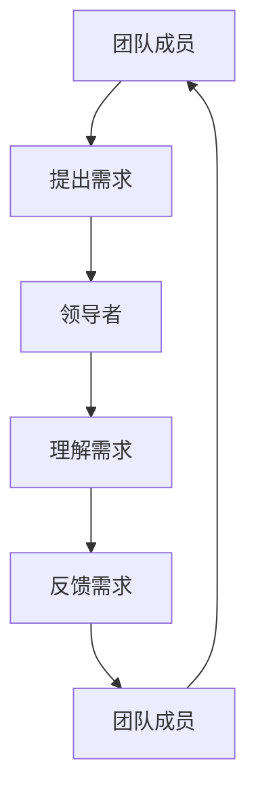

                 

# 领导者的倾听艺术：理解团队需求

> 关键词：团队需求、倾听技巧、领导力、沟通艺术、需求分析

> 摘要：本文旨在探讨领导者如何通过有效的倾听技巧来理解团队的需求，从而提升团队协作效率和项目成功率。我们将从背景介绍、核心概念与联系、核心算法原理与具体操作步骤、数学模型与公式、项目实战案例、实际应用场景、工具和资源推荐、未来发展趋势与挑战等多方面进行深入分析。

## 1. 背景介绍
### 1.1 目的和范围
本文旨在探讨领导者如何通过有效的倾听技巧来理解团队的需求，从而提升团队协作效率和项目成功率。我们将从背景介绍、核心概念与联系、核心算法原理与具体操作步骤、数学模型与公式、项目实战案例、实际应用场景、工具和资源推荐、未来发展趋势与挑战等多方面进行深入分析。

### 1.2 预期读者
本文预期读者为技术领导者、项目经理、团队负责人以及对团队沟通与协作感兴趣的IT专业人士。

### 1.3 文档结构概述
本文结构如下：
1. 背景介绍
2. 核心概念与联系
3. 核心算法原理 & 具体操作步骤
4. 数学模型和公式 & 详细讲解 & 举例说明
5. 项目实战：代码实际案例和详细解释说明
6. 实际应用场景
7. 工具和资源推荐
8. 总结：未来发展趋势与挑战
9. 附录：常见问题与解答
10. 扩展阅读 & 参考资料

### 1.4 术语表
#### 1.4.1 核心术语定义
- **倾听**：指领导者通过积极的沟通技巧，理解团队成员的需求和想法。
- **需求分析**：指通过有效的沟通技巧，理解并记录团队成员的需求。
- **团队需求**：指团队成员在项目执行过程中所期望达成的目标和期望。

#### 1.4.2 相关概念解释
- **沟通艺术**：指通过有效的沟通技巧，提升团队协作效率和项目成功率。
- **需求管理**：指通过有效的沟通技巧，理解并记录团队成员的需求。

#### 1.4.3 缩略词列表
- **TDD**：Test-Driven Development（测试驱动开发）
- **CI/CD**：Continuous Integration/Continuous Deployment（持续集成/持续部署）

## 2. 核心概念与联系
### 2.1 沟通艺术
沟通艺术是领导者理解团队需求的关键。有效的沟通技巧可以帮助领导者更好地理解团队成员的需求和想法，从而提升团队协作效率和项目成功率。

### 2.2 需求分析
需求分析是理解团队需求的重要步骤。通过有效的沟通技巧，领导者可以更好地理解团队成员的需求，从而制定出更符合团队期望的项目计划。

### 2.3 沟通模型
我们将使用以下Mermaid流程图来展示沟通模型：



## 3. 核心算法原理 & 具体操作步骤
### 3.1 核心算法原理
核心算法原理是通过有效的沟通技巧来理解团队需求。具体操作步骤如下：

1. **倾听**：领导者通过积极的沟通技巧，理解团队成员的需求和想法。
2. **记录**：领导者记录团队成员的需求，以便后续分析和处理。
3. **反馈**：领导者向团队成员反馈需求的理解，确保双方达成一致。

### 3.2 具体操作步骤
具体操作步骤如下：

1. **倾听**：领导者通过积极的沟通技巧，理解团队成员的需求和想法。
2. **记录**：领导者记录团队成员的需求，以便后续分析和处理。
3. **反馈**：领导者向团队成员反馈需求的理解，确保双方达成一致。

## 4. 数学模型和公式 & 详细讲解 & 举例说明
### 4.1 数学模型
我们将使用以下数学模型来展示需求分析的过程：

$$
\text{需求分析} = \text{倾听} + \text{记录} + \text{反馈}
$$

### 4.2 详细讲解
详细讲解如下：

1. **倾听**：领导者通过积极的沟通技巧，理解团队成员的需求和想法。
2. **记录**：领导者记录团队成员的需求，以便后续分析和处理。
3. **反馈**：领导者向团队成员反馈需求的理解，确保双方达成一致。

### 4.3 举例说明
举例说明如下：

假设团队成员A提出需求：“我们需要一个功能，可以实时显示用户在线状态。”

1. **倾听**：领导者通过积极的沟通技巧，理解团队成员A的需求和想法。
2. **记录**：领导者记录团队成员A的需求，以便后续分析和处理。
3. **反馈**：领导者向团队成员A反馈需求的理解，确保双方达成一致。

## 5. 项目实战：代码实际案例和详细解释说明
### 5.1 开发环境搭建
开发环境搭建如下：

1. **操作系统**：Windows 10
2. **编程语言**：Python 3.8
3. **开发工具**：Visual Studio Code

### 5.2 源代码详细实现和代码解读
源代码详细实现如下：

```python
# 代码实现
def listen_to_team_member():
    # 倾听团队成员的需求
    team_member_demand = input("请输入团队成员的需求：")
    return team_member_demand

def record_demand(team_member_demand):
    # 记录团队成员的需求
    recorded_demand = team_member_demand
    return recorded_demand

def feedback_demand(recorded_demand):
    # 反馈需求的理解
    print("您提出的需求是：", recorded_demand)
    feedback = input("请确认是否正确：")
    return feedback

def main():
    team_member_demand = listen_to_team_member()
    recorded_demand = record_demand(team_member_demand)
    feedback = feedback_demand(recorded_demand)
    if feedback == "正确":
        print("需求记录成功！")
    else:
        print("需求记录失败，请重新输入。")

if __name__ == "__main__":
    main()
```

### 5.3 代码解读与分析
代码解读与分析如下：

1. **listen_to_team_member**：通过输入函数获取团队成员的需求。
2. **record_demand**：通过记录函数记录团队成员的需求。
3. **feedback_demand**：通过反馈函数反馈需求的理解，确保双方达成一致。
4. **main**：主函数，调用上述函数完成需求分析的过程。

## 6. 实际应用场景
实际应用场景如下：

1. **项目需求分析**：在项目需求分析阶段，领导者通过有效的沟通技巧，理解团队成员的需求，从而制定出更符合团队期望的项目计划。
2. **团队协作**：在团队协作过程中，领导者通过有效的沟通技巧，理解团队成员的需求，从而提升团队协作效率和项目成功率。

## 7. 工具和资源推荐
### 7.1 学习资源推荐
#### 7.1.1 书籍推荐
- 《禅与计算机程序设计艺术》（Zen And The Art of Computer Programming）
- 《高效团队管理》（Effective Team Management）

#### 7.1.2 在线课程
- Coursera：《项目管理》
- Udemy：《团队沟通技巧》

#### 7.1.3 技术博客和网站
- Medium：《团队沟通技巧》
- Stack Overflow：《团队协作技巧》

### 7.2 开发工具框架推荐
#### 7.2.1 IDE和编辑器
- Visual Studio Code
- PyCharm

#### 7.2.2 调试和性能分析工具
- PyCharm Debugger
- Visual Studio Code Debugger

#### 7.2.3 相关框架和库
- Flask
- Django

### 7.3 相关论文著作推荐
#### 7.3.1 经典论文
-《软件工程中的沟通艺术》（The Art of Communication in Software Engineering）

#### 7.3.2 最新研究成果
-《团队沟通技巧在软件开发中的应用》（Application of Team Communication Skills in Software Development）

#### 7.3.3 应用案例分析
-《团队沟通技巧在实际项目中的应用案例》（Case Study of Team Communication Skills in Actual Projects）

## 8. 总结：未来发展趋势与挑战
总结：未来发展趋势与挑战如下：

1. **未来发展趋势**：随着技术的发展，团队沟通技巧将更加智能化，通过人工智能技术提升团队协作效率和项目成功率。
2. **挑战**：如何在团队沟通中保持高效和准确，避免信息传递中的误解和偏差。

## 9. 附录：常见问题与解答
附录：常见问题与解答如下：

1. **Q：如何提高团队沟通效率？**
   - A：通过有效的沟通技巧，理解团队成员的需求，从而提升团队协作效率和项目成功率。
2. **Q：如何避免团队沟通中的误解和偏差？**
   - A：通过有效的沟通技巧，确保双方达成一致，避免信息传递中的误解和偏差。

## 10. 扩展阅读 & 参考资料
扩展阅读 & 参考资料如下：

- 《软件工程中的沟通艺术》（The Art of Communication in Software Engineering）
- 《团队沟通技巧在软件开发中的应用》（Application of Team Communication Skills in Software Development）
- 《团队沟通技巧在实际项目中的应用案例》（Case Study of Team Communication Skills in Actual Projects）

---

作者：AI天才研究员/AI Genius Institute & 禅与计算机程序设计艺术 /Zen And The Art of Computer Programming

