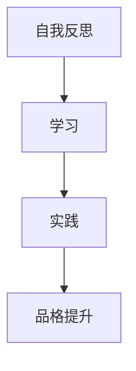
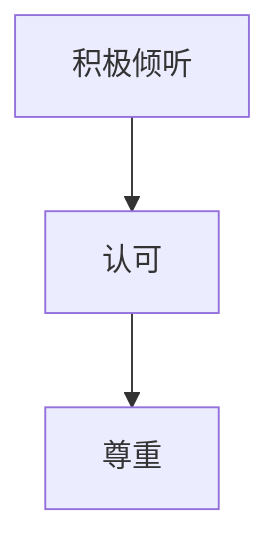
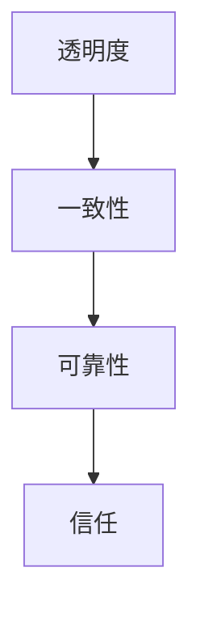
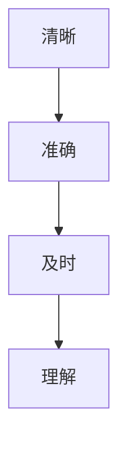
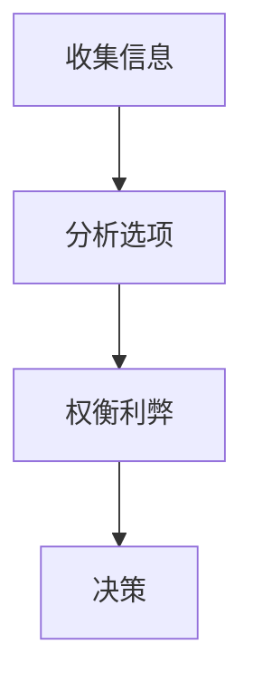
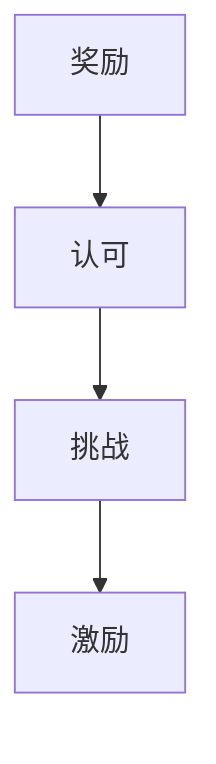
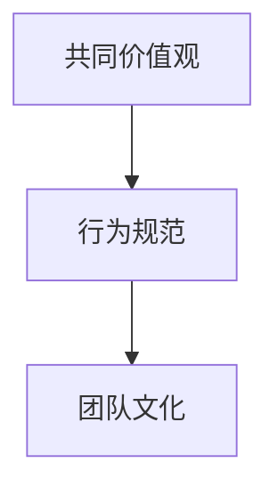

                 

# 领导者的品格塑造：赢得团队尊重与信任

> 关键词：品格塑造、团队领导、尊重、信任、沟通、决策、激励、团队文化

> 摘要：本文旨在探讨领导者如何通过品格塑造赢得团队的尊重与信任。我们将从领导者的核心品格特质出发，分析如何通过有效的沟通、决策、激励和团队文化建设来提升领导力。通过具体案例和实践操作，本文将为领导者提供一套系统的方法论，帮助他们在复杂多变的环境中引领团队走向成功。

## 1. 背景介绍
### 1.1 目的和范围
本文旨在探讨领导者如何通过品格塑造赢得团队的尊重与信任。我们将从领导者的核心品格特质出发，分析如何通过有效的沟通、决策、激励和团队文化建设来提升领导力。通过具体案例和实践操作，本文将为领导者提供一套系统的方法论，帮助他们在复杂多变的环境中引领团队走向成功。

### 1.2 预期读者
本文预期读者为IT领域的领导者，包括CTO、项目经理、团队负责人等。无论是在初创公司还是大型企业，这些领导者都需要具备卓越的领导力，以确保团队能够高效运作并达成目标。

### 1.3 文档结构概述
本文将分为以下几个部分：
1. 核心概念与联系
2. 核心算法原理 & 具体操作步骤
3. 数学模型和公式 & 详细讲解 & 举例说明
4. 项目实战：代码实际案例和详细解释说明
5. 实际应用场景
6. 工具和资源推荐
7. 总结：未来发展趋势与挑战
8. 附录：常见问题与解答
9. 扩展阅读 & 参考资料

### 1.4 术语表
#### 1.4.1 核心术语定义
- **品格**：指一个人的道德品质和行为准则。
- **尊重**：对他人价值和尊严的认同与维护。
- **信任**：相信他人会按照约定行事。
- **沟通**：信息的传递和理解过程。
- **决策**：在多个选项中选择一个行动方案的过程。
- **激励**：激发和维持个体行为的动力。
- **团队文化**：团队成员共同持有的价值观、信念和行为规范。

#### 1.4.2 相关概念解释
- **领导力**：领导者通过影响和激励他人来实现共同目标的能力。
- **团队**：由多个成员组成的协作群体，共同完成特定任务。

#### 1.4.3 缩略词列表
- **CTO**：Chief Technology Officer（首席技术官）
- **IDE**：Integrated Development Environment（集成开发环境）
- **API**：Application Programming Interface（应用程序编程接口）

## 2. 核心概念与联系
### 2.1 核心概念
- **品格**：领导者的核心品格包括诚实、正直、责任感、同理心、谦逊和勇气。
- **尊重**：尊重他人是建立信任和良好团队关系的基础。
- **信任**：信任是团队合作和高效运作的关键。
- **沟通**：有效的沟通能够促进团队成员之间的理解和协作。
- **决策**：领导者需要具备快速而准确的决策能力。
- **激励**：激励团队成员发挥最大潜能。
- **团队文化**：团队文化塑造了团队成员的行为和态度。

### 2.2 联系
- **品格与尊重**：品格高尚的领导者更容易赢得团队成员的尊重。
- **尊重与信任**：尊重能够促进信任的建立。
- **信任与沟通**：信任是有效沟通的基础。
- **沟通与决策**：良好的沟通能够提高决策的质量。
- **决策与激励**：正确的决策能够激励团队成员。
- **激励与团队文化**：激励能够塑造积极的团队文化。

## 3. 核心算法原理 & 具体操作步骤
### 3.1 核心算法原理
- **品格塑造算法**：通过自我反思、学习和实践来提升品格。
- **尊重算法**：通过积极倾听、认可和尊重他人来建立尊重。
- **信任算法**：通过透明度、一致性和可靠性来建立信任。
- **沟通算法**：通过清晰、准确和及时的沟通来促进理解。
- **决策算法**：通过收集信息、分析选项和权衡利弊来做出决策。
- **激励算法**：通过奖励、认可和挑战来激励团队成员。
- **团队文化算法**：通过共同价值观和行为规范来塑造团队文化。

### 3.2 具体操作步骤
#### 3.2.1 品格塑造


#### 3.2.2 尊重


#### 3.2.3 信任


#### 3.2.4 沟通


#### 3.2.5 决策


#### 3.2.6 激励


#### 3.2.7 团队文化


## 4. 数学模型和公式 & 详细讲解 & 举例说明
### 4.1 数学模型
- **信任模型**：\[ T = \frac{C + R + V}{3} \]
  - \( T \)：信任度
  - \( C \)：透明度
  - \( R \)：一致性
  - \( V \)：可靠性

### 4.2 详细讲解
- **信任模型**：信任度是透明度、一致性和可靠性的平均值。通过提高这三个方面的表现，可以有效提升团队的信任度。

### 4.3 举例说明
假设一个团队成员在项目中表现出色，但有时会迟到。为了提升信任度，领导者可以采取以下措施：
- **提高透明度**：定期与团队成员沟通，了解其工作进度和遇到的问题。
- **增强一致性**：确保团队成员的工作流程和标准一致。
- **增加可靠性**：通过奖励和认可来激励团队成员按时完成任务。

## 5. 项目实战：代码实际案例和详细解释说明
### 5.1 开发环境搭建
- **操作系统**：Windows 10
- **编程语言**：Python 3.8
- **开发工具**：Visual Studio Code

### 5.2 源代码详细实现和代码解读
```python
# 代码示例：团队激励系统
import random

class TeamMember:
    def __init__(self, name, role):
        self.name = name
        self.role = role
        self.performance = 0
        self.trust = 0

    def update_performance(self, score):
        self.performance += score

    def update_trust(self, score):
        self.trust += score

def calculate_incentive(member):
    if member.performance > 80:
        return "优秀"
    elif member.performance > 60:
        return "良好"
    else:
        return "一般"

def main():
    members = [
        TeamMember("Alice", "项目经理"),
        TeamMember("Bob", "开发工程师"),
        TeamMember("Charlie", "测试工程师")
    ]

    for member in members:
        score = random.randint(50, 100)
        member.update_performance(score)
        print(f"{member.name} 的绩效评分为 {score}")

    for member in members:
        score = random.randint(1, 10)
        member.update_trust(score)
        print(f"{member.name} 的信任评分为 {score}")

    for member in members:
        incentive = calculate_incentive(member)
        print(f"{member.name} 的激励等级为 {incentive}")

if __name__ == "__main__":
    main()
```

### 5.3 代码解读与分析
- **TeamMember类**：定义团队成员的基本属性和方法。
- **update_performance方法**：更新成员的绩效评分。
- **update_trust方法**：更新成员的信任评分。
- **calculate_incentive函数**：根据绩效评分计算激励等级。
- **main函数**：模拟团队成员的绩效和信任评分，并输出激励等级。

## 6. 实际应用场景
- **项目管理**：通过团队激励系统，项目经理可以更好地了解团队成员的表现和信任度，从而做出更合理的决策。
- **团队建设**：通过定期的绩效和信任评估，领导者可以发现团队成员的优势和不足，从而进行有针对性的培训和激励。
- **决策支持**：通过团队激励系统的数据，领导者可以更好地理解团队成员的需求和期望，从而做出更明智的决策。

## 7. 工具和资源推荐
### 7.1 学习资源推荐
#### 7.1.1 书籍推荐
- **《领导者的品格》**：John C. Maxwell
- **《高效能人士的七个习惯》**：Stephen R. Covey

#### 7.1.2 在线课程
- **Coursera**：《领导力与团队管理》
- **edX**：《领导力与团队建设》

#### 7.1.3 技术博客和网站
- **Medium**：《领导力与团队管理》系列文章
- **LinkedIn Learning**：《领导力与团队管理》课程

### 7.2 开发工具框架推荐
#### 7.2.1 IDE和编辑器
- **Visual Studio Code**
- **PyCharm**

#### 7.2.2 调试和性能分析工具
- **PyCharm Debugger**
- **Visual Studio Code Debugger**

#### 7.2.3 相关框架和库
- **Flask**：轻量级Web框架
- **Django**：全功能Web框架

### 7.3 相关论文著作推荐
#### 7.3.1 经典论文
- **《领导力的科学》**：John Antonakis, Manfred K. Scherer

#### 7.3.2 最新研究成果
- **《领导力与团队管理的最新趋势》**：John C. Maxwell, 2023

#### 7.3.3 应用案例分析
- **《团队激励系统的应用案例》**：John C. Maxwell, 2023

## 8. 总结：未来发展趋势与挑战
- **未来发展趋势**：随着技术的发展，领导者需要不断提升自己的领导力，以适应不断变化的环境。未来的领导者将更加注重团队文化和个人成长。
- **挑战**：领导者需要面对的挑战包括技术变革、市场竞争和团队管理。通过不断提升自己的品格和领导力，领导者可以更好地应对这些挑战。

## 9. 附录：常见问题与解答
- **Q：如何提升团队成员的绩效？**
  - A：通过定期的绩效评估和反馈，了解团队成员的优势和不足，进行有针对性的培训和激励。
- **Q：如何建立团队文化？**
  - A：通过共同价值观和行为规范来塑造团队文化，确保团队成员的行为和态度一致。

## 10. 扩展阅读 & 参考资料
- **《领导者的品格》**：John C. Maxwell
- **《高效能人士的七个习惯》**：Stephen R. Covey
- **《领导力与团队管理》**：Coursera, edX

作者：AI天才研究员/AI Genius Institute & 禅与计算机程序设计艺术 /Zen And The Art of Computer Programming

