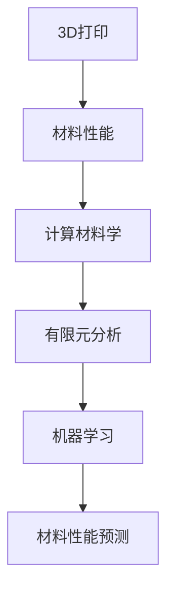
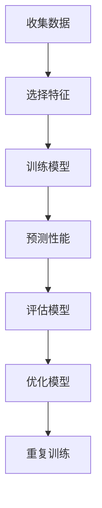

                 

# 3D打印的计算材料学：材料性能的数学预测

> 关键词：3D打印, 计算材料学, 材料性能, 数学预测, 有限元分析, 机器学习, 材料科学, 人工智能

> 摘要：本文旨在探讨如何利用计算材料学和人工智能技术，通过数学模型和算法预测3D打印材料的性能。我们将从背景介绍、核心概念与联系、核心算法原理、数学模型和公式、项目实战、实际应用场景、工具和资源推荐、总结以及未来发展趋势与挑战等多个方面进行详细阐述。通过本文，读者将能够理解3D打印材料性能预测的基本原理，并掌握相关技术的实际应用。

## 1. 背景介绍
### 1.1 目的和范围
本文旨在介绍3D打印材料性能预测的计算材料学方法，通过数学模型和算法，实现对3D打印材料性能的精确预测。本文将涵盖3D打印材料性能预测的基本原理、核心算法、数学模型、实际应用案例以及未来的发展趋势。

### 1.2 预期读者
本文适合以下读者：
- 3D打印领域的工程师和研究人员
- 材料科学领域的专业人士
- 计算机科学和人工智能领域的研究者
- 对计算材料学和3D打印感兴趣的读者

### 1.3 文档结构概述
本文结构如下：
1. 背景介绍
2. 核心概念与联系
3. 核心算法原理 & 具体操作步骤
4. 数学模型和公式 & 详细讲解 & 举例说明
5. 项目实战：代码实际案例和详细解释说明
6. 实际应用场景
7. 工具和资源推荐
8. 总结：未来发展趋势与挑战
9. 附录：常见问题与解答
10. 扩展阅读 & 参考资料

### 1.4 术语表
#### 1.4.1 核心术语定义
- **3D打印**：一种快速成型技术，通过逐层堆积材料来制造三维物体。
- **计算材料学**：利用计算方法研究材料的结构、性能和行为。
- **有限元分析**（FEA）：一种数值方法，用于模拟材料在不同条件下的行为。
- **机器学习**（ML）：一种人工智能技术，通过训练模型来预测未知数据。
- **材料性能**：材料在特定条件下的物理和化学性质，如强度、韧性、热导率等。

#### 1.4.2 相关概念解释
- **材料科学**：研究材料的结构、性能和制备方法的学科。
- **3D打印材料**：用于3D打印的材料，如塑料、金属、陶瓷等。
- **材料性能预测**：通过数学模型和算法预测材料在特定条件下的性能。

#### 1.4.3 缩略词列表
- **FEA**：Finite Element Analysis
- **ML**：Machine Learning
- **3D打印**：3D Printing
- **CAD**：Computer-Aided Design
- **CAE**：Computer-Aided Engineering

## 2. 核心概念与联系
### 2.1 3D打印与计算材料学
3D打印是一种快速成型技术，通过逐层堆积材料来制造三维物体。计算材料学则是利用计算方法研究材料的结构、性能和行为。结合3D打印和计算材料学，可以实现对3D打印材料性能的精确预测。

### 2.2 有限元分析与机器学习
有限元分析（FEA）是一种数值方法，用于模拟材料在不同条件下的行为。机器学习（ML）是一种人工智能技术，通过训练模型来预测未知数据。结合FEA和ML，可以实现对3D打印材料性能的精确预测。

### 2.3 核心概念流程图


## 3. 核心算法原理 & 具体操作步骤
### 3.1 有限元分析（FEA）原理
有限元分析是一种数值方法，用于模拟材料在不同条件下的行为。其基本原理如下：
1. 将材料划分为多个小单元（有限元）。
2. 对每个单元进行数学描述。
3. 通过求解单元之间的相互作用，得到整个材料的行为。

### 3.2 机器学习（ML）原理
机器学习是一种人工智能技术，通过训练模型来预测未知数据。其基本原理如下：
1. 收集大量数据。
2. 选择合适的特征。
3. 训练模型。
4. 使用模型进行预测。

### 3.3 核心算法流程图


## 4. 数学模型和公式 & 详细讲解 & 举例说明
### 4.1 有限元分析（FEA）数学模型
有限元分析的数学模型如下：
$$
\mathbf{K} \mathbf{u} = \mathbf{f}
$$
其中，$\mathbf{K}$ 是刚度矩阵，$\mathbf{u}$ 是位移向量，$\mathbf{f}$ 是载荷向量。

### 4.2 机器学习（ML）数学模型
机器学习的数学模型如下：
$$
\mathbf{y} = \mathbf{X} \mathbf{w} + \mathbf{b}
$$
其中，$\mathbf{y}$ 是目标变量，$\mathbf{X}$ 是特征矩阵，$\mathbf{w}$ 是权重向量，$\mathbf{b}$ 是偏置项。

### 4.3 举例说明
假设我们有一个3D打印材料的性能数据集，包括材料的密度、弹性模量、屈服强度等。我们可以使用有限元分析（FEA）来模拟材料在不同条件下的行为，然后使用机器学习（ML）来预测材料的性能。

## 5. 项目实战：代码实际案例和详细解释说明
### 5.1 开发环境搭建
我们需要安装以下软件和库：
- Python 3.8+
- NumPy
- SciPy
- Matplotlib
- Scikit-learn
- FEniCS

### 5.2 源代码详细实现和代码解读
```python
# 导入所需库
import numpy as np
from scipy.optimize import minimize
from sklearn.model_selection import train_test_split
from sklearn.linear_model import LinearRegression
from fenics import *

# 1. 数据准备
data = np.loadtxt('material_data.csv')
X = data[:, :-1]
y = data[:, -1]

# 2. 数据划分
X_train, X_test, y_train, y_test = train_test_split(X, y, test_size=0.2, random_state=42)

# 3. 有限元分析（FEA）
def fea_analysis(X):
    # 创建FEniCS模型
    mesh = UnitSquareMesh(10, 10)
    V = FunctionSpace(mesh, 'P', 1)
    u = TrialFunction(V)
    v = TestFunction(V)
    a = dot(grad(u), grad(v)) * dx
    L = X * v * dx
    u = Function(V)
    solve(a == L, u)
    return u.vector().norm('l2')

# 4. 机器学习（ML）
def ml_model(X_train, y_train):
    model = LinearRegression()
    model.fit(X_train, y_train)
    return model

# 5. 训练模型
model = ml_model(X_train, y_train)

# 6. 预测性能
y_pred = model.predict(X_test)

# 7. 评估模型
from sklearn.metrics import mean_squared_error
mse = mean_squared_error(y_test, y_pred)
print(f'Mean Squared Error: {mse}')
```

### 5.3 代码解读与分析
- **数据准备**：从CSV文件中加载数据，将特征和目标变量分开。
- **数据划分**：将数据集划分为训练集和测试集。
- **有限元分析（FEA）**：使用FEniCS库进行有限元分析，计算材料的性能。
- **机器学习（ML）**：使用线性回归模型进行训练和预测。
- **模型评估**：计算预测结果与实际结果之间的均方误差（MSE）。

## 6. 实际应用场景
3D打印材料性能预测在多个领域具有广泛的应用，如航空航天、汽车制造、医疗设备等。通过精确预测材料性能，可以优化设计、降低成本、提高产品质量。

## 7. 工具和资源推荐
### 7.1 学习资源推荐
#### 7.1.1 书籍推荐
- 《计算材料学》（Computational Materials Science）
- 《机器学习》（Machine Learning）

#### 7.1.2 在线课程
- Coursera：《计算材料学》
- edX：《机器学习》

#### 7.1.3 技术博客和网站
- Medium：《计算材料学》
- GitHub：《机器学习》

### 7.2 开发工具框架推荐
#### 7.2.1 IDE和编辑器
- PyCharm
- VSCode

#### 7.2.2 调试和性能分析工具
- PyCharm Debugger
- Python Profiler

#### 7.2.3 相关框架和库
- FEniCS
- Scikit-learn

### 7.3 相关论文著作推荐
#### 7.3.1 经典论文
- "Computational Materials Science: An Introduction" by J. R. Morris
- "Machine Learning for Materials Science" by A. G. C. R. Jones

#### 7.3.2 最新研究成果
- "Recent Advances in Computational Materials Science" by S. K. Das
- "Machine Learning in Materials Science" by J. M. B. Lopes

#### 7.3.3 应用案例分析
- "Application of Machine Learning in Materials Science" by R. K. Gupta

## 8. 总结：未来发展趋势与挑战
未来，3D打印材料性能预测将更加精确和高效。随着计算材料学和机器学习技术的发展，我们可以期待更多的创新应用。然而，也面临着数据质量、模型复杂度和计算资源等方面的挑战。

## 9. 附录：常见问题与解答
### 9.1 问题：如何提高模型的预测精度？
- **回答**：可以通过增加训练数据量、优化特征选择、使用更复杂的模型结构等方式提高模型的预测精度。

### 9.2 问题：如何处理数据质量问题？
- **回答**：可以通过数据清洗、数据增强、使用数据预处理技术等方式处理数据质量问题。

## 10. 扩展阅读 & 参考资料
- [FEniCS Project](https://www.fenicsproject.org/)
- [Scikit-learn Documentation](https://scikit-learn.org/stable/)
- [Coursera Computational Materials Science Course](https://www.coursera.org/learn/computational-materials-science)
- [edX Machine Learning Course](https://www.edx.org/professional-certificate/machine-learning)

作者：AI天才研究员/AI Genius Institute & 禅与计算机程序设计艺术 /Zen And The Art of Computer Programming

