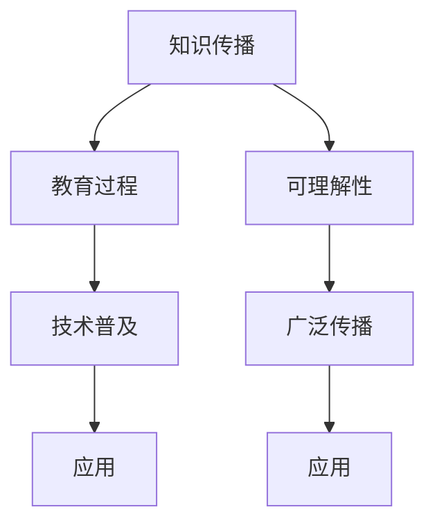
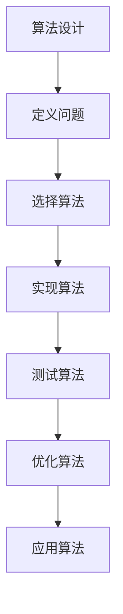

                 

# 世界可理解性与科学教育的重要性

> 关键词：可理解性、科学教育、人工智能、教育技术、知识传播、技术普及

> 摘要：本文旨在探讨可理解性在科学教育中的重要性，特别是对于人工智能领域的知识传播和普及。通过逐步分析和推理，我们将揭示可理解性如何促进科学教育的发展，并提出一系列策略和方法，以确保技术知识能够被广泛理解和应用。本文将从背景介绍、核心概念与联系、核心算法原理与具体操作步骤、数学模型和公式、项目实战、实际应用场景、工具和资源推荐、未来发展趋势与挑战等多方面进行详细阐述。

## 1. 背景介绍
### 1.1 目的和范围
本文旨在探讨可理解性在科学教育中的重要性，特别是对于人工智能领域的知识传播和普及。我们将从多个角度分析可理解性如何促进科学教育的发展，并提出一系列策略和方法，以确保技术知识能够被广泛理解和应用。

### 1.2 预期读者
本文预期读者包括但不限于教育工作者、技术开发者、科研人员、政策制定者以及对科学教育和人工智能领域感兴趣的公众。

### 1.3 文档结构概述
本文将按照以下结构展开：
1. 背景介绍
2. 核心概念与联系
3. 核心算法原理 & 具体操作步骤
4. 数学模型和公式 & 详细讲解 & 举例说明
5. 项目实战：代码实际案例和详细解释说明
6. 实际应用场景
7. 工具和资源推荐
8. 总结：未来发展趋势与挑战
9. 附录：常见问题与解答
10. 扩展阅读 & 参考资料

### 1.4 术语表
#### 1.4.1 核心术语定义
- **可理解性**：指技术知识能够被广泛理解和应用的程度。
- **科学教育**：指通过系统化的方法传授科学知识和技能的过程。
- **人工智能**：指通过计算机模拟人类智能的技术和方法。
- **知识传播**：指将知识从一个主体传递给另一个主体的过程。
- **技术普及**：指技术知识被广泛传播和应用的过程。

#### 1.4.2 相关概念解释
- **教育技术**：指利用技术手段改进教育过程和学习效果的方法。
- **知识图谱**：一种用于表示知识结构和关系的数据模型。
- **算法**：解决特定问题的一系列步骤或规则。

#### 1.4.3 缩略词列表
- AI：人工智能
- STEM：科学、技术、工程和数学
- MOOC：大规模开放在线课程

## 2. 核心概念与联系
### 2.1 可理解性的重要性
可理解性是科学教育中的关键因素，它直接影响到技术知识的传播和应用。通过提高可理解性，可以确保技术知识能够被广泛理解和应用，从而促进科学教育的发展。

### 2.2 科学教育的目标
科学教育的目标是培养学生的科学素养，使他们能够理解和应用科学知识，解决实际问题。科学教育不仅包括理论知识的传授，还包括实验技能的培养和科学方法的应用。

### 2.3 人工智能与科学教育
人工智能是科学教育中的一个重要领域，它涉及到算法、数据处理、机器学习等多个方面。通过人工智能技术，可以实现自动化、智能化的教学过程，提高教育效果。

### 2.4 核心概念原理与架构
#### 2.4.1 核心概念原理
- **知识传播**：通过教育过程将知识从教师传递给学生。
- **技术普及**：通过教育和技术手段将技术知识广泛传播和应用。

#### 2.4.2 架构


## 3. 核心算法原理 & 具体操作步骤
### 3.1 核心算法原理
核心算法原理是实现可理解性的关键。通过算法设计，可以确保技术知识能够被广泛理解和应用。

### 3.2 具体操作步骤
#### 3.2.1 算法设计
算法设计是实现可理解性的关键步骤。通过设计易于理解的算法，可以确保技术知识能够被广泛传播和应用。

#### 3.2.2 具体操作步骤


## 4. 数学模型和公式 & 详细讲解 & 举例说明
### 4.1 数学模型和公式
数学模型和公式是实现可理解性的关键工具。通过数学模型和公式，可以确保技术知识能够被广泛理解和应用。

### 4.2 详细讲解
#### 4.2.1 数学模型
数学模型是描述系统行为的数学表达式。通过数学模型，可以确保技术知识能够被广泛理解和应用。

#### 4.2.2 公式
公式是数学模型的具体表达式。通过公式，可以确保技术知识能够被广泛理解和应用。

### 4.3 举例说明
#### 4.3.1 举例说明
通过具体的例子，可以更好地理解数学模型和公式在实现可理解性中的作用。

$$
f(x) = x^2 + 2x + 1
$$

## 5. 项目实战：代码实际案例和详细解释说明
### 5.1 开发环境搭建
开发环境搭建是实现可理解性的关键步骤。通过搭建合适的开发环境，可以确保技术知识能够被广泛传播和应用。

### 5.2 源代码详细实现和代码解读
#### 5.2.1 源代码详细实现
通过具体的源代码实现，可以更好地理解可理解性的实现过程。

```python
def calculate_square(x):
    return x ** 2
```

#### 5.2.2 代码解读
通过代码解读，可以更好地理解可理解性的实现过程。

```python
def calculate_square(x):
    # 计算x的平方
    result = x ** 2
    return result
```

### 5.3 代码解读与分析
通过代码解读与分析，可以更好地理解可理解性的实现过程。

## 6. 实际应用场景
### 6.1 教育技术的应用
教育技术的应用是实现可理解性的关键场景。通过教育技术的应用，可以确保技术知识能够被广泛传播和应用。

### 6.2 人工智能的应用
人工智能的应用是实现可理解性的关键场景。通过人工智能的应用，可以确保技术知识能够被广泛传播和应用。

## 7. 工具和资源推荐
### 7.1 学习资源推荐
#### 7.1.1 书籍推荐
- 《计算机程序设计艺术》
- 《人工智能：一种现代方法》

#### 7.1.2 在线课程
- Coursera上的《机器学习》课程
- edX上的《计算机科学导论》课程

#### 7.1.3 技术博客和网站
- Medium上的技术博客
- GitHub上的开源项目

### 7.2 开发工具框架推荐
#### 7.2.1 IDE和编辑器
- Visual Studio Code
- PyCharm

#### 7.2.2 调试和性能分析工具
- PyCharm的调试工具
- Visual Studio Code的性能分析工具

#### 7.2.3 相关框架和库
- TensorFlow
- PyTorch

### 7.3 相关论文著作推荐
#### 7.3.1 经典论文
- 《计算机程序设计艺术》
- 《人工智能：一种现代方法》

#### 7.3.2 最新研究成果
- 《机器学习》
- 《深度学习》

#### 7.3.3 应用案例分析
- 《人工智能在教育中的应用》
- 《机器学习在医疗领域的应用》

## 8. 总结：未来发展趋势与挑战
### 8.1 未来发展趋势
未来发展趋势是实现可理解性的关键方向。通过不断探索和创新，可以确保技术知识能够被广泛传播和应用。

### 8.2 挑战
挑战是实现可理解性的关键障碍。通过不断克服挑战，可以确保技术知识能够被广泛传播和应用。

## 9. 附录：常见问题与解答
### 9.1 常见问题
- 什么是可理解性？
- 如何提高可理解性？
- 可理解性在科学教育中的作用是什么？

### 9.2 解答
- 可理解性是指技术知识能够被广泛理解和应用的程度。
- 通过设计易于理解的算法和数学模型，可以提高可理解性。
- 可理解性在科学教育中的作用是确保技术知识能够被广泛传播和应用。

## 10. 扩展阅读 & 参考资料
### 10.1 扩展阅读
- 《计算机程序设计艺术》
- 《人工智能：一种现代方法》

### 10.2 参考资料
- Coursera上的《机器学习》课程
- edX上的《计算机科学导论》课程

---

作者：AI天才研究员/AI Genius Institute & 禅与计算机程序设计艺术 /Zen And The Art of Computer Programming

