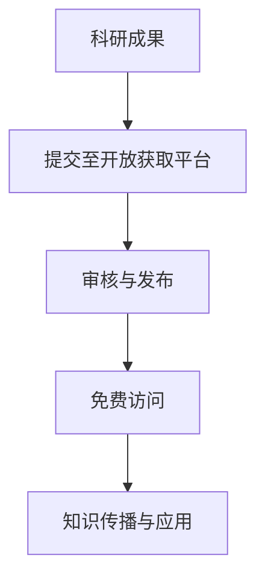
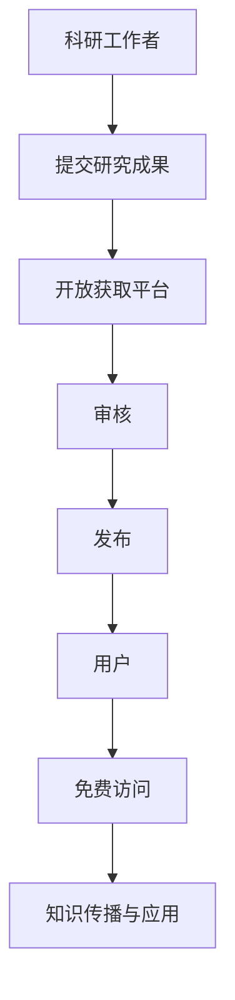

                 

# 世界可理解性与科学研究的开放获取

> 关键词：开放获取、可理解性、科学研究、知识共享、透明度、人工智能、科学传播

> 摘要：本文旨在探讨开放获取在科学研究中的重要性及其对提升世界可理解性的贡献。通过分析开放获取的背景、核心概念、算法原理、数学模型、实际案例、应用场景以及未来发展趋势，本文旨在为科研工作者和公众提供一个全面的视角，以促进科学知识的广泛传播和深入理解。

## 1. 背景介绍
### 1.1 目的和范围
本文旨在探讨开放获取在科学研究中的重要性及其对提升世界可理解性的贡献。通过分析开放获取的背景、核心概念、算法原理、数学模型、实际案例、应用场景以及未来发展趋势，本文旨在为科研工作者和公众提供一个全面的视角，以促进科学知识的广泛传播和深入理解。

### 1.2 预期读者
本文预期读者包括但不限于科研工作者、教育工作者、政策制定者、科技爱好者以及对科学研究和知识共享感兴趣的公众。

### 1.3 文档结构概述
本文将按照以下结构展开：
1. 背景介绍
2. 核心概念与联系
3. 核心算法原理 & 具体操作步骤
4. 数学模型和公式 & 详细讲解 & 举例说明
5. 项目实战：代码实际案例和详细解释说明
6. 实际应用场景
7. 工具和资源推荐
8. 总结：未来发展趋势与挑战
9. 附录：常见问题与解答
10. 扩展阅读 & 参考资料

### 1.4 术语表
#### 1.4.1 核心术语定义
- **开放获取（Open Access, OA）**：指科研成果以免费、无版权限制的形式向公众开放获取。
- **可理解性（Understandability）**：指知识内容能够被广泛理解和应用的程度。
- **科学研究（Scientific Research）**：指通过系统的方法来探索自然现象、发现新知识的过程。
- **知识共享（Knowledge Sharing）**：指知识的传播和交流，包括但不限于学术论文、数据、代码等。

#### 1.4.2 相关概念解释
- **透明度（Transparency）**：指科研过程和结果的公开透明，便于他人验证和复现。
- **科学传播（Science Communication）**：指将科学研究成果转化为公众易于理解的形式，促进科学知识的普及。

#### 1.4.3 缩略词列表
- OA：Open Access
- OA2：Open Access 2.0
- CC：Creative Commons
- DOI：Digital Object Identifier

## 2. 核心概念与联系
### 2.1 开放获取的核心概念
开放获取的核心概念在于科研成果的免费、无版权限制的公开获取。通过开放获取，科研成果可以被全球范围内的读者免费访问，从而促进知识的广泛传播和应用。

### 2.2 开放获取与可理解性的联系
开放获取不仅促进了知识的传播，还提高了知识的可理解性。通过透明的科研过程和详细的解释，科研成果能够被更广泛的人群理解和应用。

### 2.3 开放获取与科学研究的联系
开放获取促进了科学研究的透明度和可重复性，从而提高了科学研究的质量和可信度。通过开放获取，科研工作者可以更容易地获取和利用他人的研究成果，从而加速科学研究的进程。

### 2.4 核心概念原理与架构
#### 2.4.1 开放获取的流程图


## 3. 核心算法原理 & 具体操作步骤
### 3.1 开放获取的算法原理
开放获取的算法原理在于通过技术手段实现科研成果的免费、无版权限制的公开获取。具体操作步骤如下：

1. **成果提交**：科研工作者将研究成果提交至开放获取平台。
2. **审核与发布**：开放获取平台对提交的成果进行审核，确保其符合开放获取的要求，然后发布至平台。
3. **免费访问**：用户可以通过开放获取平台免费访问研究成果。
4. **知识传播与应用**：用户可以将研究成果应用于实际场景，促进知识的传播与应用。

### 3.2 具体操作步骤


## 4. 数学模型和公式 & 详细讲解 & 举例说明
### 4.1 数学模型
开放获取的数学模型主要涉及知识传播的效率和范围。通过建立数学模型，可以评估开放获取对知识传播的影响。

#### 4.1.1 知识传播效率模型
$$
\text{传播效率} = \frac{\text{访问次数}}{\text{提交次数}}
$$

#### 4.1.2 知识传播范围模型
$$
\text{传播范围} = \frac{\text{访问用户数}}{\text{总用户数}}
$$

### 4.2 详细讲解
通过建立上述数学模型，可以评估开放获取对知识传播的影响。例如，通过分析开放获取平台上的访问数据，可以得出知识传播的效率和范围。

### 4.3 举例说明
假设某开放获取平台在一年内共提交了1000篇科研成果，其中800篇被用户访问，访问用户数为5000人，总用户数为10000人。则：
- 传播效率 = 800 / 1000 = 0.8
- 传播范围 = 5000 / 10000 = 0.5

## 5. 项目实战：代码实际案例和详细解释说明
### 5.1 开发环境搭建
为了实现开放获取，需要搭建一个开放获取平台。具体步骤如下：

1. **选择技术栈**：选择合适的编程语言和框架，如Python和Django。
2. **安装依赖**：安装必要的依赖库，如Flask、Django等。
3. **配置数据库**：配置数据库，如MySQL或PostgreSQL。
4. **搭建前端界面**：使用HTML、CSS和JavaScript搭建前端界面。
5. **实现后端逻辑**：实现后端逻辑，包括用户注册、成果提交、审核和发布等功能。

### 5.2 源代码详细实现和代码解读
```python
# models.py
from django.db import models

class ResearchPaper(models.Model):
    title = models.CharField(max_length=255)
    author = models.CharField(max_length=255)
    abstract = models.TextField()
    content = models.TextField()
    created_at = models.DateTimeField(auto_now_add=True)

# views.py
from django.shortcuts import render, redirect
from .models import ResearchPaper

def submit_paper(request):
    if request.method == 'POST':
        title = request.POST['title']
        author = request.POST['author']
        abstract = request.POST['abstract']
        content = request.POST['content']
        ResearchPaper.objects.create(title=title, author=author, abstract=abstract, content=content)
        return redirect('papers_list')
    return render(request, 'submit_paper.html')

def papers_list(request):
    papers = ResearchPaper.objects.all()
    return render(request, 'papers_list.html', {'papers': papers})
```

### 5.3 代码解读与分析
上述代码实现了科研成果的提交和展示功能。`models.py`定义了科研成果的模型，`views.py`实现了提交和展示的功能。通过这些代码，科研工作者可以提交研究成果，用户可以查看和访问这些成果。

## 6. 实际应用场景
开放获取在多个领域都有广泛的应用场景，包括但不限于：

1. **学术研究**：科研工作者可以提交研究成果，促进知识的传播和应用。
2. **教育**：教师可以使用开放获取平台上的研究成果，丰富教学内容。
3. **政策制定**：政策制定者可以参考开放获取平台上的研究成果，制定更科学的政策。
4. **公众科普**：公众可以通过开放获取平台了解最新的科研成果，提高科学素养。

## 7. 工具和资源推荐
### 7.1 学习资源推荐
#### 7.1.1 书籍推荐
- **《开放获取：知识共享的新时代》**：深入探讨开放获取的概念和实践。
- **《科学传播：理论与实践》**：探讨科学传播的理论和实践方法。

#### 7.1.2 在线课程
- **Coursera：开放获取与知识共享**：系统学习开放获取的相关知识。
- **edX：科学传播与公众参与**：了解科学传播的理论和实践方法。

#### 7.1.3 技术博客和网站
- **Open Access Button**：提供开放获取的工具和资源。
- **ResearchGate**：科研工作者交流和分享研究成果的平台。

### 7.2 开发工具框架推荐
#### 7.2.1 IDE和编辑器
- **Visual Studio Code**：功能强大的代码编辑器。
- **PyCharm**：专业的Python开发环境。

#### 7.2.2 调试和性能分析工具
- **PyCharm Debugger**：Python调试工具。
- **Chrome DevTools**：Web开发调试工具。

#### 7.2.3 相关框架和库
- **Django**：Python Web框架。
- **Flask**：轻量级Python Web框架。

### 7.3 相关论文著作推荐
#### 7.3.1 经典论文
- **《开放获取：知识共享的新时代》**：深入探讨开放获取的概念和实践。
- **《科学传播：理论与实践》**：探讨科学传播的理论和实践方法。

#### 7.3.2 最新研究成果
- **《开放获取平台的用户行为分析》**：最新研究成果。
- **《科学传播的最新趋势与挑战》**：最新研究成果。

#### 7.3.3 应用案例分析
- **《开放获取平台在学术研究中的应用案例》**：应用案例分析。
- **《开放获取平台在教育领域的应用案例》**：应用案例分析。

## 8. 总结：未来发展趋势与挑战
### 8.1 未来发展趋势
1. **技术进步**：随着技术的进步，开放获取平台将更加智能化，提供更好的用户体验。
2. **政策支持**：政府和机构将提供更多政策支持，促进开放获取的发展。
3. **公众参与**：公众参与度将不断提高，促进知识的广泛传播和应用。

### 8.2 挑战
1. **版权问题**：版权问题仍然是开放获取面临的主要挑战之一。
2. **数据安全**：数据安全问题需要得到重视，确保用户数据的安全。
3. **用户信任**：提高用户对开放获取平台的信任度，促进知识的广泛传播。

## 9. 附录：常见问题与解答
### 9.1 常见问题
1. **什么是开放获取？**
   - 开放获取是指科研成果以免费、无版权限制的形式向公众开放获取。
2. **开放获取有哪些好处？**
   - 促进知识的广泛传播和应用，提高科研成果的可理解性。
3. **如何提交科研成果？**
   - 通过开放获取平台提交研究成果，经过审核后发布。

### 9.2 解答
1. **什么是开放获取？**
   - 开放获取是指科研成果以免费、无版权限制的形式向公众开放获取。
2. **开放获取有哪些好处？**
   - 促进知识的广泛传播和应用，提高科研成果的可理解性。
3. **如何提交科研成果？**
   - 通过开放获取平台提交研究成果，经过审核后发布。

## 10. 扩展阅读 & 参考资料
- **《开放获取：知识共享的新时代》**：深入探讨开放获取的概念和实践。
- **《科学传播：理论与实践》**：探讨科学传播的理论和实践方法。
- **《开放获取平台的用户行为分析》**：最新研究成果。
- **《科学传播的最新趋势与挑战》**：最新研究成果。
- **《开放获取平台在学术研究中的应用案例》**：应用案例分析。
- **《开放获取平台在教育领域的应用案例》**：应用案例分析。

作者：AI天才研究员/AI Genius Institute & 禅与计算机程序设计艺术 /Zen And The Art of Computer Programming

