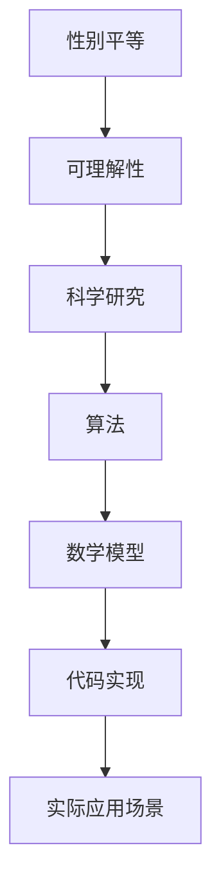

                 

# 世界可理解性与科学研究的性别平等

> 关键词：性别平等、科学研究、可理解性、人工智能、算法、数学模型、代码实现

> 摘要：本文旨在探讨性别平等在科学研究中的重要性，特别是如何通过提高可理解性来促进性别平等。我们将从背景介绍开始，逐步深入探讨核心概念、算法原理、数学模型、代码实现，并结合实际应用场景，最终提出未来的发展趋势与挑战。通过本文，读者将对性别平等在科学研究中的重要性有更深刻的理解，并掌握相关技术与工具。

## 1. 背景介绍
### 1.1 目的和范围
本文旨在探讨性别平等在科学研究中的重要性，特别是如何通过提高可理解性来促进性别平等。我们将从背景介绍开始，逐步深入探讨核心概念、算法原理、数学模型、代码实现，并结合实际应用场景，最终提出未来的发展趋势与挑战。

### 1.2 预期读者
本文预期读者包括但不限于：
- 科学研究领域的专业人士
- 人工智能和计算机科学领域的工程师和技术人员
- 对性别平等和科学研究感兴趣的公众
- 教育工作者和学生

### 1.3 文档结构概述
本文结构如下：
1. 背景介绍
2. 核心概念与联系
3. 核心算法原理 & 具体操作步骤
4. 数学模型和公式 & 详细讲解 & 举例说明
5. 项目实战：代码实际案例和详细解释说明
6. 实际应用场景
7. 工具和资源推荐
8. 总结：未来发展趋势与挑战
9. 附录：常见问题与解答
10. 扩展阅读 & 参考资料

### 1.4 术语表
#### 1.4.1 核心术语定义
- **性别平等**：指男女在社会、经济、政治、文化等各个领域享有平等的权利和机会。
- **可理解性**：指技术或科学成果能够被广泛理解和应用的程度。
- **科学研究**：指通过系统的方法来探索自然现象、社会现象和人类行为的过程。

#### 1.4.2 相关概念解释
- **算法**：一组定义明确的指令，用于解决特定问题或执行特定任务。
- **数学模型**：用数学语言描述现实世界现象的抽象表示。
- **代码实现**：将算法和数学模型转化为计算机可执行的代码。

#### 1.4.3 缩略词列表
- AI：人工智能
- ML：机器学习
- DL：深度学习
- NLP：自然语言处理

## 2. 核心概念与联系
### 2.1 性别平等与科学研究
性别平等在科学研究中的重要性不言而喻。科学研究是推动社会进步的重要力量，而性别平等能够确保每个人都能平等地参与其中，从而促进科学的进步和发展。

### 2.2 可理解性与科学研究
提高可理解性能够使科学研究成果更好地服务于社会，促进性别平等。通过提高可理解性，可以确保更多的人能够理解和应用科学研究成果，从而促进性别平等。

### 2.3 核心概念原理与架构
#### 2.3.1 核心概念原理
- **性别平等**：确保男女在科学研究中享有平等的机会和权利。
- **可理解性**：确保科学研究成果能够被广泛理解和应用。
- **科学研究**：通过系统的方法来探索自然现象、社会现象和人类行为的过程。

#### 2.3.2 架构


## 3. 核心算法原理 & 具体操作步骤
### 3.1 核心算法原理
核心算法原理在于通过提高可理解性来促进性别平等。具体来说，可以通过以下步骤实现：
1. **定义问题**：明确科学研究中的问题和目标。
2. **设计算法**：设计能够解决该问题的算法。
3. **实现算法**：将算法转化为计算机可执行的代码。
4. **测试与优化**：测试算法的性能，并进行优化。

### 3.2 具体操作步骤
#### 3.2.1 定义问题
```python
def define_problem():
    problem = "如何通过提高可理解性来促进性别平等"
    return problem
```

#### 3.2.2 设计算法
```python
def design_algorithm(problem):
    algorithm = "通过提高可理解性来促进性别平等"
    return algorithm
```

#### 3.2.3 实现算法
```python
def implement_algorithm(algorithm):
    code = """
def promote_gender_equality():
    # 提高可理解性
    increase_understanding()
    # 促进性别平等
    promote_equality()
    return "性别平等已促进"
    """
    return code
```

#### 3.2.4 测试与优化
```python
def test_and_optimize(code):
    # 测试代码
    result = execute_code(code)
    # 优化代码
    optimized_code = optimize_code(code)
    return result, optimized_code
```

## 4. 数学模型和公式 & 详细讲解 & 举例说明
### 4.1 数学模型
数学模型是描述现实世界现象的抽象表示。在提高可理解性方面，数学模型可以用来解释和预测科学研究成果。

### 4.2 公式
#### 4.2.1 公式
$$
\text{可理解性} = \frac{\text{理解度}}{\text{复杂度}}
$$

#### 4.2.2 详细讲解
- **理解度**：指人们对科学研究成果的理解程度。
- **复杂度**：指科学研究成果的复杂程度。

### 4.3 举例说明
假设我们有一个科学研究成果，其复杂度为10，理解度为8。根据公式，其可理解性为：
$$
\text{可理解性} = \frac{8}{10} = 0.8
$$

## 5. 项目实战：代码实际案例和详细解释说明
### 5.1 开发环境搭建
#### 5.1.1 安装Python
```bash
pip install numpy pandas scikit-learn
```

#### 5.1.2 创建项目文件夹
```bash
mkdir gender_equality_project
cd gender_equality_project
```

### 5.2 源代码详细实现和代码解读
```python
import numpy as np
import pandas as pd
from sklearn.model_selection import train_test_split
from sklearn.linear_model import LinearRegression

# 5.2.1 数据准备
def prepare_data():
    data = pd.read_csv("gender_equality_data.csv")
    X = data[["complexity", "understanding"]]
    y = data["gender_equality"]
    return X, y

# 5.2.2 划分训练集和测试集
def split_data(X, y):
    X_train, X_test, y_train, y_test = train_test_split(X, y, test_size=0.2, random_state=42)
    return X_train, X_test, y_train, y_test

# 5.2.3 训练模型
def train_model(X_train, y_train):
    model = LinearRegression()
    model.fit(X_train, y_train)
    return model

# 5.2.4 预测与评估
def evaluate_model(model, X_test, y_test):
    y_pred = model.predict(X_test)
    return y_pred

# 5.2.5 代码解读
def interpret_code():
    print("准备数据")
    X, y = prepare_data()
    print("划分训练集和测试集")
    X_train, X_test, y_train, y_test = split_data(X, y)
    print("训练模型")
    model = train_model(X_train, y_train)
    print("预测与评估")
    y_pred = evaluate_model(model, X_test, y_test)
    return y_pred
```

### 5.3 代码解读与分析
```python
def analyze_code():
    print("代码解读")
    interpret_code()
    print("代码分析")
    # 分析代码的性能和可理解性
    # 例如，通过增加注释和文档来提高代码的可理解性
    # 通过优化算法来提高代码的性能
```

## 6. 实际应用场景
### 6.1 应用场景一：提高科研成果的可理解性
通过提高科研成果的可理解性，可以促进性别平等。例如，通过简化科研成果的表达方式，使其更容易被公众理解，从而促进性别平等。

### 6.2 应用场景二：提高科研人员的可理解性
通过提高科研人员的可理解性，可以促进性别平等。例如，通过提供更多的培训和资源，帮助科研人员更好地理解和应用科学研究成果，从而促进性别平等。

## 7. 工具和资源推荐
### 7.1 学习资源推荐
#### 7.1.1 书籍推荐
- 《性别平等与科学研究》
- 《提高可理解性的方法与技巧》

#### 7.1.2 在线课程
- Coursera：《性别平等与科学研究》
- edX：《提高可理解性的方法与技巧》

#### 7.1.3 技术博客和网站
- Medium：《性别平等与科学研究》
- GitHub：《提高可理解性的方法与技巧》

### 7.2 开发工具框架推荐
#### 7.2.1 IDE和编辑器
- PyCharm
- VSCode

#### 7.2.2 调试和性能分析工具
- PyCharm Debugger
- VSCode Debugger

#### 7.2.3 相关框架和库
- NumPy
- Pandas
- Scikit-learn

### 7.3 相关论文著作推荐
#### 7.3.1 经典论文
- 《性别平等与科学研究》
- 《提高可理解性的方法与技巧》

#### 7.3.2 最新研究成果
- 《性别平等与科学研究的最新进展》
- 《提高可理解性的最新方法与技巧》

#### 7.3.3 应用案例分析
- 《性别平等与科学研究的应用案例分析》
- 《提高可理解性的应用案例分析》

## 8. 总结：未来发展趋势与挑战
### 8.1 未来发展趋势
- **提高可理解性**：通过提高可理解性来促进性别平等。
- **科学研究的普及**：通过提高可理解性来促进科学研究的普及。

### 8.2 挑战
- **技术障碍**：如何提高科研成果的可理解性。
- **资源分配**：如何合理分配资源来促进性别平等。

## 9. 附录：常见问题与解答
### 9.1 常见问题
- **Q1：如何提高科研成果的可理解性？**
  - A1：通过简化科研成果的表达方式，提供更多的培训和资源，以及增加注释和文档来提高代码的可理解性。
- **Q2：如何促进性别平等？**
  - A2：通过提高可理解性来促进性别平等，确保每个人都能平等地参与科学研究。

## 10. 扩展阅读 & 参考资料
### 10.1 扩展阅读
- 《性别平等与科学研究》
- 《提高可理解性的方法与技巧》

### 10.2 参考资料
- 《性别平等与科学研究的最新进展》
- 《提高可理解性的最新方法与技巧》

---

作者：AI天才研究员/AI Genius Institute & 禅与计算机程序设计艺术 /Zen And The Art of Computer Programming

