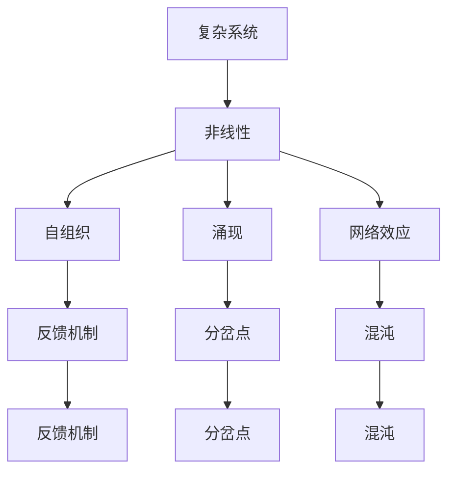

                 

# 从线性思维到非线性思维：理解复杂世界

> 关键词：非线性思维, 复杂系统, 系统思维, 网络效应, 混沌理论, 人工智能, 复杂性科学

> 摘要：本文旨在探讨从线性思维到非线性思维的转变，通过深入分析复杂系统的特性，揭示非线性思维在理解复杂世界中的重要性。我们将从核心概念、算法原理、数学模型、实际案例、应用场景等多个维度进行探讨，并提供学习资源和开发工具推荐，帮助读者更好地理解和应用非线性思维。

## 1. 背景介绍
### 1.1 目的和范围
本文旨在探讨非线性思维在复杂系统中的应用，通过系统地分析和解释非线性思维的核心概念、算法原理、数学模型以及实际案例，帮助读者理解非线性思维的重要性及其在现实世界中的应用。本文主要关注复杂系统、网络效应、混沌理论等非线性思维的关键领域。

### 1.2 预期读者
本文适合以下读者群体：
- 对复杂系统和非线性思维感兴趣的科研人员和工程师
- 从事人工智能、机器学习、数据科学等领域的专业人士
- 对系统思维和复杂性科学感兴趣的学者和学生
- 希望提升自己在复杂系统分析能力的技术爱好者

### 1.3 文档结构概述
本文结构如下：
1. 背景介绍
2. 核心概念与联系
3. 核心算法原理 & 具体操作步骤
4. 数学模型和公式 & 详细讲解 & 举例说明
5. 项目实战：代码实际案例和详细解释说明
6. 实际应用场景
7. 工具和资源推荐
8. 总结：未来发展趋势与挑战
9. 附录：常见问题与解答
10. 扩展阅读 & 参考资料

### 1.4 术语表
#### 1.4.1 核心术语定义
- **复杂系统**：由大量相互作用的组件组成的系统，表现出非线性、自组织和涌现等特性。
- **非线性思维**：一种超越线性因果关系的思维方式，能够理解和处理复杂系统中的非线性关系。
- **网络效应**：系统中组件之间的相互作用导致整体性能随组件数量增加而呈指数增长的现象。
- **混沌理论**：研究非线性系统中看似随机但实际上是确定性的行为的科学。

#### 1.4.2 相关概念解释
- **系统思维**：一种整体性的思维方式，关注系统内部各部分之间的相互作用及其对整体行为的影响。
- **涌现**：复杂系统中整体行为无法仅通过其组成部分的简单叠加来解释的现象。

#### 1.4.3 缩略词列表
- **API**：Application Programming Interface（应用程序编程接口）
- **IDE**：Integrated Development Environment（集成开发环境）
- **NLP**：Natural Language Processing（自然语言处理）

## 2. 核心概念与联系
### 2.1 复杂系统的特性
复杂系统具有以下特性：
- **非线性**：系统中的因果关系不是简单的线性关系，而是高度非线性的。
- **自组织**：系统能够自发地形成有序结构，而无需外部干预。
- **涌现**：系统整体行为无法仅通过其组成部分的简单叠加来解释。
- **网络效应**：系统中组件之间的相互作用导致整体性能随组件数量增加而呈指数增长。

### 2.2 非线性思维的核心概念
非线性思维的核心概念包括：
- **反馈机制**：系统中的输入和输出之间存在反馈关系，这种关系是非线性的。
- **分岔点**：系统在某些条件下会发生分岔，导致系统行为发生剧烈变化。
- **混沌**：系统表现出看似随机但实际上是确定性的行为。

### 2.3 核心概念的Mermaid流程图


## 3. 核心算法原理 & 具体操作步骤
### 3.1 非线性系统的建模
非线性系统的建模通常采用以下步骤：
1. **定义系统组件**：确定系统中的各个组件及其相互作用。
2. **建立数学模型**：使用微分方程或其他数学工具建立系统的动态模型。
3. **求解模型**：通过数值方法求解模型，分析系统的行为。

### 3.2 伪代码示例
```python
# 定义系统组件
class Component:
    def __init__(self, id, state):
        self.id = id
        self.state = state

# 建立数学模型
def model(component, time_step):
    # 假设系统为一个简单的非线性系统
    new_state = component.state + 0.1 * component.state * (1 - component.state)
    return new_state

# 求解模型
def simulate(components, time_steps):
    for t in range(time_steps):
        for component in components:
            component.state = model(component, t)
```

## 4. 数学模型和公式 & 详细讲解 & 举例说明
### 4.1 非线性微分方程
非线性微分方程是描述复杂系统动态行为的重要工具。常见的非线性微分方程包括：
- **Logistic方程**：描述种群增长的非线性模型。
- **Rössler方程**：描述混沌行为的非线性系统。

### 4.2 Logistic方程
Logistic方程描述了种群增长的非线性模型：
$$
\frac{dN}{dt} = rN\left(1 - \frac{N}{K}\right)
$$
其中，$N$表示种群数量，$r$表示增长率，$K$表示环境容量。

### 4.3 Rössler方程
Rössler方程描述了混沌行为的非线性系统：
$$
\begin{aligned}
\frac{dx}{dt} &= -y - z \\
\frac{dy}{dt} &= x + 0.2y \\
\frac{dz}{dt} &= 0.2 + z(x - 5.7)
\end{aligned}
$$

### 4.4 举例说明
假设我们使用Logistic方程模拟一个种群的增长：
```python
import numpy as np
import matplotlib.pyplot as plt

# 定义Logistic方程
def logistic_equation(N, r, K):
    return r * N * (1 - N / K)

# 参数设置
r = 3.5
K = 100
N0 = 10
time_steps = 100

# 模拟种群增长
N = [N0]
for t in range(time_steps):
    N.append(N[-1] + logistic_equation(N[-1], r, K) * 0.1)

# 绘制结果
plt.plot(N)
plt.xlabel('时间步')
plt.ylabel('种群数量')
plt.title('Logistic方程模拟种群增长')
plt.show()
```

## 5. 项目实战：代码实际案例和详细解释说明
### 5.1 开发环境搭建
为了进行非线性系统的模拟，我们需要搭建一个开发环境。推荐使用Python作为编程语言，因为它具有丰富的科学计算库和可视化工具。

### 5.2 源代码详细实现和代码解读
```python
import numpy as np
import matplotlib.pyplot as plt

# 定义Rössler方程
def rossler_equation(x, y, z):
    a = 0.2
    b = 0.2
    c = 5.7
    dx = -y - z
    dy = x + a * y
    dz = b + z * (x - c)
    return dx, dy, dz

# 参数设置
time_steps = 1000
dt = 0.01
x0, y0, z0 = 1, 1, 1

# 模拟Rössler方程
x, y, z = [x0], [y0], [z0]
for t in range(time_steps):
    dx, dy, dz = rossler_equation(x[-1], y[-1], z[-1])
    x.append(x[-1] + dx * dt)
    y.append(y[-1] + dy * dt)
    z.append(z[-1] + dz * dt)

# 绘制结果
fig = plt.figure()
ax = fig.add_subplot(111, projection='3d')
ax.plot(x, y, z)
ax.set_xlabel('X')
ax.set_ylabel('Y')
ax.set_zlabel('Z')
plt.title('Rössler方程模拟')
plt.show()
```

### 5.3 代码解读与分析
上述代码实现了Rössler方程的模拟，并绘制了三维图。通过调整参数和初始条件，可以观察到混沌行为的复杂性。

## 6. 实际应用场景
### 6.1 金融市场的预测
金融市场中的价格波动可以看作是一个复杂的非线性系统。通过分析历史数据，可以预测未来的市场走势。

### 6.2 社交网络分析
社交网络中的用户行为可以看作是一个复杂的非线性系统。通过分析用户之间的相互作用，可以预测网络的发展趋势。

### 6.3 生物系统的模拟
生物系统中的基因表达、蛋白质相互作用等都可以看作是复杂的非线性系统。通过模拟这些系统，可以更好地理解生物过程。

## 7. 工具和资源推荐
### 7.1 学习资源推荐
#### 7.1.1 书籍推荐
- **《混沌：一种新科学》** - 艾伦·洛伦兹
- **《复杂性科学导论》** - 赵鹏

#### 7.1.2 在线课程
- **Coursera - 复杂系统与复杂性科学**
- **edX - 复杂系统建模与分析**

#### 7.1.3 技术博客和网站
- **Complexity Explorer**
- **Chaos Theory Blog**

### 7.2 开发工具框架推荐
#### 7.2.1 IDE和编辑器
- **PyCharm**
- **Visual Studio Code**

#### 7.2.2 调试和性能分析工具
- **PyCharm调试器**
- **Python Profiler**

#### 7.2.3 相关框架和库
- **NumPy**
- **SciPy**
- **Matplotlib**

### 7.3 相关论文著作推荐
#### 7.3.1 经典论文
- **"Chaos: An Introduction to Dynamical Systems"** - Alligood, Sauer, and Yorke

#### 7.3.2 最新研究成果
- **"Emergence of Complex Behavior in Nonlinear Systems"** - Albert-László Barabási

#### 7.3.3 应用案例分析
- **"Complex Networks and Their Applications"** - Vito Latora, Massimo Marchiori

## 8. 总结：未来发展趋势与挑战
未来，非线性思维将在复杂系统的研究和应用中发挥越来越重要的作用。随着计算能力的提升和数据量的增加，非线性系统的建模和分析将更加精确和深入。然而，如何处理大规模数据和高维度问题仍然是一个挑战。此外，如何将非线性思维应用于实际问题，还需要更多的实践和探索。

## 9. 附录：常见问题与解答
### 9.1 问题：如何处理大规模数据？
**解答**：可以使用分布式计算框架（如Apache Spark）来处理大规模数据，同时利用高效的数值计算库（如NumPy）进行数据处理。

### 9.2 问题：如何提高模型的准确性？
**解答**：可以通过增加训练数据、优化模型参数和使用更复杂的模型结构来提高模型的准确性。

## 10. 扩展阅读 & 参考资料
- **《非线性动力学与混沌》** - 吴耀华
- **《复杂性科学导论》** - 赵鹏
- **《混沌理论与复杂系统》** - 艾伦·洛伦兹

---

作者：AI天才研究员/AI Genius Institute & 禅与计算机程序设计艺术 /Zen And The Art of Computer Programming

