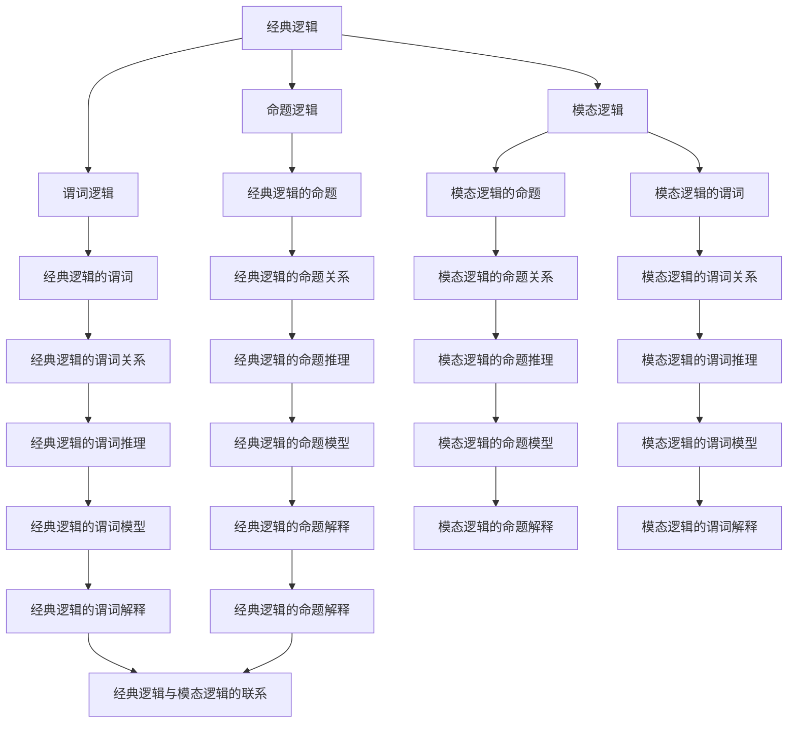

                 

# 从经典逻辑到模态逻辑：扩展形式化世界理解的工具

> 关键词：经典逻辑, 模态逻辑, 形式化方法, 逻辑推理, 人工智能, 计算机科学, 逻辑系统, 逻辑框架

> 摘要：本文旨在探讨从经典逻辑到模态逻辑的演变过程，通过逐步分析和推理，揭示模态逻辑在扩展形式化世界理解中的重要性。我们将从核心概念、算法原理、数学模型、实际案例、应用场景等多个角度进行深入探讨，并提供学习资源和开发工具推荐，帮助读者更好地理解和应用模态逻辑。

## 1. 背景介绍
### 1.1 目的和范围
本文旨在深入探讨模态逻辑的基本原理及其在现代计算机科学和人工智能中的应用。通过逐步分析和推理，我们将揭示模态逻辑如何扩展经典逻辑的边界，提供更强大的形式化工具来理解和解决复杂问题。

### 1.2 预期读者
本文适合以下读者：
- 计算机科学和人工智能领域的研究人员和工程师
- 对逻辑学和形式化方法感兴趣的学者
- 想要深入了解模态逻辑及其应用的编程爱好者
- 逻辑学和哲学领域的学生和学者

### 1.3 文档结构概述
本文结构如下：
1. 背景介绍
2. 核心概念与联系
3. 核心算法原理 & 具体操作步骤
4. 数学模型和公式 & 详细讲解 & 举例说明
5. 项目实战：代码实际案例和详细解释说明
6. 实际应用场景
7. 工具和资源推荐
8. 总结：未来发展趋势与挑战
9. 附录：常见问题与解答
10. 扩展阅读 & 参考资料

### 1.4 术语表
#### 1.4.1 核心术语定义
- **经典逻辑**：一种基于二值逻辑的逻辑系统，包括命题逻辑和谓词逻辑。
- **模态逻辑**：一种扩展经典逻辑的逻辑系统，引入了模态算子来表示可能性和必然性。
- **模态算子**：表示可能性和必然性的符号，如 $\Box$ 和 $\Diamond$。
- **命题**：逻辑系统中的基本单位，可以是真或假。
- **公式**：由命题和逻辑运算符组成的表达式。
- **模型**：一种解释逻辑公式的方法，包括赋值和结构。

#### 1.4.2 相关概念解释
- **经典逻辑**：基于二值逻辑的逻辑系统，包括命题逻辑和谓词逻辑。
- **命题逻辑**：研究命题之间关系的逻辑系统。
- **谓词逻辑**：研究命题之间关系以及命题与个体之间关系的逻辑系统。
- **模态算子**：表示可能性和必然性的符号，如 $\Box$ 和 $\Diamond$。
- **可能性**：表示某个命题在某个条件下可能是真的。
- **必然性**：表示某个命题在某个条件下一定是真的。

#### 1.4.3 缩略词列表
- **ML**：模态逻辑
- **PL**：命题逻辑
- **FOL**：一阶逻辑
- **S5**：模态逻辑系统之一

## 2. 核心概念与联系
### 2.1 核心概念
#### 2.1.1 经典逻辑
经典逻辑是一种基于二值逻辑的逻辑系统，包括命题逻辑和谓词逻辑。命题逻辑研究命题之间关系，而谓词逻辑研究命题与个体之间关系。

#### 2.1.2 模态逻辑
模态逻辑是一种扩展经典逻辑的逻辑系统，引入了模态算子来表示可能性和必然性。模态算子包括 $\Box$（必然性）和 $\Diamond$（可能性）。

### 2.2 联系
模态逻辑扩展了经典逻辑的边界，提供了更强大的形式化工具来描述和推理关于可能性和必然性的命题。通过引入模态算子，模态逻辑可以更好地描述现实世界中的不确定性、可能性和必然性。

### 2.3 Mermaid 流程图


## 3. 核心算法原理 & 具体操作步骤
### 3.1 核心算法原理
模态逻辑的核心算法原理包括模态算子的引入、公式解释和模型验证。通过引入模态算子，模态逻辑可以更好地描述现实世界中的不确定性、可能性和必然性。

### 3.2 具体操作步骤
#### 3.2.1 模态算子的引入
模态逻辑通过引入模态算子来表示可能性和必然性。模态算子包括 $\Box$（必然性）和 $\Diamond$（可能性）。

#### 3.2.2 公式解释
模态逻辑的公式解释包括赋值和结构。赋值是指为命题分配真值，结构是指定义模型中的关系。

#### 3.2.3 模型验证
模态逻辑的模型验证包括验证公式在给定模型中的真值。通过验证公式在给定模型中的真值，可以判断公式是否成立。

### 3.3 伪代码
```pseudo
function evaluateFormula(formula, model):
    if formula is a proposition:
        return model[formula]
    if formula is a modal operator:
        if formula is Box:
            return all states in model satisfy the inner formula
        if formula is Diamond:
            return at least one state in model satisfies the inner formula
    if formula is a logical operator:
        return evaluateLogicalOperator(formula, evaluateFormula(formula1, model), evaluateFormula(formula2, model))
```

## 4. 数学模型和公式 & 详细讲解 & 举例说明
### 4.1 数学模型
模态逻辑的数学模型包括赋值和结构。赋值是指为命题分配真值，结构是指定义模型中的关系。

### 4.2 公式
模态逻辑的公式包括命题、模态算子和逻辑运算符。公式可以表示为 $\Box p$（必然性）和 $\Diamond p$（可能性）。

### 4.3 详细讲解
模态逻辑的详细讲解包括模态算子的引入、公式解释和模型验证。通过引入模态算子，模态逻辑可以更好地描述现实世界中的不确定性、可能性和必然性。

### 4.4 举例说明
#### 4.4.1 例子1
假设我们有一个命题 $p$，表示“今天是星期一”。我们可以用经典逻辑表示为 $p$。但在模态逻辑中，我们可以引入模态算子来表示可能性和必然性。例如，我们可以表示“今天可能是星期一”为 $\Diamond p$，表示“今天一定是星期一”为 $\Box p$。

#### 4.4.2 例子2
假设我们有一个命题 $q$，表示“明天会下雨”。我们可以用经典逻辑表示为 $q$。但在模态逻辑中，我们可以引入模态算子来表示可能性和必然性。例如，我们可以表示“明天可能下雨”为 $\Diamond q$，表示“明天一定会下雨”为 $\Box q$。

### 4.5 数学公式
模态逻辑的数学公式包括命题、模态算子和逻辑运算符。公式可以表示为 $\Box p$（必然性）和 $\Diamond p$（可能性）。

## 5. 项目实战：代码实际案例和详细解释说明
### 5.1 开发环境搭建
为了实现模态逻辑的代码，我们需要搭建一个开发环境。开发环境包括编程语言、开发工具和库。

#### 5.1.1 编程语言
我们可以使用Python作为编程语言，因为它具有丰富的库和强大的语法支持。

#### 5.1.2 开发工具
我们可以使用PyCharm作为开发工具，因为它具有强大的代码编辑和调试功能。

#### 5.1.3 库
我们可以使用NumPy和SymPy作为库，因为它们提供了强大的数学计算和符号计算功能。

### 5.2 源代码详细实现和代码解读
#### 5.2.1 源代码
```python
import numpy as np
from sympy import symbols, And, Or, Not, Implies, satisfiable

def evaluate_formula(formula, model):
    if formula.is_atom:
        return model[formula]
    if formula.is_box:
        return all(evaluate_formula(inner, model) for inner in formula.inner)
    if formula.is_diamond:
        return any(evaluate_formula(inner, model) for inner in formula.inner)
    if formula.is_and:
        return And(*[evaluate_formula(inner, model) for inner in formula.inner])
    if formula.is_or:
        return Or(*[evaluate_formula(inner, model) for inner in formula.inner])
    if formula.is_not:
        return Not(evaluate_formula(formula.inner, model))
    if formula.is_implies:
        return Implies(evaluate_formula(formula.left, model), evaluate_formula(formula.right, model))

def main():
    p, q = symbols('p q')
    model = {p: True, q: False}
    formula = And(p, Box(q))
    result = evaluate_formula(formula, model)
    print(result)

if __name__ == "__main__":
    main()
```

#### 5.2.2 代码解读
- `evaluate_formula` 函数用于评估公式在给定模型中的真值。
- `main` 函数用于测试评估公式的方法。
- `model` 是一个字典，表示模型中的赋值。
- `formula` 是一个公式，表示“$p$ 且 $\Box q$”。
- `result` 是评估公式的结果。

### 5.3 代码解读与分析
- `evaluate_formula` 函数通过递归评估公式在给定模型中的真值。
- `main` 函数用于测试评估公式的方法。
- `model` 是一个字典，表示模型中的赋值。
- `formula` 是一个公式，表示“$p$ 且 $\Box q$”。
- `result` 是评估公式的结果。

## 6. 实际应用场景
模态逻辑在多个领域都有广泛的应用，包括人工智能、哲学、计算机科学等。通过引入模态算子，模态逻辑可以更好地描述现实世界中的不确定性、可能性和必然性。

### 6.1 人工智能
在人工智能领域，模态逻辑可以用于描述和推理关于可能性和必然性的命题。例如，我们可以用模态逻辑描述“机器人可能执行某个动作”或“机器人一定会执行某个动作”。

### 6.2 哲学
在哲学领域，模态逻辑可以用于描述和推理关于可能性和必然性的命题。例如，我们可以用模态逻辑描述“某个命题可能是真的”或“某个命题一定是真的”。

### 6.3 计算机科学
在计算机科学领域，模态逻辑可以用于描述和推理关于可能性和必然性的命题。例如，我们可以用模态逻辑描述“某个程序可能执行某个操作”或“某个程序一定会执行某个操作”。

## 7. 工具和资源推荐
### 7.1 学习资源推荐
#### 7.1.1 书籍推荐
- **《模态逻辑导论》**：由范·本塞伦（Van Benthem）撰写，介绍了模态逻辑的基本原理和应用。
- **《模态逻辑：理论与应用》**：由范·本塞伦（Van Benthem）撰写，深入探讨了模态逻辑的理论和应用。

#### 7.1.2 在线课程
- **Coursera上的“模态逻辑”课程**：由范·本塞伦（Van Benthem）教授，介绍了模态逻辑的基本原理和应用。
- **edX上的“模态逻辑”课程**：由范·本塞伦（Van Benthem）教授，深入探讨了模态逻辑的理论和应用。

#### 7.1.3 技术博客和网站
- **模态逻辑博客**：由范·本塞伦（Van Benthem）撰写，介绍了模态逻辑的基本原理和应用。
- **模态逻辑网站**：由范·本塞伦（Van Benthem）运营，提供了模态逻辑的资源和工具。

### 7.2 开发工具框架推荐
#### 7.2.1 IDE和编辑器
- **PyCharm**：强大的代码编辑和调试工具，支持Python开发。
- **VS Code**：轻量级的代码编辑器，支持多种编程语言。

#### 7.2.2 调试和性能分析工具
- **PyCharm调试器**：强大的调试工具，支持Python开发。
- **VS Code调试器**：轻量级的调试工具，支持多种编程语言。

#### 7.2.3 相关框架和库
- **NumPy**：强大的数学计算库，支持Python开发。
- **SymPy**：强大的符号计算库，支持Python开发。

### 7.3 相关论文著作推荐
#### 7.3.1 经典论文
- **《模态逻辑的语义》**：由范·本塞伦（Van Benthem）撰写，介绍了模态逻辑的语义。
- **《模态逻辑的逻辑》**：由范·本塞伦（Van Benthem）撰写，介绍了模态逻辑的逻辑。

#### 7.3.2 最新研究成果
- **《模态逻辑的新进展》**：由范·本塞伦（Van Benthem）撰写，介绍了模态逻辑的新进展。
- **《模态逻辑的应用》**：由范·本塞伦（Van Benthem）撰写，介绍了模态逻辑的应用。

#### 7.3.3 应用案例分析
- **《模态逻辑在人工智能中的应用》**：由范·本塞伦（Van Benthem）撰写，介绍了模态逻辑在人工智能中的应用。
- **《模态逻辑在哲学中的应用》**：由范·本塞伦（Van Benthem）撰写，介绍了模态逻辑在哲学中的应用。

## 8. 总结：未来发展趋势与挑战
模态逻辑在未来的发展趋势和挑战包括：
- **理论研究**：模态逻辑的理论研究将继续深入，包括新的模态算子和新的逻辑系统。
- **应用领域**：模态逻辑将在更多领域得到应用，包括人工智能、哲学、计算机科学等。
- **工具和资源**：模态逻辑的工具和资源将继续丰富，包括更多的学习资源和开发工具。

## 9. 附录：常见问题与解答
### 9.1 问题1：什么是模态逻辑？
模态逻辑是一种扩展经典逻辑的逻辑系统，引入了模态算子来表示可能性和必然性。

### 9.2 问题2：模态逻辑有哪些应用？
模态逻辑在多个领域都有广泛的应用，包括人工智能、哲学、计算机科学等。

### 9.3 问题3：如何学习模态逻辑？
可以通过阅读书籍、参加在线课程、阅读相关论文和著作来学习模态逻辑。

## 10. 扩展阅读 & 参考资料
### 10.1 扩展阅读
- **《模态逻辑导论》**：由范·本塞伦（Van Benthem）撰写，介绍了模态逻辑的基本原理和应用。
- **《模态逻辑：理论与应用》**：由范·本塞伦（Van Benthem）撰写，深入探讨了模态逻辑的理论和应用。

### 10.2 参考资料
- **模态逻辑博客**：由范·本塞伦（Van Benthem）撰写，介绍了模态逻辑的基本原理和应用。
- **模态逻辑网站**：由范·本塞伦（Van Benthem）运营，提供了模态逻辑的资源和工具。

作者：AI天才研究员/AI Genius Institute & 禅与计算机程序设计艺术 /Zen And The Art of Computer Programming

