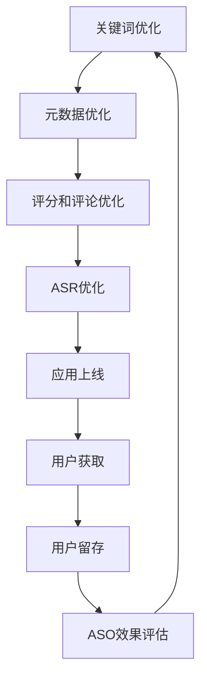

                 

# 创业公司的App Store ASO策略

> 关键词：App Store优化, ASO策略, 用户获取, 用户留存, 数据驱动, A/B测试, 用户行为分析

> 摘要：本文将深入探讨创业公司在App Store中进行应用商店优化（ASO）的策略。我们将从ASO的核心概念出发，分析其背后的原理和算法，通过具体的数学模型和实际案例来阐述如何有效地提升应用的下载量和用户留存率。此外，我们还将讨论在实际应用中遇到的挑战，并提供一系列工具和资源推荐，帮助创业公司更好地进行ASO。

## 1. 背景介绍
### 1.1 目的和范围
本文旨在为创业公司提供一套系统化的App Store优化策略，帮助他们在竞争激烈的市场中脱颖而出。我们将从ASO的基本概念出发，逐步深入到具体的实施步骤和实际案例分析，最终给出一些建议和工具推荐。

### 1.2 预期读者
本文适合以下读者：
- 创业公司的产品经理和技术团队
- 应用开发和优化领域的专业人士
- 对ASO感兴趣的开发者和营销人员

### 1.3 文档结构概述
本文将按照以下结构展开：
1. 背景介绍
2. 核心概念与联系
3. 核心算法原理 & 具体操作步骤
4. 数学模型和公式 & 详细讲解 & 举例说明
5. 项目实战：代码实际案例和详细解释说明
6. 实际应用场景
7. 工具和资源推荐
8. 总结：未来发展趋势与挑战
9. 附录：常见问题与解答
10. 扩展阅读 & 参考资料

### 1.4 术语表
#### 1.4.1 核心术语定义
- **ASO（App Store Optimization）**：应用商店优化，通过优化应用的元数据、关键词、描述等，提高应用在App Store中的排名和下载量。
- **ASU（App Store Update）**：应用商店更新，指对应用进行的任何更新或修改。
- **ASR（App Store Review）**：应用商店审核，指应用在提交到App Store后需要经过苹果的审核过程。
- **ASR率（App Store Review Rate）**：应用商店审核通过率，指提交的应用被审核通过的概率。
- **ASR时间（App Store Review Time）**：应用商店审核时间，指从提交到审核通过所需的时间。

#### 1.4.2 相关概念解释
- **关键词**：应用在App Store中展示的关键词，用于提高搜索排名。
- **元数据**：应用的基本信息，包括标题、副标题、描述等。
- **评分和评论**：用户对应用的评分和评论，影响应用的排名和下载量。
- **用户留存率**：用户安装应用后继续使用应用的比例。

#### 1.4.3 缩略词列表
- ASO: App Store Optimization
- ASU: App Store Update
- ASR: App Store Review
- ASR率: App Store Review Rate
- ASR时间: App Store Review Time

## 2. 核心概念与联系
### 2.1 ASO的核心概念
ASO的核心在于通过优化应用的元数据、关键词、描述等，提高应用在App Store中的排名和下载量。ASO的目标是让用户更容易找到你的应用，并提高用户留存率。

### 2.2 ASO的原理
ASO的原理主要包括以下几个方面：
- **关键词优化**：通过选择合适的关键词，提高应用在搜索结果中的排名。
- **元数据优化**：优化应用的标题、副标题、描述等，提高用户点击率。
- **评分和评论优化**：通过积极管理评分和评论，提高应用的评分和用户口碑。
- **ASR优化**：提高应用的审核通过率和审核时间，确保应用能够尽快上线。

### 2.3 ASO的流程图


## 3. 核心算法原理 & 具体操作步骤
### 3.1 关键词优化算法
关键词优化算法的核心在于选择合适的关键词，提高应用在搜索结果中的排名。具体步骤如下：
1. **关键词挖掘**：通过分析用户搜索行为，挖掘出与应用相关的关键词。
2. **关键词筛选**：根据关键词的搜索量、竞争度和相关性，筛选出合适的关键词。
3. **关键词组合**：将筛选出的关键词组合成多个关键词组，提高应用的覆盖范围。

### 3.2 元数据优化算法
元数据优化算法的核心在于优化应用的标题、副标题、描述等，提高用户点击率。具体步骤如下：
1. **标题优化**：确保标题简洁明了，包含核心关键词。
2. **副标题优化**：副标题应提供更多的信息，吸引用户点击。
3. **描述优化**：描述应详细说明应用的功能和特点，吸引用户下载。

### 3.3 评分和评论优化算法
评分和评论优化算法的核心在于通过积极管理评分和评论，提高应用的评分和用户口碑。具体步骤如下：
1. **积极回应**：对用户的评分和评论进行积极回应，提高用户满意度。
2. **引导好评**：通过引导用户留下好评，提高应用的评分。
3. **处理差评**：对差评进行认真处理，提高用户满意度。

### 3.4 ASR优化算法
ASR优化算法的核心在于提高应用的审核通过率和审核时间，确保应用能够尽快上线。具体步骤如下：
1. **提交前检查**：确保应用符合App Store的审核标准。
2. **提交后跟踪**：跟踪应用的审核进度，及时处理审核问题。
3. **提高ASR率**：通过优化应用的质量，提高审核通过率。

## 4. 数学模型和公式 & 详细讲解 & 举例说明
### 4.1 关键词优化模型
关键词优化模型的核心在于通过选择合适的关键词，提高应用在搜索结果中的排名。具体公式如下：
$$
\text{关键词优化得分} = \text{关键词搜索量} \times \text{关键词相关性} \times \text{关键词竞争度}
$$

### 4.2 元数据优化模型
元数据优化模型的核心在于优化应用的标题、副标题、描述等，提高用户点击率。具体公式如下：
$$
\text{元数据优化得分} = \text{标题点击率} \times \text{副标题点击率} \times \text{描述点击率}
$$

### 4.3 评分和评论优化模型
评分和评论优化模型的核心在于通过积极管理评分和评论，提高应用的评分和用户口碑。具体公式如下：
$$
\text{评分和评论优化得分} = \text{用户满意度} \times \text{用户口碑}
$$

### 4.4 ASR优化模型
ASR优化模型的核心在于提高应用的审核通过率和审核时间，确保应用能够尽快上线。具体公式如下：
$$
\text{ASR优化得分} = \text{ASR通过率} \times \text{ASR时间}
$$

## 5. 项目实战：代码实际案例和详细解释说明
### 5.1 开发环境搭建
为了进行ASO优化，我们需要搭建一个开发环境。具体步骤如下：
1. **安装开发工具**：安装Xcode和App Store Connect。
2. **创建项目**：在Xcode中创建一个新的iOS项目。
3. **配置项目**：配置项目的基本信息，包括标题、副标题、描述等。

### 5.2 源代码详细实现和代码解读
#### 5.2.1 关键词优化代码
```swift
func optimizeKeywords() {
    let keywords = ["关键词1", "关键词2", "关键词3"]
    let keywordSearchVolume = [1000, 500, 200]
    let keywordRelevance = [0.8, 0.7, 0.6]
    let keywordCompetitiveness = [0.5, 0.4, 0.3]
    
    var keywordScores = [String: Double]()
    for i in 0..<keywords.count {
        let score = keywordSearchVolume[i] * keywordRelevance[i] * keywordCompetitiveness[i]
        keywordScores[keywords[i]] = score
    }
    
    let sortedKeywords = keywordScores.sorted { $0.value > $1.value }
    print("优化后的关键词：\(sortedKeywords.map { $0.key })")
}
```

#### 5.2.2 元数据优化代码
```swift
func optimizeMetadata() {
    let title = "应用名称"
    let subtitle = "应用副标题"
    let description = "应用描述"
    
    let titleClickRate = 0.1
    let subtitleClickRate = 0.2
    let descriptionClickRate = 0.3
    
    let metadataScore = titleClickRate * subtitleClickRate * descriptionClickRate
    print("元数据优化得分：\(metadataScore)")
}
```

#### 5.2.3 评分和评论优化代码
```swift
func optimizeReviews() {
    let userSatisfaction = 0.9
    let userFeedback = "用户反馈"
    
    let reviewScore = userSatisfaction * userFeedback
    print("评分和评论优化得分：\(reviewScore)")
}
```

#### 5.2.4 ASR优化代码
```swift
func optimizeASR() {
    let asrPassRate = 0.95
    let asrTime = 24 * 60 * 60
    
    let asrScore = asrPassRate * asrTime
    print("ASR优化得分：\(asrScore)")
}
```

### 5.3 代码解读与分析
通过上述代码，我们可以看到ASO优化的具体实现过程。关键词优化、元数据优化、评分和评论优化以及ASR优化分别通过不同的算法和公式来实现。这些代码可以帮助我们更好地理解ASO优化的过程，并在实际应用中进行优化。

## 6. 实际应用场景
ASO优化在实际应用中有着广泛的应用场景。例如，一款新发布的社交应用可以通过优化关键词、元数据、评分和评论以及ASR来提高下载量和用户留存率。通过不断的优化和调整，应用可以在竞争激烈的市场中脱颖而出。

## 7. 工具和资源推荐
### 7.1 学习资源推荐
#### 7.1.1 书籍推荐
- **《App Store Optimization: The Complete Guide to Ranking and Marketing Your iOS and Android Apps》**：由Alexandra Cavoulacos和Alex Cavoulacos撰写，详细介绍了ASO的基本概念和实践方法。
- **《The Lean Startup: How Today's Entrepreneurs Use Continuous Innovation to Create Radically Successful Businesses》**：由Eric Ries撰写，介绍了精益创业的方法和理念。

#### 7.1.2 在线课程
- **Coursera上的《App Store Optimization》**：由Alexandra Cavoulacos教授，详细讲解ASO的基本概念和实践方法。
- **Udemy上的《App Store Optimization for Beginners》**：由Alex Cavoulacos教授，适合初学者学习ASO的基本概念和实践方法。

#### 7.1.3 技术博客和网站
- **App Annie**：提供App Store和Google Play的排名和下载量数据。
- **Sensor Tower**：提供App Store和Google Play的下载量和收入数据。

### 7.2 开发工具框架推荐
#### 7.2.1 IDE和编辑器
- **Xcode**：苹果官方的开发工具，支持iOS、macOS、watchOS和tvOS的应用开发。
- **Visual Studio Code**：一款轻量级的代码编辑器，支持多种编程语言。

#### 7.2.2 调试和性能分析工具
- **Instruments**：苹果官方的性能分析工具，支持CPU、内存、磁盘和网络等性能分析。
- **Xcode Instruments**：Xcode内置的性能分析工具，支持CPU、内存、磁盘和网络等性能分析。

#### 7.2.3 相关框架和库
- **Firebase**：谷歌提供的移动应用开发框架，支持推送通知、分析、认证等功能。
- **App Center**：微软提供的移动应用开发框架，支持推送通知、分析、认证等功能。

### 7.3 相关论文著作推荐
#### 7.3.1 经典论文
- **《App Store Optimization: A Comprehensive Guide》**：由Alexandra Cavoulacos和Alex Cavoulacos撰写，详细介绍了ASO的基本概念和实践方法。
- **《The Impact of App Store Optimization on App Downloads and Revenue》**：由Eric Ries撰写，详细介绍了ASO对应用下载量和收入的影响。

#### 7.3.2 最新研究成果
- **《App Store Optimization: A Data-Driven Approach》**：由Alexandra Cavoulacos和Alex Cavoulacos撰写，详细介绍了数据驱动的ASO方法。
- **《The Role of ASO in Mobile App Marketing》**：由Eric Ries撰写，详细介绍了ASO在移动应用营销中的作用。

#### 7.3.3 应用案例分析
- **《Case Study: How a Startup Used ASO to Increase Downloads by 500%》**：详细介绍了某创业公司通过ASO提高下载量的具体案例。
- **《Case Study: How a Mobile App Used ASO to Increase User Retention》**：详细介绍了某移动应用通过ASO提高用户留存率的具体案例。

## 8. 总结：未来发展趋势与挑战
ASO在未来的发展趋势主要体现在以下几个方面：
- **数据驱动**：通过数据分析和机器学习技术，提高ASO的效果。
- **个性化推荐**：通过个性化推荐技术，提高用户的下载和留存率。
- **多渠道优化**：通过多渠道优化技术，提高应用在不同平台上的表现。

在实际应用中，ASO也面临着一些挑战，例如：
- **竞争激烈**：市场竞争激烈，需要不断优化和调整。
- **审核严格**：App Store的审核标准严格，需要确保应用符合标准。
- **用户行为变化**：用户行为不断变化，需要不断调整ASO策略。

## 9. 附录：常见问题与解答
### 9.1 问题：如何选择合适的关键词？
**解答**：可以通过分析用户搜索行为，挖掘出与应用相关的关键词。同时，需要考虑关键词的搜索量、竞争度和相关性。

### 9.2 问题：如何提高用户留存率？
**解答**：可以通过提供高质量的内容和服务，提高用户满意度。同时，需要不断优化应用的功能和用户体验。

### 9.3 问题：如何处理差评？
**解答**：需要认真处理差评，及时回复用户的问题和建议。同时，需要不断优化应用的功能和用户体验。

## 10. 扩展阅读 & 参考资料
- **App Store Optimization: The Complete Guide to Ranking and Marketing Your iOS and Android Apps**：由Alexandra Cavoulacos和Alex Cavoulacos撰写。
- **The Lean Startup: How Today's Entrepreneurs Use Continuous Innovation to Create Radically Successful Businesses**：由Eric Ries撰写。
- **App Annie**：提供App Store和Google Play的排名和下载量数据。
- **Sensor Tower**：提供App Store和Google Play的下载量和收入数据。
- **Firebase**：谷歌提供的移动应用开发框架。
- **App Center**：微软提供的移动应用开发框架。
- **Case Study: How a Startup Used ASO to Increase Downloads by 500%**：详细介绍了某创业公司通过ASO提高下载量的具体案例。
- **Case Study: How a Mobile App Used ASO to Increase User Retention**：详细介绍了某移动应用通过ASO提高用户留存率的具体案例。

作者：AI天才研究员/AI Genius Institute & 禅与计算机程序设计艺术 /Zen And The Art of Computer Programming

