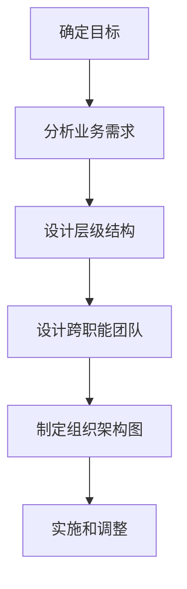
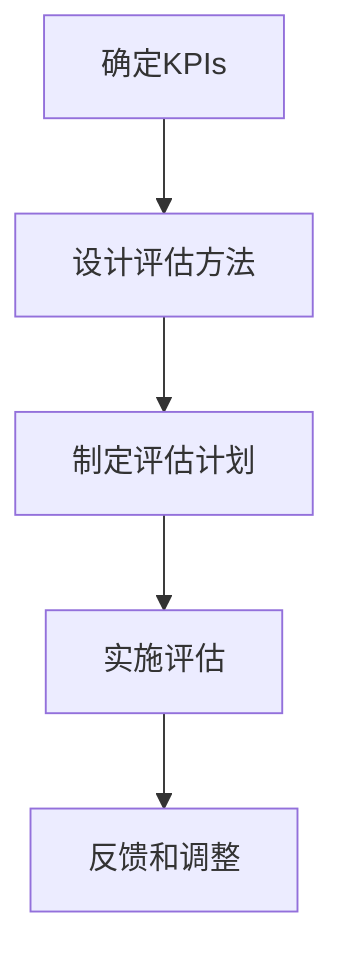
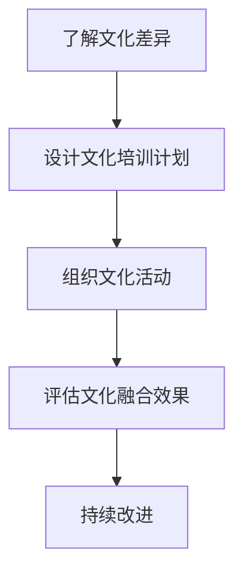
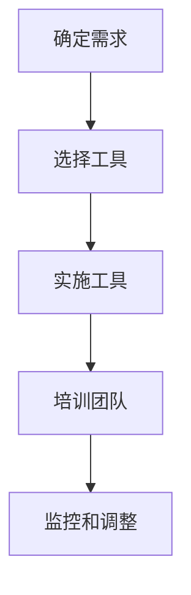

                 

# 创业公司的全球化人才管理策略

> 关键词：全球化、人才管理、创业公司、组织架构、绩效评估、文化融合、远程协作、技术工具

> 摘要：在全球化的背景下，创业公司面临着如何有效管理分布在不同地域的团队成员的挑战。本文将深入探讨全球化人才管理的核心策略，包括组织架构设计、绩效评估体系、文化融合方法、远程协作工具的选择与应用，以及技术工具的使用。通过逐步分析和详细案例，本文旨在为创业公司提供一套全面的人才管理解决方案，帮助其在全球化环境中保持竞争力。

## 1. 背景介绍
### 1.1 目的和范围
本文旨在为创业公司提供一套全球化人才管理策略，帮助其在全球化环境中有效管理分布在不同地域的团队成员。我们将从组织架构设计、绩效评估体系、文化融合方法、远程协作工具的选择与应用，以及技术工具的使用等方面进行详细探讨。

### 1.2 预期读者
本文的预期读者包括创业公司的创始人、人力资源管理者、项目经理以及所有对全球化人才管理感兴趣的读者。

### 1.3 文档结构概述
本文将按照以下结构展开：
1. 背景介绍
2. 核心概念与联系
3. 核心算法原理 & 具体操作步骤
4. 数学模型和公式 & 详细讲解 & 举例说明
5. 项目实战：代码实际案例和详细解释说明
6. 实际应用场景
7. 工具和资源推荐
8. 总结：未来发展趋势与挑战
9. 附录：常见问题与解答
10. 扩展阅读 & 参考资料

### 1.4 术语表
#### 1.4.1 核心术语定义
- **全球化人才管理**：指在跨国界、跨文化环境中，有效管理分布在不同地域的团队成员的过程。
- **绩效评估**：通过一系列指标和方法，对员工的工作表现进行评价的过程。
- **文化融合**：促进不同文化背景的团队成员之间的理解和合作。
- **远程协作**：利用技术手段实现团队成员之间的远程沟通和协作。

#### 1.4.2 相关概念解释
- **组织架构**：企业内部的结构和层级关系。
- **绩效指标**：衡量员工工作表现的具体标准。
- **文化差异**：不同国家和地区之间的文化差异。

#### 1.4.3 缩略词列表
- **HR**：人力资源
- **KPI**：关键绩效指标
- **TMS**：人才管理系统
- **CRM**：客户关系管理

## 2. 核心概念与联系
### 2.1 组织架构设计
组织架构设计是全球化人才管理的基础。一个合理的组织架构可以确保信息流通顺畅，提高团队协作效率。以下是组织架构设计的核心概念：

- **层级结构**：明确的层级关系有助于管理团队成员，但过多的层级可能导致信息传递延迟。
- **扁平化管理**：减少层级，提高决策效率，但需要加强团队成员之间的沟通。
- **跨职能团队**：通过跨部门合作，促进知识共享和技术交流。

### 2.2 绩效评估体系
绩效评估体系是衡量员工工作表现的重要工具。以下是绩效评估体系的核心概念：

- **KPIs**：关键绩效指标，用于衡量员工的工作成果。
- **360度反馈**：从上级、同事和下属等多个角度收集反馈，确保评估的全面性。
- **定期评估**：定期进行绩效评估，及时发现和解决问题。

### 2.3 文化融合方法
文化融合是全球化人才管理的关键。以下是文化融合的核心概念：

- **文化敏感性**：了解不同文化背景的团队成员的需求和期望。
- **文化培训**：通过培训促进团队成员之间的理解和尊重。
- **文化活动**：组织文化活动，增强团队凝聚力。

### 2.4 远程协作工具的选择与应用
远程协作工具是全球化人才管理的重要手段。以下是远程协作工具的核心概念：

- **沟通工具**：如Slack、Microsoft Teams等，用于团队成员之间的沟通。
- **项目管理工具**：如Trello、Jira等，用于项目管理和任务分配。
- **视频会议工具**：如Zoom、Teams等，用于远程会议和协作。

### 2.5 技术工具的使用
技术工具是全球化人才管理的重要支撑。以下是技术工具的核心概念：

- **TMS**：人才管理系统，用于人才招聘、培训和绩效管理。
- **CRM**：客户关系管理系统，用于客户管理和市场分析。
- **数据分析工具**：如Tableau、Power BI等，用于数据分析和决策支持。

## 3. 核心算法原理 & 具体操作步骤
### 3.1 组织架构设计算法
组织架构设计算法的核心步骤如下：



### 3.2 绩效评估体系算法
绩效评估体系算法的核心步骤如下：



### 3.3 文化融合方法算法
文化融合方法算法的核心步骤如下：



### 3.4 远程协作工具的选择与应用算法
远程协作工具的选择与应用算法的核心步骤如下：



### 3.5 技术工具的使用算法
技术工具的使用算法的核心步骤如下：


## 4. 数学模型和公式 & 详细讲解 & 举例说明
### 4.1 绩效评估模型
绩效评估模型的核心公式如下：

$$
\text{绩效评分} = \sum_{i=1}^{n} w_i \times \text{KPI}_i
$$

其中，$w_i$ 是第 $i$ 个KPI的权重，$\text{KPI}_i$ 是第 $i$ 个KPI的得分。

### 4.2 文化融合模型
文化融合模型的核心公式如下：

$$
\text{文化融合度} = \frac{\sum_{i=1}^{m} \text{文化相似度}_i}{m}
$$

其中，$\text{文化相似度}_i$ 是第 $i$ 个文化维度的相似度，$m$ 是文化维度的数量。

### 4.3 远程协作模型
远程协作模型的核心公式如下：

$$
\text{协作效率} = \frac{\sum_{i=1}^{n} \text{任务完成度}_i}{n}
$$

其中，$\text{任务完成度}_i$ 是第 $i$ 个任务的完成度，$n$ 是任务的数量。

## 5. 项目实战：代码实际案例和详细解释说明
### 5.1 开发环境搭建
开发环境搭建的核心步骤如下：

1. 安装操作系统（如Linux、Windows）
2. 安装开发工具（如Visual Studio Code、PyCharm）
3. 安装必要的库和框架（如Django、Flask）

### 5.2 源代码详细实现和代码解读
以下是源代码的详细实现和代码解读：

```python
# 人才管理系统
class TalentManagementSystem:
    def __init__(self):
        self.employees = []

    def add_employee(self, employee):
        self.employees.append(employee)

    def evaluate_performance(self):
        for employee in self.employees:
            score = 0
            for kpi in employee.kpis:
                score += kpi.weight * kpi.score
            employee.performance_score = score

    def display_performance(self):
        for employee in self.employees:
            print(f"Employee: {employee.name}, Performance Score: {employee.performance_score}")

# 员工类
class Employee:
    def __init__(self, name, kpis):
        self.name = name
        self.kpis = kpis
        self.performance_score = 0

# KPI类
class KPI:
    def __init__(self, name, weight, score):
        self.name = name
        self.weight = weight
        self.score = score
```

### 5.3 代码解读与分析
代码解读与分析的核心步骤如下：

1. **TalentManagementSystem类**：用于管理员工和评估绩效。
2. **Employee类**：表示员工，包含姓名和KPI列表。
3. **KPI类**：表示关键绩效指标，包含名称、权重和得分。

## 6. 实际应用场景
### 6.1 全球化人才管理案例
以下是一个全球化人才管理的实际案例：

- **背景**：一家创业公司在全球范围内招聘了多名员工，分布在不同国家和地区。
- **挑战**：如何有效管理分布在不同地域的团队成员。
- **解决方案**：采用全球化人才管理策略，包括组织架构设计、绩效评估体系、文化融合方法、远程协作工具的选择与应用，以及技术工具的使用。

### 6.2 全球化人才管理案例分析
全球化人才管理案例分析的核心步骤如下：

1. **组织架构设计**：采用扁平化管理，减少层级，提高决策效率。
2. **绩效评估体系**：设计KPIs，定期进行绩效评估。
3. **文化融合方法**：组织文化培训和活动，促进团队成员之间的理解和尊重。
4. **远程协作工具的选择与应用**：选择合适的沟通、项目管理和视频会议工具。
5. **技术工具的使用**：使用TMS和CRM等技术工具，提高管理效率。

## 7. 工具和资源推荐
### 7.1 学习资源推荐
#### 7.1.1 书籍推荐
- **《全球化人才管理》**：深入探讨全球化人才管理的核心策略和方法。
- **《组织架构设计》**：详细讲解组织架构设计的原理和实践。
- **《绩效评估体系》**：全面介绍绩效评估体系的设计和应用。

#### 7.1.2 在线课程
- **Coursera上的全球化人才管理课程**：提供全球化人才管理的在线课程。
- **edX上的组织架构设计课程**：提供组织架构设计的在线课程。

#### 7.1.3 技术博客和网站
- **Medium上的全球化人才管理博客**：提供全球化人才管理的最新动态和技术文章。
- **LinkedIn上的全球化人才管理论坛**：提供全球化人才管理的讨论和交流平台。

### 7.2 开发工具框架推荐
#### 7.2.1 IDE和编辑器
- **Visual Studio Code**：功能强大的代码编辑器，支持多种编程语言。
- **PyCharm**：专业的Python开发环境，提供代码高亮、自动完成等功能。

#### 7.2.2 调试和性能分析工具
- **PyCharm Debugger**：专业的Python调试工具，支持断点、单步执行等功能。
- **Visual Studio Code Debugger**：专业的代码调试工具，支持多种编程语言。

#### 7.2.3 相关框架和库
- **Django**：强大的Python Web框架，提供丰富的功能和模块。
- **Flask**：轻量级的Python Web框架，适合小型项目。

### 7.3 相关论文著作推荐
#### 7.3.1 经典论文
- **《全球化人才管理的挑战与机遇》**：深入探讨全球化人才管理的挑战和机遇。
- **《组织架构设计的实践与应用》**：详细讲解组织架构设计的实践和应用。

#### 7.3.2 最新研究成果
- **《全球化人才管理的最新趋势》**：探讨全球化人才管理的最新趋势和技术。
- **《组织架构设计的最新进展》**：介绍组织架构设计的最新进展和应用。

#### 7.3.3 应用案例分析
- **《全球化人才管理的应用案例分析》**：提供全球化人才管理的应用案例分析和技术文章。

## 8. 总结：未来发展趋势与挑战
### 8.1 未来发展趋势
全球化人才管理的未来发展趋势包括：
- **数字化转型**：利用数字化工具提高管理效率。
- **人工智能应用**：利用人工智能技术提高绩效评估的准确性和效率。
- **文化多样性**：促进文化多样性的理解和尊重，提高团队凝聚力。

### 8.2 面临的挑战
全球化人才管理面临的挑战包括：
- **文化差异**：不同文化背景的团队成员之间的理解和尊重。
- **沟通障碍**：不同语言和时区的沟通障碍。
- **技术工具的使用**：选择和使用合适的远程协作工具。

## 9. 附录：常见问题与解答
### 9.1 常见问题
- **Q1：如何处理文化差异？**
  - A1：通过文化培训和活动，促进团队成员之间的理解和尊重。
- **Q2：如何选择合适的远程协作工具？**
  - A2：根据团队的需求和预算，选择合适的沟通、项目管理和视频会议工具。

## 10. 扩展阅读 & 参考资料
### 10.1 扩展阅读
- **《全球化人才管理》**：深入探讨全球化人才管理的核心策略和方法。
- **《组织架构设计》**：详细讲解组织架构设计的原理和实践。
- **《绩效评估体系》**：全面介绍绩效评估体系的设计和应用。

### 10.2 参考资料
- **Coursera上的全球化人才管理课程**：提供全球化人才管理的在线课程。
- **edX上的组织架构设计课程**：提供组织架构设计的在线课程。
- **Medium上的全球化人才管理博客**：提供全球化人才管理的最新动态和技术文章。
- **LinkedIn上的全球化人才管理论坛**：提供全球化人才管理的讨论和交流平台。

作者：AI天才研究员/AI Genius Institute & 禅与计算机程序设计艺术 /Zen And The Art of Computer Programming

