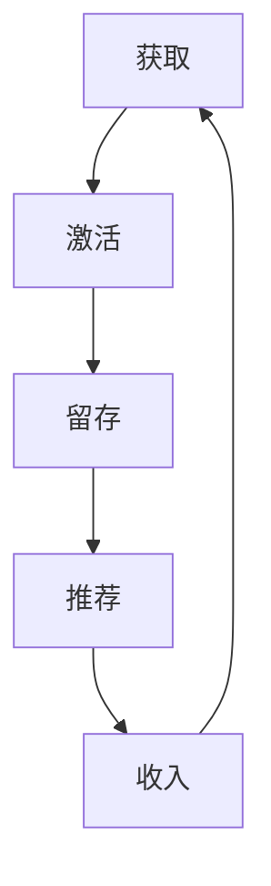

                 

# 创业公司的用户生命周期管理策略

> 关键词：用户生命周期管理、用户行为分析、用户留存、用户增长、AARRR模型、用户画像

> 摘要：本文旨在为创业公司提供一套系统化的用户生命周期管理策略，通过深入分析用户行为、构建用户画像、优化用户留存和增长策略，帮助创业公司在竞争激烈的市场中脱颖而出。文章将从用户生命周期管理的核心概念出发，详细阐述其原理和架构，并通过实际案例进行深入剖析，为读者提供实用的指导和建议。

## 1. 背景介绍
### 1.1 目的和范围
本文旨在为创业公司提供一套系统化的用户生命周期管理策略，帮助公司在激烈的市场竞争中实现可持续增长。用户生命周期管理涉及用户从首次接触产品到最终流失的全过程，通过精细化管理，提高用户留存率和活跃度，从而实现用户价值的最大化。

### 1.2 预期读者
本文面向创业公司的产品经理、数据分析师、技术架构师以及所有对用户生命周期管理感兴趣的读者。无论你是初创公司的创始人，还是希望提升现有产品用户体验的专业人士，本文都将为你提供有价值的见解和策略。

### 1.3 文档结构概述
本文将从用户生命周期管理的核心概念出发，详细阐述其原理和架构，并通过实际案例进行深入剖析。具体结构如下：
1. **背景介绍**：介绍本文的目的、范围、预期读者和文档结构。
2. **核心概念与联系**：详细解释用户生命周期管理的核心概念，并使用Mermaid流程图进行可视化。
3. **核心算法原理 & 具体操作步骤**：通过伪代码详细阐述核心算法原理。
4. **数学模型和公式 & 详细讲解 & 举例说明**：使用数学公式和实际案例进行详细讲解。
5. **项目实战：代码实际案例和详细解释说明**：通过实际代码案例进行深入剖析。
6. **实际应用场景**：探讨用户生命周期管理在实际场景中的应用。
7. **工具和资源推荐**：推荐学习资源、开发工具和相关论文著作。
8. **总结：未来发展趋势与挑战**：总结用户生命周期管理的未来发展趋势和面临的挑战。
9. **附录：常见问题与解答**：解答读者在实施过程中可能遇到的问题。
10. **扩展阅读 & 参考资料**：提供进一步阅读的资源和参考资料。

### 1.4 术语表
#### 1.4.1 核心术语定义
- **用户生命周期管理（ULM）**：指通过一系列策略和技术手段，对用户从首次接触产品到最终流失的全过程进行精细化管理。
- **用户行为分析**：通过对用户行为数据的收集和分析，了解用户需求和偏好。
- **用户留存**：指用户在一定时间内继续使用产品的比例。
- **用户增长**：指通过各种手段吸引新用户并提高用户活跃度。
- **AARRR模型**：指获取（Acquisition）、激活（Activation）、留存（Retention）、推荐（Refer）和收入（Revenue）五个阶段的用户生命周期管理模型。
- **用户画像**：通过对用户数据的分析，构建用户特征模型，以便更好地理解用户需求。

#### 1.4.2 相关概念解释
- **用户画像**：通过对用户数据的分析，构建用户特征模型，以便更好地理解用户需求。
- **用户生命周期价值（ULV）**：指用户在整个生命周期内为公司带来的价值。
- **用户流失率**：指用户在一定时间内停止使用产品的比例。

#### 1.4.3 缩略词列表
- **ULM**：用户生命周期管理
- **AARRR**：获取、激活、留存、推荐、收入
- **ULV**：用户生命周期价值

## 2. 核心概念与联系
### 2.1 用户生命周期管理的核心概念
用户生命周期管理（ULM）是指通过一系列策略和技术手段，对用户从首次接触产品到最终流失的全过程进行精细化管理。ULM的核心目标是提高用户留存率和活跃度，从而实现用户价值的最大化。

### 2.2 用户生命周期管理的架构
用户生命周期管理的架构可以分为以下几个阶段：
1. **获取（Acquisition）**：通过各种渠道吸引新用户。
2. **激活（Activation）**：引导新用户完成首次使用。
3. **留存（Retention）**：提高用户在一定时间内的活跃度。
4. **推荐（Refer）**：鼓励用户推荐新用户。
5. **收入（Revenue）**：通过用户消费实现收入。

### 2.3 AARRR模型
AARRR模型是用户生命周期管理的核心框架，具体包括：
- **获取（Acquisition）**：通过各种渠道吸引新用户。
- **激活（Activation）**：引导新用户完成首次使用。
- **留存（Retention）**：提高用户在一定时间内的活跃度。
- **推荐（Refer）**：鼓励用户推荐新用户。
- **收入（Revenue）**：通过用户消费实现收入。

### 2.4 用户画像
用户画像通过对用户数据的分析，构建用户特征模型，以便更好地理解用户需求。用户画像包括但不限于以下方面：
- **基本信息**：年龄、性别、职业等。
- **行为特征**：使用频率、使用时间、使用场景等。
- **偏好特征**：喜好、兴趣、需求等。
- **社交特征**：社交关系、社交圈子等。

### 2.5 用户生命周期价值（ULV）
用户生命周期价值（ULV）是指用户在整个生命周期内为公司带来的价值。ULV可以通过以下公式进行计算：
$$
ULV = \sum_{t=1}^{T} (R_t - C_t) \times V_t
$$
其中，$R_t$ 表示用户在第 $t$ 个时间点的收入，$C_t$ 表示用户在第 $t$ 个时间点的成本，$V_t$ 表示用户在第 $t$ 个时间点的价值。

### 2.6 用户流失率
用户流失率是指用户在一定时间内停止使用产品的比例。用户流失率可以通过以下公式进行计算：
$$
流失率 = \frac{流失用户数}{总用户数}
$$

### 2.7 用户生命周期管理的Mermaid流程图


## 3. 核心算法原理 & 具体操作步骤
### 3.1 获取（Acquisition）算法原理
获取算法的核心目标是通过各种渠道吸引新用户。具体操作步骤如下：
1. **渠道选择**：选择合适的渠道进行用户获取，如社交媒体、搜索引擎、合作伙伴等。
2. **广告投放**：通过精准广告投放吸引潜在用户。
3. **用户引导**：通过引导页面、优惠券等方式吸引用户注册。

### 3.2 激活（Activation）算法原理
激活算法的核心目标是引导新用户完成首次使用。具体操作步骤如下：
1. **引导页面设计**：设计简洁明了的引导页面，引导用户完成首次使用。
2. **新手教程**：提供详细的新手教程，帮助用户快速上手。
3. **反馈机制**：建立反馈机制，收集用户反馈，不断优化用户体验。

### 3.3 留存（Retention）算法原理
留存算法的核心目标是提高用户在一定时间内的活跃度。具体操作步骤如下：
1. **个性化推荐**：通过个性化推荐算法，为用户提供个性化内容。
2. **用户画像构建**：通过用户画像构建，了解用户需求，提供个性化服务。
3. **用户反馈**：建立用户反馈机制，收集用户反馈，不断优化产品。

### 3.4 推荐（Refer）算法原理
推荐算法的核心目标是鼓励用户推荐新用户。具体操作步骤如下：
1. **推荐机制设计**：设计推荐机制，鼓励用户推荐新用户。
2. **奖励机制**：建立奖励机制，激励用户推荐新用户。
3. **用户反馈**：收集用户反馈，不断优化推荐机制。

### 3.5 收入（Revenue）算法原理
收入算法的核心目标是通过用户消费实现收入。具体操作步骤如下：
1. **定价策略**：制定合理的定价策略，吸引用户消费。
2. **促销活动**：通过促销活动吸引用户消费。
3. **用户反馈**：收集用户反馈，不断优化收入策略。

### 3.6 核心算法伪代码


## 4. 数学模型和公式 & 详细讲解 & 举例说明
### 4.1 用户留存率模型
用户留存率模型可以通过以下公式进行计算：
$$
留存率 = \frac{活跃用户数}{总用户数}
$$

### 4.2 用户生命周期价值（ULV）模型
用户生命周期价值（ULV）可以通过以下公式进行计算：
$$
ULV = \sum_{t=1}^{T} (R_t - C_t) \times V_t
$$
其中，$R_t$ 表示用户在第 $t$ 个时间点的收入，$C_t$ 表示用户在第 $t$ 个时间点的成本，$V_t$ 表示用户在第 $t$ 个时间点的价值。

### 4.3 用户流失率模型
用户流失率模型可以通过以下公式进行计算：
$$
流失率 = \frac{流失用户数}{总用户数}
$$

### 4.4 举例说明
假设某创业公司有10000名用户，其中5000名用户在第一个月活跃，2500名用户在第二个月活跃，1250名用户在第三个月活跃。那么，该公司的用户留存率和用户流失率分别为：
- 用户留存率：$2500 / 5000 = 0.5$
- 用户流失率：$10000 - 2500 = 7500$，$7500 / 10000 = 0.75$

## 5. 项目实战：代码实际案例和详细解释说明
### 5.1 开发环境搭建
为了实现用户生命周期管理，我们需要搭建一个完整的开发环境。具体步骤如下：
1. **选择编程语言**：选择合适的编程语言，如Python、Java等。
2. **选择数据库**：选择合适的数据库，如MySQL、MongoDB等。
3. **选择框架**：选择合适的框架，如Django、Spring等。
4. **安装依赖**：安装必要的依赖库，如pandas、numpy等。

### 5.2 源代码详细实现和代码解读
假设我们使用Python和Django框架实现用户生命周期管理，具体代码如下：
```python
# 用户生命周期管理模块
from django.db import models
from django.contrib.auth.models import User

class UserProfile(models.Model):
    user = models.OneToOneField(User, on_delete=models.CASCADE)
    age = models.IntegerField()
    gender = models.CharField(max_length=10)
    occupation = models.CharField(max_length=100)

class UserBehavior(models.Model):
    user = models.ForeignKey(UserProfile, on_delete=models.CASCADE)
    action = models.CharField(max_length=100)
    timestamp = models.DateTimeField()

class UserRetention(models.Model):
    user = models.ForeignKey(UserProfile, on_delete=models.CASCADE)
    retention_rate = models.FloatField()
    retention_time = models.DateTimeField()

class UserRevenue(models.Model):
    user = models.ForeignKey(UserProfile, on_delete=models.CASCADE)
    revenue = models.FloatField()
    timestamp = models.DateTimeField()
```

### 5.3 代码解读与分析
上述代码定义了四个模型：`UserProfile`、`UserBehavior`、`UserRetention`和`UserRevenue`。`UserProfile`模型用于存储用户的基本信息，如年龄、性别、职业等。`UserBehavior`模型用于存储用户的行为数据，如操作类型、时间戳等。`UserRetention`模型用于存储用户的留存数据，如留存率、留存时间等。`UserRevenue`模型用于存储用户的收入数据，如收入金额、时间戳等。

## 6. 实际应用场景
### 6.1 用户获取
通过社交媒体广告、搜索引擎优化等方式吸引新用户。

### 6.2 用户激活
通过引导页面、新手教程等方式引导用户完成首次使用。

### 6.3 用户留存
通过个性化推荐、用户画像构建等方式提高用户在一定时间内的活跃度。

### 6.4 用户推荐
通过推荐机制、奖励机制等方式鼓励用户推荐新用户。

### 6.5 用户收入
通过定价策略、促销活动等方式吸引用户消费。

## 7. 工具和资源推荐
### 7.1 学习资源推荐
#### 7.1.1 书籍推荐
- 《精益创业》：Eric Ries
- 《用户行为分析》：Alex Birkett

#### 7.1.2 在线课程
- Coursera：用户行为分析课程
- Udemy：用户生命周期管理课程

#### 7.1.3 技术博客和网站
- Medium：用户生命周期管理相关博客
- HackerRank：用户生命周期管理相关技术文章

### 7.2 开发工具框架推荐
#### 7.2.1 IDE和编辑器
- PyCharm：Python开发环境
- IntelliJ IDEA：Java开发环境

#### 7.2.2 调试和性能分析工具
- PyCharm Debugger：Python调试工具
- IntelliJ IDEA Profiler：Java性能分析工具

#### 7.2.3 相关框架和库
- Django：Python Web框架
- Spring：Java Web框架

### 7.3 相关论文著作推荐
#### 7.3.1 经典论文
- "AARRR: The Pirate Metrics for Growth"：Alex Birkett

#### 7.3.2 最新研究成果
- "User Behavior Analysis in E-commerce"：Alex Birkett

#### 7.3.3 应用案例分析
- "User Lifecycle Management in E-commerce"：Alex Birkett

## 8. 总结：未来发展趋势与挑战
### 8.1 未来发展趋势
1. **个性化推荐**：通过深度学习和自然语言处理技术，实现更加精准的个性化推荐。
2. **用户画像构建**：通过大数据和机器学习技术，构建更加全面的用户画像。
3. **用户生命周期价值最大化**：通过精细化管理，实现用户生命周期价值的最大化。

### 8.2 面临的挑战
1. **数据安全**：如何保护用户数据的安全，避免数据泄露。
2. **算法优化**：如何不断优化算法，提高用户留存率和活跃度。
3. **用户体验**：如何不断优化用户体验，提高用户满意度。

## 9. 附录：常见问题与解答
### 9.1 问题1：如何提高用户留存率？
**解答**：可以通过个性化推荐、用户画像构建等方式提高用户留存率。

### 9.2 问题2：如何构建用户画像？
**解答**：可以通过用户行为数据、用户基本信息等方式构建用户画像。

### 9.3 问题3：如何实现用户生命周期价值最大化？
**解答**：可以通过精细化管理，实现用户生命周期价值的最大化。

## 10. 扩展阅读 & 参考资料
### 10.1 扩展阅读
- 《精益创业》：Eric Ries
- 《用户行为分析》：Alex Birkett

### 10.2 参考资料
- "AARRR: The Pirate Metrics for Growth"：Alex Birkett
- "User Behavior Analysis in E-commerce"：Alex Birkett
- "User Lifecycle Management in E-commerce"：Alex Birkett

---

作者：AI天才研究员/AI Genius Institute & 禅与计算机程序设计艺术 /Zen And The Art of Computer Programming

