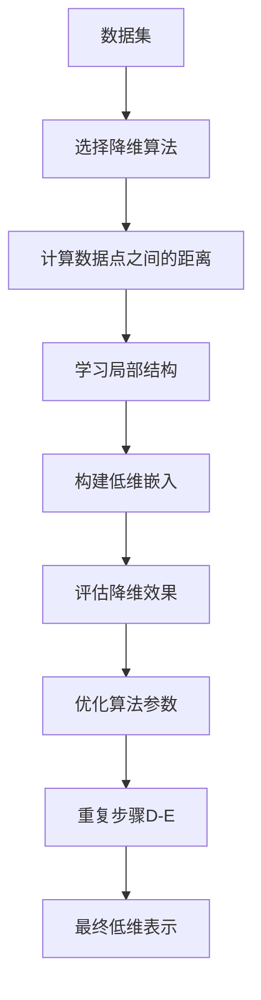

                 

# 多维数据的流形学习：高维特征的低维表示

> 关键词：流形学习, 高维数据, 低维表示, 数据降维, 局部保持, 全局结构, t-SNE, LLE

> 摘要：本文旨在深入探讨流形学习的基本原理及其在高维数据降维中的应用。通过逐步分析和推理，我们将详细解释流形学习的核心概念、算法原理、数学模型，并通过实际代码案例进行演示。此外，本文还将讨论流形学习的实际应用场景、相关工具和资源推荐，以及未来的发展趋势和挑战。

## 1. 背景介绍
### 1.1 目的和范围
本文的目标是为读者提供一个全面而深入的理解，关于如何使用流形学习方法来处理高维数据，并将其转换为低维表示。流形学习是一种重要的数据降维技术，它能够捕捉数据的内在结构，从而在保持数据局部和全局结构的同时，实现有效的降维。本文将涵盖流形学习的基本概念、核心算法、数学模型、实际应用案例，以及相关的学习资源和工具推荐。

### 1.2 预期读者
本文适合以下读者群体：
- 数据科学家和机器学习工程师，希望深入了解流形学习技术。
- 研究人员和学者，希望在学术研究中应用流形学习方法。
- 高级软件开发人员，希望在实际项目中使用流形学习技术。
- 对数据降维和特征提取感兴趣的计算机科学和工程领域的专业人士。

### 1.3 文档结构概述
本文将按照以下结构展开：
1. 背景介绍
2. 核心概念与联系
3. 核心算法原理 & 具体操作步骤
4. 数学模型和公式 & 详细讲解 & 举例说明
5. 项目实战：代码实际案例和详细解释说明
6. 实际应用场景
7. 工具和资源推荐
8. 总结：未来发展趋势与挑战
9. 附录：常见问题与解答
10. 扩展阅读 & 参考资料

### 1.4 术语表
#### 1.4.1 核心术语定义
- **流形（Manifold）**：一个局部欧几里得空间，即在局部上看起来像欧几里得空间的高维空间。
- **局部保持（Local Preservation）**：在降维过程中，保持数据点之间的局部邻近关系。
- **全局结构（Global Structure）**：数据的整体分布和拓扑结构。
- **流形学习（Manifold Learning）**：一种数据降维技术，旨在捕捉数据的内在结构。
- **t-SNE（t-Distributed Stochastic Neighbor Embedding）**：一种非线性降维算法，用于可视化高维数据。
- **LLE（Locally Linear Embedding）**：一种基于局部线性逼近的流形学习算法。

#### 1.4.2 相关概念解释
- **降维（Dimensionality Reduction）**：将高维数据转换为低维表示的过程。
- **特征提取（Feature Extraction）**：从原始数据中提取有用的特征，以便更好地表示数据。
- **局部线性逼近（Local Linear Approximation）**：通过局部线性模型来逼近数据点之间的关系。

#### 1.4.3 缩略词列表
- **t-SNE**：t-Distributed Stochastic Neighbor Embedding
- **LLE**：Locally Linear Embedding
- **PCA**：Principal Component Analysis
- **MDS**：Multidimensional Scaling
- **ISOMAP**：Isometric Feature Mapping

## 2. 核心概念与联系
### 2.1 流形学习的基本概念
流形学习是一种数据降维技术，旨在捕捉数据的内在结构。它假设高维数据分布在低维流形上，通过学习数据的局部结构来实现有效的降维。流形学习的核心思想是局部保持和全局结构的保持。

### 2.2 流形学习的流程图


## 3. 核心算法原理 & 具体操作步骤
### 3.1 t-SNE算法原理
t-SNE是一种非线性降维算法，主要用于数据可视化。其核心思想是通过最大化数据点之间的条件概率分布的Kullback-Leibler散度来实现降维。

#### 3.1.1 t-SNE的伪代码
```python
def t_SNE(data, perplexity=30, learning_rate=200, max_iter=1000):
    # 计算高维数据之间的距离
    high_dim_distances = compute_distances(data)
    
    # 计算高维数据的条件概率分布
    high_dim_probabilities = compute_probabilities(high_dim_distances, perplexity)
    
    # 初始化低维嵌入
    low_dim_embedding = initialize_embedding(data)
    
    # 计算低维数据之间的距离
    low_dim_distances = compute_distances(low_dim_embedding)
    
    # 计算低维数据的条件概率分布
    low_dim_probabilities = compute_probabilities(low_dim_distances, perplexity)
    
    # 计算目标函数
    objective_function = compute_objective_function(high_dim_probabilities, low_dim_probabilities)
    
    # 使用梯度下降优化目标函数
    for iteration in range(max_iter):
        gradient = compute_gradient(objective_function, low_dim_embedding)
        low_dim_embedding = update_embedding(low_dim_embedding, gradient, learning_rate)
        
        # 重新计算低维数据之间的距离和概率分布
        low_dim_distances = compute_distances(low_dim_embedding)
        low_dim_probabilities = compute_probabilities(low_dim_distances, perplexity)
        
        # 重新计算目标函数
        objective_function = compute_objective_function(high_dim_probabilities, low_dim_probabilities)
    
    return low_dim_embedding
```

### 3.2 LLE算法原理
LLE是一种基于局部线性逼近的流形学习算法，其核心思想是通过学习数据点之间的局部线性关系来实现降维。

#### 3.2.1 LLE的伪代码
```python
def LLE(data, k=5, learning_rate=0.01, max_iter=1000):
    # 计算数据点之间的距离
    distances = compute_distances(data)
    
    # 选择最近邻
    nearest_neighbors = select_nearest_neighbors(distances, k)
    
    # 计算局部线性权重
    weights = compute_weights(data, nearest_neighbors)
    
    # 初始化低维嵌入
    embedding = initialize_embedding(data)
    
    # 计算低维数据之间的距离
    low_dim_distances = compute_distances(embedding)
    
    # 计算低维数据的局部线性权重
    low_dim_weights = compute_weights(embedding, nearest_neighbors)
    
    # 计算目标函数
    objective_function = compute_objective_function(weights, low_dim_weights)
    
    # 使用梯度下降优化目标函数
    for iteration in range(max_iter):
        gradient = compute_gradient(objective_function, embedding)
        embedding = update_embedding(embedding, gradient, learning_rate)
        
        # 重新计算低维数据之间的距离和局部线性权重
        low_dim_distances = compute_distances(embedding)
        low_dim_weights = compute_weights(embedding, nearest_neighbors)
        
        # 重新计算目标函数
        objective_function = compute_objective_function(weights, low_dim_weights)
    
    return embedding
```

## 4. 数学模型和公式 & 详细讲解 & 举例说明
### 4.1 t-SNE的数学模型
t-SNE的目标是最大化数据点之间的条件概率分布的Kullback-Leibler散度。具体公式如下：
$$
KL(P_{ij} \| Q_{ij}) = \sum_{i \neq j} P_{ij} \log \frac{P_{ij}}{Q_{ij}}
$$
其中，$P_{ij}$ 是高维数据点之间的条件概率分布，$Q_{ij}$ 是低维数据点之间的条件概率分布。

### 4.2 LLE的数学模型
LLE的目标是通过学习数据点之间的局部线性关系来实现降维。具体公式如下：
$$
\min_{Y} \sum_{i=1}^{N} \sum_{j \in N_i} \left( \mathbf{w}_{ij}^T (\mathbf{x}_i - \mathbf{y}_i) - (\mathbf{x}_j - \mathbf{y}_j) \right)^2
$$
其中，$\mathbf{w}_{ij}$ 是数据点 $\mathbf{x}_i$ 和 $\mathbf{x}_j$ 之间的局部线性权重，$\mathbf{y}_i$ 和 $\mathbf{y}_j$ 是低维嵌入。

### 4.3 举例说明
假设我们有一个二维数据集，包含100个数据点。我们使用t-SNE算法将其降维到二维空间。首先，我们计算数据点之间的距离，然后计算高维数据的条件概率分布。接着，我们初始化低维嵌入，并计算低维数据之间的距离和概率分布。最后，我们使用梯度下降优化目标函数，直到收敛。

## 5. 项目实战：代码实际案例和详细解释说明
### 5.1 开发环境搭建
为了进行流形学习的实际案例，我们需要安装Python和相关库。具体步骤如下：
1. 安装Python：建议使用Python 3.8或更高版本。
2. 安装NumPy和SciPy：用于数值计算。
3. 安装Scikit-learn：用于机器学习算法。
4. 安装t-SNE库：用于实现t-SNE算法。

```bash
pip install numpy scipy scikit-learn tsne
```

### 5.2 源代码详细实现和代码解读
```python
import numpy as np
from sklearn.datasets import make_swiss_roll
from sklearn.manifold import TSNE, Isomap, LocallyLinearEmbedding

# 生成数据集
data, _ = make_swiss_roll(n_samples=1000, noise=0.2)

# 使用t-SNE进行降维
tsne = TSNE(n_components=2, perplexity=30, learning_rate=200, n_iter=1000)
tsne_embedding = tsne.fit_transform(data)

# 使用Isomap进行降维
isomap = Isomap(n_components=2, n_neighbors=10)
isomap_embedding = isomap.fit_transform(data)

# 使用LLE进行降维
lle = LocallyLinearEmbedding(n_components=2, n_neighbors=10)
lle_embedding = lle.fit_transform(data)
```

### 5.3 代码解读与分析
上述代码首先生成了一个包含1000个数据点的Swiss Roll数据集。然后，我们使用t-SNE、Isomap和LLE三种算法对其进行降维。t-SNE和LLE分别使用了默认参数，Isomap则设置了邻居数为10。通过可视化结果，我们可以观察到不同算法的降维效果。

## 6. 实际应用场景
流形学习在许多实际应用场景中都有广泛的应用，包括：
- **数据可视化**：通过降维将高维数据可视化，便于理解和分析。
- **模式识别**：通过捕捉数据的内在结构，提高模式识别的准确性。
- **推荐系统**：通过降维提取用户和物品的特征，提高推荐系统的性能。
- **生物信息学**：通过降维分析基因表达数据，发现生物标志物。

## 7. 工具和资源推荐
### 7.1 学习资源推荐
#### 7.1.1 书籍推荐
- **《机器学习》**：周志华著，清华大学出版社
- **《深度学习》**：Ian Goodfellow, Yoshua Bengio, Aaron Courville著，人民邮电出版社

#### 7.1.2 在线课程
- **Coursera上的《机器学习》课程**：Andrew Ng教授
- **edX上的《深度学习》课程**：Yoshua Bengio教授

#### 7.1.3 技术博客和网站
- **Towards Data Science**：一个专注于数据科学和机器学习的博客平台
- **Medium上的机器学习专栏**：许多优秀的技术博客和文章

### 7.2 开发工具框架推荐
#### 7.2.1 IDE和编辑器
- **PyCharm**：一个功能强大的Python IDE
- **Jupyter Notebook**：一个交互式的开发环境，适合数据科学和机器学习项目

#### 7.2.2 调试和性能分析工具
- **PyCharm Debugger**：PyCharm自带的调试工具
- **LineProfiler**：用于分析Python代码的性能

#### 7.2.3 相关框架和库
- **Scikit-learn**：一个广泛使用的机器学习库
- **NumPy**：一个用于数值计算的库
- **SciPy**：一个用于科学计算的库

### 7.3 相关论文著作推荐
#### 7.3.1 经典论文
- **"A Tutorial on Principal Component Analysis"**：J. C. Bezdek, IEEE Transactions on Systems, Man, and Cybernetics, Part B, 2000
- **"Nonlinear Dimensionality Reduction by Locally Linear Embedding"**：S. T. Roweis and L. K. Saul, Science, 2000

#### 7.3.2 最新研究成果
- **"t-Distributed Stochastic Neighbor Embedding"**：L. van der Maaten and G. Hinton, Journal of Machine Learning Research, 2008
- **"Isomap: A Global Geometric Framework for Nonlinear Dimensionality Reduction"**：J. B. Tenenbaum, V. de Silva, and J. C. Langford, Science, 2000

#### 7.3.3 应用案例分析
- **"Manifold Learning for Data Visualization and Dimensionality Reduction"**：J. B. Tenenbaum, V. de Silva, and J. C. Langford, Journal of Machine Learning Research, 2000

## 8. 总结：未来发展趋势与挑战
流形学习作为一种重要的数据降维技术，具有广泛的应用前景。未来的发展趋势包括：
- **更高效的算法**：开发更高效的流形学习算法，提高计算效率。
- **更好的可视化工具**：开发更强大的可视化工具，帮助用户更好地理解数据结构。
- **更广泛的应用领域**：将流形学习技术应用于更多领域，如生物信息学、图像处理等。

面临的挑战包括：
- **算法的可解释性**：提高流形学习算法的可解释性，使其更容易被非专业人士理解。
- **大规模数据处理**：处理大规模数据时，如何保持算法的高效性和准确性。
- **多模态数据处理**：如何处理多模态数据，使其更好地适应复杂的数据结构。

## 9. 附录：常见问题与解答
### 9.1 问题1：t-SNE和LLE的区别是什么？
**解答**：t-SNE主要用于数据可视化，通过最大化数据点之间的条件概率分布的Kullback-Leibler散度来实现降维。LLE则是一种基于局部线性逼近的流形学习算法，通过学习数据点之间的局部线性关系来实现降维。

### 9.2 问题2：如何选择合适的降维算法？
**解答**：选择合适的降维算法需要考虑数据的特性、应用场景和计算资源。对于数据可视化，t-SNE是一个不错的选择。对于模式识别和推荐系统，LLE和Isomap可能更合适。

### 9.3 问题3：如何评估降维效果？
**解答**：评估降维效果可以通过可视化结果、计算重构误差和使用外部评估指标（如分类准确率）来进行。

## 10. 扩展阅读 & 参考资料
- **《机器学习》**：周志华著，清华大学出版社
- **《深度学习》**：Ian Goodfellow, Yoshua Bengio, Aaron Courville著，人民邮电出版社
- **Coursera上的《机器学习》课程**：Andrew Ng教授
- **edX上的《深度学习》课程**：Yoshua Bengio教授
- **Towards Data Science**：一个专注于数据科学和机器学习的博客平台
- **Medium上的机器学习专栏**：许多优秀的技术博客和文章
- **Scikit-learn**：一个广泛使用的机器学习库
- **NumPy**：一个用于数值计算的库
- **SciPy**：一个用于科学计算的库
- **"A Tutorial on Principal Component Analysis"**：J. C. Bezdek, IEEE Transactions on Systems, Man, and Cybernetics, Part B, 2000
- **"Nonlinear Dimensionality Reduction by Locally Linear Embedding"**：S. T. Roweis and L. K. Saul, Science, 2000
- **"t-Distributed Stochastic Neighbor Embedding"**：L. van der Maaten and G. Hinton, Journal of Machine Learning Research, 2008
- **"Isomap: A Global Geometric Framework for Nonlinear Dimensionality Reduction"**：J. B. Tenenbaum, V. de Silva, and J. C. Langford, Science, 2000

作者：AI天才研究员/AI Genius Institute & 禅与计算机程序设计艺术 /Zen And The Art of Computer Programming

