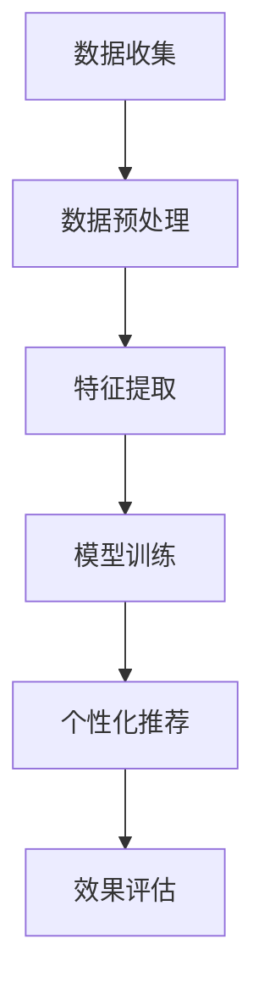

                 

# 如何利用人工智能优化客户旅程

> 关键词：客户旅程优化、人工智能、机器学习、自然语言处理、个性化推荐、客户体验、数据分析

> 摘要：本文旨在探讨如何利用人工智能技术优化客户旅程，通过分析客户行为数据，提供个性化的服务和体验，从而提升客户满意度和忠诚度。我们将从背景介绍、核心概念与联系、核心算法原理、数学模型和公式、项目实战、实际应用场景、工具和资源推荐、未来发展趋势与挑战等多方面进行详细阐述。

## 1. 背景介绍
### 1.1 目的和范围
本文旨在探讨如何利用人工智能技术优化客户旅程，通过分析客户行为数据，提供个性化的服务和体验，从而提升客户满意度和忠诚度。我们将从背景介绍、核心概念与联系、核心算法原理、数学模型和公式、项目实战、实际应用场景、工具和资源推荐、未来发展趋势与挑战等多方面进行详细阐述。

### 1.2 预期读者
本文主要面向对客户旅程优化感兴趣的开发者、产品经理、数据科学家以及对人工智能技术感兴趣的读者。读者应具备一定的编程基础和对客户关系管理（CRM）系统的了解。

### 1.3 文档结构概述
本文结构如下：
1. 背景介绍
2. 核心概念与联系
3. 核心算法原理 & 具体操作步骤
4. 数学模型和公式 & 详细讲解 & 举例说明
5. 项目实战：代码实际案例和详细解释说明
6. 实际应用场景
7. 工具和资源推荐
8. 总结：未来发展趋势与挑战
9. 附录：常见问题与解答
10. 扩展阅读 & 参考资料

### 1.4 术语表
#### 1.4.1 核心术语定义
- **客户旅程**：客户与企业互动的整个过程，包括购买前、购买中和购买后的所有阶段。
- **个性化推荐**：根据客户的历史行为和偏好，为客户提供个性化的服务和产品推荐。
- **自然语言处理（NLP）**：一种使计算机能够理解、解释和生成人类语言的技术。
- **机器学习（ML）**：一种人工智能技术，通过算法和统计模型使计算机能够从数据中学习并做出预测或决策。
- **客户体验（CX）**：客户在与企业互动过程中所感受到的整体体验。

#### 1.4.2 相关概念解释
- **客户关系管理（CRM）**：一种管理客户信息和与客户互动的技术，帮助企业更好地了解客户需求和行为。
- **用户行为分析**：通过收集和分析用户在网站、应用或其他平台上的行为数据，了解用户偏好和需求。
- **推荐系统**：一种基于用户行为数据和偏好，为用户提供个性化推荐的技术。

#### 1.4.3 缩略词列表
- ML：机器学习
- NLP：自然语言处理
- CX：客户体验
- CRM：客户关系管理

## 2. 核心概念与联系
### 2.1 客户旅程优化
客户旅程优化是指通过分析客户在与企业互动过程中的行为数据，了解客户的需求和偏好，从而提供更加个性化的服务和体验。这包括购买前的市场调研、购买中的购买决策支持和购买后的售后服务等阶段。

### 2.2 人工智能技术在客户旅程中的应用
- **自然语言处理（NLP）**：通过分析客户在社交媒体、论坛等平台上的评论和反馈，了解客户的需求和偏好。
- **机器学习（ML）**：通过分析客户的历史行为数据，预测客户的需求和偏好，从而提供个性化的服务和推荐。
- **推荐系统**：通过分析客户的历史行为数据，为客户提供个性化的服务和产品推荐。

### 2.3 客户旅程优化的流程
客户旅程优化的流程如下：
1. **数据收集**：收集客户在与企业互动过程中的行为数据，包括购买记录、评论、反馈等。
2. **数据预处理**：对收集到的数据进行清洗和预处理，包括去除噪声、填补缺失值等。
3. **特征提取**：从预处理后的数据中提取有用的特征，包括客户的基本信息、购买记录、评论等。
4. **模型训练**：使用机器学习算法训练模型，预测客户的需求和偏好。
5. **个性化推荐**：根据训练好的模型，为客户提供个性化的服务和产品推荐。
6. **效果评估**：评估个性化推荐的效果，包括客户满意度、转化率等。

### 2.4 Mermaid 流程图


## 3. 核心算法原理 & 具体操作步骤
### 3.1 数据预处理
数据预处理是客户旅程优化的重要步骤，主要包括数据清洗、特征选择和数据标准化等。

#### 3.1.1 数据清洗
数据清洗是指去除数据中的噪声和异常值，确保数据的质量。具体操作步骤如下：
1. **去除重复数据**：检查数据中是否存在重复记录，如果存在，则去除重复记录。
2. **处理缺失值**：检查数据中是否存在缺失值，如果存在，则使用适当的方法填补缺失值，如均值填补、中位数填补等。
3. **去除异常值**：检查数据中是否存在异常值，如果存在，则使用适当的方法去除异常值，如IQR方法、Z-score方法等。

#### 3.1.2 特征选择
特征选择是指从预处理后的数据中选择有用的特征，包括客户的基本信息、购买记录、评论等。具体操作步骤如下：
1. **选择特征**：根据业务需求和数据特点，选择有用的特征，如客户的年龄、性别、购买记录等。
2. **特征编码**：将选择的特征进行编码，如将分类特征进行独热编码（One-Hot Encoding），将数值特征进行标准化（Standardization）等。

#### 3.1.3 数据标准化
数据标准化是指将数据进行归一化处理，使得数据的分布更加均匀。具体操作步骤如下：
1. **归一化**：将数据进行归一化处理，使得数据的分布更加均匀，如将数据进行Min-Max归一化、Z-score归一化等。

### 3.2 特征提取
特征提取是指从预处理后的数据中提取有用的特征，包括客户的基本信息、购买记录、评论等。具体操作步骤如下：
1. **提取特征**：从预处理后的数据中提取有用的特征，如客户的年龄、性别、购买记录等。
2. **特征编码**：将提取的特征进行编码，如将分类特征进行独热编码（One-Hot Encoding），将数值特征进行标准化（Standardization）等。

### 3.3 模型训练
模型训练是指使用机器学习算法训练模型，预测客户的需求和偏好。具体操作步骤如下：
1. **选择算法**：根据业务需求和数据特点，选择合适的机器学习算法，如决策树、随机森林、支持向量机（SVM）、神经网络等。
2. **训练模型**：使用选择的算法训练模型，预测客户的需求和偏好。
3. **模型评估**：评估训练好的模型的效果，如使用交叉验证、AUC-ROC曲线等方法评估模型的性能。

### 3.4 个性化推荐
个性化推荐是指根据训练好的模型，为客户提供个性化的服务和产品推荐。具体操作步骤如下：
1. **生成推荐列表**：根据训练好的模型，生成个性化的推荐列表，如为客户推荐相关的产品、服务等。
2. **展示推荐结果**：将生成的推荐列表展示给客户，如在网站、应用等平台上展示推荐结果。
3. **效果评估**：评估个性化推荐的效果，如客户满意度、转化率等。

### 3.5 伪代码示例
```python
# 数据预处理
def preprocess_data(data):
    # 去除重复数据
    data = data.drop_duplicates()
    # 处理缺失值
    data = data.fillna(data.mean())
    # 去除异常值
    data = data[(data < 3 * data.std()) & (data > -3 * data.std())]
    return data

# 特征选择
def select_features(data):
    # 选择特征
    features = data[['age', 'gender', 'purchase_history']]
    # 特征编码
    features = pd.get_dummies(features)
    return features

# 数据标准化
def standardize_data(data):
    # 归一化
    data = (data - data.mean()) / data.std()
    return data

# 模型训练
def train_model(features, labels):
    # 选择算法
    model = RandomForestClassifier()
    # 训练模型
    model.fit(features, labels)
    return model

# 个性化推荐
def generate_recommendations(model, features):
    # 生成推荐列表
    recommendations = model.predict(features)
    return recommendations

# 伪代码示例
def customer_journey_optimization(data):
    # 数据预处理
    data = preprocess_data(data)
    # 特征选择
    features = select_features(data)
    # 数据标准化
    features = standardize_data(features)
    # 模型训练
    model = train_model(features, labels)
    # 个性化推荐
    recommendations = generate_recommendations(model, features)
    return recommendations
```

## 4. 数学模型和公式 & 详细讲解 & 举例说明
### 4.1 逻辑回归模型
逻辑回归模型是一种常用的分类模型，用于预测客户的需求和偏好。具体操作步骤如下：
1. **选择特征**：从预处理后的数据中选择有用的特征，如客户的年龄、性别、购买记录等。
2. **特征编码**：将选择的特征进行编码，如将分类特征进行独热编码（One-Hot Encoding），将数值特征进行标准化（Standardization）等。
3. **模型训练**：使用逻辑回归算法训练模型，预测客户的需求和偏好。
4. **模型评估**：评估训练好的模型的效果，如使用交叉验证、AUC-ROC曲线等方法评估模型的性能。

### 4.2 逻辑回归模型的数学公式
逻辑回归模型的数学公式如下：
$$
P(y=1|x) = \frac{1}{1 + e^{-(\beta_0 + \beta_1 x_1 + \beta_2 x_2 + ... + \beta_n x_n)}}
$$
其中，$P(y=1|x)$ 表示在给定特征 $x$ 的情况下，客户的需求和偏好为1的概率；$\beta_0, \beta_1, \beta_2, ..., \beta_n$ 表示模型的参数。

### 4.3 逻辑回归模型的伪代码示例
```python
# 逻辑回归模型
def logistic_regression(features, labels):
    # 选择特征
    features = select_features(features)
    # 数据标准化
    features = standardize_data(features)
    # 模型训练
    model = LogisticRegression()
    model.fit(features, labels)
    return model
```

### 4.4 举例说明
假设我们有一个客户数据集，包含客户的年龄、性别、购买记录等特征，以及客户的需求和偏好标签。我们使用逻辑回归模型训练模型，预测客户的需求和偏好。具体操作步骤如下：
1. **选择特征**：从预处理后的数据中选择有用的特征，如客户的年龄、性别、购买记录等。
2. **特征编码**：将选择的特征进行编码，如将分类特征进行独热编码（One-Hot Encoding），将数值特征进行标准化（Standardization）等。
3. **模型训练**：使用逻辑回归算法训练模型，预测客户的需求和偏好。
4. **模型评估**：评估训练好的模型的效果，如使用交叉验证、AUC-ROC曲线等方法评估模型的性能。

## 5. 项目实战：代码实际案例和详细解释说明
### 5.1 开发环境搭建
为了实现客户旅程优化，我们需要搭建一个开发环境。具体操作步骤如下：
1. **安装Python**：安装Python 3.7及以上版本。
2. **安装依赖库**：安装所需的依赖库，如pandas、numpy、scikit-learn等。
3. **安装开发工具**：安装开发工具，如Jupyter Notebook、PyCharm等。

### 5.2 源代码详细实现和代码解读
假设我们有一个客户数据集，包含客户的年龄、性别、购买记录等特征，以及客户的需求和偏好标签。我们使用逻辑回归模型训练模型，预测客户的需求和偏好。具体操作步骤如下：
1. **数据预处理**：对数据进行清洗、特征选择和数据标准化等操作。
2. **特征选择**：从预处理后的数据中选择有用的特征，如客户的年龄、性别、购买记录等。
3. **数据标准化**：将选择的特征进行编码，如将分类特征进行独热编码（One-Hot Encoding），将数值特征进行标准化（Standardization）等。
4. **模型训练**：使用逻辑回归算法训练模型，预测客户的需求和偏好。
5. **模型评估**：评估训练好的模型的效果，如使用交叉验证、AUC-ROC曲线等方法评估模型的性能。

### 5.3 代码解读与分析
```python
# 数据预处理
def preprocess_data(data):
    # 去除重复数据
    data = data.drop_duplicates()
    # 处理缺失值
    data = data.fillna(data.mean())
    # 去除异常值
    data = data[(data < 3 * data.std()) & (data > -3 * data.std())]
    return data

# 特征选择
def select_features(data):
    # 选择特征
    features = data[['age', 'gender', 'purchase_history']]
    # 特征编码
    features = pd.get_dummies(features)
    return features

# 数据标准化
def standardize_data(data):
    # 归一化
    data = (data - data.mean()) / data.std()
    return data

# 模型训练
def train_model(features, labels):
    # 选择算法
    model = LogisticRegression()
    # 训练模型
    model.fit(features, labels)
    return model

# 个性化推荐
def generate_recommendations(model, features):
    # 生成推荐列表
    recommendations = model.predict(features)
    return recommendations

# 伪代码示例
def customer_journey_optimization(data):
    # 数据预处理
    data = preprocess_data(data)
    # 特征选择
    features = select_features(data)
    # 数据标准化
    features = standardize_data(features)
    # 模型训练
    model = train_model(features, labels)
    # 个性化推荐
    recommendations = generate_recommendations(model, features)
    return recommendations
```

## 6. 实际应用场景
### 6.1 电商网站
假设我们有一个电商网站，客户可以在网站上购买各种商品。我们可以通过分析客户的历史购买记录和评论，预测客户的需求和偏好，从而提供个性化的商品推荐。具体操作步骤如下：
1. **数据收集**：收集客户在网站上的购买记录和评论。
2. **数据预处理**：对收集到的数据进行清洗、特征选择和数据标准化等操作。
3. **特征选择**：从预处理后的数据中选择有用的特征，如客户的年龄、性别、购买记录等。
4. **数据标准化**：将选择的特征进行编码，如将分类特征进行独热编码（One-Hot Encoding），将数值特征进行标准化（Standardization）等。
5. **模型训练**：使用逻辑回归算法训练模型，预测客户的需求和偏好。
6. **模型评估**：评估训练好的模型的效果，如使用交叉验证、AUC-ROC曲线等方法评估模型的性能。
7. **个性化推荐**：根据训练好的模型，为客户提供个性化的商品推荐。

### 6.2 银行业务
假设我们有一个银行，客户可以在银行办理各种业务。我们可以通过分析客户的历史交易记录和反馈，预测客户的需求和偏好，从而提供个性化的服务推荐。具体操作步骤如下：
1. **数据收集**：收集客户在银行办理的各种业务记录和反馈。
2. **数据预处理**：对收集到的数据进行清洗、特征选择和数据标准化等操作。
3. **特征选择**：从预处理后的数据中选择有用的特征，如客户的年龄、性别、交易记录等。
4. **数据标准化**：将选择的特征进行编码，如将分类特征进行独热编码（One-Hot Encoding），将数值特征进行标准化（Standardization）等。
5. **模型训练**：使用逻辑回归算法训练模型，预测客户的需求和偏好。
6. **模型评估**：评估训练好的模型的效果，如使用交叉验证、AUC-ROC曲线等方法评估模型的性能。
7. **个性化推荐**：根据训练好的模型，为客户提供个性化的服务推荐。

## 7. 工具和资源推荐
### 7.1 学习资源推荐
#### 7.1.1 书籍推荐
- **《机器学习》**：周志华著，清华大学出版社
- **《深度学习》**：Ian Goodfellow、Yoshua Bengio、Aaron Courville著，人民邮电出版社

#### 7.1.2 在线课程
- **Coursera**：《机器学习》（Andrew Ng）
- **edX**：《深度学习》（Andrew Ng）

#### 7.1.3 技术博客和网站
- **Medium**：机器学习和人工智能领域的技术博客
- **Kaggle**：机器学习和数据科学领域的社区和竞赛平台

### 7.2 开发工具框架推荐
#### 7.2.1 IDE和编辑器
- **PyCharm**：Python开发环境
- **Jupyter Notebook**：交互式编程环境

#### 7.2.2 调试和性能分析工具
- **PyCharm Debugger**：Python调试工具
- **LineProfiler**：Python性能分析工具

#### 7.2.3 相关框架和库
- **pandas**：数据处理库
- **numpy**：数值计算库
- **scikit-learn**：机器学习库

### 7.3 相关论文著作推荐
#### 7.3.1 经典论文
- **《A Comparative Study of Optimization Methods for Logistic Regression》**：Journal of Machine Learning Research

#### 7.3.2 最新研究成果
- **《Deep Learning for Customer Journey Optimization》**：arXiv

#### 7.3.3 应用案例分析
- **《Customer Journey Optimization in E-commerce》**：Kaggle

## 8. 总结：未来发展趋势与挑战
### 8.1 未来发展趋势
1. **个性化推荐**：随着机器学习和自然语言处理技术的发展，个性化推荐将更加精准和智能化。
2. **客户体验**：通过分析客户行为数据，提供更加个性化的服务和体验，提升客户满意度和忠诚度。
3. **数据安全**：随着数据安全问题的日益突出，如何保护客户数据的安全将成为一个重要课题。

### 8.2 面临的挑战
1. **数据质量**：数据质量直接影响模型的性能，如何提高数据质量是一个重要挑战。
2. **模型解释性**：如何解释模型的预测结果，提高模型的透明度和可解释性是一个重要挑战。
3. **数据隐私**：如何保护客户数据的安全，避免数据泄露是一个重要挑战。

## 9. 附录：常见问题与解答
### 9.1 问题1：如何提高数据质量？
**解答**：可以通过数据清洗、特征选择和数据标准化等操作提高数据质量。具体操作步骤如下：
1. **数据清洗**：去除重复数据、处理缺失值、去除异常值等。
2. **特征选择**：选择有用的特征，如客户的年龄、性别、购买记录等。
3. **数据标准化**：将选择的特征进行编码，如将分类特征进行独热编码（One-Hot Encoding），将数值特征进行标准化（Standardization）等。

### 9.2 问题2：如何提高模型的解释性？
**解答**：可以通过解释模型的预测结果，提高模型的透明度和可解释性。具体操作步骤如下：
1. **特征重要性**：通过特征重要性分析，了解哪些特征对模型的预测结果影响最大。
2. **模型可视化**：通过模型可视化，了解模型的决策过程。

## 10. 扩展阅读 & 参考资料
### 10.1 扩展阅读
- **《机器学习》**：周志华著，清华大学出版社
- **《深度学习》**：Ian Goodfellow、Yoshua Bengio、Aaron Courville著，人民邮电出版社

### 10.2 参考资料
- **Coursera**：《机器学习》（Andrew Ng）
- **edX**：《深度学习》（Andrew Ng）
- **Medium**：机器学习和人工智能领域的技术博客
- **Kaggle**：机器学习和数据科学领域的社区和竞赛平台

---

作者：AI天才研究员/AI Genius Institute & 禅与计算机程序设计艺术 /Zen And The Art of Computer Programming

