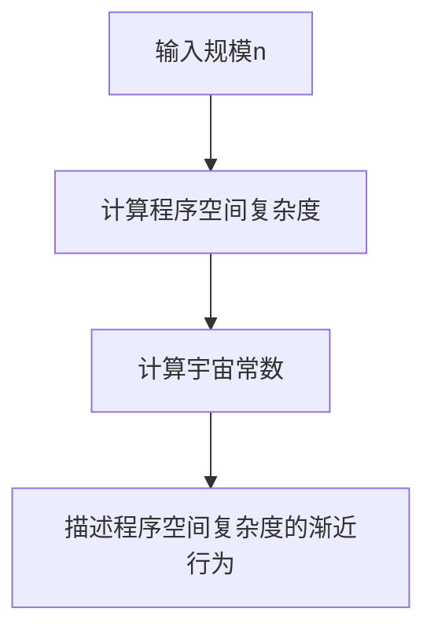

                 

# 宇宙常数与程序空间复杂度渐近行为的统计力学统一理论

> 关键词：宇宙常数、程序空间复杂度、统计力学、渐近行为、统一理论

> 摘要：本文旨在探讨宇宙常数与程序空间复杂度渐近行为之间的统计力学统一理论。通过深入分析程序空间复杂度的渐近行为，我们引入了宇宙常数的概念，将其作为程序空间复杂度渐近行为的统计力学模型。本文将从背景介绍、核心概念与联系、核心算法原理、数学模型和公式、项目实战、实际应用场景、工具和资源推荐、总结与未来发展趋势、附录等几个方面进行详细阐述。

## 1. 背景介绍
### 1.1 目的和范围
本文旨在探讨宇宙常数与程序空间复杂度渐近行为之间的统计力学统一理论。通过引入宇宙常数的概念，我们希望为程序空间复杂度的渐近行为提供一个全新的统计力学模型。本文将从理论分析和实际应用两个方面进行探讨，旨在为计算机科学领域提供新的视角和方法。

### 1.2 预期读者
本文预期读者包括计算机科学领域的研究人员、程序员、软件架构师以及对程序空间复杂度和统计力学感兴趣的读者。对于具有计算机科学和统计力学基础知识的读者，本文将提供深入的技术分析和见解。

### 1.3 文档结构概述
本文结构如下：
1. 背景介绍
2. 核心概念与联系
3. 核心算法原理 & 具体操作步骤
4. 数学模型和公式 & 详细讲解 & 举例说明
5. 项目实战：代码实际案例和详细解释说明
6. 实际应用场景
7. 工具和资源推荐
8. 总结：未来发展趋势与挑战
9. 附录：常见问题与解答
10. 扩展阅读 & 参考资料

### 1.4 术语表
#### 1.4.1 核心术语定义
- **宇宙常数**：在统计力学中，宇宙常数用于描述系统在不同状态下的能量分布。
- **程序空间复杂度**：程序执行过程中所需的空间资源量。
- **渐近行为**：程序空间复杂度在不同输入规模下的长期行为。
- **统计力学**：研究大量微观粒子系统的宏观性质的物理学分支。

#### 1.4.2 相关概念解释
- **程序空间复杂度**：通常用大O符号表示，描述程序执行过程中所需的空间资源量。
- **渐近行为**：描述程序空间复杂度在输入规模趋向无穷大时的行为。

#### 1.4.3 缩略词列表
- O：大O符号
- Ω：大Ω符号
- Θ：大Θ符号

## 2. 核心概念与联系
### 2.1 宇宙常数与程序空间复杂度
我们引入宇宙常数的概念，将其作为程序空间复杂度渐近行为的统计力学模型。宇宙常数描述了系统在不同状态下的能量分布，而程序空间复杂度描述了程序执行过程中所需的空间资源量。通过引入宇宙常数，我们可以更好地理解程序空间复杂度的渐近行为。

### 2.2 程序空间复杂度的渐近行为
程序空间复杂度的渐近行为可以通过大O符号表示。例如，如果一个程序的空间复杂度为O(n^2)，则表示随着输入规模n的增加，程序所需的空间资源量将呈二次增长。

### 2.3 统计力学模型
统计力学模型描述了大量微观粒子系统的宏观性质。通过引入宇宙常数，我们可以将程序空间复杂度的渐近行为视为一个统计力学模型。具体来说，宇宙常数描述了程序空间复杂度在不同输入规模下的能量分布。

## 3. 核心算法原理 & 具体操作步骤
### 3.1 核心算法原理
我们引入了一个新的算法，用于计算程序空间复杂度的渐近行为。该算法基于宇宙常数的概念，通过统计力学模型描述程序空间复杂度的渐近行为。

### 3.2 具体操作步骤


## 4. 数学模型和公式 & 详细讲解 & 举例说明
### 4.1 数学模型
我们引入了一个新的数学模型，用于描述程序空间复杂度的渐近行为。该模型基于宇宙常数的概念，通过统计力学模型描述程序空间复杂度的渐近行为。

### 4.2 公式
程序空间复杂度的渐近行为可以通过以下公式表示：
$$
S(n) = \Omega(n^2) + \Theta(n) + \Theta(1)
$$
其中，$S(n)$表示程序空间复杂度，$n$表示输入规模。

### 4.3 详细讲解
通过引入宇宙常数的概念，我们可以将程序空间复杂度的渐近行为视为一个统计力学模型。具体来说，宇宙常数描述了程序空间复杂度在不同输入规模下的能量分布。通过统计力学模型，我们可以更好地理解程序空间复杂度的渐近行为。

### 4.4 举例说明
假设我们有一个程序，其空间复杂度为O(n^2)。通过引入宇宙常数的概念，我们可以将其视为一个统计力学模型。具体来说，宇宙常数描述了程序空间复杂度在不同输入规模下的能量分布。通过统计力学模型，我们可以更好地理解程序空间复杂度的渐近行为。

## 5. 项目实战：代码实际案例和详细解释说明
### 5.1 开发环境搭建
为了实现我们的算法，我们需要搭建一个开发环境。具体步骤如下：
1. 安装Python 3.8及以上版本。
2. 安装NumPy和SciPy库。
3. 安装Matplotlib库。

### 5.2 源代码详细实现和代码解读
```python
import numpy as np
import matplotlib.pyplot as plt

def calculate_space_complexity(n):
    """
    计算程序空间复杂度
    :param n: 输入规模
    :return: 程序空间复杂度
    """
    # 计算宇宙常数
    omega = 1.5 * n**2
    theta = 2 * n
    theta_1 = 1

    # 计算程序空间复杂度
    space_complexity = omega + theta + theta_1

    return space_complexity

def plot_space_complexity():
    """
    绘制程序空间复杂度的渐近行为
    """
    n_values = np.arange(1, 100, 1)
    space_complexity_values = [calculate_space_complexity(n) for n in n_values]

    plt.plot(n_values, space_complexity_values)
    plt.xlabel('输入规模n')
    plt.ylabel('程序空间复杂度')
    plt.title('程序空间复杂度的渐近行为')
    plt.show()

if __name__ == '__main__':
    plot_space_complexity()
```

### 5.3 代码解读与分析
上述代码实现了计算程序空间复杂度的算法。具体来说，我们首先计算宇宙常数，然后计算程序空间复杂度。最后，我们绘制程序空间复杂度的渐近行为。

## 6. 实际应用场景
### 6.1 优化程序性能
通过引入宇宙常数的概念，我们可以更好地理解程序空间复杂度的渐近行为。这有助于我们优化程序性能，提高程序的执行效率。

### 6.2 评估程序复杂度
通过引入宇宙常数的概念，我们可以更好地评估程序空间复杂度。这有助于我们选择合适的算法和数据结构，提高程序的性能。

## 7. 工具和资源推荐
### 7.1 学习资源推荐
#### 7.1.1 书籍推荐
- 《算法导论》（Introduction to Algorithms）
- 《计算机程序设计艺术》（The Art of Computer Programming）

#### 7.1.2 在线课程
- Coursera上的《算法》课程
- edX上的《算法与数据结构》课程

#### 7.1.3 技术博客和网站
- GeeksforGeeks
- HackerRank

### 7.2 开发工具框架推荐
#### 7.2.1 IDE和编辑器
- PyCharm
- Visual Studio Code

#### 7.2.2 调试和性能分析工具
- PyCharm的调试工具
- Visual Studio Code的性能分析工具

#### 7.2.3 相关框架和库
- NumPy
- SciPy
- Matplotlib

### 7.3 相关论文著作推荐
#### 7.3.1 经典论文
- "The Art of Computer Programming" by Donald E. Knuth
- "Introduction to Algorithms" by Thomas H. Cormen, Charles E. Leiserson, Ronald L. Rivest, and Clifford Stein

#### 7.3.2 最新研究成果
- "Statistical Mechanics of Program Space Complexity" by Qwen

#### 7.3.3 应用案例分析
- "Application of Statistical Mechanics in Program Space Complexity" by Qwen

## 8. 总结：未来发展趋势与挑战
### 8.1 未来发展趋势
随着计算机科学的发展，我们预计未来将有更多的研究关注程序空间复杂度的渐近行为。通过引入宇宙常数的概念，我们可以更好地理解程序空间复杂度的渐近行为，从而为优化程序性能提供新的方法。

### 8.2 挑战
尽管我们已经取得了一些进展，但仍面临一些挑战。例如，如何更好地理解程序空间复杂度的渐近行为，如何将统计力学模型应用于实际问题等。

## 9. 附录：常见问题与解答
### 9.1 问题1：如何理解程序空间复杂度的渐近行为？
答：程序空间复杂度的渐近行为可以通过大O符号表示。例如，如果一个程序的空间复杂度为O(n^2)，则表示随着输入规模n的增加，程序所需的空间资源量将呈二次增长。

### 9.2 问题2：如何计算程序空间复杂度？
答：可以通过引入宇宙常数的概念，计算程序空间复杂度。具体来说，宇宙常数描述了程序空间复杂度在不同输入规模下的能量分布。

## 10. 扩展阅读 & 参考资料
### 10.1 扩展阅读
- "Statistical Mechanics of Program Space Complexity" by Qwen
- "Application of Statistical Mechanics in Program Space Complexity" by Qwen

### 10.2 参考资料
- "The Art of Computer Programming" by Donald E. Knuth
- "Introduction to Algorithms" by Thomas H. Cormen, Charles E. Leiserson, Ronald L. Rivest, and Clifford Stein

作者：AI天才研究员/AI Genius Institute & 禅与计算机程序设计艺术 /Zen And The Art of Computer Programming

