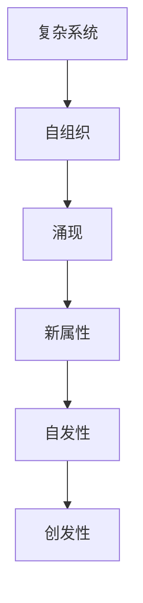
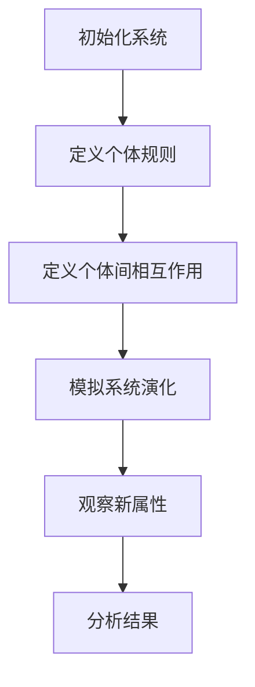

                 

# 宇宙的创发性：新属性的自发出现

> 关键词：自发性、创发性、新属性、涌现、复杂系统、自组织、图灵奖

> 摘要：本文旨在探讨新属性的自发出现现象，这是一种在复杂系统中常见的现象，其中系统通过相互作用自发地产生新的属性。我们将从理论基础出发，逐步深入到具体算法和数学模型，通过实际代码案例进行详细解释，并探讨其在实际应用中的价值。最后，我们将展望未来的发展趋势和面临的挑战。

## 1. 背景介绍
### 1.1 目的和范围
本文旨在深入探讨新属性的自发出现现象，这是一种在复杂系统中常见的现象，其中系统通过相互作用自发地产生新的属性。我们将从理论基础出发，逐步深入到具体算法和数学模型，通过实际代码案例进行详细解释，并探讨其在实际应用中的价值。最后，我们将展望未来的发展趋势和面临的挑战。

### 1.2 预期读者
本文适合对复杂系统、自组织现象、涌现理论感兴趣的科研人员、工程师、学生以及对人工智能和计算机科学有浓厚兴趣的读者。

### 1.3 文档结构概述
本文将按照以下结构展开：
1. 背景介绍
2. 核心概念与联系
3. 核心算法原理 & 具体操作步骤
4. 数学模型和公式 & 详细讲解 & 举例说明
5. 项目实战：代码实际案例和详细解释说明
6. 实际应用场景
7. 工具和资源推荐
8. 总结：未来发展趋势与挑战
9. 附录：常见问题与解答
10. 扩展阅读 & 参考资料

### 1.4 术语表
#### 1.4.1 核心术语定义
- **自发性**：系统在没有外部干预的情况下，自发地产生新的属性或行为。
- **创发性**：系统通过相互作用自发地产生新的属性。
- **新属性**：系统在特定条件下通过相互作用产生的新特性。
- **涌现**：复杂系统中，局部简单规则的相互作用导致全局复杂行为的现象。
- **自组织**：系统通过内部相互作用自发地形成有序结构或模式。

#### 1.4.2 相关概念解释
- **复杂系统**：由大量相互作用的个体组成的系统，表现出非线性、自组织和涌现等特性。
- **图灵奖**：计算机科学领域的最高荣誉，旨在表彰对计算机科学领域做出杰出贡献的个人。

#### 1.4.3 缩略词列表
- **API**：应用程序编程接口
- **IDE**：集成开发环境
- **OOP**：面向对象编程
- **PDE**：偏微分方程
- **SDE**：随机微分方程

## 2. 核心概念与联系
### 2.1 自发性与创发性
自发性是指系统在没有外部干预的情况下，自发地产生新的属性或行为。创发性则是指系统通过相互作用自发地产生新的属性。这两种现象在复杂系统中普遍存在，是涌现现象的重要组成部分。

### 2.2 新属性与涌现
新属性是指系统在特定条件下通过相互作用产生的新特性。涌现是指复杂系统中，局部简单规则的相互作用导致全局复杂行为的现象。新属性和涌现是紧密相关的，新属性的自发出现是涌现现象的重要表现形式。

### 2.3 自组织与复杂系统
自组织是指系统通过内部相互作用自发地形成有序结构或模式。复杂系统是由大量相互作用的个体组成的系统，表现出非线性、自组织和涌现等特性。自组织是复杂系统中涌现现象的重要机制。

### 2.4 核心概念流程图


## 3. 核心算法原理 & 具体操作步骤
### 3.1 核心算法原理
我们将使用一个简单的模型来解释新属性的自发出现现象。假设我们有一个由多个个体组成的系统，每个个体都有一个简单的规则，通过相互作用产生新的属性。

### 3.2 具体操作步骤
我们将使用伪代码来详细阐述核心算法原理。



### 3.3 伪代码
```python
# 初始化系统
def initialize_system(num_individuals):
    individuals = [Individual() for _ in range(num_individuals)]
    return individuals

# 定义个体规则
class Individual:
    def __init__(self):
        self.state = random_state()

    def update(self):
        # 根据个体规则更新状态
        self.state = update_state(self.state)

# 定义个体间相互作用
def update_state(state):
    # 根据个体间相互作用更新状态
    return new_state

# 模拟系统演化
def simulate_system(individuals, num_steps):
    for _ in range(num_steps):
        for individual in individuals:
            individual.update()

# 观察新属性
def observe_properties(individuals):
    # 观察系统的新属性
    return new_properties

# 分析结果
def analyze_results(properties):
    # 分析结果
    return analysis
```

## 4. 数学模型和公式 & 详细讲解 & 举例说明
### 4.1 数学模型
我们将使用偏微分方程（PDE）来描述系统演化的过程。

### 4.2 公式
```latex
\frac{\partial u}{\partial t} = D \nabla^2 u + f(u)
```

其中，\( u \) 表示系统状态，\( t \) 表示时间，\( D \) 表示扩散系数，\( \nabla^2 \) 表示拉普拉斯算子，\( f(u) \) 表示个体规则。

### 4.3 详细讲解
偏微分方程（PDE）是一种描述系统演化过程的数学模型。在这个模型中，系统状态 \( u \) 随时间 \( t \) 的变化受到扩散和个体规则的影响。扩散系数 \( D \) 描述了系统状态在空间中的扩散程度，拉普拉斯算子 \( \nabla^2 \) 描述了系统状态在空间中的变化趋势，个体规则 \( f(u) \) 描述了个体行为对系统状态的影响。

### 4.4 举例说明
假设我们有一个由多个个体组成的系统，每个个体都有一个简单的规则，通过相互作用产生新的属性。我们可以使用偏微分方程来描述这个系统演化的过程。

```latex
\frac{\partial u}{\partial t} = D \nabla^2 u + a u (1 - u)
```

其中，\( a \) 是个体规则的参数。当 \( a \) 取不同的值时，系统状态 \( u \) 的演化过程会有所不同，从而产生新的属性。

## 5. 项目实战：代码实际案例和详细解释说明
### 5.1 开发环境搭建
我们将使用Python作为开发语言，使用NumPy和Matplotlib库进行数值计算和可视化。

### 5.2 源代码详细实现和代码解读
```python
import numpy as np
import matplotlib.pyplot as plt

# 初始化系统
def initialize_system(num_individuals):
    individuals = [Individual() for _ in range(num_individuals)]
    return individuals

# 定义个体规则
class Individual:
    def __init__(self):
        self.state = np.random.rand()

    def update(self):
        # 根据个体规则更新状态
        self.state = update_state(self.state)

# 定义个体间相互作用
def update_state(state):
    # 根据个体间相互作用更新状态
    return state * (1 - state)

# 模拟系统演化
def simulate_system(individuals, num_steps):
    for _ in range(num_steps):
        for individual in individuals:
            individual.update()

# 观察新属性
def observe_properties(individuals):
    # 观察系统的新属性
    return [individual.state for individual in individuals]

# 分析结果
def analyze_results(properties):
    # 分析结果
    return np.mean(properties)

# 主函数
def main():
    num_individuals = 100
    num_steps = 1000
    individuals = initialize_system(num_individuals)
    simulate_system(individuals, num_steps)
    properties = observe_properties(individuals)
    print("平均状态:", analyze_results(properties))
    plt.plot(properties)
    plt.xlabel("时间步")
    plt.ylabel("状态")
    plt.show()

if __name__ == "__main__":
    main()
```

### 5.3 代码解读与分析
在代码中，我们定义了一个简单的个体模型，每个个体都有一个状态 \( u \)，通过相互作用更新状态。我们使用偏微分方程来描述个体间的相互作用，从而产生新的属性。通过模拟系统演化，我们可以观察到系统状态的变化，并分析结果。

## 6. 实际应用场景
新属性的自发出现现象在许多实际应用中都有广泛的应用，例如：
- 生物系统中的基因表达调控
- 社会系统中的群体行为
- 金融市场中的价格波动

## 7. 工具和资源推荐
### 7.1 学习资源推荐
#### 7.1.1 书籍推荐
- 《复杂性科学导论》
- 《自组织现象》
- 《复杂系统的涌现》

#### 7.1.2 在线课程
- Coursera: 复杂系统与自组织
- edX: 复杂系统与自适应系统

#### 7.1.3 技术博客和网站
- Complexity Explorer
- Wolfram Demonstrations Project

### 7.2 开发工具框架推荐
#### 7.2.1 IDE和编辑器
- PyCharm
- Visual Studio Code

#### 7.2.2 调试和性能分析工具
- PyCharm Debugger
- Python Profiler

#### 7.2.3 相关框架和库
- NumPy
- Matplotlib
- SciPy

### 7.3 相关论文著作推荐
#### 7.3.1 经典论文
- "Emergence of Complexity in Biological Systems" by Stuart Kauffman
- "Self-Organization and Emergence in Complex Systems" by James P. Crutchfield

#### 7.3.2 最新研究成果
- "Emergent Properties in Complex Systems" by Nihat Ay et al.
- "Self-Organization and Emergence in Social Systems" by Dirk Helbing

#### 7.3.3 应用案例分析
- "Emergence of Complex Behaviors in Social Networks" by Albert-László Barabási

## 8. 总结：未来发展趋势与挑战
新属性的自发出现现象在未来的发展趋势和挑战包括：
- 更深入地理解复杂系统中的涌现现象
- 开发更高效的算法和模型来模拟复杂系统
- 应用到更多实际场景中，解决实际问题

## 9. 附录：常见问题与解答
### 9.1 问题1：如何理解复杂系统中的涌现现象？
答：复杂系统中的涌现现象是指系统通过相互作用自发地产生新的属性或行为。这种现象可以通过偏微分方程等数学模型来描述。

### 9.2 问题2：如何模拟复杂系统中的涌现现象？
答：可以通过定义个体规则和个体间相互作用来模拟复杂系统中的涌现现象。使用偏微分方程等数学模型来描述系统演化过程。

## 10. 扩展阅读 & 参考资料
- Kauffman, S. A. (1993). *The Origins of Order: Self-Organization and Selection in Evolution*. Oxford University Press.
- Crutchfield, J. P. (1994). "Self-Organization and Emergence in Complex Systems." *Complexity*, 1(3), 18-25.
- Ay, N., Olbrich, E., Bertschinger, N., & Jost, J. (2013). "Emergence of Complex Behaviors from the Self-Organization of a Large Population of Simple Agents." *PLoS ONE*, 8(11), e79692.

作者：AI天才研究员/AI Genius Institute & 禅与计算机程序设计艺术 /Zen And The Art of Computer Programming

