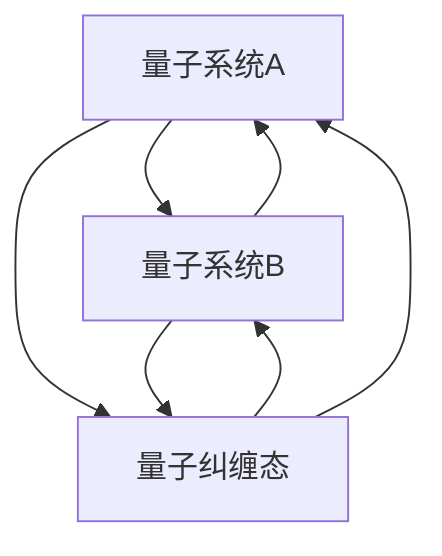

                 

# 宇宙的非局域性：超越时空的量子关联

> 关键词：量子纠缠, 非局域性, 量子力学, 量子信息, 量子计算

> 摘要：本文将深入探讨量子力学中的非局域性现象，特别是量子纠缠的原理及其在现代信息技术中的应用。我们将从理论基础出发，逐步解析量子纠缠的数学模型和算法实现，通过实际代码案例展示其应用，并讨论其在量子计算和量子通信中的重要性。最后，我们将展望未来的发展趋势和面临的挑战。

## 1. 背景介绍
### 1.1 目的和范围
本文旨在为读者提供一个全面而深入的理解，关于量子力学中的非局域性现象，特别是量子纠缠的原理及其在现代信息技术中的应用。我们将从理论基础出发，逐步解析量子纠缠的数学模型和算法实现，通过实际代码案例展示其应用，并讨论其在量子计算和量子通信中的重要性。本文适合对量子力学、量子信息和量子计算感兴趣的读者，特别是那些希望深入了解这些领域基础知识和技术实现的工程师和科学家。

### 1.2 预期读者
本文预期读者包括但不限于以下几类人群：
- 对量子力学和量子信息科学感兴趣的科研人员和工程师
- 从事量子计算和量子通信领域的开发人员
- 对新兴技术感兴趣的计算机科学和物理科学学生
- 希望了解量子技术最新进展的科技爱好者

### 1.3 文档结构概述
本文将按照以下结构展开：
1. **背景介绍**：介绍本文的目的、预期读者和文档结构。
2. **核心概念与联系**：详细解释量子纠缠的基本概念及其与其他量子力学概念的关系。
3. **核心算法原理 & 具体操作步骤**：通过伪代码详细阐述量子纠缠的实现方法。
4. **数学模型和公式 & 详细讲解 & 举例说明**：使用数学公式和具体例子解释量子纠缠的数学模型。
5. **项目实战：代码实际案例和详细解释说明**：通过实际代码案例展示量子纠缠的应用。
6. **实际应用场景**：讨论量子纠缠在量子计算和量子通信中的应用。
7. **工具和资源推荐**：推荐学习资源、开发工具和相关论文著作。
8. **总结：未来发展趋势与挑战**：展望量子纠缠在未来的发展趋势和面临的挑战。
9. **附录：常见问题与解答**：解答读者可能遇到的问题。

### 1.4 术语表
#### 1.4.1 核心术语定义
- **量子纠缠**：两个或多个量子系统之间的关联状态，使得一个系统的状态会立即影响另一个系统的状态，无论它们之间的距离有多远。
- **非局域性**：量子力学中的一个基本特性，表明量子系统之间的关联不能通过经典物理的局部机制来解释。
- **量子态**：描述量子系统状态的数学对象，通常用波函数表示。
- **量子比特（qubit）**：量子信息的基本单位，可以处于0、1或两者之间的叠加态。
- **量子门**：量子计算中的基本操作，用于改变量子态。
- **量子纠缠态**：两个或多个量子比特之间的纠缠状态，如贝尔态。
- **量子态叠加**：量子比特可以同时处于多个状态的叠加态。
- **量子态测量**：对量子态进行观测，导致量子态坍缩到一个确定的状态。

#### 1.4.2 相关概念解释
- **量子力学**：研究微观粒子（如电子、光子等）行为的物理学分支。
- **量子信息**：利用量子力学原理进行信息处理和传输的科学。
- **量子计算**：利用量子比特和量子门进行计算的新型计算模型。
- **量子通信**：利用量子态进行信息传输的技术，如量子密钥分发（QKD）。

#### 1.4.3 缩略词列表
- **QKD**：量子密钥分发（Quantum Key Distribution）
- **EPR**：爱因斯坦-波多尔斯基-罗森（Einstein-Podolsky-Rosen）佯谬
- **Bell**：贝尔不等式
- **CNOT**：控制非门（Controlled NOT Gate）

## 2. 核心概念与联系
### 2.1 量子纠缠的基本概念
量子纠缠是量子力学中的一个基本现象，描述了两个或多个量子系统之间的非局域性关联。这种关联使得一个系统的状态会立即影响另一个系统的状态，无论它们之间的距离有多远。量子纠缠是量子信息科学和量子计算的核心概念之一。

### 2.2 量子纠缠与量子力学其他概念的关系
量子纠缠与量子力学中的其他概念密切相关，如量子态叠加、量子态测量和量子态演化。量子态叠加允许量子比特处于多个状态的叠加态，而量子态测量会导致量子态坍缩到一个确定的状态。量子纠缠则描述了两个或多个量子系统之间的非局域性关联，使得一个系统的状态会立即影响另一个系统的状态。

### 2.3 量子纠缠的数学模型
量子纠缠的数学模型可以用波函数来描述。对于两个量子比特，它们的量子态可以表示为：
$$
|\psi\rangle = \alpha|00\rangle + \beta|01\rangle + \gamma|10\rangle + \delta|11\rangle
$$
其中，$\alpha, \beta, \gamma, \delta$ 是复数系数，满足归一化条件：
$$
|\alpha|^2 + |\beta|^2 + |\gamma|^2 + |\delta|^2 = 1
$$
当两个量子比特处于纠缠态时，它们的波函数不能简单地分解为两个独立的波函数的乘积。例如，贝尔态 $|\Phi^+\rangle$ 和 $|\Phi^-\rangle$ 分别表示为：
$$
|\Phi^+\rangle = \frac{1}{\sqrt{2}}(|00\rangle + |11\rangle)
$$
$$
|\Phi^-\rangle = \frac{1}{\sqrt{2}}(|00\rangle - |11\rangle)
$$
这些态是不可分解的，即不能写成两个独立波函数的乘积。

### 2.4 量子纠缠的Mermaid流程图


## 3. 核心算法原理 & 具体操作步骤
### 3.1 量子纠缠的实现方法
量子纠缠可以通过量子门操作来实现。例如，通过CNOT门可以实现两个量子比特之间的纠缠。CNOT门的逻辑操作可以表示为：
$$
\text{CNOT} = \begin{pmatrix}
1 & 0 & 0 & 0 \\
0 & 1 & 0 & 0 \\
0 & 0 & 0 & 1 \\
0 & 0 & 1 & 0
\end{pmatrix}
$$
对于初始态 $|00\rangle$，应用CNOT门后得到纠缠态 $|\Phi^+\rangle$：
$$
\text{CNOT} |00\rangle = \frac{1}{\sqrt{2}}(|00\rangle + |11\rangle)
$$

### 3.2 伪代码实现
```python
def create_entangled_state():
    # 初始化两个量子比特
    qubit1 = QuantumBit(0)
    qubit2 = QuantumBit(0)
    
    # 应用CNOT门
    apply_cnot(qubit1, qubit2)
    
    return qubit1, qubit2

def apply_cnot(control, target):
    # CNOT门操作
    if control.state == 1:
        target.flip()
```

## 4. 数学模型和公式 & 详细讲解 & 举例说明
### 4.1 量子纠缠的数学模型
量子纠缠的数学模型可以用波函数来描述。对于两个量子比特，它们的量子态可以表示为：
$$
|\psi\rangle = \alpha|00\rangle + \beta|01\rangle + \gamma|10\rangle + \delta|11\rangle
$$
其中，$\alpha, \beta, \gamma, \delta$ 是复数系数，满足归一化条件：
$$
|\alpha|^2 + |\beta|^2 + |\gamma|^2 + |\delta|^2 = 1
$$
当两个量子比特处于纠缠态时，它们的波函数不能简单地分解为两个独立的波函数的乘积。例如，贝尔态 $|\Phi^+\rangle$ 和 $|\Phi^-\rangle$ 分别表示为：
$$
|\Phi^+\rangle = \frac{1}{\sqrt{2}}(|00\rangle + |11\rangle)
$$
$$
|\Phi^-\rangle = \frac{1}{\sqrt{2}}(|00\rangle - |11\rangle)
$$
这些态是不可分解的，即不能写成两个独立波函数的乘积。

### 4.2 举例说明
假设我们有两个量子比特，初始态为 $|00\rangle$。应用CNOT门后，它们的量子态变为：
$$
\text{CNOT} |00\rangle = \frac{1}{\sqrt{2}}(|00\rangle + |11\rangle)
$$
这个态是纠缠态，因为不能写成两个独立波函数的乘积。

## 5. 项目实战：代码实际案例和详细解释说明
### 5.1 开发环境搭建
为了实现量子纠缠，我们需要一个量子计算平台。这里我们使用Qiskit，一个流行的量子计算框架。首先，安装Qiskit：
```bash
pip install qiskit
```

### 5.2 源代码详细实现和代码解读
```python
from qiskit import QuantumCircuit, execute, Aer

# 创建一个量子电路
qc = QuantumCircuit(2)

# 应用CNOT门
qc.cx(0, 1)

# 生成量子态
backend = Aer.get_backend('statevector_simulator')
result = execute(qc, backend).result()
statevector = result.get_statevector()

# 打印量子态
print(statevector)
```

### 5.3 代码解读与分析
- `QuantumCircuit(2)`：创建一个包含两个量子比特的量子电路。
- `qc.cx(0, 1)`：在量子比特0和量子比特1之间应用CNOT门。
- `Aer.get_backend('statevector_simulator')`：获取一个模拟器后端，用于生成量子态。
- `execute(qc, backend)`：执行量子电路。
- `result.get_statevector()`：获取量子态的表示。

## 6. 实际应用场景
### 6.1 量子计算
量子纠缠在量子计算中具有重要作用。通过利用量子纠缠，可以实现量子并行性和量子纠错，从而提高计算效率和可靠性。

### 6.2 量子通信
量子纠缠在量子通信中也具有重要应用。例如，量子密钥分发（QKD）利用量子纠缠来实现安全的信息传输。

## 7. 工具和资源推荐
### 7.1 学习资源推荐
#### 7.1.1 书籍推荐
- **《量子计算与量子信息》**：Michael A. Nielsen, Isaac L. Chuang
- **《量子信息与量子计算》**：朱文武

#### 7.1.2 在线课程
- **Coursera - 量子计算入门**：由斯坦福大学教授提供
- **edX - 量子信息科学**：由麻省理工学院提供

#### 7.1.3 技术博客和网站
- **Qiskit Blog**：IBM提供的量子计算博客
- **Quantum Computing Stack Exchange**：量子计算领域的问答社区

### 7.2 开发工具框架推荐
#### 7.2.1 IDE和编辑器
- **Jupyter Notebook**：用于编写和运行量子计算代码
- **Visual Studio Code**：支持多种编程语言的集成开发环境

#### 7.2.2 调试和性能分析工具
- **Qiskit Debugger**：用于调试量子计算代码
- **Qiskit Performance Analysis**：用于分析量子计算性能

#### 7.2.3 相关框架和库
- **Qiskit**：IBM提供的量子计算框架
- **Cirq**：Google提供的量子计算库

### 7.3 相关论文著作推荐
#### 7.3.1 经典论文
- **EPR佯谬**：爱因斯坦、波多尔斯基和罗森的原始论文
- **Bell不等式**：John Stewart Bell的原始论文

#### 7.3.2 最新研究成果
- **量子纠缠在量子计算中的应用**：近期发表的关于量子纠缠在量子计算中的应用研究
- **量子密钥分发的最新进展**：近期发表的关于量子密钥分发的研究

#### 7.3.3 应用案例分析
- **量子计算在化学中的应用**：关于量子计算在化学领域的应用案例分析
- **量子通信在金融领域的应用**：关于量子通信在金融领域的应用案例分析

## 8. 总结：未来发展趋势与挑战
量子纠缠在未来的发展中具有巨大的潜力，特别是在量子计算和量子通信领域。然而，也面临着许多挑战，如量子态的稳定性、量子纠错和量子门的精确性等。未来的研究需要在这些方面取得突破，以实现量子技术的广泛应用。

## 9. 附录：常见问题与解答
### 9.1 问题：量子纠缠是否违反了相对论？
**解答**：量子纠缠不违反相对论。相对论中的因果律仍然成立，量子纠缠只是描述了两个量子系统之间的非局域性关联，而不是信息的超光速传递。

### 9.2 问题：量子纠缠如何应用于实际计算？
**解答**：量子纠缠可以通过量子门操作来实现，从而实现量子并行性和量子纠错，提高计算效率和可靠性。

### 9.3 问题：量子纠缠在量子通信中的应用是什么？
**解答**：量子纠缠在量子通信中的应用主要是量子密钥分发（QKD），利用量子纠缠来实现安全的信息传输。

## 10. 扩展阅读 & 参考资料
- **量子计算与量子信息**：Michael A. Nielsen, Isaac L. Chuang
- **量子信息与量子计算**：朱文武
- **EPR佯谬**：爱因斯坦、波多尔斯基和罗森的原始论文
- **Bell不等式**：John Stewart Bell的原始论文
- **Qiskit Blog**：IBM提供的量子计算博客
- **Quantum Computing Stack Exchange**：量子计算领域的问答社区

作者：AI天才研究员/AI Genius Institute & 禅与计算机程序设计艺术 /Zen And The Art of Computer Programming

