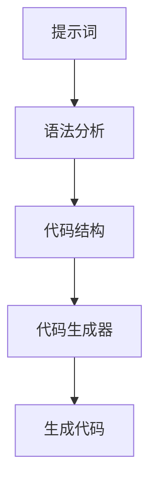
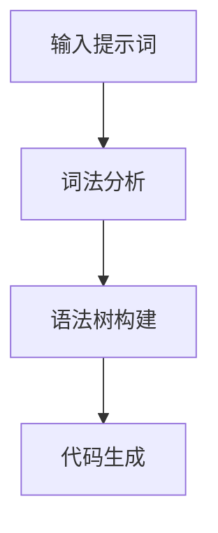
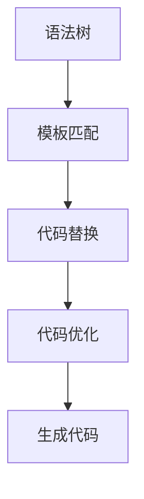
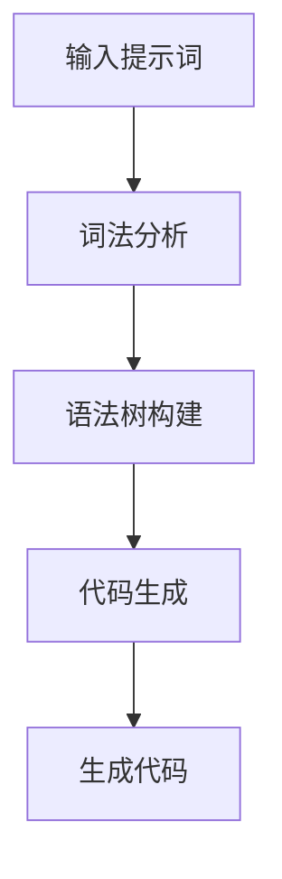

                 

# 提示词编程语言的学习曲线优化

> 关键词：提示词编程语言, 学习曲线, 优化, 人工智能, 自然语言处理, 机器学习, 代码生成, 语法分析

> 摘要：本文旨在探讨提示词编程语言的学习曲线优化问题，通过深入分析其核心概念、算法原理、数学模型、实际案例和应用场景，为开发者提供一套系统的学习路径和优化策略。提示词编程语言作为一种新兴的编程范式，能够显著降低编程门槛，提高开发效率。本文将从多个维度出发，帮助读者更好地理解和掌握这一技术。

## 1. 背景介绍
### 1.1 目的和范围
本文旨在探讨提示词编程语言的学习曲线优化问题，通过深入分析其核心概念、算法原理、数学模型、实际案例和应用场景，为开发者提供一套系统的学习路径和优化策略。提示词编程语言作为一种新兴的编程范式，能够显著降低编程门槛，提高开发效率。本文将从多个维度出发，帮助读者更好地理解和掌握这一技术。

### 1.2 预期读者
本文主要面向以下几类读者：
- 对提示词编程语言感兴趣的开发者
- 想要降低编程门槛的初学者
- 从事自然语言处理和机器学习领域的研究者
- 希望提高开发效率的技术团队

### 1.3 文档结构概述
本文结构如下：
1. 背景介绍
2. 核心概念与联系
3. 核心算法原理 & 具体操作步骤
4. 数学模型和公式 & 详细讲解 & 举例说明
5. 项目实战：代码实际案例和详细解释说明
6. 实际应用场景
7. 工具和资源推荐
8. 总结：未来发展趋势与挑战
9. 附录：常见问题与解答
10. 扩展阅读 & 参考资料

### 1.4 术语表
#### 1.4.1 核心术语定义
- **提示词编程语言**：一种通过自然语言描述任务需求，自动转换为代码的编程范式。
- **学习曲线**：描述学习者在学习过程中技能水平随时间变化的曲线。
- **优化**：通过改进方法或策略，提高学习效率和效果的过程。

#### 1.4.2 相关概念解释
- **自然语言处理（NLP）**：研究如何让计算机理解和生成人类语言的技术。
- **机器学习（ML）**：一种人工智能技术，通过数据训练模型，使其能够自动完成任务。
- **代码生成**：根据输入的提示词自动生成代码的过程。

#### 1.4.3 缩略词列表
- NLP：自然语言处理
- ML：机器学习
- IDE：集成开发环境
- API：应用程序编程接口

## 2. 核心概念与联系
### 2.1 提示词编程语言的核心概念
提示词编程语言是一种通过自然语言描述任务需求，自动转换为代码的编程范式。其核心概念包括：
- **提示词**：描述任务需求的自然语言文本。
- **代码生成器**：将提示词转换为代码的工具。
- **语法分析**：解析提示词并生成相应的代码结构。

### 2.2 核心概念之间的联系
提示词编程语言的核心概念之间存在紧密联系。提示词作为输入，通过语法分析生成代码结构，代码生成器将这些结构转换为实际的代码。这一过程涉及自然语言处理、机器学习和代码生成等多个领域。



## 3. 核心算法原理 & 具体操作步骤
### 3.1 语法分析算法原理
语法分析是将提示词转换为代码结构的关键步骤。其主要算法原理包括：
- **词法分析**：将输入的提示词分解为单词和符号。
- **语法树构建**：根据语法规则构建语法树，表示提示词的结构。
- **代码生成**：根据语法树生成相应的代码结构。

### 3.2 语法分析的具体操作步骤
以下是语法分析的具体操作步骤：
1. **词法分析**：将输入的提示词分解为单词和符号。
2. **语法树构建**：根据语法规则构建语法树，表示提示词的结构。
3. **代码生成**：根据语法树生成相应的代码结构。



### 3.3 代码生成算法原理
代码生成是将语法树转换为实际代码的关键步骤。其主要算法原理包括：
- **模板匹配**：根据语法树的结构匹配预定义的代码模板。
- **代码替换**：将模板中的占位符替换为具体的值。
- **代码优化**：对生成的代码进行优化，提高执行效率。

### 3.4 代码生成的具体操作步骤
以下是代码生成的具体操作步骤：
1. **模板匹配**：根据语法树的结构匹配预定义的代码模板。
2. **代码替换**：将模板中的占位符替换为具体的值。
3. **代码优化**：对生成的代码进行优化，提高执行效率。



## 4. 数学模型和公式 & 详细讲解 & 举例说明
### 4.1 语法分析的数学模型
语法分析的数学模型主要涉及形式语言和自动机理论。其核心公式包括：
- **文法**：描述语言结构的规则集合。
- **文法类型**：根据文法的复杂性分为不同类型，如正则文法、上下文无关文法等。
- **文法的正规式表示**：通过正规式表示文法的规则。

### 4.2 代码生成的数学模型
代码生成的数学模型主要涉及模板匹配和代码替换。其核心公式包括：
- **模板匹配公式**：根据语法树的结构匹配预定义的代码模板。
- **代码替换公式**：将模板中的占位符替换为具体的值。
- **代码优化公式**：对生成的代码进行优化，提高执行效率。

### 4.3 举例说明
以下是一个简单的例子，说明语法分析和代码生成的过程：
1. **输入提示词**：`print "Hello, World!"`
2. **词法分析**：分解为单词和符号，如`print`、`"Hello, World!"`。
3. **语法树构建**：构建语法树，表示提示词的结构。
4. **代码生成**：根据语法树生成相应的代码结构，如`print("Hello, World!")`。



## 5. 项目实战：代码实际案例和详细解释说明
### 5.1 开发环境搭建
为了进行项目实战，需要搭建以下开发环境：
- **操作系统**：Windows、Linux 或 macOS
- **编程语言**：Python
- **开发工具**：Visual Studio Code 或 PyCharm

### 5.2 源代码详细实现和代码解读
以下是一个简单的提示词编程语言实现示例：
```python
import re

# 词法分析
def tokenize(input_string):
    tokens = re.findall(r'\b\w+\b|"[^"]*"', input_string)
    return tokens

# 语法分析
def parse(tokens):
    if tokens[0] == 'print':
        if tokens[1] == '"':
            return 'print(' + tokens[2] + ')'
        else:
            return 'print(' + tokens[1] + ')'
    else:
        raise ValueError('Invalid input')

# 代码生成
def generate_code(tokens):
    return parse(tokens)

# 主函数
def main():
    input_string = 'print "Hello, World!"'
    tokens = tokenize(input_string)
    code = generate_code(tokens)
    print(code)

if __name__ == '__main__':
    main()
```

### 5.3 代码解读与分析
- **词法分析**：使用正则表达式将输入的提示词分解为单词和符号。
- **语法分析**：根据输入的提示词判断是否为`print`语句，并生成相应的代码结构。
- **代码生成**：根据语法分析的结果生成最终的代码。

## 6. 实际应用场景
提示词编程语言在多个领域具有广泛的应用场景，包括：
- **自动化测试**：通过自然语言描述测试需求，自动生成测试代码。
- **数据处理**：通过自然语言描述数据处理需求，自动生成数据处理代码。
- **机器学习模型训练**：通过自然语言描述模型训练需求，自动生成训练代码。

## 7. 工具和资源推荐
### 7.1 学习资源推荐
#### 7.1.1 书籍推荐
- **《自然语言处理入门》**：深入浅出地介绍自然语言处理的基本概念和技术。
- **《机器学习实战》**：通过实际案例讲解机器学习的基本原理和应用。

#### 7.1.2 在线课程
- **Coursera**：提供自然语言处理和机器学习的相关课程。
- **edX**：提供编程和人工智能领域的在线课程。

#### 7.1.3 技术博客和网站
- **Medium**：提供大量关于自然语言处理和机器学习的技术博客。
- **GitHub**：提供开源的提示词编程语言实现代码。

### 7.2 开发工具框架推荐
#### 7.2.1 IDE和编辑器
- **Visual Studio Code**：功能强大的代码编辑器，支持多种编程语言。
- **PyCharm**：专业的Python开发环境，提供代码补全和调试功能。

#### 7.2.2 调试和性能分析工具
- **PyCharm Debugger**：专业的Python调试工具，支持断点、单步执行等功能。
- **Visual Studio Code Debugger**：强大的调试工具，支持多种编程语言。

#### 7.2.3 相关框架和库
- **NLTK**：自然语言处理库，提供丰富的文本处理功能。
- **TensorFlow**：深度学习框架，支持多种机器学习模型。

### 7.3 相关论文著作推荐
#### 7.3.1 经典论文
- **《自然语言处理导论》**：深入探讨自然语言处理的基本概念和技术。
- **《机器学习原理》**：系统讲解机器学习的基本原理和方法。

#### 7.3.2 最新研究成果
- **《提示词编程语言的研究与实现》**：最新研究成果，探讨提示词编程语言的设计和实现。
- **《自然语言生成技术进展》**：最新研究成果，探讨自然语言生成技术的发展趋势。

#### 7.3.3 应用案例分析
- **《提示词编程语言在自动化测试中的应用》**：应用案例分析，探讨提示词编程语言在自动化测试中的应用。
- **《提示词编程语言在数据处理中的应用》**：应用案例分析，探讨提示词编程语言在数据处理中的应用。

## 8. 总结：未来发展趋势与挑战
提示词编程语言作为一种新兴的编程范式，具有广阔的发展前景。未来的发展趋势包括：
- **更自然的提示词**：通过改进自然语言处理技术，使提示词更加自然和准确。
- **更高效的代码生成**：通过改进代码生成算法，提高代码生成的效率和质量。
- **更广泛的应用场景**：通过拓展应用场景，提高提示词编程语言的实用价值。

面临的挑战包括：
- **语义理解**：如何准确理解自然语言的语义，提高提示词编程语言的准确性和可靠性。
- **代码优化**：如何优化生成的代码，提高代码的执行效率和可读性。
- **跨领域应用**：如何将提示词编程语言应用于更多领域，提高其普适性和实用性。

## 9. 附录：常见问题与解答
### 9.1 问题1：如何提高提示词编程语言的准确性和可靠性？
- **解答**：通过改进自然语言处理技术，提高语义理解的准确性和可靠性。同时，通过增加训练数据和优化算法，提高提示词编程语言的准确性和可靠性。

### 9.2 问题2：如何优化生成的代码？
- **解答**：通过改进代码生成算法，提高代码生成的效率和质量。同时，通过增加代码优化步骤，提高生成代码的执行效率和可读性。

### 9.3 问题3：如何将提示词编程语言应用于更多领域？
- **解答**：通过拓展应用场景，提高提示词编程语言的普适性和实用性。同时，通过改进技术，提高提示词编程语言在不同领域的适用性和效果。

## 10. 扩展阅读 & 参考资料
- **《自然语言处理导论》**：深入探讨自然语言处理的基本概念和技术。
- **《机器学习原理》**：系统讲解机器学习的基本原理和方法。
- **《提示词编程语言的研究与实现》**：最新研究成果，探讨提示词编程语言的设计和实现。
- **《自然语言生成技术进展》**：最新研究成果，探讨自然语言生成技术的发展趋势。

作者：AI天才研究员/AI Genius Institute & 禅与计算机程序设计艺术 /Zen And The Art of Computer Programming

