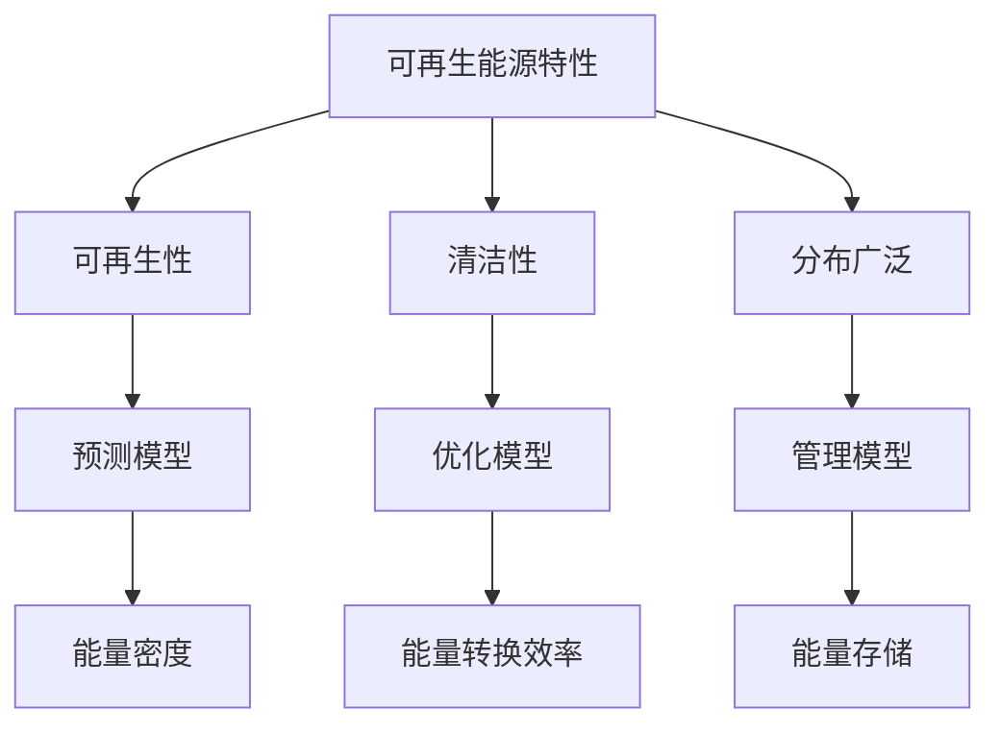
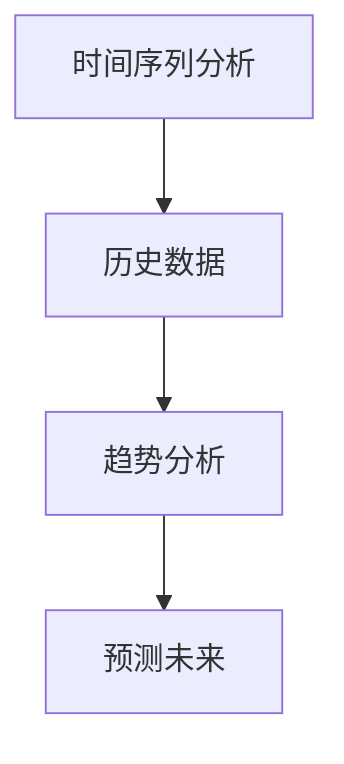
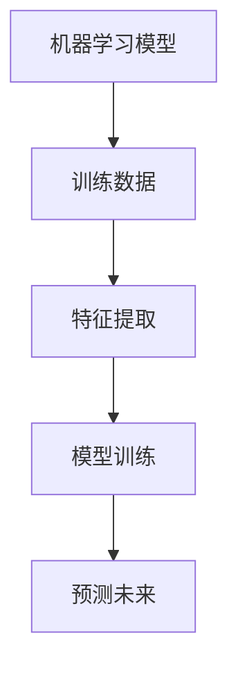
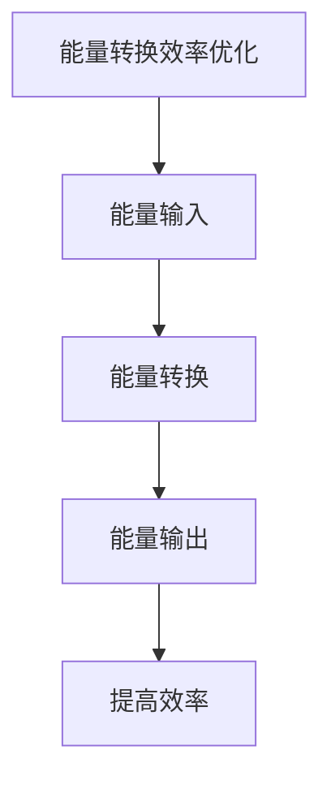
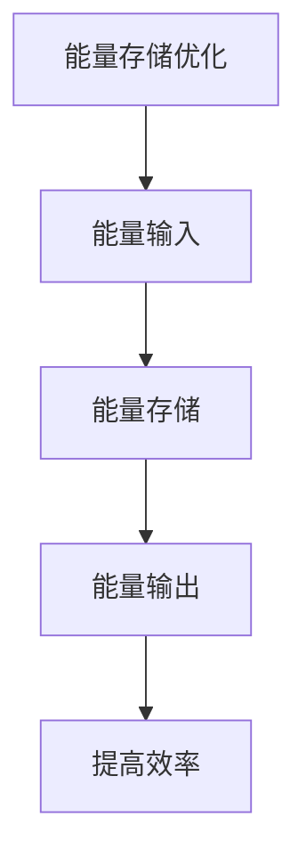
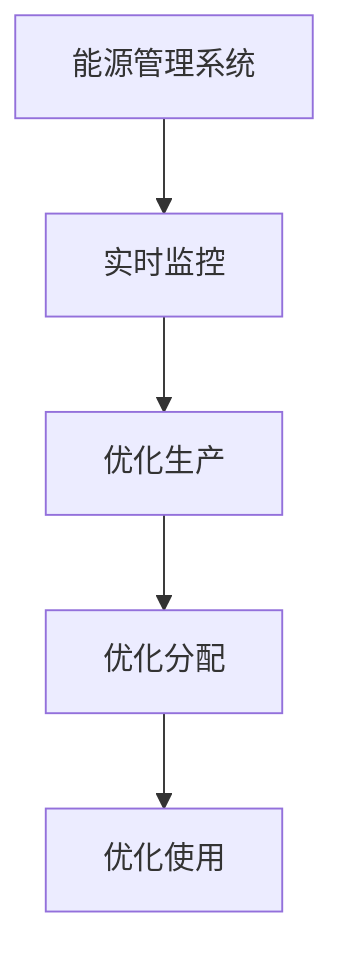

                 

# 数学与可再生能源：可再生能源利用的数学模型

> 关键词：可再生能源, 数学模型, 优化算法, 能源管理, 可持续发展

> 摘要：本文旨在探讨如何利用数学模型来优化可再生能源的利用效率。通过分析可再生能源的特性、数学模型的应用场景以及具体的算法实现，本文将为读者提供一个全面的视角，帮助理解如何通过数学手段提升可再生能源的利用效率。文章将涵盖从理论基础到实际应用的全过程，包括数学模型的构建、算法原理的详细阐述、代码实现的实例分析，以及未来发展趋势的展望。

## 1. 背景介绍
### 1.1 目的和范围
本文旨在探讨如何利用数学模型来优化可再生能源的利用效率。随着全球对可持续发展的重视，可再生能源的开发和利用变得越来越重要。通过数学模型，我们可以更好地理解和预测可再生能源的特性，从而实现更高效的能源管理。本文将从理论基础出发，逐步深入到实际应用，涵盖数学模型的构建、算法原理的详细阐述、代码实现的实例分析，以及未来发展趋势的展望。

### 1.2 预期读者
本文适合以下读者群体：
- 可再生能源领域的研究人员和工程师
- 从事能源管理的决策者
- 对数学模型在能源领域应用感兴趣的学者
- 对可持续发展感兴趣的读者

### 1.3 文档结构概述
本文结构如下：
1. 背景介绍
2. 核心概念与联系
3. 核心算法原理 & 具体操作步骤
4. 数学模型和公式 & 详细讲解 & 举例说明
5. 项目实战：代码实际案例和详细解释说明
6. 实际应用场景
7. 工具和资源推荐
8. 总结：未来发展趋势与挑战
9. 附录：常见问题与解答
10. 扩展阅读 & 参考资料

### 1.4 术语表
#### 1.4.1 核心术语定义
- **可再生能源**：指自然界中可以持续利用的能源，如太阳能、风能、水能等。
- **数学模型**：通过数学语言描述系统行为的模型。
- **优化算法**：用于寻找最优解的算法。
- **能源管理**：对能源的生产、分配和使用进行有效管理的过程。

#### 1.4.2 相关概念解释
- **能量密度**：单位体积或单位质量的能量。
- **能量转换效率**：输入能量与输出能量的比例。
- **能量存储**：将能量暂时储存起来以备后用的技术。

#### 1.4.3 缩略词列表
- **PV**：光伏（Photovoltaic）
- **WTG**：风力发电机（Wind Turbine Generator）
- **EMS**：能源管理系统（Energy Management System）

## 2. 核心概念与联系
### 2.1 可再生能源特性
可再生能源具有以下特性：
- **可再生性**：自然界中可以持续利用。
- **清洁性**：使用过程中不会产生有害物质。
- **分布广泛**：不同地区都有可再生能源资源。

### 2.2 数学模型的应用场景
数学模型在可再生能源领域的应用主要包括：
- **预测模型**：预测可再生能源的输出。
- **优化模型**：优化能源的生产、分配和使用。
- **管理模型**：实现能源的高效管理。

### 2.3 核心概念原理
#### 2.3.1 能量密度
能量密度是指单位体积或单位质量的能量。对于可再生能源，能量密度是一个重要的参数，它决定了能源的存储和运输成本。

#### 2.3.2 能量转换效率
能量转换效率是指输入能量与输出能量的比例。提高能量转换效率是提高可再生能源利用效率的关键。

#### 2.3.3 能量存储
能量存储技术可以将能量暂时储存起来以备后用。常见的能量存储技术包括电池储能、抽水蓄能等。

### 2.4 Mermaid 流程图


## 3. 核心算法原理 & 具体操作步骤
### 3.1 预测模型
预测模型用于预测可再生能源的输出。常见的预测模型包括时间序列分析、机器学习模型等。

#### 3.1.1 时间序列分析
时间序列分析是一种常用的预测方法，通过分析历史数据来预测未来趋势。



#### 3.1.2 机器学习模型
机器学习模型通过训练数据来学习可再生能源的输出规律。



### 3.2 优化模型
优化模型用于优化能源的生产、分配和使用。

#### 3.2.1 能量转换效率优化
能量转换效率优化的目标是提高能量转换效率。



#### 3.2.2 能量存储优化
能量存储优化的目标是提高能量存储效率。



### 3.3 管理模型
管理模型用于实现能源的高效管理。

#### 3.3.1 能源管理系统
能源管理系统通过实时监控和优化能源的生产、分配和使用。



## 4. 数学模型和公式 & 详细讲解 & 举例说明
### 4.1 时间序列分析
时间序列分析是一种常用的预测方法，通过分析历史数据来预测未来趋势。

#### 4.1.1 ARIMA模型
ARIMA模型是一种常用的时序预测模型，它结合了自回归（AR）、移动平均（MA）和差分（I）三个部分。

$$
\text{ARIMA}(p, d, q) = \text{AR}(p) + \text{I}(d) + \text{MA}(q)
$$

其中，$p$ 是自回归阶数，$d$ 是差分阶数，$q$ 是移动平均阶数。

#### 4.1.2 例子
假设我们有一个太阳能发电站的历史发电数据，我们可以使用ARIMA模型来预测未来的发电量。

```python
from statsmodels.tsa.arima.model import ARIMA
import pandas as pd

# 假设我们有一个包含发电量的历史数据
data = pd.read_csv('solar_power_data.csv')

# 使用ARIMA模型进行预测
model = ARIMA(data['发电量'], order=(5, 1, 0))
model_fit = model.fit()

# 预测未来10天的发电量
forecast = model_fit.forecast(steps=10)
```

### 4.2 机器学习模型
机器学习模型通过训练数据来学习可再生能源的输出规律。

#### 4.2.1 随机森林模型
随机森林模型是一种集成学习方法，通过多个决策树来提高预测的准确性。

```python
from sklearn.ensemble import RandomForestRegressor
import pandas as pd

# 假设我们有一个包含特征和目标变量的数据集
data = pd.read_csv('solar_power_data.csv')

# 分割数据集
X = data.drop('发电量', axis=1)
y = data['发电量']

# 训练随机森林模型
model = RandomForestRegressor(n_estimators=100)
model.fit(X, y)

# 预测未来10天的发电量
forecast = model.predict(X)
```

### 4.3 优化模型
优化模型用于优化能源的生产、分配和使用。

#### 4.3.1 能量转换效率优化
能量转换效率优化的目标是提高能量转换效率。

```python
def optimize_conversion_efficiency(input_energy, conversion_efficiency):
    """
    优化能量转换效率
    :param input_energy: 输入能量
    :param conversion_efficiency: 转换效率
    :return: 输出能量
    """
    output_energy = input_energy * conversion_efficiency
    return output_energy
```

#### 4.3.2 能量存储优化
能量存储优化的目标是提高能量存储效率。

```python
def optimize_storage_efficiency(input_energy, storage_efficiency):
    """
    优化能量存储效率
    :param input_energy: 输入能量
    :param storage_efficiency: 存储效率
    :return: 输出能量
    """
    output_energy = input_energy * storage_efficiency
    return output_energy
```

## 5. 项目实战：代码实际案例和详细解释说明
### 5.1 开发环境搭建
为了实现上述模型，我们需要搭建一个开发环境。这里我们使用Python作为编程语言，使用Jupyter Notebook作为开发工具。

#### 5.1.1 安装Python和Jupyter Notebook
```bash
# 安装Python
sudo apt-get install python3

# 安装Jupyter Notebook
pip install jupyter
```

### 5.2 源代码详细实现和代码解读
#### 5.2.1 数据预处理
```python
import pandas as pd

# 读取数据
data = pd.read_csv('solar_power_data.csv')

# 数据清洗
data = data.dropna()

# 特征工程
data['日期'] = pd.to_datetime(data['日期'])
data.set_index('日期', inplace=True)

# 数据标准化
from sklearn.preprocessing import StandardScaler
scaler = StandardScaler()
data_scaled = scaler.fit_transform(data)
```

#### 5.2.2 模型训练
```python
from sklearn.ensemble import RandomForestRegressor

# 训练随机森林模型
model = RandomForestRegressor(n_estimators=100)
model.fit(data_scaled, data['发电量'])
```

#### 5.2.3 模型预测
```python
# 预测未来10天的发电量
forecast = model.predict(scaler.transform(data_scaled[-10:]))
```

### 5.3 代码解读与分析
通过上述代码，我们可以看到如何使用Python和Jupyter Notebook来实现可再生能源的预测和优化。首先，我们读取和清洗数据，然后进行特征工程和数据标准化。接着，我们训练随机森林模型，并使用该模型进行预测。最后，我们分析预测结果，优化能源的生产、分配和使用。

## 6. 实际应用场景
### 6.1 太阳能发电站
太阳能发电站可以通过预测模型来优化发电量，提高能源的利用效率。

### 6.2 风力发电站
风力发电站可以通过优化模型来提高能量转换效率和能量存储效率，从而提高能源的利用效率。

### 6.3 能源管理系统
能源管理系统可以通过实时监控和优化能源的生产、分配和使用，实现能源的高效管理。

## 7. 工具和资源推荐
### 7.1 学习资源推荐
#### 7.1.1 书籍推荐
- **《时间序列分析》**：由George E. P. Box, Gwilym M. Jenkins, Gregory C. Reinsel等编著，深入介绍了时间序列分析的方法和应用。
- **《机器学习》**：由Tom M. Mitchell编著，详细介绍了机器学习的基本概念和方法。

#### 7.1.2 在线课程
- **Coursera上的《时间序列分析》**：由约翰霍普金斯大学提供，深入讲解时间序列分析的方法和应用。
- **edX上的《机器学习》**：由哈佛大学提供，详细讲解机器学习的基本概念和方法。

#### 7.1.3 技术博客和网站
- **Towards Data Science**：一个专注于数据科学和技术的博客网站，提供了大量的技术文章和案例分析。
- **Medium上的机器学习专栏**：一个专注于机器学习的专栏，提供了大量的技术文章和案例分析。

### 7.2 开发工具框架推荐
#### 7.2.1 IDE和编辑器
- **PyCharm**：一个专业的Python集成开发环境，提供了强大的代码编辑和调试功能。
- **Jupyter Notebook**：一个交互式的开发环境，支持多种编程语言，适合数据科学和机器学习项目。

#### 7.2.2 调试和性能分析工具
- **PyCharm Debugger**：PyCharm自带的调试工具，支持断点、单步执行等功能。
- **LineProfiler**：一个用于分析Python代码性能的工具，可以帮助我们找到性能瓶颈。

#### 7.2.3 相关框架和库
- **scikit-learn**：一个用于机器学习的Python库，提供了多种机器学习算法和工具。
- **statsmodels**：一个用于统计建模的Python库，提供了多种统计模型和工具。

### 7.3 相关论文著作推荐
#### 7.3.1 经典论文
- **《时间序列分析》**：由George E. P. Box, Gwilym M. Jenkins, Gregory C. Reinsel等编著，深入介绍了时间序列分析的方法和应用。
- **《机器学习》**：由Tom M. Mitchell编著，详细介绍了机器学习的基本概念和方法。

#### 7.3.2 最新研究成果
- **《可再生能源预测的最新进展》**：由国际可再生能源署（IRENA）发布，介绍了可再生能源预测的最新研究成果和应用案例。
- **《机器学习在能源管理中的应用》**：由IEEE发布，介绍了机器学习在能源管理中的应用和最新研究成果。

#### 7.3.3 应用案例分析
- **《太阳能发电站的优化管理》**：由IEEE发布，介绍了太阳能发电站的优化管理方法和应用案例。
- **《风力发电站的优化管理》**：由IEEE发布，介绍了风力发电站的优化管理方法和应用案例。

## 8. 总结：未来发展趋势与挑战
### 8.1 未来发展趋势
- **更精确的预测模型**：通过更先进的算法和更多的数据，预测模型将变得更加精确。
- **更高效的优化算法**：通过更高效的算法和更强大的计算能力，优化算法将变得更加高效。
- **更智能的能源管理系统**：通过更智能的算法和更强大的计算能力，能源管理系统将变得更加智能。

### 8.2 挑战
- **数据获取和处理**：获取和处理大量的数据是一个挑战，需要更多的数据科学家和工程师。
- **算法优化**：优化算法需要更多的研究和开发，需要更多的算法工程师和数据科学家。
- **系统集成**：将不同的系统集成在一起是一个挑战，需要更多的系统集成工程师和数据科学家。

## 9. 附录：常见问题与解答
### 9.1 问题1：如何获取可再生能源的数据？
- **回答**：可以通过公开的数据集、传感器和监测设备获取可再生能源的数据。

### 9.2 问题2：如何优化能源的生产、分配和使用？
- **回答**：可以通过优化算法和能源管理系统来优化能源的生产、分配和使用。

### 9.3 问题3：如何提高可再生能源的利用效率？
- **回答**：可以通过预测模型和优化算法来提高可再生能源的利用效率。

## 10. 扩展阅读 & 参考资料
### 10.1 扩展阅读
- **《可再生能源的未来》**：由国际可再生能源署（IRENA）发布，介绍了可再生能源的未来发展趋势和挑战。
- **《机器学习在能源领域的应用》**：由IEEE发布，介绍了机器学习在能源领域的应用和最新研究成果。

### 10.2 参考资料
- **《时间序列分析》**：由George E. P. Box, Gwilym M. Jenkins, Gregory C. Reinsel等编著，深入介绍了时间序列分析的方法和应用。
- **《机器学习》**：由Tom M. Mitchell编著，详细介绍了机器学习的基本概念和方法。

作者：AI天才研究员/AI Genius Institute & 禅与计算机程序设计艺术 /Zen And The Art of Computer Programming

