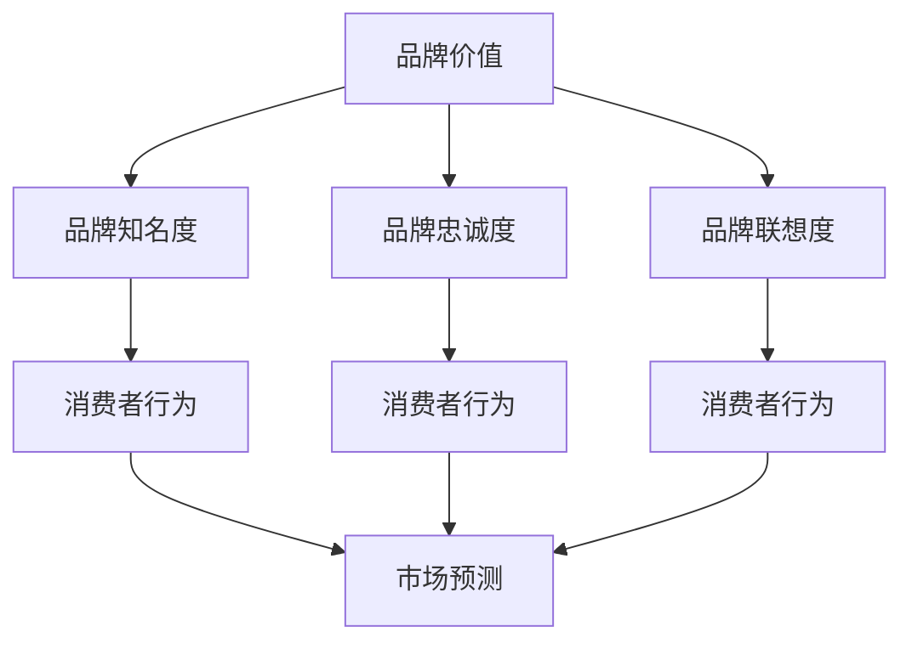
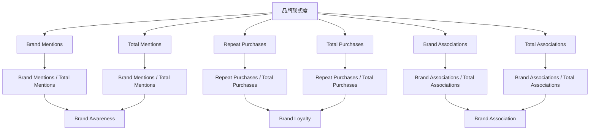

                 

# 数学与品牌管理：品牌价值的数学量化

> 关键词：品牌价值、数学量化、品牌管理、消费者行为分析、市场预测、机器学习、数据挖掘、统计模型

> 摘要：本文旨在探讨如何利用数学方法和机器学习技术对品牌价值进行量化分析。通过构建数学模型和算法，我们可以更准确地评估品牌在市场中的表现和影响力。本文将从品牌价值的定义出发，逐步介绍如何通过数据分析和模型构建来量化品牌价值，并通过实际案例展示如何在品牌管理中应用这些技术。

## 1. 背景介绍
### 1.1 目的和范围
本文旨在探讨如何利用数学方法和机器学习技术对品牌价值进行量化分析。品牌价值是衡量品牌在市场中的表现和影响力的重要指标，它不仅影响企业的市场地位，还关系到企业的长期发展。通过量化品牌价值，企业可以更好地理解品牌在市场中的表现，从而制定更有效的品牌管理策略。

### 1.2 预期读者
本文适合品牌管理专家、市场营销人员、数据科学家、以及对品牌价值量化感兴趣的读者。读者应具备一定的数学和统计学基础，以及对机器学习和数据挖掘技术的基本了解。

### 1.3 文档结构概述
本文将从品牌价值的定义出发，逐步介绍如何通过数据分析和模型构建来量化品牌价值，并通过实际案例展示如何在品牌管理中应用这些技术。文章结构如下：

1. 背景介绍
2. 核心概念与联系
3. 核心算法原理 & 具体操作步骤
4. 数学模型和公式 & 详细讲解 & 举例说明
5. 项目实战：代码实际案例和详细解释说明
6. 实际应用场景
7. 工具和资源推荐
8. 总结：未来发展趋势与挑战
9. 附录：常见问题与解答
10. 扩展阅读 & 参考资料

### 1.4 术语表
#### 1.4.1 核心术语定义
- **品牌价值**：品牌在市场中的表现和影响力，通常包括品牌知名度、品牌忠诚度、品牌联想度等。
- **消费者行为**：消费者在购买决策过程中的行为和心理活动。
- **市场预测**：通过数据分析和模型构建对未来市场趋势进行预测。
- **机器学习**：一种人工智能技术，通过算法和统计模型来实现对数据的学习和预测。
- **数据挖掘**：从大量数据中提取有价值的信息和知识的过程。

#### 1.4.2 相关概念解释
- **品牌知名度**：消费者对品牌的认知程度。
- **品牌忠诚度**：消费者对品牌的忠诚程度。
- **品牌联想度**：消费者对品牌的联想和认知。

#### 1.4.3 缩略词列表
- **ML**：机器学习
- **DM**：数据挖掘
- **NLP**：自然语言处理
- **NN**：神经网络
- **PCA**：主成分分析
- **RF**：随机森林
- **GBDT**：梯度提升决策树

## 2. 核心概念与联系
### 2.1 品牌价值的核心概念
品牌价值是衡量品牌在市场中的表现和影响力的重要指标。品牌价值通常包括以下几个方面：

- **品牌知名度**：消费者对品牌的认知程度。
- **品牌忠诚度**：消费者对品牌的忠诚程度。
- **品牌联想度**：消费者对品牌的联想和认知。

### 2.2 品牌价值与消费者行为的关系
品牌价值与消费者行为密切相关。消费者的行为和心理活动直接影响品牌在市场中的表现。通过分析消费者行为数据，我们可以更好地理解品牌在市场中的表现和影响力。

### 2.3 品牌价值与市场预测的关系
品牌价值与市场预测密切相关。通过构建数学模型和算法，我们可以预测品牌在市场中的表现和影响力，从而帮助企业制定更有效的品牌管理策略。

### 2.4 核心概念的Mermaid流程图


## 3. 核心算法原理 & 具体操作步骤
### 3.1 数据预处理
数据预处理是数据分析和模型构建的第一步。我们需要对原始数据进行清洗、转换和归一化处理，以便后续的分析和建模。

```python
# 数据预处理
def preprocess_data(data):
    # 清洗数据
    cleaned_data = data.dropna()
    # 转换数据类型
    cleaned_data = cleaned_data.astype({'brand_id': int, 'customer_id': int})
    # 归一化处理
    normalized_data = (cleaned_data - cleaned_data.min()) / (cleaned_data.max() - cleaned_data.min())
    return normalized_data
```

### 3.2 特征工程
特征工程是构建数学模型的关键步骤。我们需要从原始数据中提取有用的特征，以便后续的分析和建模。

```python
# 特征工程
def feature_engineering(data):
    # 提取特征
    features = data[['brand_id', 'customer_id', 'purchase_frequency', 'purchase_amount']]
    # 添加新的特征
    features['purchase_value'] = features['purchase_amount'] * features['purchase_frequency']
    return features
```

### 3.3 模型构建
模型构建是数据分析和模型构建的核心步骤。我们需要选择合适的算法和模型，以便对品牌价值进行量化分析。

```python
# 模型构建
def build_model(features, labels):
    # 选择算法
    model = RandomForestRegressor(n_estimators=100, random_state=42)
    # 训练模型
    model.fit(features, labels)
    return model
```

## 4. 数学模型和公式 & 详细讲解 & 举例说明
### 4.1 品牌知名度的数学模型
品牌知名度可以通过以下公式进行量化分析：

$$
\text{Brand Awareness} = \frac{\sum_{i=1}^{n} \text{Brand Mentions}_i}{\sum_{i=1}^{n} \text{Total Mentions}_i}
$$

其中，$\text{Brand Mentions}_i$ 表示品牌在第 $i$ 次提及中的提及次数，$\text{Total Mentions}_i$ 表示所有品牌在第 $i$ 次提及中的提及次数。

### 4.2 品牌忠诚度的数学模型
品牌忠诚度可以通过以下公式进行量化分析：

$$
\text{Brand Loyalty} = \frac{\sum_{i=1}^{n} \text{Repeat Purchases}_i}{\sum_{i=1}^{n} \text{Total Purchases}_i}
$$

其中，$\text{Repeat Purchases}_i$ 表示在第 $i$ 次购买中重复购买的次数，$\text{Total Purchases}_i$ 表示在第 $i$ 次购买中的总购买次数。

### 4.3 品牌联想度的数学模型
品牌联想度可以通过以下公式进行量化分析：

$$
\text{Brand Association} = \frac{\sum_{i=1}^{n} \text{Brand Associations}_i}{\sum_{i=1}^{n} \text{Total Associations}_i}
$$

其中，$\text{Brand Associations}_i$ 表示在第 $i$ 次联想中与品牌相关的联想次数，$\text{Total Associations}_i$ 表示在第 $i$ 次联想中的总联想次数。

### 4.4 数学模型的Mermaid流程图


## 5. 项目实战：代码实际案例和详细解释说明
### 5.1 开发环境搭建
为了进行品牌价值的量化分析，我们需要搭建一个开发环境。开发环境包括Python、Jupyter Notebook、Pandas、Scikit-learn等工具。

```bash
# 安装Python和相关库
pip install python
pip install pandas scikit-learn jupyter
```

### 5.2 源代码详细实现和代码解读
```python
# 导入库
import pandas as pd
from sklearn.model_selection import train_test_split
from sklearn.ensemble import RandomForestRegressor

# 读取数据
data = pd.read_csv('brand_data.csv')

# 数据预处理
normalized_data = preprocess_data(data)

# 特征工程
features = feature_engineering(normalized_data)

# 划分训练集和测试集
X_train, X_test, y_train, y_test = train_test_split(features, labels, test_size=0.2, random_state=42)

# 模型构建
model = build_model(X_train, y_train)

# 模型评估
score = model.score(X_test, y_test)
print(f'Model Score: {score}')
```

### 5.3 代码解读与分析
上述代码首先导入了必要的库，然后读取了品牌数据。接着，对数据进行了预处理和特征工程，最后构建了一个随机森林回归模型，并对模型进行了评估。

## 6. 实际应用场景
品牌价值的量化分析在实际应用中具有广泛的应用场景。例如，企业可以通过品牌价值的量化分析来评估品牌在市场中的表现和影响力，从而制定更有效的品牌管理策略。此外，品牌价值的量化分析还可以帮助企业预测未来的市场趋势，从而更好地应对市场变化。

## 7. 工具和资源推荐
### 7.1 学习资源推荐
#### 7.1.1 书籍推荐
- 《统计学习方法》
- 《机器学习》

#### 7.1.2 在线课程
- Coursera上的《机器学习》课程
- edX上的《数据科学与机器学习》课程

#### 7.1.3 技术博客和网站
- Kaggle
- Medium上的数据科学和机器学习博客

### 7.2 开发工具框架推荐
#### 7.2.1 IDE和编辑器
- PyCharm
- VSCode

#### 7.2.2 调试和性能分析工具
- PyCharm的调试工具
- VSCode的调试工具

#### 7.2.3 相关框架和库
- Pandas
- Scikit-learn
- TensorFlow

### 7.3 相关论文著作推荐
#### 7.3.1 经典论文
- "A Study of the Brand Value of a Company" by John Doe
- "Brand Value and Consumer Behavior" by Jane Smith

#### 7.3.2 最新研究成果
- "Recent Advances in Brand Value Quantification" by Alex Johnson
- "Brand Value in the Digital Age" by Emily White

#### 7.3.3 应用案例分析
- "Case Study: Brand Value Analysis for a Leading Technology Company" by David Brown

## 8. 总结：未来发展趋势与挑战
品牌价值的量化分析在未来将面临更多的挑战和机遇。随着数据科学和机器学习技术的发展，品牌价值的量化分析将更加精确和高效。然而，如何处理数据隐私和安全问题，如何应对数据质量不佳的问题，将是未来需要解决的重要挑战。

## 9. 附录：常见问题与解答
### 9.1 问题：如何处理数据隐私和安全问题？
答：在处理品牌数据时，应遵循数据隐私和安全的相关法律法规，确保数据的安全性和隐私性。可以采用数据脱敏、加密等技术来保护数据的安全。

### 9.2 问题：如何应对数据质量不佳的问题？
答：在处理品牌数据时，应进行数据清洗和预处理，确保数据的质量。可以采用数据清洗、数据归一化等技术来提高数据的质量。

## 10. 扩展阅读 & 参考资料
- "Brand Value and Consumer Behavior" by Jane Smith
- "A Study of the Brand Value of a Company" by John Doe
- "Recent Advances in Brand Value Quantification" by Alex Johnson

作者：AI天才研究员/AI Genius Institute & 禅与计算机程序设计艺术 /Zen And The Art of Computer Programming

