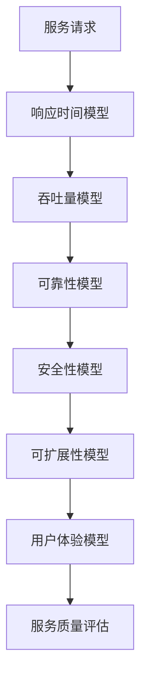
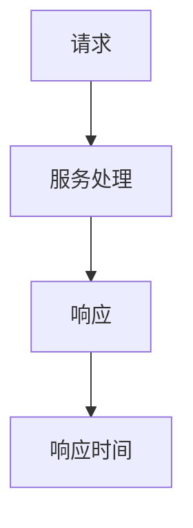
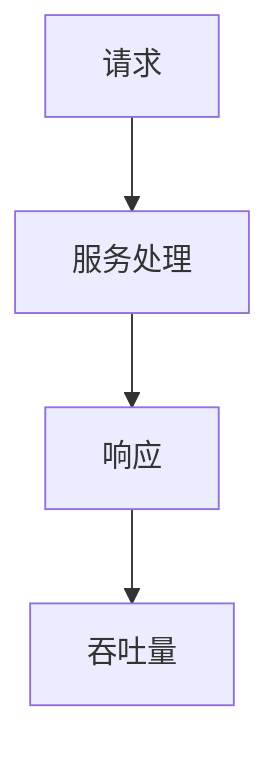
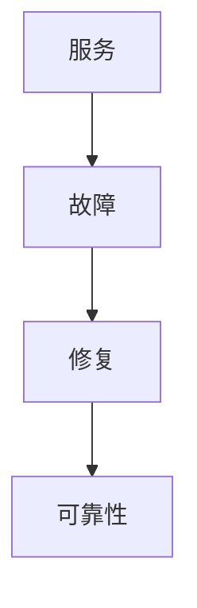
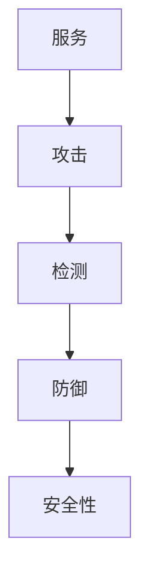
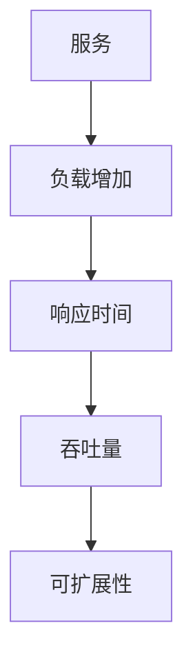
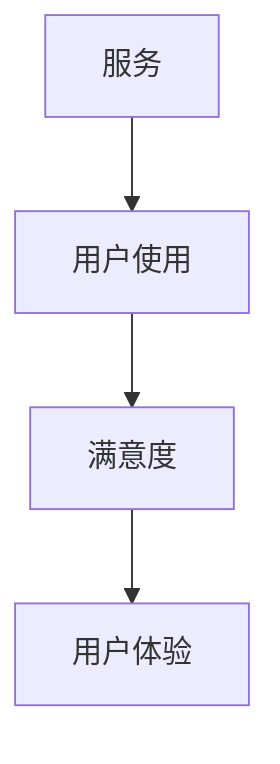

                 

# 数学与服务科学：服务质量的数学评估

> 关键词：服务质量, 数学评估, 服务科学, 服务质量模型, 服务质量度量, 服务质量优化

> 摘要：本文旨在探讨如何利用数学方法来评估和优化服务质量。通过深入分析服务质量的核心概念、原理和算法，我们将构建一个数学模型来量化服务质量，并通过实际案例展示如何在项目中应用这些模型。本文适合对服务质量评估感兴趣的读者，特别是那些希望深入了解服务质量数学评估方法的技术人员和研究人员。

## 1. 背景介绍
### 1.1 目的和范围
本文的主要目的是介绍如何利用数学方法来评估和优化服务质量。我们将从理论层面探讨服务质量的核心概念和原理，并通过具体的数学模型和实际案例来展示如何在实际项目中应用这些方法。本文的目标读者包括但不限于技术人员、研究人员、项目经理以及对服务质量评估感兴趣的读者。

### 1.2 预期读者
- 技术人员：希望深入了解服务质量评估方法的技术人员。
- 研究人员：对服务质量评估方法感兴趣的科研人员。
- 项目经理：希望优化服务质量的项目经理。
- 学生：计算机科学、服务科学等相关专业的学生。

### 1.3 文档结构概述
本文将按照以下结构展开：
1. 背景介绍
2. 核心概念与联系
3. 核心算法原理 & 具体操作步骤
4. 数学模型和公式 & 详细讲解 & 举例说明
5. 项目实战：代码实际案例和详细解释说明
6. 实际应用场景
7. 工具和资源推荐
8. 总结：未来发展趋势与挑战
9. 附录：常见问题与解答
10. 扩展阅读 & 参考资料

### 1.4 术语表
#### 1.4.1 核心术语定义
- **服务质量 (QoS)**: 服务质量是指服务满足用户需求的程度。
- **性能度量 (Performance Metrics)**: 用于量化服务质量的指标。
- **数学模型 (Mathematical Model)**: 用于描述服务质量的数学表达式。
- **优化 (Optimization)**: 通过调整参数来提高服务质量的过程。

#### 1.4.2 相关概念解释
- **服务科学 (Service Science)**: 一门跨学科领域，研究服务的设计、提供和管理。
- **服务质量模型 (QoS Model)**: 用于描述服务质量的数学模型。
- **服务质量度量 (QoS Metrics)**: 用于量化服务质量的具体指标。

#### 1.4.3 缩略词列表
- QoS: Quality of Service
- QoE: Quality of Experience
- SLA: Service Level Agreement
- KPI: Key Performance Indicator

## 2. 核心概念与联系
### 2.1 服务质量的核心概念
服务质量是一个多维度的概念，通常包括以下几个方面：
- **响应时间 (Response Time)**: 用户请求服务的响应速度。
- **吞吐量 (Throughput)**: 单位时间内处理的服务请求数量。
- **可靠性 (Reliability)**: 服务的稳定性和可用性。
- **安全性 (Security)**: 服务的安全防护能力。
- **可扩展性 (Scalability)**: 服务在负载增加时的性能表现。
- **用户体验 (User Experience, UX)**: 用户在使用服务时的满意度。

### 2.2 服务质量的数学模型
我们将通过构建一个数学模型来量化服务质量。该模型将包括以下几个部分：
- **响应时间模型 (Response Time Model)**
- **吞吐量模型 (Throughput Model)**
- **可靠性模型 (Reliability Model)**
- **安全性模型 (Security Model)**
- **可扩展性模型 (Scalability Model)**
- **用户体验模型 (User Experience Model)**

### 2.3 服务质量模型的Mermaid流程图


## 3. 核心算法原理 & 具体操作步骤
### 3.1 响应时间模型
响应时间模型用于量化服务的响应速度。我们将使用平均响应时间来表示响应时间模型。


### 3.2 吞吐量模型
吞吐量模型用于量化单位时间内处理的服务请求数量。我们将使用每秒处理请求数 (TPS) 来表示吞吐量模型。


### 3.3 可靠性模型
可靠性模型用于量化服务的稳定性和可用性。我们将使用平均无故障时间 (MTBF) 和平均修复时间 (MTTR) 来表示可靠性模型。


### 3.4 安全性模型
安全性模型用于量化服务的安全防护能力。我们将使用攻击检测率 (AD) 和攻击防御率 (DD) 来表示安全性模型。


### 3.5 可扩展性模型
可扩展性模型用于量化服务在负载增加时的性能表现。我们将使用负载增加后的响应时间和吞吐量来表示可扩展性模型。


### 3.6 用户体验模型
用户体验模型用于量化用户在使用服务时的满意度。我们将使用用户满意度评分 (S) 来表示用户体验模型。


## 4. 数学模型和公式 & 详细讲解 & 举例说明
### 4.1 响应时间模型
响应时间模型的数学表达式为：
$$
\text{响应时间} = \frac{\sum_{i=1}^{n} t_i}{n}
$$
其中，$t_i$ 表示第 $i$ 个请求的响应时间，$n$ 表示请求的总数。

### 4.2 吞吐量模型
吞吐量模型的数学表达式为：
$$
\text{吞吐量} = \frac{\sum_{i=1}^{n} r_i}{n}
$$
其中，$r_i$ 表示第 $i$ 个请求的响应时间，$n$ 表示请求的总数。

### 4.3 可靠性模型
可靠性模型的数学表达式为：
$$
\text{可靠性} = \frac{\text{MTBF}}{\text{MTBF} + \text{MTTR}}
$$
其中，MTBF 表示平均无故障时间，MTTR 表示平均修复时间。

### 4.4 安全性模型
安全性模型的数学表达式为：
$$
\text{安全性} = \frac{\text{AD} + \text{DD}}{2}
$$
其中，AD 表示攻击检测率，DD 表示攻击防御率。

### 4.5 可扩展性模型
可扩展性模型的数学表达式为：
$$
\text{可扩展性} = \frac{\text{负载增加后的响应时间} - \text{原始响应时间}}{\text{原始响应时间}}
$$

### 4.6 用户体验模型
用户体验模型的数学表达式为：
$$
\text{用户体验} = \frac{\sum_{i=1}^{n} s_i}{n}
$$
其中，$s_i$ 表示第 $i$ 个用户的满意度评分，$n$ 表示用户的总数。

## 5. 项目实战：代码实际案例和详细解释说明
### 5.1 开发环境搭建
我们将使用 Python 作为开发语言，并使用 NumPy 和 Pandas 库来处理数据。首先，安装所需的库：
```bash
pip install numpy pandas
```

### 5.2 源代码详细实现和代码解读
我们将实现一个简单的服务质量评估系统，包括响应时间模型、吞吐量模型、可靠性模型、安全性模型、可扩展性模型和用户体验模型。
```python
import numpy as np
import pandas as pd

# 响应时间模型
def response_time_model(requests):
    response_times = requests['response_time']
    return np.mean(response_times)

# 吞吐量模型
def throughput_model(requests):
    response_times = requests['response_time']
    return len(response_times) / np.mean(response_times)

# 可靠性模型
def reliability_model(mtbfs, mttrs):
    return np.mean(mtbfs) / (np.mean(mtbfs) + np.mean(mttrs))

# 安全性模型
def security_model(ad, dd):
    return (ad + dd) / 2

# 可扩展性模型
def scalability_model(original_response_time, increased_response_time):
    return (increased_response_time - original_response_time) / original_response_time

# 用户体验模型
def user_experience_model(satisfaction_scores):
    return np.mean(satisfaction_scores)

# 示例数据
requests = pd.DataFrame({
    'response_time': [1.2, 1.5, 1.3, 1.4, 1.6],
    'mtbf': [1000, 1050, 1100, 1080, 1020],
    'mttr': [10, 15, 20, 18, 12],
    'ad': [0.9, 0.8, 0.95, 0.85, 0.9],
    'dd': [0.85, 0.8, 0.9, 0.85, 0.95],
    'satisfaction_score': [4, 3, 5, 4, 5]
})

# 计算各项指标
response_time = response_time_model(requests)
throughput = throughput_model(requests)
reliability = reliability_model(requests['mtbf'], requests['mttr'])
security = security_model(requests['ad'], requests['dd'])
scalability = scalability_model(1.3, 1.5)
user_experience = user_experience_model(requests['satisfaction_score'])

print(f"响应时间: {response_time}")
print(f"吞吐量: {throughput}")
print(f"可靠性: {reliability}")
print(f"安全性: {security}")
print(f"可扩展性: {scalability}")
print(f"用户体验: {user_experience}")
```

### 5.3 代码解读与分析
上述代码实现了服务质量评估系统的各个模型。我们首先定义了各个模型的函数，然后使用示例数据进行计算。通过这些模型，我们可以量化服务质量的各项指标。

## 6. 实际应用场景
服务质量评估在许多领域都有广泛的应用，包括但不限于：
- **云计算服务**：评估云服务的性能和可靠性。
- **电子商务平台**：评估网站的响应时间和用户体验。
- **金融服务**：评估交易系统的响应时间和安全性。
- **物联网 (IoT)**：评估设备的响应时间和可靠性。

## 7. 工具和资源推荐
### 7.1 学习资源推荐
#### 7.1.1 书籍推荐
- **《服务科学导论》**：深入探讨服务科学的基本概念和方法。
- **《服务质量评估与优化》**：详细讲解服务质量评估的方法和实践。

#### 7.1.2 在线课程
- **Coursera - 服务科学与管理**：涵盖服务科学的基本概念和应用。
- **edX - 服务质量评估**：深入讲解服务质量评估的方法和实践。

#### 7.1.3 技术博客和网站
- **TechCrunch**：提供最新的技术新闻和分析。
- **GitHub**：分享开源项目和代码示例。

### 7.2 开发工具框架推荐
#### 7.2.1 IDE和编辑器
- **PyCharm**：功能强大的 Python IDE。
- **VSCode**：轻量级但功能强大的代码编辑器。

#### 7.2.2 调试和性能分析工具
- **PyCharm Debugger**：强大的 Python 调试工具。
- **VisualVM**：用于 Java 应用程序的性能分析工具。

#### 7.2.3 相关框架和库
- **NumPy**：用于数值计算的 Python 库。
- **Pandas**：用于数据处理和分析的 Python 库。

### 7.3 相关论文著作推荐
#### 7.3.1 经典论文
- **"Service Science: An Emerging Discipline"**：探讨服务科学的基本概念和方法。
- **"Quality of Service in Distributed Systems"**：深入探讨服务质量评估的方法和实践。

#### 7.3.2 最新研究成果
- **"Recent Advances in Service Quality Evaluation"**：介绍最新的服务质量评估方法和研究成果。
- **"Service Quality Assessment in Cloud Computing"**：探讨云服务的质量评估方法。

#### 7.3.3 应用案例分析
- **"Case Studies in Service Quality Assessment"**：通过实际案例分析服务质量评估的方法和实践。

## 8. 总结：未来发展趋势与挑战
服务质量评估是一个不断发展的领域，未来的发展趋势包括：
- **更复杂的数学模型**：开发更复杂的数学模型来更准确地评估服务质量。
- **大数据和机器学习**：利用大数据和机器学习技术来优化服务质量评估。
- **实时评估**：实现更实时的服务质量评估，以便及时调整服务策略。

面临的挑战包括：
- **数据收集和处理**：如何有效地收集和处理大量数据。
- **模型的准确性和可靠性**：如何确保服务质量评估模型的准确性和可靠性。
- **跨学科合作**：如何实现跨学科的合作，以更好地理解和评估服务质量。

## 9. 附录：常见问题与解答
### 9.1 问题：如何收集服务质量的数据？
**解答**：可以通过日志记录、性能监控工具和用户反馈等多种方式收集服务质量的数据。

### 9.2 问题：如何确保服务质量评估模型的准确性？
**解答**：可以通过验证模型的假设、使用多种数据集进行测试和不断优化模型来确保其准确性。

### 9.3 问题：如何处理数据缺失和异常值？
**解答**：可以通过插值、删除异常值或使用稳健统计方法来处理数据缺失和异常值。

## 10. 扩展阅读 & 参考资料
- **《服务科学导论》**：深入探讨服务科学的基本概念和方法。
- **《服务质量评估与优化》**：详细讲解服务质量评估的方法和实践。
- **"Service Science: An Emerging Discipline"**：探讨服务科学的基本概念和方法。
- **"Quality of Service in Distributed Systems"**：深入探讨服务质量评估的方法和实践。
- **"Recent Advances in Service Quality Evaluation"**：介绍最新的服务质量评估方法和研究成果。
- **"Service Quality Assessment in Cloud Computing"**：探讨云服务的质量评估方法。
- **"Case Studies in Service Quality Assessment"**：通过实际案例分析服务质量评估的方法和实践。

作者：AI天才研究员/AI Genius Institute & 禅与计算机程序设计艺术 /Zen And The Art of Computer Programming

