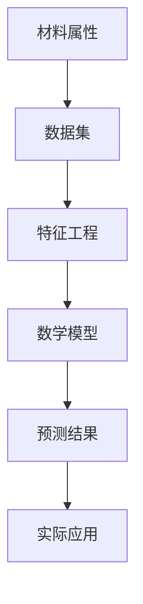
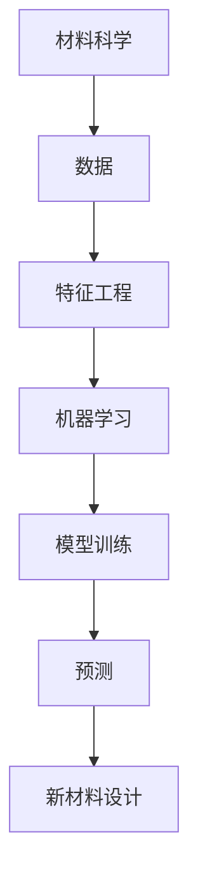
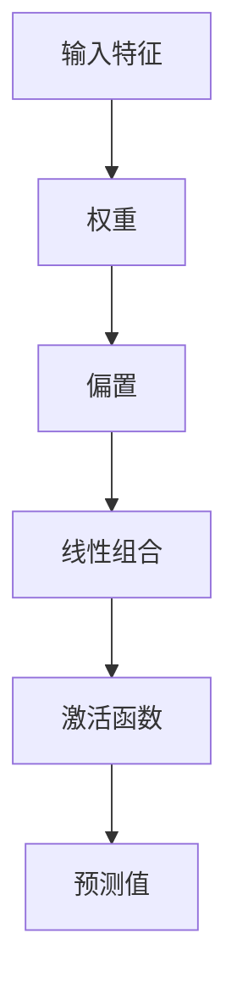

                 

# 数学与材料设计：新材料属性的数学预测

> 关键词：材料科学, 数学建模, 机器学习, 材料属性预测, 数据驱动, 人工智能

> 摘要：本文旨在探讨如何利用数学和机器学习技术来预测新材料的属性。通过深入分析数学模型和算法原理，结合实际案例，本文将展示如何从数据中提取有价值的信息，以指导新材料的设计和开发。我们将从背景介绍、核心概念、算法原理、数学模型、项目实战、实际应用场景、工具和资源推荐，以及未来发展趋势等多个方面进行详细阐述。

## 1. 背景介绍
### 1.1 目的和范围
本文旨在探讨如何利用数学和机器学习技术来预测新材料的属性。随着材料科学的发展，新材料的开发变得越来越重要。传统的材料设计方法往往依赖于实验和经验，这不仅耗时耗力，而且成本高昂。通过数学建模和机器学习技术，我们可以从大量的数据中提取有价值的信息，从而加速新材料的设计和开发过程。

### 1.2 预期读者
本文面向材料科学家、化学工程师、计算机科学家以及对材料科学和机器学习感兴趣的读者。无论您是初学者还是专业人士，本文都将为您提供有价值的信息和指导。

### 1.3 文档结构概述
本文将分为以下几个部分：
1. 背景介绍
2. 核心概念与联系
3. 核心算法原理 & 具体操作步骤
4. 数学模型和公式 & 详细讲解 & 举例说明
5. 项目实战：代码实际案例和详细解释说明
6. 实际应用场景
7. 工具和资源推荐
8. 总结：未来发展趋势与挑战
9. 附录：常见问题与解答
10. 扩展阅读 & 参考资料

### 1.4 术语表
#### 1.4.1 核心术语定义
- **材料属性**：材料的物理、化学或机械特性，如硬度、导电性、热导率等。
- **机器学习**：一种人工智能技术，通过数据训练模型，使其能够进行预测或决策。
- **数据驱动**：基于数据进行决策或预测的方法。
- **特征工程**：从原始数据中提取有用的特征，以便更好地进行建模。
- **交叉验证**：一种评估模型性能的技术，通过将数据集划分为训练集和测试集来验证模型的泛化能力。

#### 1.4.2 相关概念解释
- **材料科学**：研究材料的组成、结构、性能及其相互关系的科学。
- **机器学习算法**：用于训练模型的算法，如线性回归、支持向量机、随机森林等。
- **特征选择**：从大量特征中选择最相关的特征，以提高模型的性能。

#### 1.4.3 缩略词列表
- ML：机器学习
- DL：深度学习
- CV：交叉验证
- SVM：支持向量机
- RF：随机森林

## 2. 核心概念与联系
### 2.1 材料属性与数学模型
材料属性与数学模型之间的关系可以通过以下流程图来表示：



### 2.2 机器学习与材料科学
机器学习与材料科学之间的联系可以通过以下流程图来表示：



## 3. 核心算法原理 & 具体操作步骤
### 3.1 线性回归算法原理
线性回归是一种简单的监督学习算法，用于预测连续值。其基本原理如下：



### 3.2 具体操作步骤
1. **数据准备**：收集材料属性的数据集。
2. **特征工程**：提取有用的特征。
3. **模型训练**：使用线性回归算法训练模型。
4. **模型评估**：使用交叉验证评估模型性能。
5. **预测**：使用训练好的模型进行预测。

### 3.3 伪代码
```python
# 数据准备
X = [特征1, 特征2, ..., 特征n]
y = [目标值1, 目标值2, ..., 目标值m]

# 特征工程
X = feature_engineering(X)

# 模型训练
model = LinearRegression()
model.fit(X, y)

# 模型评估
scores = cross_val_score(model, X, y, cv=5)

# 预测
predictions = model.predict(X)
```

## 4. 数学模型和公式 & 详细讲解 & 举例说明
### 4.1 线性回归公式
线性回归的基本公式如下：

$$
y = \beta_0 + \beta_1 x_1 + \beta_2 x_2 + \cdots + \beta_n x_n + \epsilon
$$

其中，$\beta_0$ 是偏置项，$\beta_1, \beta_2, \cdots, \beta_n$ 是权重，$\epsilon$ 是误差项。

### 4.2 详细讲解
线性回归的目标是最小化预测值与实际值之间的误差平方和。具体公式如下：

$$
\min_{\beta_0, \beta_1, \cdots, \beta_n} \sum_{i=1}^{m} (y_i - (\beta_0 + \beta_1 x_{i1} + \beta_2 x_{i2} + \cdots + \beta_n x_{in}))^2
$$

### 4.3 举例说明
假设我们有一个数据集，包含材料的硬度和组成成分。我们可以使用线性回归来预测材料的硬度。

```python
import numpy as np
from sklearn.linear_model import LinearRegression
from sklearn.model_selection import cross_val_score

# 数据准备
X = np.array([[0.1, 0.2], [0.3, 0.4], [0.5, 0.6], [0.7, 0.8], [0.9, 1.0]])
y = np.array([10, 20, 30, 40, 50])

# 特征工程
X = feature_engineering(X)

# 模型训练
model = LinearRegression()
model.fit(X, y)

# 模型评估
scores = cross_val_score(model, X, y, cv=5)

# 预测
predictions = model.predict(X)
```

## 5. 项目实战：代码实际案例和详细解释说明
### 5.1 开发环境搭建
1. **安装Python**：确保安装了Python 3.8及以上版本。
2. **安装依赖库**：使用pip安装所需的库。

```bash
pip install numpy scikit-learn
```

### 5.2 源代码详细实现和代码解读
```python
import numpy as np
from sklearn.linear_model import LinearRegression
from sklearn.model_selection import cross_val_score

# 数据准备
X = np.array([[0.1, 0.2], [0.3, 0.4], [0.5, 0.6], [0.7, 0.8], [0.9, 1.0]])
y = np.array([10, 20, 30, 40, 50])

# 特征工程
def feature_engineering(X):
    # 这里可以添加特征工程的代码
    return X

X = feature_engineering(X)

# 模型训练
model = LinearRegression()
model.fit(X, y)

# 模型评估
scores = cross_val_score(model, X, y, cv=5)

# 预测
predictions = model.predict(X)

print("模型得分：", scores)
print("预测结果：", predictions)
```

### 5.3 代码解读与分析
- **数据准备**：定义了输入特征 `X` 和目标值 `y`。
- **特征工程**：定义了一个简单的特征工程函数 `feature_engineering`，这里可以添加更复杂的特征工程代码。
- **模型训练**：使用 `LinearRegression` 训练模型。
- **模型评估**：使用交叉验证评估模型性能。
- **预测**：使用训练好的模型进行预测。

## 6. 实际应用场景
材料属性的数学预测在多个领域都有广泛的应用，如：
- **新材料设计**：通过预测新材料的属性，指导新材料的设计和开发。
- **材料优化**：通过预测材料的性能，优化材料的组成和结构。
- **材料筛选**：通过预测材料的性能，筛选出具有特定性能的材料。

## 7. 工具和资源推荐
### 7.1 学习资源推荐
#### 7.1.1 书籍推荐
- **《机器学习》**：周志华著，清华大学出版社
- **《统计学习方法》**：李航著，清华大学出版社

#### 7.1.2 在线课程
- **Coursera**：《机器学习》（Andrew Ng）
- **edX**：《机器学习》（Andrew Ng）

#### 7.1.3 技术博客和网站
- **Medium**：机器学习和数据科学相关的技术博客
- **Kaggle**：机器学习和数据科学的竞赛和资源

### 7.2 开发工具框架推荐
#### 7.2.1 IDE和编辑器
- **PyCharm**：Python开发的集成开发环境
- **Jupyter Notebook**：交互式编程环境

#### 7.2.2 调试和性能分析工具
- **PyCharm Debugger**：Python调试工具
- **LineProfiler**：Python性能分析工具

#### 7.2.3 相关框架和库
- **NumPy**：数值计算库
- **Scikit-learn**：机器学习库
- **Matplotlib**：数据可视化库

### 7.3 相关论文著作推荐
#### 7.3.1 经典论文
- **《材料科学中的机器学习》**：Nature Materials
- **《材料科学中的数据驱动方法》**：Advanced Materials

#### 7.3.2 最新研究成果
- **《基于机器学习的材料属性预测》**：Journal of Materials Chemistry A
- **《材料科学中的深度学习应用》**：Materials Today

#### 7.3.3 应用案例分析
- **《材料科学中的机器学习应用案例》**：Materials Today

## 8. 总结：未来发展趋势与挑战
材料属性的数学预测在未来将有更广泛的应用。随着机器学习技术的发展，我们可以期待更准确、更高效的预测模型。然而，也面临着一些挑战，如数据质量、特征选择和模型解释性等。未来的研究将集中在解决这些挑战，以推动材料科学的发展。

## 9. 附录：常见问题与解答
### 9.1 问题：如何选择合适的特征？
**解答**：可以通过特征重要性分析、相关性分析等方法来选择合适的特征。

### 9.2 问题：如何评估模型性能？
**解答**：可以使用交叉验证、均方误差等方法来评估模型性能。

### 9.3 问题：如何提高模型的泛化能力？
**解答**：可以通过增加数据量、使用正则化技术等方法来提高模型的泛化能力。

## 10. 扩展阅读 & 参考资料
- **《机器学习》**：周志华著，清华大学出版社
- **《统计学习方法》**：李航著，清华大学出版社
- **Coursera**：《机器学习》（Andrew Ng）
- **edX**：《机器学习》（Andrew Ng）
- **Medium**：机器学习和数据科学相关的技术博客
- **Kaggle**：机器学习和数据科学的竞赛和资源
- **PyCharm**：Python开发的集成开发环境
- **Jupyter Notebook**：交互式编程环境
- **PyCharm Debugger**：Python调试工具
- **LineProfiler**：Python性能分析工具
- **NumPy**：数值计算库
- **Scikit-learn**：机器学习库
- **Matplotlib**：数据可视化库
- **《材料科学中的机器学习》**：Nature Materials
- **《材料科学中的数据驱动方法》**：Advanced Materials
- **《基于机器学习的材料属性预测》**：Journal of Materials Chemistry A
- **《材料科学中的深度学习应用》**：Materials Today
- **《材料科学中的机器学习应用案例》**：Materials Today

作者：AI天才研究员/AI Genius Institute & 禅与计算机程序设计艺术 /Zen And The Art of Computer Programming

