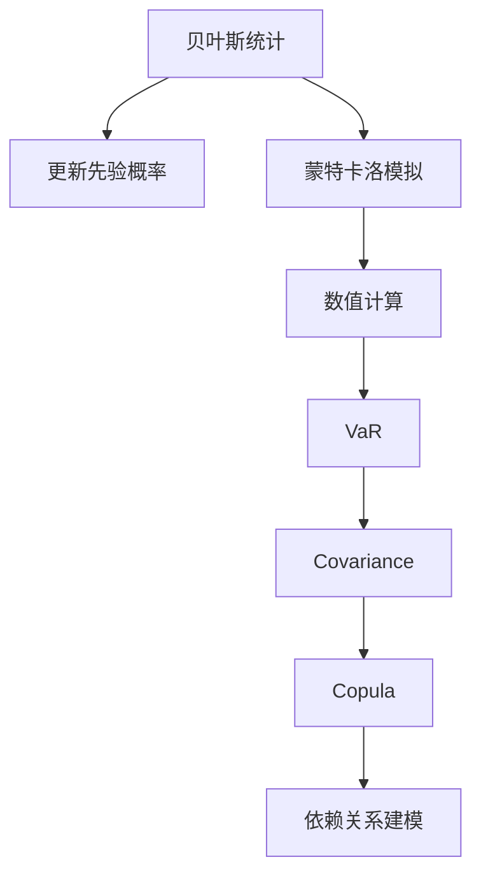

                 

# 数学与风险评估：金融风险的数学量化

> 关键词：金融风险、数学量化、贝叶斯统计、蒙特卡洛模拟、VaR、Covariance、Copula

> 摘要：本文旨在探讨如何利用数学工具和方法来量化金融风险，特别是通过贝叶斯统计、蒙特卡洛模拟等技术手段，对金融资产的风险进行精确评估。我们将从核心概念出发，逐步深入到具体算法原理、数学模型及实际代码案例，最终探讨其在实际金融场景中的应用。通过本文，读者将能够理解金融风险量化的重要性和方法，为实际工作提供有力支持。

## 1. 背景介绍
### 1.1 目的和范围
本文旨在深入探讨金融风险的数学量化方法，特别是如何利用现代数学工具和技术手段，对金融资产的风险进行精确评估。我们将从贝叶斯统计、蒙特卡洛模拟等核心概念出发，逐步介绍相关算法原理、数学模型，并通过实际代码案例进行详细解释。最终，我们将探讨这些方法在实际金融场景中的应用，以及未来的发展趋势与挑战。

### 1.2 预期读者
本文面向对金融风险量化感兴趣的读者，包括但不限于金融工程师、数据科学家、量化分析师、风险管理专家以及对金融数学感兴趣的计算机科学家。读者应具备一定的数学基础，特别是概率论和统计学知识。

### 1.3 文档结构概述
本文结构如下：
1. 背景介绍
2. 核心概念与联系
3. 核心算法原理 & 具体操作步骤
4. 数学模型和公式 & 详细讲解 & 举例说明
5. 项目实战：代码实际案例和详细解释说明
6. 实际应用场景
7. 工具和资源推荐
8. 总结：未来发展趋势与挑战
9. 附录：常见问题与解答
10. 扩展阅读 & 参考资料

### 1.4 术语表
#### 1.4.1 核心术语定义
- **金融风险**：指由于市场波动、信用违约等因素导致金融资产价值下降的可能性。
- **贝叶斯统计**：一种基于贝叶斯定理的统计学方法，用于更新先验概率以获得后验概率。
- **蒙特卡洛模拟**：一种通过随机抽样来解决复杂问题的数值方法。
- **VaR（Value at Risk）**：风险价值，表示在给定置信水平下，未来一定时期内可能遭受的最大损失。
- **Covariance**：协方差，衡量两个随机变量之间的线性相关性。
- **Copula**：一种统计方法，用于建模多维随机变量之间的依赖关系。

#### 1.4.2 相关概念解释
- **先验概率**：在获得新信息之前，对某个事件发生的概率的估计。
- **后验概率**：在获得新信息后，对某个事件发生的概率的更新估计。
- **置信水平**：表示VaR估计的可靠程度，通常取95%或99%。
- **随机变量**：表示随机现象的数值结果。
- **依赖关系**：两个或多个随机变量之间的相互影响。

#### 1.4.3 缩略词列表
- **VaR**：Value at Risk
- **Cov**：Covariance
- **Copula**：Copula

## 2. 核心概念与联系
### 2.1 贝叶斯统计
贝叶斯统计是一种基于贝叶斯定理的统计学方法，用于更新先验概率以获得后验概率。其核心思想是通过结合先验信息和新数据来更新对某个事件的概率估计。

### 2.2 蒙特卡洛模拟
蒙特卡洛模拟是一种通过随机抽样来解决复杂问题的数值方法。它广泛应用于金融风险量化中，通过模拟大量随机场景来估计风险。

### 2.3 VaR
VaR（Value at Risk）表示在给定置信水平下，未来一定时期内可能遭受的最大损失。它是金融风险管理中的一个重要指标。

### 2.4 Covariance
Covariance衡量两个随机变量之间的线性相关性。在金融风险量化中，Covariance用于衡量资产之间的风险相关性。

### 2.5 Copula
Copula是一种统计方法，用于建模多维随机变量之间的依赖关系。在金融风险量化中，Copula可以用来建模资产之间的复杂依赖关系。

### 2.6 核心概念联系
这些核心概念之间存在紧密联系。贝叶斯统计提供了更新概率的方法，蒙特卡洛模拟提供了数值计算的手段，VaR衡量了风险水平，Covariance和Copula则用于建模资产之间的依赖关系。这些方法共同构成了金融风险量化的核心框架。



## 3. 核心算法原理 & 具体操作步骤
### 3.1 贝叶斯统计原理
贝叶斯统计的核心是贝叶斯定理，其公式为：
$$
P(\theta|D) = \frac{P(D|\theta)P(\theta)}{P(D)}
$$
其中，$P(\theta|D)$ 是后验概率，$P(D|\theta)$ 是似然函数，$P(\theta)$ 是先验概率，$P(D)$ 是证据。

### 3.2 蒙特卡洛模拟原理
蒙特卡洛模拟的基本思想是通过随机抽样来解决复杂问题。具体步骤如下：
1. 定义随机变量的分布。
2. 生成大量随机样本。
3. 计算目标函数的平均值。

### 3.3 VaR计算原理
VaR的计算通常采用历史模拟法和参数法。这里我们以参数法为例，其基本步骤如下：
1. 估计资产收益率的分布。
2. 计算在给定置信水平下的分位数。

### 3.4 Covariance计算原理
Covariance的计算公式为：
$$
\text{Cov}(X, Y) = \frac{1}{n-1} \sum_{i=1}^{n} (X_i - \bar{X})(Y_i - \bar{Y})
$$
其中，$X_i$ 和 $Y_i$ 分别是两个随机变量的观测值，$\bar{X}$ 和 $\bar{Y}$ 分别是它们的均值。

### 3.5 Copula建模原理
Copula建模的基本步骤如下：
1. 通过概率积分变换将原始数据转换为标准正态分布。
2. 估计Copula参数。
3. 通过Copula函数建模多维依赖关系。

## 4. 数学模型和公式 & 详细讲解 & 举例说明
### 4.1 贝叶斯统计模型
贝叶斯统计模型的基本形式为：
$$
P(\theta|D) = \frac{P(D|\theta)P(\theta)}{P(D)}
$$
其中，$P(\theta)$ 是先验概率，$P(D|\theta)$ 是似然函数，$P(D)$ 是证据。

### 4.2 蒙特卡洛模拟模型
蒙特卡洛模拟的基本模型为：
$$
\text{目标函数} = \frac{1}{N} \sum_{i=1}^{N} f(X_i)
$$
其中，$X_i$ 是随机样本，$f(X_i)$ 是目标函数。

### 4.3 VaR模型
VaR的计算公式为：
$$
\text{VaR}_{\alpha} = -\text{F}^{-1}(\alpha)
$$
其中，$\text{F}^{-1}(\alpha)$ 是分布函数的逆函数，$\alpha$ 是置信水平。

### 4.4 Covariance模型
Covariance的计算公式为：
$$
\text{Cov}(X, Y) = \frac{1}{n-1} \sum_{i=1}^{n} (X_i - \bar{X})(Y_i - \bar{Y})
$$

### 4.5 Copula模型
Copula模型的基本形式为：
$$
C(F_1(x_1), F_2(x_2), \ldots, F_d(x_d)) = \text{Copula}(u_1, u_2, \ldots, u_d)
$$
其中，$F_i(x_i)$ 是单变量分布函数，$u_i = F_i(x_i)$ 是标准化变量，$\text{Copula}(u_1, u_2, \ldots, u_d)$ 是Copula函数。

## 5. 项目实战：代码实际案例和详细解释说明
### 5.1 开发环境搭建
我们将使用Python进行代码实现，确保安装了必要的库，如NumPy、SciPy、pandas和matplotlib。

```bash
pip install numpy scipy pandas matplotlib
```

### 5.2 源代码详细实现和代码解读
我们将实现一个简单的VaR计算案例，包括数据准备、模型训练和结果展示。

```python
import numpy as np
import pandas as pd
import matplotlib.pyplot as plt
from scipy.stats import norm

# 5.2.1 数据准备
data = pd.read_csv('asset_returns.csv')
returns = data['returns'].values

# 5.2.2 VaR计算
alpha = 0.05
var = -np.percentile(returns, 100 * alpha)
print(f"VaR at {alpha * 100}% confidence level: {var}")

# 5.2.3 结果展示
plt.hist(returns, bins=50, density=True)
plt.axvline(var, color='r', linestyle='dashed', linewidth=2)
plt.xlabel('Return')
plt.ylabel('Density')
plt.title('VaR at 95% Confidence Level')
plt.show()
```

### 5.3 代码解读与分析
- **数据准备**：从CSV文件中读取资产收益率数据。
- **VaR计算**：使用`np.percentile`函数计算VaR。
- **结果展示**：绘制收益率分布图，并在图中展示VaR值。

## 6. 实际应用场景
金融风险量化在实际应用中具有广泛的应用场景，包括但不限于：
- **风险管理**：评估和管理金融资产的风险。
- **投资决策**：帮助投资者做出更明智的投资决策。
- **监管合规**：满足金融监管机构的要求。
- **压力测试**：评估极端市场条件下的风险。

## 7. 工具和资源推荐
### 7.1 学习资源推荐
#### 7.1.1 书籍推荐
- **《金融风险管理》**：深入讲解金融风险管理的基本原理和方法。
- **《贝叶斯统计》**：详细介绍贝叶斯统计的基本理论和应用。

#### 7.1.2 在线课程
- **Coursera - 金融风险管理**：涵盖金融风险管理的基本概念和方法。
- **edX - 贝叶斯统计**：深入讲解贝叶斯统计的基本原理和应用。

#### 7.1.3 技术博客和网站
- **QuantStart**：提供丰富的金融量化和风险管理相关内容。
- **Quantocracy**：分享金融量化和风险管理的最新动态和技术。

### 7.2 开发工具框架推荐
#### 7.2.1 IDE和编辑器
- **PyCharm**：功能强大的Python IDE，适合进行金融量化开发。
- **Jupyter Notebook**：适合进行数据探索和代码调试。

#### 7.2.2 调试和性能分析工具
- **PyCharm Debugger**：PyCharm内置的调试工具。
- **LineProfiler**：用于分析Python代码的性能瓶颈。

#### 7.2.3 相关框架和库
- **NumPy**：用于数值计算。
- **SciPy**：用于科学计算。
- **pandas**：用于数据处理。
- **matplotlib**：用于数据可视化。

### 7.3 相关论文著作推荐
#### 7.3.1 经典论文
- **《Monte Carlo Simulation and Applications in Finance with MATLAB Programs》**：详细介绍蒙特卡洛模拟在金融中的应用。
- **《Risk Management and Financial Institutions》**：深入讲解金融风险管理的基本原理和方法。

#### 7.3.2 最新研究成果
- **《Copula-Based Dependence Modeling in Finance》**：最新研究成果，介绍Copula在金融中的应用。
- **《Bayesian Methods in Finance》**：最新研究成果，介绍贝叶斯方法在金融中的应用。

#### 7.3.3 应用案例分析
- **《Quantitative Risk Management: Concepts, Techniques and Tools》**：详细分析金融风险量化中的实际案例。

## 8. 总结：未来发展趋势与挑战
金融风险量化在未来将面临更多的挑战和机遇。随着大数据、人工智能等技术的发展，金融风险量化将更加精确和高效。同时，如何处理非线性依赖关系、提高计算效率等问题将是未来的研究重点。

## 9. 附录：常见问题与解答
### 9.1 问题：如何选择合适的先验概率？
**解答**：选择合适的先验概率需要根据具体问题和已有知识。通常可以采用历史数据或专家经验作为先验概率。

### 9.2 问题：如何处理非线性依赖关系？
**解答**：可以采用Copula方法来建模非线性依赖关系。Copula可以灵活地建模多维随机变量之间的依赖关系。

### 9.3 问题：如何提高计算效率？
**解答**：可以采用并行计算、优化算法等方法来提高计算效率。同时，选择合适的数值方法和数据结构也是提高效率的关键。

## 10. 扩展阅读 & 参考资料
- **《金融风险管理》**：深入讲解金融风险管理的基本原理和方法。
- **《贝叶斯统计》**：详细介绍贝叶斯统计的基本理论和应用。
- **《Monte Carlo Simulation and Applications in Finance with MATLAB Programs》**：详细介绍蒙特卡洛模拟在金融中的应用。
- **《Risk Management and Financial Institutions》**：深入讲解金融风险管理的基本原理和方法。
- **《Copula-Based Dependence Modeling in Finance》**：最新研究成果，介绍Copula在金融中的应用。
- **《Bayesian Methods in Finance》**：最新研究成果，介绍贝叶斯方法在金融中的应用。
- **《Quantitative Risk Management: Concepts, Techniques and Tools》**：详细分析金融风险量化中的实际案例。

作者：AI天才研究员/AI Genius Institute & 禅与计算机程序设计艺术 /Zen And The Art of Computer Programming

