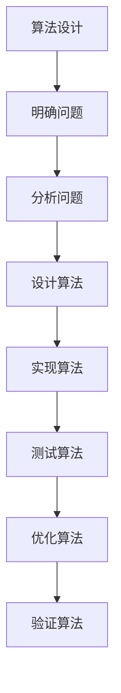

                 

# 数学史上的数学教育思想演变

> 关键词：数学教育、数学史、教育思想、数学模型、算法原理、教育技术

> 摘要：本文旨在探讨数学教育思想的历史演变，从古至今，数学教育经历了从直观到抽象、从经验到理论的转变。通过分析数学教育思想的发展脉络，我们可以更好地理解数学教育的本质，并为现代数学教育提供有价值的参考。本文将通过历史回顾、核心概念解析、算法原理、数学模型、实际案例、应用场景、工具推荐以及未来展望等多方面，全面探讨数学教育思想的演变。

## 1. 背景介绍
### 1.1 目的和范围
本文旨在探讨数学教育思想的历史演变，从古至今，数学教育经历了从直观到抽象、从经验到理论的转变。通过分析数学教育思想的发展脉络，我们可以更好地理解数学教育的本质，并为现代数学教育提供有价值的参考。

### 1.2 预期读者
本文适合数学教育工作者、教育技术专家、计算机科学家、数学爱好者以及对数学教育感兴趣的读者。

### 1.3 文档结构概述
本文将从数学教育思想的历史演变入手，逐步深入探讨数学教育的核心概念、算法原理、数学模型、实际案例、应用场景、工具推荐以及未来发展趋势。最后，我们将总结数学教育思想的演变，并提出未来的发展方向和挑战。

### 1.4 术语表
#### 1.4.1 核心术语定义
- **数学教育**：指通过教学活动培养学生的数学思维能力和解决问题的能力。
- **直观教学**：通过直观的图形、实物等手段进行教学。
- **抽象教学**：通过符号、公式等抽象手段进行教学。
- **经验教学**：通过实际操作和实验进行教学。
- **理论教学**：通过理论知识和逻辑推理进行教学。
- **数学模型**：用数学语言描述现实问题的抽象表达。
- **算法原理**：解决问题的方法和步骤。
- **数学史**：数学发展的历史过程。

#### 1.4.2 相关概念解释
- **数学教育思想**：指在数学教育过程中所遵循的原则和方法。
- **教育技术**：利用现代信息技术手段进行教学的方法和工具。

#### 1.4.3 缩略词列表
- **IDE**：Integrated Development Environment（集成开发环境）
- **API**：Application Programming Interface（应用程序编程接口）

## 2. 核心概念与联系
### 2.1 直观教学
直观教学是数学教育的早期形式，通过直观的图形、实物等手段进行教学。直观教学有助于学生建立初步的数学概念和直观感受。

### 2.2 抽象教学
抽象教学是数学教育的高级形式，通过符号、公式等抽象手段进行教学。抽象教学有助于学生建立系统的数学知识体系。

### 2.3 经验教学
经验教学是通过实际操作和实验进行教学，有助于学生通过实践理解数学概念。

### 2.4 理论教学
理论教学是通过理论知识和逻辑推理进行教学，有助于学生建立系统的数学理论体系。

### 2.5 数学模型
数学模型是用数学语言描述现实问题的抽象表达，是数学教育的重要工具。

### 2.6 算法原理
算法原理是解决问题的方法和步骤，是数学教育的核心内容之一。

### 2.7 数学史
数学史是数学发展的历史过程，是理解数学教育思想演变的重要背景。

## 3. 核心算法原理 & 具体操作步骤
### 3.1 算法原理
算法原理是解决问题的方法和步骤。在数学教育中，算法原理是培养学生逻辑思维能力的重要手段。

### 3.2 具体操作步骤


## 4. 数学模型和公式 & 详细讲解 & 举例说明
### 4.1 数学模型
数学模型是用数学语言描述现实问题的抽象表达。例如，线性方程组可以用来描述物理系统中的平衡状态。

### 4.2 公式
数学公式是数学模型的重要组成部分。例如，勾股定理可以表示为：$a^2 + b^2 = c^2$。

### 4.3 详细讲解
数学模型和公式是数学教育的核心内容之一，通过数学模型和公式，学生可以更好地理解数学概念和解决问题的方法。

### 4.4 举例说明
#### 4.4.1 例子1：勾股定理
勾股定理是数学中的一个重要定理，可以表示为：$a^2 + b^2 = c^2$。通过勾股定理，我们可以计算直角三角形的边长。

#### 4.4.2 例子2：线性方程组
线性方程组可以用来描述物理系统中的平衡状态。例如，两个物体在水平面上的平衡状态可以用线性方程组表示。

## 5. 项目实战：代码实际案例和详细解释说明
### 5.1 开发环境搭建
为了实现数学模型和算法，我们需要搭建一个开发环境。这里以Python为例，安装必要的库和工具。

```bash
pip install numpy matplotlib sympy
```

### 5.2 源代码详细实现和代码解读
```python
import numpy as np
import matplotlib.pyplot as plt
from sympy import symbols, Eq, solve

# 定义符号
a, b, c = symbols('a b c')

# 勾股定理
equation = Eq(a**2 + b**2, c**2)

# 解方程
solution = solve(equation, c)

# 打印解
print(solution)
```

### 5.3 代码解读与分析
上述代码实现了勾股定理的求解。首先，我们定义了符号变量a、b和c。然后，我们定义了勾股定理的方程。最后，我们使用`solve`函数求解方程，并打印解。

## 6. 实际应用场景
数学模型和算法在许多实际应用场景中都有广泛的应用。例如，在物理学中，我们可以使用数学模型来描述物理系统的平衡状态；在工程学中，我们可以使用数学模型来优化设计；在经济学中，我们可以使用数学模型来预测市场趋势。

## 7. 工具和资源推荐
### 7.1 学习资源推荐
#### 7.1.1 书籍推荐
- 《数学之美》
- 《数学分析》
- 《线性代数及其应用》

#### 7.1.2 在线课程
- Coursera上的《数学思维导论》
- edX上的《线性代数》

#### 7.1.3 技术博客和网站
- Math Stack Exchange
- Khan Academy

### 7.2 开发工具框架推荐
#### 7.2.1 IDE和编辑器
- PyCharm
- VS Code

#### 7.2.2 调试和性能分析工具
- PyCharm的调试工具
- Python的cProfile模块

#### 7.2.3 相关框架和库
- NumPy
- SciPy
- Matplotlib

### 7.3 相关论文著作推荐
#### 7.3.1 经典论文
- Courant, R., & Robbins, H. (1941). What is Mathematics? An Elementary Approach to Ideas and Methods.

#### 7.3.2 最新研究成果
- Tao, T. (2020). An Introduction to Measure Theory.

#### 7.3.3 应用案例分析
- Strogatz, S. H. (2019). Infinite Powers: How Calculus Reveals the Secrets of the Universe.

## 8. 总结：未来发展趋势与挑战
数学教育思想的演变是一个不断发展的过程。未来，数学教育将更加注重培养学生的创新能力和实践能力。同时，随着信息技术的发展，数学教育将更加注重利用现代信息技术手段进行教学。然而，数学教育也面临着一些挑战，例如如何平衡理论教学和实践教学，如何提高学生的数学兴趣等。

## 9. 附录：常见问题与解答
### 9.1 问题1：如何提高学生的数学兴趣？
- 答案：可以通过引入有趣的数学问题和实际应用场景，激发学生的学习兴趣。

### 9.2 问题2：如何平衡理论教学和实践教学？
- 答案：可以通过引入实际问题和实验，让学生在实践中理解理论知识。

## 10. 扩展阅读 & 参考资料
- Courant, R., & Robbins, H. (1941). What is Mathematics? An Elementary Approach to Ideas and Methods.
- Strogatz, S. H. (2019). Infinite Powers: How Calculus Reveals the Secrets of the Universe.
- Tao, T. (2020). An Introduction to Measure Theory.

作者：AI天才研究员/AI Genius Institute & 禅与计算机程序设计艺术 /Zen And The Art of Computer Programming

