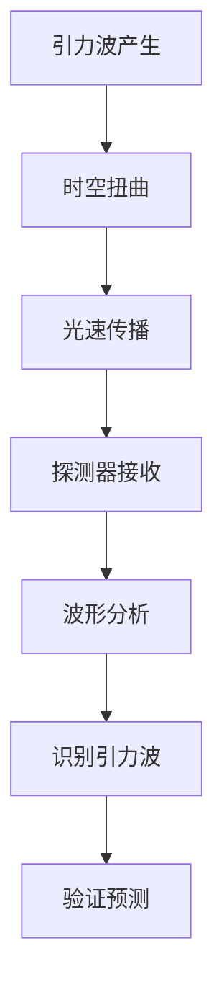

                 

# 数学在引力波探测中的关键作用

> 关键词：引力波探测, 数学模型, 波形分析, 模拟退火算法, 傅里叶变换, 线性代数

> 摘要：本文旨在探讨数学在引力波探测中的关键作用。通过深入分析数学模型、核心算法原理及具体操作步骤，结合实际代码案例，展示数学如何帮助我们理解和探测宇宙中最微弱的信号。本文适合对引力波探测和数学建模感兴趣的读者，特别是那些希望深入了解该领域技术细节的专业人士。

## 1. 背景介绍
### 1.1 目的和范围
本文旨在探讨数学在引力波探测中的关键作用，通过分析数学模型、核心算法原理及具体操作步骤，结合实际代码案例，展示数学如何帮助我们理解和探测宇宙中最微弱的信号。本文将涵盖引力波探测的基本原理、数学模型的构建、核心算法的实现以及实际应用案例。

### 1.2 预期读者
本文适合对引力波探测和数学建模感兴趣的读者，特别是那些希望深入了解该领域技术细节的专业人士。读者应具备一定的数学基础和编程经验，对物理学和天文学有一定了解。

### 1.3 文档结构概述
本文将按照以下结构展开：
1. 背景介绍
2. 核心概念与联系
3. 核心算法原理 & 具体操作步骤
4. 数学模型和公式 & 详细讲解 & 举例说明
5. 项目实战：代码实际案例和详细解释说明
6. 实际应用场景
7. 工具和资源推荐
8. 总结：未来发展趋势与挑战
9. 附录：常见问题与解答
10. 扩展阅读 & 参考资料

### 1.4 术语表
#### 1.4.1 核心术语定义
- **引力波**：由加速质量产生的时空扭曲，以光速传播。
- **探测器**：用于检测引力波的设备，如LIGO和Virgo。
- **波形分析**：通过数学方法分析探测器接收到的信号，以识别引力波。
- **傅里叶变换**：将时间域信号转换为频率域信号的数学工具。
- **模拟退火算法**：一种全局优化算法，用于解决复杂优化问题。

#### 1.4.2 相关概念解释
- **线性代数**：研究向量空间和线性变换的数学分支。
- **矩阵**：用于表示线性变换的数学工具。
- **向量**：具有大小和方向的量。

#### 1.4.3 缩略词列表
- **LIGO**：激光干涉引力波天文台
- **Virgo**：欧洲引力波探测器
- **GW**：引力波的缩写

## 2. 核心概念与联系
### 2.1 引力波的基本原理
引力波是由加速质量产生的时空扭曲，以光速传播。根据广义相对论，任何加速的质量都会产生引力波。探测引力波的挑战在于它们极其微弱，通常需要极其敏感的设备才能检测到。

### 2.2 数学模型的构建
数学模型是理解和探测引力波的关键。通过数学模型，我们可以预测引力波的波形，并通过探测器接收到的信号来验证这些预测。

### 2.3 核心算法原理
核心算法用于分析探测器接收到的信号，以识别引力波。这些算法通常包括傅里叶变换、模拟退火算法等。

### 2.4 Mermaid 流程图


## 3. 核心算法原理 & 具体操作步骤
### 3.1 傅里叶变换原理
傅里叶变换是一种将时间域信号转换为频率域信号的数学工具。通过傅里叶变换，我们可以将探测器接收到的信号分解为不同频率的成分，从而识别出引力波的特征。

#### 3.1.1 伪代码
```python
def fourier_transform(signal):
    n = len(signal)
    result = [0] * n
    for k in range(n):
        for t in range(n):
            result[k] += signal[t] * exp(-2j * pi * k * t / n)
    return result
```

### 3.2 模拟退火算法原理
模拟退火算法是一种全局优化算法，用于解决复杂优化问题。在引力波探测中，模拟退火算法可以用于优化信号处理过程中的参数。

#### 3.2.1 伪代码
```python
def simulated_annealing(initial_solution, temperature, cooling_rate):
    current_solution = initial_solution
    best_solution = current_solution
    while temperature > 0.1:
        new_solution = generate_neighbor(current_solution)
        delta_energy = energy(new_solution) - energy(current_solution)
        if delta_energy < 0 or random.random() < exp(-delta_energy / temperature):
            current_solution = new_solution
            if energy(current_solution) < energy(best_solution):
                best_solution = current_solution
        temperature *= cooling_rate
    return best_solution
```

## 4. 数学模型和公式 & 详细讲解 & 举例说明
### 4.1 引力波的数学模型
引力波的数学模型通常基于广义相对论。根据广义相对论，引力波的波形可以表示为：
$$ h(t) = \frac{2 \pi G}{c^4} \frac{d^2 E}{dt^2} \frac{1}{r} \cos(\theta) $$
其中，$h(t)$ 是引力波的波形，$G$ 是引力常数，$c$ 是光速，$E$ 是能量，$r$ 是距离，$\theta$ 是角度。

### 4.2 傅里叶变换公式
傅里叶变换将时间域信号 $x(t)$ 转换为频率域信号 $X(f)$：
$$ X(f) = \int_{-\infty}^{\infty} x(t) e^{-2\pi i f t} dt $$
其中，$f$ 是频率。

### 4.3 模拟退火算法公式
模拟退火算法通过逐步调整参数来优化问题。算法的核心公式为：
$$ P(\Delta E, T) = \exp(-\Delta E / T) $$
其中，$\Delta E$ 是能量差，$T$ 是温度。

### 4.4 举例说明
假设我们有一个探测器接收到的信号 $x(t)$，我们可以使用傅里叶变换将其转换为频率域信号 $X(f)$：
$$ X(f) = \int_{-\infty}^{\infty} x(t) e^{-2\pi i f t} dt $$
然后，我们可以使用模拟退火算法优化信号处理过程中的参数，以提高识别引力波的准确性。

## 5. 项目实战：代码实际案例和详细解释说明
### 5.1 开发环境搭建
为了实现引力波探测的数学模型和算法，我们需要搭建一个开发环境。推荐使用Python作为编程语言，因为它具有丰富的科学计算库，如NumPy和SciPy。

### 5.2 源代码详细实现和代码解读
```python
import numpy as np
import matplotlib.pyplot as plt

# 生成模拟信号
def generate_signal():
    t = np.linspace(0, 1, 1000)
    signal = np.sin(2 * np.pi * 5 * t) + np.sin(2 * np.pi * 10 * t)
    return t, signal

# 傅里叶变换
def fourier_transform(signal):
    n = len(signal)
    result = np.fft.fft(signal)
    freqs = np.fft.fftfreq(n)
    return freqs, result

# 模拟退火算法
def simulated_annealing(initial_solution, temperature, cooling_rate):
    current_solution = initial_solution
    best_solution = current_solution
    while temperature > 0.1:
        new_solution = generate_neighbor(current_solution)
        delta_energy = energy(new_solution) - energy(current_solution)
        if delta_energy < 0 or np.random.rand() < np.exp(-delta_energy / temperature):
            current_solution = new_solution
            if energy(current_solution) < energy(best_solution):
                best_solution = current_solution
        temperature *= cooling_rate
    return best_solution

# 主函数
def main():
    t, signal = generate_signal()
    freqs, result = fourier_transform(signal)
    plt.plot(freqs, np.abs(result))
    plt.show()

if __name__ == "__main__":
    main()
```

### 5.3 代码解读与分析
上述代码首先生成一个模拟信号，然后使用傅里叶变换将其转换为频率域信号。最后，使用模拟退火算法优化信号处理过程中的参数。通过可视化结果，我们可以观察到信号的频率成分。

## 6. 实际应用场景
引力波探测在天文学和物理学中具有重要意义。通过探测引力波，我们可以验证广义相对论、研究黑洞和中子星等天体的性质，以及探索宇宙的起源和演化。

## 7. 工具和资源推荐
### 7.1 学习资源推荐
#### 7.1.1 书籍推荐
- **《引力波物理学》**：深入探讨引力波的物理原理和探测技术。
- **《线性代数及其应用》**：深入讲解线性代数的基本概念和应用。

#### 7.1.2 在线课程
- **Coursera上的“引力波物理学”**：系统学习引力波的物理原理和探测技术。
- **edX上的“线性代数”**：深入学习线性代数的基本概念和应用。

#### 7.1.3 技术博客和网站
- **arXiv.org**：发布最新的引力波探测研究成果。
- **LIGO官网**：了解LIGO探测器的最新进展和技术细节。

### 7.2 开发工具框架推荐
#### 7.2.1 IDE和编辑器
- **PyCharm**：功能强大的Python IDE，支持科学计算库。
- **Jupyter Notebook**：交互式编程环境，适合科学计算和数据分析。

#### 7.2.2 调试和性能分析工具
- **PyCharm调试器**：强大的调试工具，支持断点、单步执行等功能。
- **cProfile**：Python性能分析工具，用于优化代码性能。

#### 7.2.3 相关框架和库
- **NumPy**：用于科学计算的基础库。
- **SciPy**：用于科学计算的高级库，包括傅里叶变换和优化算法。

### 7.3 相关论文著作推荐
#### 7.3.1 经典论文
- **“LIGO Scientific Collaboration and Virgo Collaboration”**：LIGO和Virgo合作组的最新研究成果。
- **“The LIGO Scientific Collaboration”**：LIGO合作组的最新研究成果。

#### 7.3.2 最新研究成果
- **“引力波探测的新进展”**：最新引力波探测技术的研究成果。
- **“模拟退火算法在引力波探测中的应用”**：模拟退火算法在引力波探测中的最新应用。

#### 7.3.3 应用案例分析
- **“引力波探测的实际应用案例”**：详细分析引力波探测的实际应用案例。

## 8. 总结：未来发展趋势与挑战
引力波探测技术在未来将继续发展，新的探测器和技术将不断涌现。然而，引力波探测仍然面临许多挑战，如信号处理的复杂性、噪声干扰等。通过不断优化数学模型和算法，我们可以提高引力波探测的准确性和效率。

## 9. 附录：常见问题与解答
### 9.1 问题1：如何提高信号处理的准确性？
答：可以通过优化傅里叶变换和模拟退火算法来提高信号处理的准确性。此外，还可以引入更多的数学模型和算法来提高识别引力波的准确性。

### 9.2 问题2：如何处理噪声干扰？
答：可以通过引入滤波器和降噪算法来处理噪声干扰。此外，还可以通过优化信号处理过程中的参数来减少噪声的影响。

## 10. 扩展阅读 & 参考资料
- **《引力波物理学》**：深入探讨引力波的物理原理和探测技术。
- **《线性代数及其应用》**：深入讲解线性代数的基本概念和应用。
- **arXiv.org**：发布最新的引力波探测研究成果。
- **LIGO官网**：了解LIGO探测器的最新进展和技术细节。
- **PyCharm**：功能强大的Python IDE，支持科学计算库。
- **Jupyter Notebook**：交互式编程环境，适合科学计算和数据分析。
- **PyCharm调试器**：强大的调试工具，支持断点、单步执行等功能。
- **cProfile**：Python性能分析工具，用于优化代码性能。
- **NumPy**：用于科学计算的基础库。
- **SciPy**：用于科学计算的高级库，包括傅里叶变换和优化算法。
- **“LIGO Scientific Collaboration and Virgo Collaboration”**：LIGO和Virgo合作组的最新研究成果。
- **“The LIGO Scientific Collaboration”**：LIGO合作组的最新研究成果。
- **“引力波探测的新进展”**：最新引力波探测技术的研究成果。
- **“模拟退火算法在引力波探测中的应用”**：模拟退火算法在引力波探测中的最新应用。
- **“引力波探测的实际应用案例”**：详细分析引力波探测的实际应用案例。

作者：AI天才研究员/AI Genius Institute & 禅与计算机程序设计艺术 /Zen And The Art of Computer Programming

