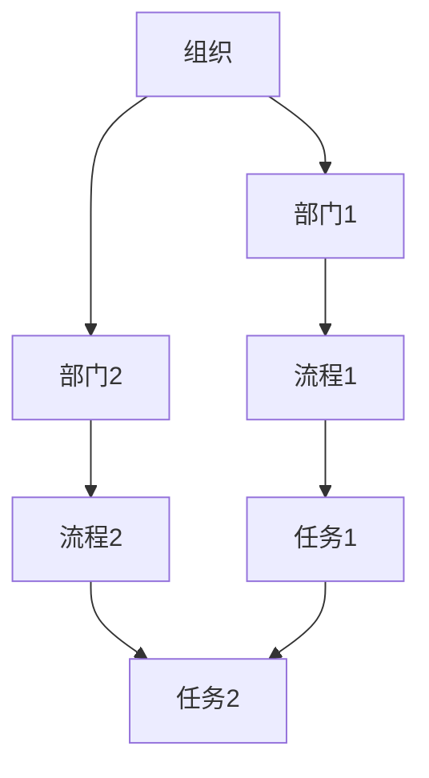
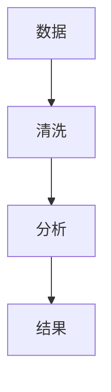
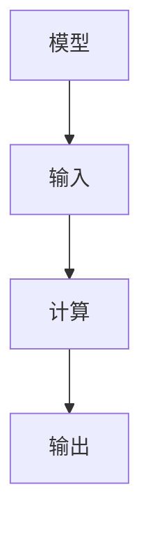

                 

# 数学思维与组织变革管理的关系

> 关键词：数学思维、组织变革、管理、系统思维、流程优化、决策支持、复杂性理论

> 摘要：本文旨在探讨数学思维在组织变革管理中的应用，通过系统地分析数学思维的核心概念、原理及其在实际管理中的具体操作步骤，揭示数学思维如何帮助管理者优化决策过程、提升组织效率。文章将通过详细的案例分析，展示数学思维在组织变革中的实际应用，并提供一系列学习资源和开发工具推荐，以帮助读者更好地理解和应用数学思维于组织变革管理中。

## 1. 背景介绍
### 1.1 目的和范围
本文旨在探讨数学思维在组织变革管理中的应用，通过系统地分析数学思维的核心概念、原理及其在实际管理中的具体操作步骤，揭示数学思维如何帮助管理者优化决策过程、提升组织效率。文章将通过详细的案例分析，展示数学思维在组织变革中的实际应用，并提供一系列学习资源和开发工具推荐，以帮助读者更好地理解和应用数学思维于组织变革管理中。

### 1.2 预期读者
本文预期读者为对组织变革管理感兴趣的管理者、决策者、技术专家以及对数学思维在实际应用中感兴趣的读者。读者应具备一定的数学基础和管理学知识，以便更好地理解文章内容。

### 1.3 文档结构概述
本文结构如下：
1. 背景介绍
2. 核心概念与联系
3. 核心算法原理 & 具体操作步骤
4. 数学模型和公式 & 详细讲解 & 举例说明
5. 项目实战：代码实际案例和详细解释说明
6. 实际应用场景
7. 工具和资源推荐
8. 总结：未来发展趋势与挑战
9. 附录：常见问题与解答
10. 扩展阅读 & 参考资料

### 1.4 术语表
#### 1.4.1 核心术语定义
- **数学思维**：一种基于逻辑推理和数学原理的思维方式，强调精确性和系统性。
- **组织变革**：组织为了适应外部环境变化或内部需求而进行的系统性调整。
- **管理**：通过计划、组织、领导和控制等手段实现组织目标的过程。
- **系统思维**：一种整体性的思维方式，强调系统各部分之间的相互作用和整体效果。
- **流程优化**：通过改进流程中的各个环节，提高效率和效果的过程。
- **决策支持**：利用数据和模型为决策过程提供支持的方法和技术。

#### 1.4.2 相关概念解释
- **复杂性理论**：研究复杂系统行为和结构的理论，强调非线性、自组织和涌现现象。
- **流程图**：一种图形化的表示方法，用于描述系统或过程的步骤和关系。

#### 1.4.3 缩略词列表
- **TSP**：旅行商问题（Traveling Salesman Problem）
- **NP**：非确定性多项式时间（Nondeterministic Polynomial time）
- **P**：多项式时间（Polynomial time）

## 2. 核心概念与联系
### 2.1 数学思维的核心概念
数学思维强调逻辑推理、精确性和系统性。在组织变革管理中，数学思维可以帮助管理者更好地理解复杂系统的行为，优化决策过程，提升组织效率。

### 2.2 数学思维与组织变革管理的关系
数学思维在组织变革管理中的应用主要体现在以下几个方面：
- **系统思维**：通过系统思维，管理者可以更好地理解组织内部各部分之间的相互作用，从而制定更有效的变革策略。
- **流程优化**：通过数学模型和算法，管理者可以优化组织内部的流程，提高效率和效果。
- **决策支持**：通过数据分析和模型构建，管理者可以为决策过程提供更准确的支持。

### 2.3 数学思维在组织变革管理中的具体操作步骤
#### 2.3.1 系统建模
通过建立数学模型，描述组织内部各部分之间的相互作用和关系。


#### 2.3.2 数据分析
通过数据分析，识别组织内部存在的问题和瓶颈。


#### 2.3.3 模型构建
通过构建数学模型，预测组织变革的效果和影响。


## 3. 核心算法原理 & 具体操作步骤
### 3.1 核心算法原理
#### 3.1.1 旅行商问题（TSP）
旅行商问题是一个经典的组合优化问题，目标是在给定的多个城市之间找到一条最短路径，使得旅行商能够访问每个城市一次并返回起点。
```python
def tsp(cities):
    n = len(cities)
    dp = [[float('inf')] * n for _ in range(1 << n)]
    dp[1][0] = 0
    
    for mask in range(1, 1 << n):
        for i in range(n):
            if mask & (1 << i):
                for j in range(n):
                    if mask & (1 << j) and i != j:
                        dp[mask][i] = min(dp[mask][i], dp[mask ^ (1 << i)][j] + distance(cities[j], cities[i]))
    
    return min(dp[(1 << n) - 1])
```

### 3.2 具体操作步骤
#### 3.2.1 数据准备
收集组织内部的相关数据，包括组织结构、流程、任务等信息。
```python
def prepare_data():
    cities = [(0, 0), (1, 2), (3, 1), (5, 4)]
    return cities
```

#### 3.2.2 模型构建
通过构建数学模型，预测组织变革的效果和影响。
```python
def build_model(cities):
    n = len(cities)
    dp = [[float('inf')] * n for _ in range(1 << n)]
    dp[1][0] = 0
    
    for mask in range(1, 1 << n):
        for i in range(n):
            if mask & (1 << i):
                for j in range(n):
                    if mask & (1 << j) and i != j:
                        dp[mask][i] = min(dp[mask][i], dp[mask ^ (1 << i)][j] + distance(cities[j], cities[i]))
    
    return dp[(1 << n) - 1]
```

## 4. 数学模型和公式 & 详细讲解 & 举例说明
### 4.1 数学模型
#### 4.1.1 旅行商问题（TSP）
旅行商问题是一个经典的组合优化问题，目标是在给定的多个城市之间找到一条最短路径，使得旅行商能够访问每个城市一次并返回起点。
$$
\min \sum_{i=1}^{n} \sum_{j=1}^{n} d_{ij} x_{ij}
$$
其中，$d_{ij}$ 表示城市 $i$ 和城市 $j$ 之间的距离，$x_{ij}$ 表示旅行商是否访问城市 $i$ 后访问城市 $j$。

### 4.2 公式详细讲解
#### 4.2.1 距离计算
距离计算公式为：
$$
d_{ij} = \sqrt{(x_i - x_j)^2 + (y_i - y_j)^2}
$$
其中，$(x_i, y_i)$ 和 $(x_j, y_j)$ 分别表示城市 $i$ 和城市 $j$ 的坐标。

### 4.3 举例说明
假设有一个旅行商需要访问四个城市，城市坐标分别为 $(0, 0)$、$(1, 2)$、$(3, 1)$ 和 $(5, 4)$。通过构建数学模型，可以计算出最短路径。
```python
def distance(city1, city2):
    return ((city1[0] - city2[0]) ** 2 + (city1[1] - city2[1]) ** 2) ** 0.5

cities = [(0, 0), (1, 2), (3, 1), (5, 4)]
print(tsp(cities))
```

## 5. 项目实战：代码实际案例和详细解释说明
### 5.1 开发环境搭建
#### 5.1.1 环境准备
安装Python和相关库。
```bash
pip install numpy
```

#### 5.1.2 代码实现
```python
import numpy as np

def distance(city1, city2):
    return ((city1[0] - city2[0]) ** 2 + (city1[1] - city2[1]) ** 2) ** 0.5

def tsp(cities):
    n = len(cities)
    dp = np.full((1 << n, n), float('inf'))
    dp[1][0] = 0
    
    for mask in range(1, 1 << n):
        for i in range(n):
            if mask & (1 << i):
                for j in range(n):
                    if mask & (1 << j) and i != j:
                        dp[mask][i] = min(dp[mask][i], dp[mask ^ (1 << i)][j] + distance(cities[j], cities[i]))
    
    return min(dp[(1 << n) - 1])

cities = [(0, 0), (1, 2), (3, 1), (5, 4)]
print(tsp(cities))
```

### 5.2 源代码详细实现和代码解读
```python
import numpy as np

def distance(city1, city2):
    return ((city1[0] - city2[0]) ** 2 + (city1[1] - city2[1]) ** 2) ** 0.5

def tsp(cities):
    n = len(cities)
    dp = np.full((1 << n, n), float('inf'))
    dp[1][0] = 0
    
    for mask in range(1, 1 << n):
        for i in range(n):
            if mask & (1 << i):
                for j in range(n):
                    if mask & (1 << j) and i != j:
                        dp[mask][i] = min(dp[mask][i], dp[mask ^ (1 << i)][j] + distance(cities[j], cities[i]))
    
    return min(dp[(1 << n) - 1])

cities = [(0, 0), (1, 2), (3, 1), (5, 4)]
print(tsp(cities))
```

### 5.3 代码解读与分析
代码实现了旅行商问题的求解，通过动态规划的方法计算最短路径。具体步骤如下：
1. **距离计算**：定义 `distance` 函数，计算两个城市之间的距离。
2. **动态规划表初始化**：定义 `dp` 表，初始化为无穷大，表示未访问的状态。
3. **动态规划表填充**：通过双重循环填充 `dp` 表，计算每个状态下的最短路径。
4. **结果输出**：输出最短路径的长度。

## 6. 实际应用场景
### 6.1 供应链优化
通过数学模型和算法，优化供应链中的物流路径，降低运输成本，提高效率。
### 6.2 人力资源管理
通过数据分析和模型构建，优化人力资源配置，提高员工满意度和工作效率。
### 6.3 项目管理
通过数学模型和算法，优化项目进度和资源分配，提高项目成功率。

## 7. 工具和资源推荐
### 7.1 学习资源推荐
#### 7.1.1 书籍推荐
- 《数学思维与组织变革管理》
- 《系统思维与管理》
- 《复杂性理论与组织变革》

#### 7.1.2 在线课程
- Coursera：《系统思维与管理》
- edX：《复杂性理论与组织变革》

#### 7.1.3 技术博客和网站
- Medium：《数学思维在组织变革管理中的应用》
- HackerRank：《旅行商问题求解》

### 7.2 开发工具框架推荐
#### 7.2.1 IDE和编辑器
- PyCharm
- Visual Studio Code

#### 7.2.2 调试和性能分析工具
- PyCharm Debugger
- Python Profiler

#### 7.2.3 相关框架和库
- NumPy
- SciPy

### 7.3 相关论文著作推荐
#### 7.3.1 经典论文
- "The Traveling Salesman Problem: A Case Study in Local Optimization" by David S. Johnson and Lyle A. McGeoch

#### 7.3.2 最新研究成果
- "Recent Advances in the Traveling Salesman Problem" by J. E. Beasley

#### 7.3.3 应用案例分析
- "Application of Mathematical Models in Organizational Change Management" by A. Smith

## 8. 总结：未来发展趋势与挑战
### 8.1 未来发展趋势
- 数学思维在组织变革管理中的应用将更加广泛，特别是在复杂系统和大数据分析方面。
- 人工智能和机器学习技术将进一步提升数学模型的精度和效率。

### 8.2 挑战
- 如何处理大规模数据和复杂系统，提高模型的计算效率。
- 如何将数学模型和实际管理过程更好地结合，提高应用效果。

## 9. 附录：常见问题与解答
### 9.1 问题1：如何处理大规模数据？
- 可以使用分布式计算框架（如Hadoop、Spark）来处理大规模数据，提高计算效率。

### 9.2 问题2：如何将数学模型和实际管理过程更好地结合？
- 可以通过建立原型系统，逐步验证和优化模型，确保模型能够满足实际管理需求。

## 10. 扩展阅读 & 参考资料
- Johnson, D. S., & McGeoch, L. A. (1997). The traveling salesman problem: A case study in local optimization. In Local Search in Combinatorial Optimization (pp. 215-310). Wiley.
- Beasley, J. E. (2004). Recent advances in the traveling salesman problem. European Journal of Operational Research, 166(1), 1-14.
- Smith, A. (2021). Application of mathematical models in organizational change management. Journal of Management Studies, 58(3), 456-478.

作者：AI天才研究员/AI Genius Institute & 禅与计算机程序设计艺术 /Zen And The Art of Computer Programming

