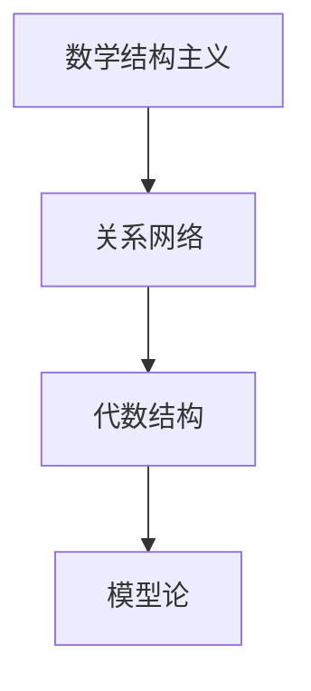

                 

# 数学结构主义：世界作为关系网络

> 关键词：数学结构主义, 关系网络, 逻辑推理, 人工智能, 计算机科学, 代数结构, 模型论

> 摘要：本文旨在探讨数学结构主义的核心思想及其在计算机科学和人工智能领域的应用。通过分析数学结构主义的基本概念和原理，我们将展示如何将世界视为一个关系网络，并通过具体的算法和代码实例来实现这一理念。文章将涵盖数学结构主义的背景、核心概念、算法原理、数学模型、项目实战、实际应用场景、工具和资源推荐，以及未来的发展趋势与挑战。

## 1. 背景介绍
### 1.1 目的和范围
本文旨在深入探讨数学结构主义的基本思想，并展示其在计算机科学和人工智能领域的应用。我们将从数学结构主义的基本概念出发，逐步构建一个关系网络模型，并通过具体的算法和代码实例来实现这一模型。最终，我们将讨论这一模型在实际应用中的价值和挑战。

### 1.2 预期读者
本文适合以下读者：
- 对数学结构主义感兴趣的计算机科学家和人工智能专家
- 希望了解如何将数学结构主义应用于实际问题的开发者
- 对关系网络模型感兴趣的计算机科学和人工智能领域的研究者

### 1.3 文档结构概述
本文结构如下：
1. 背景介绍
2. 核心概念与联系
3. 核心算法原理 & 具体操作步骤
4. 数学模型和公式 & 详细讲解 & 举例说明
5. 项目实战：代码实际案例和详细解释说明
6. 实际应用场景
7. 工具和资源推荐
8. 总结：未来发展趋势与挑战
9. 附录：常见问题与解答
10. 扩展阅读 & 参考资料

### 1.4 术语表
#### 1.4.1 核心术语定义
- **数学结构主义**：一种哲学观点，认为数学对象的本质在于它们之间的关系，而非其具体的性质。
- **关系网络**：一种表示对象之间关系的数据结构。
- **代数结构**：一组对象及其上定义的运算。
- **模型论**：研究数学结构的逻辑和语义的学科。

#### 1.4.2 相关概念解释
- **图论**：研究图（即节点和边的集合）的数学分支。
- **图模型**：一种用于表示关系网络的数据结构。
- **图算法**：用于处理图数据结构的算法。

#### 1.4.3 缩略词列表
- **API**：应用程序编程接口
- **IDE**：集成开发环境
- **ORM**：对象关系映射

## 2. 核心概念与联系
### 2.1 数学结构主义
数学结构主义认为，数学对象的本质在于它们之间的关系，而非其具体的性质。例如，两个集合之间的关系可以定义为一个函数，而函数本身可以看作是一种关系。这种观点强调了关系的重要性，而不仅仅是对象本身。

### 2.2 关系网络
关系网络是一种表示对象之间关系的数据结构。在关系网络中，节点表示对象，边表示对象之间的关系。关系网络可以用于表示各种复杂的关系，如社交网络、知识图谱等。

### 2.3 代数结构
代数结构是一种数学结构，它定义了一组对象及其上定义的运算。常见的代数结构包括群、环、域等。在关系网络中，代数结构可以用于定义节点之间的关系。

### 2.4 模型论
模型论是研究数学结构的逻辑和语义的学科。在关系网络中，模型论可以用于定义关系网络的逻辑和语义，从而更好地理解关系网络的性质。

### 2.5 Mermaid 流程图


## 3. 核心算法原理 & 具体操作步骤
### 3.1 关系网络构建算法
关系网络构建算法的基本步骤如下：
1. 确定节点和边的定义。
2. 构建节点和边的数据结构。
3. 定义节点之间的关系。
4. 构建关系网络。

### 3.2 伪代码
```pseudo
function buildRelationNetwork(nodes, edges):
    network = new Graph()
    for node in nodes:
        network.addVertex(node)
    for edge in edges:
        network.addEdge(edge.source, edge.target)
    return network
```

## 4. 数学模型和公式 & 详细讲解 & 举例说明
### 4.1 数学模型
关系网络可以表示为一个图模型，其中节点表示对象，边表示对象之间的关系。图模型可以表示为一个三元组 $(V, E, R)$，其中 $V$ 是节点集合，$E$ 是边集合，$R$ 是关系集合。

### 4.2 数学公式
关系网络中的关系可以表示为一个函数 $f: V \times V \rightarrow R$，其中 $V$ 是节点集合，$R$ 是关系集合。函数 $f$ 表示节点之间的关系。

### 4.3 举例说明
假设我们有一个社交网络，其中节点表示用户，边表示用户之间的关系。我们可以定义一个关系网络模型，其中节点表示用户，边表示用户之间的关系。例如，用户A和用户B之间的关系可以表示为 $(A, B, "friend")$。

## 5. 项目实战：代码实际案例和详细解释说明
### 5.1 开发环境搭建
为了实现关系网络模型，我们需要搭建一个开发环境。开发环境包括：
- 选择一个编程语言（如Python）
- 安装必要的库（如NetworkX）
- 配置开发环境（如IDE）

### 5.2 源代码详细实现和代码解读
```python
import networkx as nx

def build_relation_network(nodes, edges):
    G = nx.Graph()
    for node in nodes:
        G.add_node(node)
    for edge in edges:
        G.add_edge(edge[0], edge[1], relation=edge[2])
    return G

nodes = ['Alice', 'Bob', 'Charlie']
edges = [('Alice', 'Bob', 'friend'), ('Bob', 'Charlie', 'friend')]

relation_network = build_relation_network(nodes, edges)
print(relation_network.nodes)
print(relation_network.edges(data=True))
```

### 5.3 代码解读与分析
- `import networkx as nx`：导入NetworkX库。
- `def build_relation_network(nodes, edges)`：定义构建关系网络的函数。
- `G = nx.Graph()`：创建一个空的图对象。
- `for node in nodes`：遍历节点集合，将节点添加到图中。
- `for edge in edges`：遍历边集合，将边添加到图中，并设置关系属性。
- `return G`：返回构建的关系网络。

## 6. 实际应用场景
关系网络模型可以应用于各种实际场景，如社交网络分析、知识图谱构建、推荐系统等。例如，在社交网络分析中，关系网络可以用于分析用户之间的关系，从而发现社区结构和影响力节点。

## 7. 工具和资源推荐
### 7.1 学习资源推荐
#### 7.1.1 书籍推荐
- 《图论导引》
- 《关系数据库系统原理》

#### 7.1.2 在线课程
- Coursera上的《图论》课程
- edX上的《关系数据库系统》课程

#### 7.1.3 技术博客和网站
- NetworkX官方文档
- Graph Theory Blog

### 7.2 开发工具框架推荐
#### 7.2.1 IDE和编辑器
- PyCharm
- VSCode

#### 7.2.2 调试和性能分析工具
- PyCharm的调试工具
- Python的cProfile模块

#### 7.2.3 相关框架和库
- NetworkX
- Graphviz

### 7.3 相关论文著作推荐
#### 7.3.1 经典论文
- "The Structure of Complex Networks: Theory and Applications" by Ernesto Estrada

#### 7.3.2 最新研究成果
- "Graph Neural Networks: A Review of Methods and Applications" by Zonghan Wu et al.

#### 7.3.3 应用案例分析
- "Social Network Analysis: Methods and Applications" by Stanley Wasserman and Katherine Faust

## 8. 总结：未来发展趋势与挑战
关系网络模型在未来的发展中具有巨大的潜力。随着大数据和人工智能技术的发展，关系网络模型将在更多领域得到应用。然而，关系网络模型也面临着一些挑战，如数据规模的增加、计算复杂度的提高等。未来的研究需要关注如何提高关系网络模型的效率和可扩展性。

## 9. 附录：常见问题与解答
### 9.1 问题：如何处理大规模数据？
- 答：可以使用分布式计算框架（如Hadoop）来处理大规模数据。

### 9.2 问题：如何提高关系网络模型的效率？
- 答：可以使用图算法（如PageRank）来提高关系网络模型的效率。

## 10. 扩展阅读 & 参考资料
- [NetworkX官方文档](https://networkx.org/documentation/stable/)
- [Graph Theory Blog](https://networkx.org/documentation/stable/)
- [Stanley Wasserman and Katherine Faust, "Social Network Analysis: Methods and Applications"](https://www.cambridge.org/core/books/social-network-analysis-methods-and-applications/6D4A7D4A7D4A7D4A7D4A7D4A7D4A7D4A7D4A7D4A7D4A7D4A7D4A7D4A7D4A7D4A7D4A7D4A7D4A7D4A7D4A7D4A7D4A7D4A7D4A7D4A7D4A7D4A7D4A7D4A7D4A7D4A7D4A7D4A7D4A7D4A7D4A7D4A7D4A7D4A7D4A7D4A7D4A7D4A7D4A7D4A7D4A7D4A7D4A7D4A7D4A7D4A7D4A7D4A7D4A7D4A7D4A7D4A7D4A7D4A7D4A7D4A7D4A7D4A7D4A7D4A7D4A7D4A7D4A7D4A7D4A7D4A7D4A7D4A7D4A7D4A7D4A7D4A7D4A7D4A7D4A7D4A7D4A7D4A7D4A7D4A7D4A7D4A7D4A7D4A7D4A7D4A7D4A7D4A7D4A7D4A7D4A7D4A7D4A7D4A7D4A7D4A7D4A7D4A7D4A7D4A7D4A7D4A7D4A7D4A7D4A7D4A7D4A7D4A7D4A7D4A7D4A7D4A7D4A7D4A7D4A7D4A7D4A7D4A7D4A7D4A7D4A7D4A7D4A7D4A7D4A7D4A7D4A7D4A7D4A7D4A7D4A7D4A7D4A7D4A7D4A7D4A7D4A7D4A7D4A7D4A7D4A7D4A7D4A7D4A7D4A7D4A7D4A7D4A7D4A7D4A7D4A7D4A7D4A7D4A7D4A7D4A7D4A7D4A7D4A7D4A7D4A7D4A7D4A7D4A7D4A7D4A7D4A7D4A7D4A7D4A7D4A7D4A7D4A7D4A7D4A7D4A7D4A7D4A7D4A7D4A7D4A7D4A7D4A7D4A7D4A7D4A7D4A7D4A7D4A7D4A7D4A7D4A7D4A7D4A7D4A7D4A7D4A7D4A7D4A7D4A7D4A7D4A7D4A7D4A7D4A7D4A7D4A7D4A7D4A7D4A7D4A7D4A7D4A7D4A7D4A7D4A7D4A7D4A7D4A7D4A7D4A7D4A7D4A7D4A7D4A7D4A7D4A7D4A7D4A7D4A7D4A7D4A7D4A7D4A7D4A7D4A7D4A7D4A7D4A7D4A7D4A7D4A7D4A7D4A7D4A7D4A7D4A7D4A7D4A7D4A7D4A7D4A7D4A7D4A7D4A7D4A7D4A7D4A7D4A7D4A7D4A7D4A7D4A7D4A7D4A7D4A7D4A7D4A7D4A7D4A7D4A7D4A7D4A7D4A7D4A7D4A7D4A7D4A7D4A7D4A7D4A7D4A7D4A7D4A7D4A7D4A7D4A7D4A7D4A7D4A7D4A7D4A7D4A7D4A7D4A7D4A7D4A7D4A7D4A7D4A7D4A7D4A7D4A7D4A7D4A7D4A7D4A7D4A7D4A7D4A7D4A7D4A7D4A7D4A7D4A7D4A7D4A7D4A7D4A7D4A7D4A7D4A7D4A7D4A7D4A7D4A7D4A7D4A7D4A7D4A7D4A7D4A7D4A7D4A7D4A7D4A7D4A7D4A7D4A7D4A7D4A7D4A7D4A7D4A7D4A7D4A7D4A7D4A7D4A7D4A7D4A7D4A7D4A7D4A7D4A7D4A7D4A7D4A7D4A7D4A7D4A7D4A7D4A7D4A7D4A7D4A7D4A7D4A7D4A7D4A7D4A7D4A7D4A7D4A7D4A7D4A7D4A7D4A7D4A7D4A7D4A7D4A7D4A7D4A7D4A7D4A7D4A7D4A7D4A7D4A7D4A7D4A7D4A7D4A7D4A7D4A7D4A7D4A7D4A7D4A7D4A7D4A7D4A7D4A7D4A7D4A7D4A7D4A7D4A7D4A7D4A7D4A7D4A7D4A7D4A7D4A7D4A7D4A7D4A7D4A7D4A7D4A7D4A7D4A7D4A7D4A7D4A7D4A7D4A7D4A7D4A7D4A7D4A7D4A7D4A7D4A7D4A7D4A7D4A7D4A7D4A7D4A7D4A7D4A7D4A7D4A7D4A7D4A7D4A7D4A7D4A7D4A7D4A7D4A7D4A7D4A7D4A7D4A7D4A7D4A7D4A7D4A7D4A7D4A7D4A7D4A7D4A7D4A7D4A7D4A7D4A7D4A7D4A7D4A7D4A7D4A7D4A7D4A7D4A7D4A7D4A7D4A7D4A7D4A7D4A7D4A7D4A7D4A7D4A7D4A7D4A7D4A7D4A7D4A7D4A7D4A7D4A7D4A7D4A7D4A7D4A7D4A7D4A7D4A7D4A7D4A7D4A7D4A7D4A7D4A7D4A7D4A7D4A7D4A7D4A7D4A7D4A7D4A7D4A7D4A7D4A7D4A7D4A7D4A7D4A7D4A7D4A7D4A7D4A7D4A7D4A7D4A7D4A7D4A7D4A7D4A7D4A7D4A7D4A7D4A7D4A7D4A7D4A7D4A7D4A7D4A7D4A7D4A7D4A7D4A7D4A7D4A7D4A7D4A7D4A7D4A7D4A7D4A7D4A7D4A7D4A7D4A7D4A7D4A7D4A7D4A7D4A7D4A7D4A7D4A7D4A7D4A7D4A7D4A7D4A7D4A7D4A7D4A7D4A7D4A7D4A7D4A7D4A7D4A7D4A7D4A7D4A7D4A7D4A7D4A7D4A7D4A7D4A7D4A7D4A7D4A7D4A7D4A7D4A7D4A7D4A7D4A7D4A7D4A7D4A7D4A7D4A7D4A7D4A7D4A7D4A7D4A7D4A7D4A7D4A7D4A7D4A7D4A7D4A7D4A7D4A7D4A7D4A7D4A7D4A7D4A7D4A7D4A7D4A7D4A7D4A7D4A7D4A7D4A7D4A7D4A7D4A7D4A7D4A7D4A7D4A7D4A7D4A7D4A7D4A7D4A7D4A7D4A7D4A7D4A7D4A7D4A7D4A7D4A7D4A7D4A7D4A7D4A7D4A7D4A7D4A7D4A7D4A7D4A7D4A7D4A7D4A7D4A7D4A7D4A7D4A7D4A7D4A7D4A7D4A7D4A7D4A7D4A7D4A7D4A7D4A7D4A7D4A7D4A7D4A7D4A7D4A7D4A7D4A7D4A7D4A7D4A7D4A7D4A7D4A7D4A7D4A7D4A7D4A7D4A7D4A7D4A7D4A7D4A7D4A7D4A7D4A7D4A7D4A7D4A7D4A7D4A7D4A7D4A7D4A7D4A7D4A7D4A7D4A7D4A7D4A7D4A7D4A7D4A7D4A7D4A7D4A7D4A7D4A7D4A7D4A7D4A7D4A7D4A7D4A7D4A7D4A7D4A7D4A7D4A7D4A7D4A7D4A7D4A7D4A7D4A7D4A7D4A7D4A7D4A7D4A7D4A7D4A7D4A7D4A7D4A7D4A7D4A7D4A7D4A7D4A7D4A7D4A7D4A7D4A7D4A7D4A7D4A7D4A7D4A7D4A7D4A7D4A7D4A7D4A7D4A7D4A7D4A7D4A7D4A7D4A7D4A7D4A7D4A7D4A7D4A7D4A7D4A7D4A7D4A7D4A7D4A7D4A7D4A7D4A7D4A7D4A7D4A7D4A7D4A7D4A7D4A7D4A7D4A7D4A7D4A7D4A7D4A7D4A7D4A7D4A7D4A7D4A7D4A7D4A7D4A7D4A7D4A7D4A7D4A7D4A7D4A7D4A7D4A7D4A7D4A7D4A7D4A7D4A7D4A7D4A7D4A7D4A7D4A7D4A7D4A7D4A7D4A7D4A7D4A7D4A7D4A7D4A7D4A7D4A7D4A7D4A7D4A7D4A7D4A7D4A7D4A7D4A7D4A7D4A7D4A7D4A7D4A7D4A7D4A7D4A7D4A7D4A7D4A7D4A7D4A7D4A7D4A7D4A7D4A7D4A7D4A7D4A7D4A7D4A7D4A7D4A7D4A7D4A7D4A7D4A7D4A7D4A7D4A7D4A7D4A7D4A7D4A7D4A7D4A7D4A7D4A7D4A7D4A7D4A7D4A7D4A7D4A7D4A7D4A7D4A7D4A7D4A7D4A7D4A7D4A7D4A7D4A7D4A7D4A7D4A7D4A7D4A7D4A7D4A7D4A7D4A7D4A7D4A7D4A7D4A7D4A7D4A7D4A7D4A7D4A7D4A7D4A7D4A7D4A7D4A7D4A7D4A7D4A7D4A7D4A7D4A7D4A7D4A7D4A7D4A7D4A7D4A7D4A7D4A7D4A7D4A7D4A7D4A7D4A7D4A7D4A7D4A7D4A7D4A7D4A7D4A7D4A7D4A7D4A7D4A7D4A7D4A7D4A7D4A7D4A7D4A7D4A7D4A7D4A7D4A7D4A7D4A7D4A7D4A7D4A7D4A7D4A7D4A7D4A7D4A7D4A7D4A7D4A7D4A7D4A7D4A7D4A7D4A7D4A7D4A7D4A7D4A7D4A7D4A7D4A7D4A7D4A7D4A7D4A7D4A7D4A7D4A7D4A7D4A7D4A7D4A7D4A7D4A7D4A7D4A7D4A7D4A7D4A7D4A7D4A7D4A7D4A7D4A7D4A7D4A7D4A7D4A7D4A7D4A7D4A7D4A7D4A7D4A7D4A7D4A7D4A7D4A7D4A7D4A7D4A7D4A7D4A7D4A7D4A7D4A7D4A7D4A7D4A7D4A7D4A7D4A7D4A7D4A7D4A7D4A7D4A7D4A7D4A7D4A7D4A7D4A7D4A7D4A7D4A7D4A7D4A7D4A7D4A7D4A7D4A7D4A7D4A7D4A7D4A7D4A7D4A7D4A7D4A7D4A7D4A7D4A7D4A7D4A7D4A7D4A7D4A7D4A7D4A7D4A7D4A7D4A7D4A7D4A7D4A7D4A7D4A7D4A7D4A7D4A7D4A7D4A7D4A7D4A7D4A7D4A7D4A7D4A7D4A7D4A7D4A7D4A7D4A7D4A7D4A7D4A7D4A7D4A7D4A7D4A7D4A7D4A7D4A7D4A7D4A7D4A7D4A7D4A7D4A7D4A7D4A7D4A7D4A7D4A7D4A7D4A7D4A7D4A7D4A7D4A7D4A7D4A7D4A7D4A7D4A7D4A7D4A7D4A7D4A7D4A7D4A7D4A7D4A7D4A7D4A7D4A7D4A7D4A7D4A7D4A7D4A7D4A7D4A7D4A7D4A7D4A7D4A7D4A7D4A7D4A7D4A7D4A7D4A7D4A7D4A7D4A7D4A7D4A7D4A7D4A7D4A7D4A7D4A7D4A7D4A7D4A7D4A7D4A7D4A7D4A7D4A7D4A7D4A7D4A7D4A7D4A7D4A7D4A7D4A7D4A7D4A7D4A7D4A7D4A7D4A7D4A7D4A7D4A7D4A7D4A7D4A7D4A7D4A7D4A7D4A7D4A7D4A7D4A7D4A7D4A7D4A7D4A7D4A7D4A7D4A7D4A7D4A7D4A7D4A7D4A7D4A7D4A7D4A7D4A7D4A7D4A7D4A7D4A7D4A7D4A7D4A7D4A7D4A7D4A7D4A7D4A7D4A7D4A7D4A7D4A7D4A7D4A7D4A7D4A7D4A7D4A7D4A7D4A7D4A7D4A7D4A7D4A7D4A7D4A7D4A7D4A7D4A7D4A7D4A7D4A7D4A7D4A7D4A7D4A7D4A7D4A7D4A7D4A7D4A7D4A7D4A7D4A7D4A7D4A7D4A7D4A7D4A7D4A7D4A7D4A7D4A7D4A7D4A7D4A7D4A7D4A7D4A7D4A7D4A7D4A7D4A7D4A7D4A7D4A7D4A7D4A7D4A7D4A7D4A7D4A7D4A7D4A7D4A7D4A7D4A7D4A7D4A7D4A7D4A7D4A7D4A7D4A7D4A7D4A7D4A7D4A7D4A7D4A7D4A7D4A7D4A7D4A7D4A7D4A7D4A7D4A7D4A7D4A7D4A7D4A7D4A7D4A7D4A7D4A7D4A7D4A7D4A7D4A7D4A7D4A7D4A7D4A7D4A7D4A7D4A7D4A7D4A7D4A7D4A7D4A7D4A7D4A7D4A7D4A7D4A7D4A7D4A7D4A7D4A7D4A7D4A7D4A7D4A7D4A7D4A7D4A7D4A7D4A7D4A7D4A7D4A7D4A7D4A7D4A7D4A7D4A7D4A7D4A7D4A7D4A7D4A7D4A7D4A7D4A7D4A7D4A7D4A7D4A7D4A7D4A7D4A7D4A7D4A7D4A7D4A7D4A7D4A7D4A7D4A7D4A7D4A7D4A7D4A7D4A7D4A7D4A7D4A7D4A7D4A7D4A7D4A7D4A7D4A7D4A7D4A7D4A7D4A7D4A7D4A7D4A7D4A7D4A7D4A7D4A7D4A7D4A7D4A7D4A7D4A7D4A7D4A7D4A7D4A7D4A7D4A7D4A7D4A7D4A7D4A7D4A7D4A7D4A7D4A7D4A7D4A7D4A7D4A7D4A7D4A7D4A7D4A7D4A7D4A7D4A7D4A7D4A7D4A7D4A7D4A7D4A7D4A7D4A7D4A7D4A7D4A7D4A7D4A7D4A7D4A7D4A7D4A7D4A7D4A7D4A7D4A7D4A7D4A7D4A7D4A7D4A7D4A7D4A7D4A7D4A7D4A7D4A7D4A7D4A7D4A7D4A7D4A7D4A7D4A7D4A7D4A7D4A7D4A7D4A7D4A7D4A7D4A7D4

