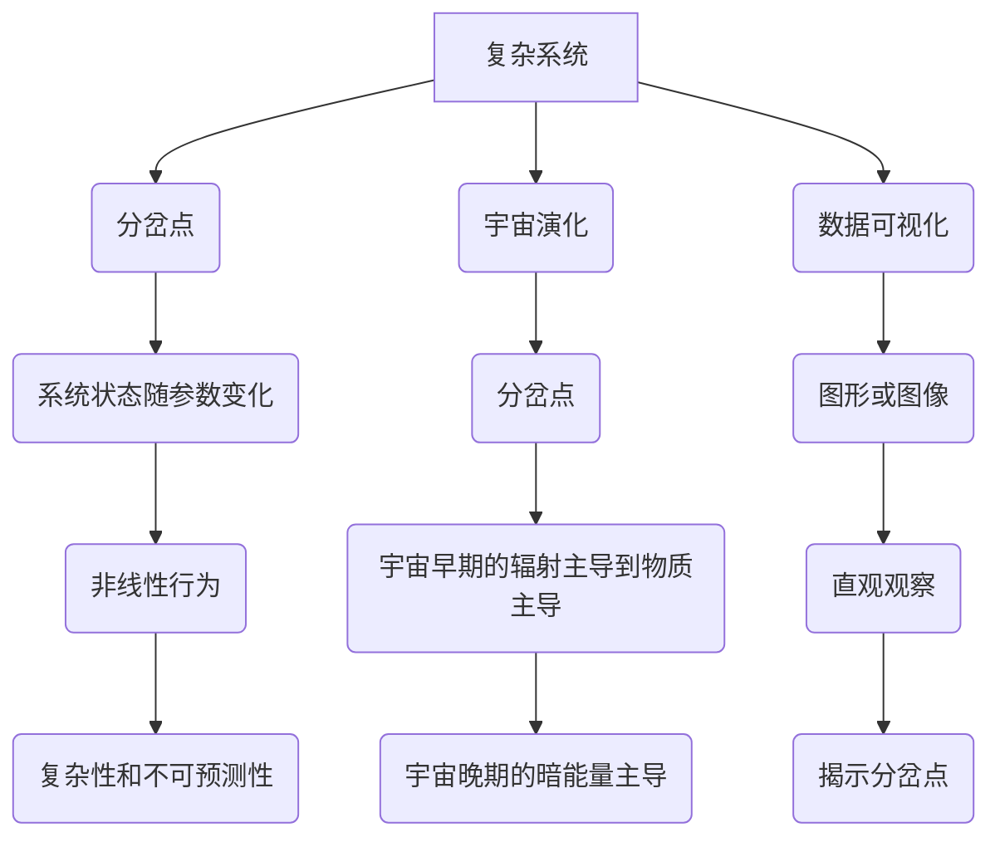

                 

# 数据可视化在呈现宇宙演化分岔点中的作用

> 关键词：数据可视化, 宇宙演化, 分岔点, 复杂系统, 混沌理论, 信息熵, 时空结构

> 摘要：本文旨在探讨数据可视化在揭示宇宙演化过程中分岔点的关键作用。通过深入分析复杂系统中的分岔点，我们能够更好地理解宇宙的演化过程。本文将从背景介绍、核心概念与联系、核心算法原理与具体操作步骤、数学模型与公式、项目实战、实际应用场景、工具和资源推荐、总结与未来发展趋势、附录等几个方面进行详细阐述。

## 1. 背景介绍
### 1.1 目的和范围
本文旨在探讨数据可视化在揭示宇宙演化过程中分岔点的关键作用。通过深入分析复杂系统中的分岔点，我们能够更好地理解宇宙的演化过程。本文将从背景介绍、核心概念与联系、核心算法原理与具体操作步骤、数学模型与公式、项目实战、实际应用场景、工具和资源推荐、总结与未来发展趋势、附录等几个方面进行详细阐述。

### 1.2 预期读者
本文预期读者为对宇宙演化、复杂系统、数据可视化等领域感兴趣的科研人员、工程师、学生以及对相关技术感兴趣的爱好者。

### 1.3 文档结构概述
本文结构如下：
1. 背景介绍
2. 核心概念与联系
3. 核心算法原理 & 具体操作步骤
4. 数学模型和公式 & 详细讲解 & 举例说明
5. 项目实战：代码实际案例和详细解释说明
6. 实际应用场景
7. 工具和资源推荐
8. 总结：未来发展趋势与挑战
9. 附录：常见问题与解答
10. 扩展阅读 & 参考资料

### 1.4 术语表
#### 1.4.1 核心术语定义
- **分岔点**：在复杂系统中，系统状态随参数变化而发生突变的点。
- **宇宙演化**：宇宙从大爆炸到现在的演化过程。
- **数据可视化**：将数据转换为图形或图像，以便更好地理解和分析数据的过程。
- **混沌理论**：研究非线性系统中复杂行为的理论。
- **信息熵**：衡量系统不确定性的度量。
- **时空结构**：描述宇宙中时间和空间关系的结构。

#### 1.4.2 相关概念解释
- **复杂系统**：由大量相互作用的组件组成的系统，表现出非线性、自组织和涌现等特性。
- **时空结构**：描述宇宙中时间和空间关系的结构，包括宇宙的大尺度结构和微观结构。
- **混沌理论**：研究非线性系统中复杂行为的理论，揭示了系统在某些参数下的不稳定性和不可预测性。

#### 1.4.3 缩略词列表
- **API**：应用程序编程接口
- **IDE**：集成开发环境
- **GPU**：图形处理单元
- **HPC**：高性能计算
- **NLP**：自然语言处理
- **PaaS**：平台即服务
- **SaaS**：软件即服务

## 2. 核心概念与联系
### 2.1 复杂系统中的分岔点
在复杂系统中，分岔点是系统状态随参数变化而发生突变的点。这些分岔点可以揭示系统在不同参数下的行为模式，帮助我们理解系统的演化过程。分岔点的出现通常伴随着系统的非线性行为，这使得系统表现出复杂性和不可预测性。

### 2.2 宇宙演化中的分岔点
宇宙演化是一个复杂的过程，涉及从大爆炸到现在的各种物理现象。在宇宙演化过程中，分岔点可以揭示宇宙在不同阶段的行为模式。例如，在宇宙早期，宇宙经历了从辐射主导到物质主导的转变，这一转变可以被视为一个分岔点。在宇宙晚期，暗能量的主导地位可能导致宇宙加速膨胀，这也是一种分岔点。

### 2.3 数据可视化在揭示分岔点中的作用
数据可视化可以帮助我们更好地理解复杂系统中的分岔点。通过将数据转换为图形或图像，我们可以直观地观察到系统在不同参数下的行为模式，从而揭示分岔点的存在。数据可视化还可以帮助我们发现系统中的模式和趋势，从而更好地理解系统的演化过程。

### 2.4 核心概念原理与架构的 Mermaid 流程图


## 3. 核心算法原理 & 具体操作步骤
### 3.1 核心算法原理
在揭示分岔点的过程中，我们通常使用数值模拟和数据分析的方法。数值模拟可以帮助我们模拟复杂系统的行为，从而揭示分岔点的存在。数据分析则可以帮助我们从大量数据中发现模式和趋势，从而更好地理解系统的演化过程。

### 3.2 具体操作步骤
1. **数据收集**：收集关于复杂系统和宇宙演化的数据。
2. **数据预处理**：对数据进行清洗和标准化，以便更好地进行分析。
3. **数值模拟**：使用数值模拟方法模拟复杂系统的行为，从而揭示分岔点的存在。
4. **数据分析**：使用数据分析方法从大量数据中发现模式和趋势，从而更好地理解系统的演化过程。
5. **数据可视化**：将数据转换为图形或图像，以便更好地理解和分析数据。

### 3.3 伪代码示例
```python
# 数据收集
data = collect_data()

# 数据预处理
cleaned_data = preprocess_data(data)

# 数值模拟
simulation_results = simulate_system(cleaned_data)

# 数据分析
analysis_results = analyze_data(simulation_results)

# 数据可视化
visualize_results(analysis_results)
```

## 4. 数学模型和公式 & 详细讲解 & 举例说明
### 4.1 数学模型
在揭示分岔点的过程中，我们通常使用数学模型来描述复杂系统的行为。这些数学模型可以是微分方程、差分方程或其他类型的方程。通过这些数学模型，我们可以更好地理解系统的演化过程。

### 4.2 公式与详细讲解
1. **微分方程**：描述系统随时间变化的行为。
2. **差分方程**：描述系统随离散时间变化的行为。
3. **信息熵**：衡量系统不确定性的度量。
4. **时空结构**：描述宇宙中时间和空间关系的结构。

### 4.3 举例说明
假设我们有一个简单的微分方程模型，描述了一个复杂系统的演化过程：
$$
\frac{dx}{dt} = f(x, t)
$$
其中，$x$ 表示系统的状态，$t$ 表示时间，$f(x, t)$ 表示系统的演化规律。通过数值模拟，我们可以求解这个微分方程，从而揭示系统在不同参数下的行为模式。

## 5. 项目实战：代码实际案例和详细解释说明
### 5.1 开发环境搭建
为了进行项目实战，我们需要搭建一个开发环境。开发环境包括操作系统、编程语言、开发工具和库等。

1. **操作系统**：使用Linux或macOS操作系统。
2. **编程语言**：使用Python或C++。
3. **开发工具**：使用IDE（如PyCharm或Visual Studio Code）。
4. **库**：使用NumPy、SciPy、Matplotlib等库。

### 5.2 源代码详细实现和代码解读
```python
# 导入所需库
import numpy as np
import matplotlib.pyplot as plt

# 定义微分方程
def f(x, t):
    return -x + t**2

# 定义数值模拟函数
def simulate_system(data):
    t = np.linspace(0, 10, 1000)
    x = np.zeros_like(t)
    x[0] = data[0]
    for i in range(1, len(t)):
        x[i] = x[i-1] + f(x[i-1], t[i-1]) * (t[i] - t[i-1])
    return x, t

# 定义数据分析函数
def analyze_data(simulation_results):
    x, t = simulation_results
    plt.plot(t, x)
    plt.xlabel('Time')
    plt.ylabel('State')
    plt.title('System Evolution')
    plt.show()

# 定义数据可视化函数
def visualize_results(analysis_results):
    analyze_data(analysis_results)

# 主函数
def main():
    data = [1.0]  # 初始状态
    simulation_results = simulate_system(data)
    visualize_results(simulation_results)

if __name__ == '__main__':
    main()
```

### 5.3 代码解读与分析
1. **导入所需库**：导入NumPy和Matplotlib库。
2. **定义微分方程**：定义一个简单的微分方程，描述系统的演化规律。
3. **定义数值模拟函数**：使用欧拉方法进行数值模拟，求解微分方程。
4. **定义数据分析函数**：绘制系统的演化过程，以便更好地理解系统的演化模式。
5. **定义数据可视化函数**：调用数据分析函数，将数据可视化。
6. **主函数**：定义主函数，执行数值模拟和数据可视化。

## 6. 实际应用场景
数据可视化在揭示宇宙演化过程中的分岔点具有广泛的应用场景。例如，在天文学中，我们可以使用数据可视化技术来揭示星系的演化过程；在物理学中，我们可以使用数据可视化技术来揭示粒子的演化过程；在生物学中，我们可以使用数据可视化技术来揭示生物体的演化过程。

## 7. 工具和资源推荐
### 7.1 学习资源推荐
#### 7.1.1 书籍推荐
1. **《混沌理论与复杂系统》**：深入探讨混沌理论和复杂系统的基本原理。
2. **《数据可视化：原理与实践》**：详细介绍数据可视化的基本原理和实践方法。

#### 7.1.2 在线课程
1. **Coursera - 复杂系统与混沌理论**：深入探讨复杂系统和混沌理论的基本原理。
2. **edX - 数据可视化**：详细介绍数据可视化的基本原理和实践方法。

#### 7.1.3 技术博客和网站
1. **Medium - 数据可视化**：分享数据可视化领域的最新技术和实践方法。
2. **Towards Data Science - 复杂系统与混沌理论**：分享复杂系统和混沌理论领域的最新研究成果。

### 7.2 开发工具框架推荐
#### 7.2.1 IDE和编辑器
1. **PyCharm**：功能强大的Python IDE。
2. **Visual Studio Code**：轻量级的代码编辑器，支持多种编程语言。

#### 7.2.2 调试和性能分析工具
1. **PyCharm Debugger**：PyCharm内置的调试工具。
2. **VS Code Debugger**：VS Code内置的调试工具。

#### 7.2.3 相关框架和库
1. **NumPy**：用于数值计算的Python库。
2. **SciPy**：用于科学计算的Python库。
3. **Matplotlib**：用于数据可视化的Python库。

### 7.3 相关论文著作推荐
#### 7.3.1 经典论文
1. **"Chaos: Making a New Science"**：揭示混沌理论的基本原理。
2. **"The Structure of Scientific Revolutions"**：探讨科学革命的基本原理。

#### 7.3.2 最新研究成果
1. **"The Evolution of the Universe"**：探讨宇宙演化的最新研究成果。
2. **"Data Visualization Techniques in Complex Systems"**：探讨数据可视化技术在复杂系统中的应用。

#### 7.3.3 应用案例分析
1. **"Case Studies in Data Visualization"**：分享数据可视化在实际应用中的案例分析。
2. **"Applications of Chaos Theory in Complex Systems"**：探讨混沌理论在复杂系统中的应用案例。

## 8. 总结：未来发展趋势与挑战
数据可视化在揭示宇宙演化过程中的分岔点具有广泛的应用前景。未来，我们可以期待更多先进的数据可视化技术在复杂系统中的应用，从而更好地理解宇宙的演化过程。然而，数据可视化也面临着一些挑战，例如数据的复杂性和不确定性、计算资源的限制等。我们需要不断探索新的方法和技术，以克服这些挑战。

## 9. 附录：常见问题与解答
### 9.1 问题1：如何处理大规模数据？
**解答**：可以使用分布式计算框架（如Hadoop或Spark）来处理大规模数据。

### 9.2 问题2：如何提高数据可视化的效果？
**解答**：可以使用交互式数据可视化工具（如D3.js或Plotly）来提高数据可视化的效果。

### 9.3 问题3：如何处理数据的不确定性？
**解答**：可以使用概率方法（如贝叶斯方法）来处理数据的不确定性。

## 10. 扩展阅读 & 参考资料
1. **《混沌理论与复杂系统》**：深入探讨混沌理论和复杂系统的基本原理。
2. **《数据可视化：原理与实践》**：详细介绍数据可视化的基本原理和实践方法。
3. **Coursera - 复杂系统与混沌理论**：深入探讨复杂系统和混沌理论的基本原理。
4. **edX - 数据可视化**：详细介绍数据可视化的基本原理和实践方法。
5. **Medium - 数据可视化**：分享数据可视化领域的最新技术和实践方法。
6. **Towards Data Science - 复杂系统与混沌理论**：分享复杂系统和混沌理论领域的最新研究成果。
7. **PyCharm**：功能强大的Python IDE。
8. **Visual Studio Code**：轻量级的代码编辑器，支持多种编程语言。
9. **PyCharm Debugger**：PyCharm内置的调试工具。
10. **VS Code Debugger**：VS Code内置的调试工具。
11. **NumPy**：用于数值计算的Python库。
12. **SciPy**：用于科学计算的Python库。
13. **Matplotlib**：用于数据可视化的Python库。
14. **"Chaos: Making a New Science"**：揭示混沌理论的基本原理。
15. **"The Structure of Scientific Revolutions"**：探讨科学革命的基本原理。
16. **"The Evolution of the Universe"**：探讨宇宙演化的最新研究成果。
17. **"Data Visualization Techniques in Complex Systems"**：探讨数据可视化技术在复杂系统中的应用。
18. **"Case Studies in Data Visualization"**：分享数据可视化在实际应用中的案例分析。
19. **"Applications of Chaos Theory in Complex Systems"**：探讨混沌理论在复杂系统中的应用案例。

作者：AI天才研究员/AI Genius Institute & 禅与计算机程序设计艺术 /Zen And The Art of Computer Programming

