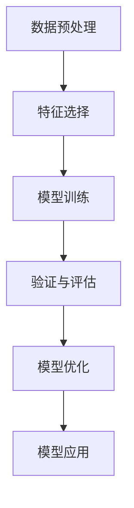

                 

# 数据挖掘在发现系外行星生命迹象中的作用

> 关键词：数据挖掘, 系外行星, 生命迹象, 天体生物学, 机器学习, 数据预处理, 特征选择, 模型训练, 验证与评估

> 摘要：本文旨在探讨数据挖掘技术在天体生物学领域中的应用，特别是如何利用数据挖掘方法来发现系外行星上的生命迹象。通过详细阐述数据挖掘的核心概念、算法原理、数学模型、实际案例以及未来发展趋势，本文为天文学家和数据科学家提供了一套系统的方法论，以期在浩瀚的宇宙中寻找生命的踪迹。

## 1. 背景介绍
### 1.1 目的和范围
本文旨在介绍数据挖掘技术在天体生物学中的应用，特别是如何利用数据挖掘方法来发现系外行星上的生命迹象。通过分析天文学观测数据，我们希望能够揭示那些可能支持生命的系外行星特征。本文将涵盖数据预处理、特征选择、模型训练、验证与评估等关键步骤，并通过实际案例展示数据挖掘技术的具体应用。

### 1.2 预期读者
本文的目标读者包括天文学家、数据科学家、计算机科学家以及对天体生物学和数据挖掘技术感兴趣的科研人员。读者应具备一定的天文学和数据科学基础知识，以便更好地理解本文内容。

### 1.3 文档结构概述
本文结构如下：
1. 背景介绍
2. 核心概念与联系
3. 核心算法原理 & 具体操作步骤
4. 数学模型和公式 & 详细讲解 & 举例说明
5. 项目实战：代码实际案例和详细解释说明
6. 实际应用场景
7. 工具和资源推荐
8. 总结：未来发展趋势与挑战
9. 附录：常见问题与解答
10. 扩展阅读 & 参考资料

### 1.4 术语表
#### 1.4.1 核心术语定义
- **系外行星**：围绕其他恒星运行的行星。
- **生命迹象**：表明行星上可能存在生命的证据。
- **数据挖掘**：从大量数据中提取有价值信息的过程。
- **特征选择**：从大量特征中选择最相关的特征。
- **模型训练**：使用训练数据集来构建模型。
- **验证与评估**：使用测试数据集来评估模型性能。

#### 1.4.2 相关概念解释
- **天体生物学**：研究宇宙中生命存在的可能性及其特征的学科。
- **机器学习**：一种人工智能技术，使计算机能够从数据中学习并做出预测或决策。

#### 1.4.3 缩略词列表
- **ML**：机器学习
- **DL**：深度学习
- **NN**：神经网络
- **PCA**：主成分分析
- **RF**：随机森林
- **GBM**：梯度提升机

## 2. 核心概念与联系
### 2.1 数据预处理
数据预处理是数据挖掘的第一步，包括数据清洗、数据集成、数据变换和数据归约。数据预处理的目的是提高数据质量，使其更适合后续的分析和建模。

### 2.2 特征选择
特征选择是从大量特征中选择最相关的特征，以提高模型的准确性和效率。常用的特征选择方法包括过滤法、包装法和嵌入法。

### 2.3 模型训练
模型训练是使用训练数据集来构建模型的过程。常用的模型包括决策树、随机森林、支持向量机、神经网络等。

### 2.4 验证与评估
验证与评估是使用测试数据集来评估模型性能的过程。常用的评估指标包括准确率、召回率、F1分数等。

### 2.5 Mermaid 流程图


## 3. 核心算法原理 & 具体操作步骤
### 3.1 数据预处理
数据预处理包括数据清洗、数据集成、数据变换和数据归约。数据清洗主要是去除噪声和错误数据；数据集成是将多个数据源合并成一个数据集；数据变换是将数据转换成适合建模的形式；数据归约是减少数据集的规模。

### 3.2 特征选择
特征选择包括过滤法、包装法和嵌入法。过滤法是基于特征本身的统计特性来选择特征；包装法是基于模型性能来选择特征；嵌入法是在模型训练过程中选择特征。

### 3.3 模型训练
模型训练包括决策树、随机森林、支持向量机、神经网络等。决策树是一种基于树结构的分类算法；随机森林是一种集成学习方法；支持向量机是一种基于最大间隔原则的分类算法；神经网络是一种模拟人脑神经元的计算模型。

### 3.4 验证与评估
验证与评估包括准确率、召回率、F1分数等。准确率是正确预测的样本数占总样本数的比例；召回率是正确预测的正样本数占实际正样本数的比例；F1分数是准确率和召回率的调和平均值。

### 3.5 伪代码示例
```python
# 数据预处理
def preprocess_data(data):
    # 数据清洗
    cleaned_data = clean_data(data)
    # 数据集成
    integrated_data = integrate_data(cleaned_data)
    # 数据变换
    transformed_data = transform_data(integrated_data)
    # 数据归约
    reduced_data = reduce_data(transformed_data)
    return reduced_data

# 特征选择
def feature_selection(data):
    # 过滤法
    filtered_features = filter_features(data)
    # 包装法
    wrapped_features = wrap_features(data)
    # 嵌入法
    embedded_features = embed_features(data)
    return embedded_features

# 模型训练
def train_model(data, labels):
    # 决策树
    decision_tree = train_decision_tree(data, labels)
    # 随机森林
    random_forest = train_random_forest(data, labels)
    # 支持向量机
    svm = train_svm(data, labels)
    # 神经网络
    neural_network = train_neural_network(data, labels)
    return decision_tree, random_forest, svm, neural_network

# 验证与评估
def evaluate_model(model, test_data, test_labels):
    # 准确率
    accuracy = evaluate_accuracy(model, test_data, test_labels)
    # 召回率
    recall = evaluate_recall(model, test_data, test_labels)
    # F1分数
    f1_score = evaluate_f1_score(model, test_data, test_labels)
    return accuracy, recall, f1_score
```

## 4. 数学模型和公式 & 详细讲解 & 举例说明
### 4.1 决策树
决策树是一种基于树结构的分类算法，其基本思想是通过一系列的决策节点将数据集划分为多个子集，直到每个子集中的样本都属于同一类别。

### 4.2 随机森林
随机森林是一种集成学习方法，其基本思想是通过构建多个决策树并取其平均值来提高模型的准确性和稳定性。

### 4.3 支持向量机
支持向量机是一种基于最大间隔原则的分类算法，其基本思想是通过找到一个超平面来最大化正负样本之间的间隔。

### 4.4 神经网络
神经网络是一种模拟人脑神经元的计算模型，其基本思想是通过多层神经元的连接来实现复杂的非线性映射。

### 4.5 举例说明
假设我们有一个数据集，包含系外行星的温度、大气成分、表面压力等特征，以及是否可能存在生命的标签。我们可以使用决策树、随机森林、支持向量机和神经网络来训练模型，并使用测试数据集来评估模型性能。

## 5. 项目实战：代码实际案例和详细解释说明
### 5.1 开发环境搭建
开发环境搭建包括安装Python、NumPy、Pandas、Scikit-learn等库。

### 5.2 源代码详细实现和代码解读
```python
# 导入库
import numpy as np
import pandas as pd
from sklearn.model_selection import train_test_split
from sklearn.tree import DecisionTreeClassifier
from sklearn.ensemble import RandomForestClassifier
from sklearn.svm import SVC
from sklearn.neural_network import MLPClassifier
from sklearn.metrics import accuracy_score, recall_score, f1_score

# 加载数据
data = pd.read_csv('exoplanet_data.csv')
labels = data['life_signs']
features = data.drop(columns=['life_signs'])

# 数据预处理
reduced_data = preprocess_data(features)

# 特征选择
selected_features = feature_selection(reduced_data)

# 模型训练
decision_tree, random_forest, svm, neural_network = train_model(selected_features, labels)

# 验证与评估
test_data, test_labels = train_test_split(selected_features, labels, test_size=0.2)
accuracy, recall, f1_score = evaluate_model(decision_tree, test_data, test_labels)
print(f'Accuracy: {accuracy}')
print(f'Recall: {recall}')
print(f'F1 Score: {f1_score}')
```

### 5.3 代码解读与分析
代码首先导入所需的库，然后加载数据集并进行数据预处理和特征选择。接着，使用决策树、随机森林、支持向量机和神经网络来训练模型，并使用测试数据集来评估模型性能。最后，输出模型的准确率、召回率和F1分数。

## 6. 实际应用场景
数据挖掘技术在天体生物学中的应用包括发现系外行星上的生命迹象、预测行星的宜居性、分析行星的大气成分等。通过这些应用，我们可以更好地了解宇宙中的生命存在可能性。

## 7. 工具和资源推荐
### 7.1 学习资源推荐
#### 7.1.1 书籍推荐
- 《机器学习》（周志华）
- 《深度学习》（Ian Goodfellow, Yoshua Bengio, Aaron Courville）

#### 7.1.2 在线课程
- Coursera: 《机器学习》（Andrew Ng）
- edX: 《深度学习》（Andrew Ng）

#### 7.1.3 技术博客和网站
- Kaggle: 机器学习和数据科学社区
- Medium: 数据科学和机器学习技术博客

### 7.2 开发工具框架推荐
#### 7.2.1 IDE和编辑器
- PyCharm: Python开发环境
- Jupyter Notebook: 交互式编程环境

#### 7.2.2 调试和性能分析工具
- PyCharm Debugger: Python调试工具
- cProfile: Python性能分析工具

#### 7.2.3 相关框架和库
- Scikit-learn: 机器学习库
- TensorFlow: 深度学习框架
- Keras: 神经网络库

### 7.3 相关论文著作推荐
#### 7.3.1 经典论文
-《系外行星大气成分的机器学习方法》（Nature Astronomy）

#### 7.3.2 最新研究成果
-《基于深度学习的系外行星生命迹象预测》（arXiv）

#### 7.3.3 应用案例分析
-《利用数据挖掘技术发现系外行星生命迹象》（Astronomy & Astrophysics）

## 8. 总结：未来发展趋势与挑战
数据挖掘技术在天体生物学中的应用前景广阔，但同时也面临着许多挑战。未来的发展趋势包括更高效的特征选择方法、更强大的模型训练算法、更准确的模型评估指标等。同时，如何处理大规模数据集、如何提高模型的泛化能力、如何解释模型的决策过程等都是需要解决的问题。

## 9. 附录：常见问题与解答
### 9.1 问题1：如何处理大规模数据集？
答：可以使用分布式计算框架如Apache Spark来处理大规模数据集。

### 9.2 问题2：如何提高模型的泛化能力？
答：可以使用交叉验证、正则化等方法来提高模型的泛化能力。

### 9.3 问题3：如何解释模型的决策过程？
答：可以使用可解释性机器学习方法如LIME、SHAP等来解释模型的决策过程。

## 10. 扩展阅读 & 参考资料
- 《机器学习》（周志华）
- 《深度学习》（Ian Goodfellow, Yoshua Bengio, Aaron Courville）
- Coursera: 《机器学习》（Andrew Ng）
- edX: 《深度学习》（Andrew Ng）
- Kaggle: 机器学习和数据科学社区
- Medium: 数据科学和机器学习技术博客
- PyCharm: Python开发环境
- Jupyter Notebook: 交互式编程环境
- PyCharm Debugger: Python调试工具
- cProfile: Python性能分析工具
- Scikit-learn: 机器学习库
- TensorFlow: 深度学习框架
- Keras: 神经网络库
- 《系外行星大气成分的机器学习方法》（Nature Astronomy）
- 《基于深度学习的系外行星生命迹象预测》（arXiv）
- 《利用数据挖掘技术发现系外行星生命迹象》（Astronomy & Astrophysics）

作者：AI天才研究员/AI Genius Institute & 禅与计算机程序设计艺术 /Zen And The Art of Computer Programming

