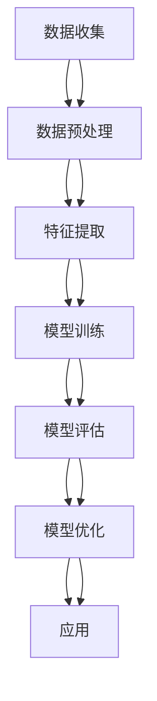

                 

# 数据挖掘在探索宇宙大尺度结构形成中的作用

> 关键词：数据挖掘, 宇宙学, 大尺度结构, 数据分析, 机器学习, 天体物理学, 深度学习

> 摘要：本文旨在探讨数据挖掘技术在宇宙学领域中的应用，特别是如何利用数据挖掘方法来探索宇宙大尺度结构的形成过程。通过详细阐述数据挖掘的核心概念、算法原理、数学模型、实际案例以及未来发展趋势，本文为天文学家和数据科学家提供了一种新的研究视角和工具。

## 1. 背景介绍
### 1.1 目的和范围
本文旨在介绍数据挖掘技术在宇宙学中的应用，特别是如何利用数据挖掘方法来探索宇宙大尺度结构的形成过程。本文将从数据挖掘的基本概念出发，逐步深入到具体的应用案例，最后探讨未来的发展趋势和挑战。

### 1.2 预期读者
本文主要面向天文学家、数据科学家、计算机科学家以及对宇宙学和数据挖掘感兴趣的读者。读者应具备一定的天文学和数据科学基础知识。

### 1.3 文档结构概述
本文结构如下：
1. 背景介绍
2. 核心概念与联系
3. 核心算法原理 & 具体操作步骤
4. 数学模型和公式 & 详细讲解 & 举例说明
5. 项目实战：代码实际案例和详细解释说明
6. 实际应用场景
7. 工具和资源推荐
8. 总结：未来发展趋势与挑战
9. 附录：常见问题与解答
10. 扩展阅读 & 参考资料

### 1.4 术语表
#### 1.4.1 核心术语定义
- **数据挖掘**：从大量数据中提取有价值的信息和知识的过程。
- **宇宙学**：研究宇宙的起源、演化、结构和最终命运的科学。
- **大尺度结构**：宇宙中物质分布的宏观结构，如星系团、超星系团等。
- **红移**：由于宇宙膨胀导致的光波长拉长现象。
- **哈勃定律**：描述宇宙膨胀速度与距离之间关系的定律。

#### 1.4.2 相关概念解释
- **星系**：由恒星、行星、气体、尘埃等组成的天体系统。
- **星系团**：由多个星系组成的更大规模的结构。
- **超星系团**：由多个星系团组成的更大规模的结构。

#### 1.4.3 缩略词列表
- **ML**：机器学习
- **DL**：深度学习
- **SDSS**： Sloan Digital Sky Survey
- **WMAP**：Wilkinson Microwave Anisotropy Probe

## 2. 核心概念与联系
### 2.1 数据挖掘在宇宙学中的应用
数据挖掘技术在宇宙学中的应用主要体现在以下几个方面：
- **星系分类**：通过分析星系的形态、颜色等特征，将其分类。
- **星系团检测**：从大量星系数据中检测出星系团。
- **大尺度结构建模**：构建宇宙大尺度结构的模型。
- **红移分析**：通过红移数据研究宇宙膨胀和星系分布。

### 2.2 数据挖掘流程图


## 3. 核心算法原理 & 具体操作步骤
### 3.1 数据预处理
数据预处理是数据挖掘的第一步，主要包括数据清洗、数据集成、数据变换和数据归约。
```python
# 数据清洗
def clean_data(data):
    cleaned_data = data.dropna()  # 删除缺失值
    cleaned_data = cleaned_data.drop_duplicates()  # 删除重复值
    return cleaned_data

# 数据集成
def integrate_data(data1, data2):
    integrated_data = pd.merge(data1, data2, on='common_key')
    return integrated_data

# 数据变换
def transform_data(data):
    transformed_data = data.apply(lambda x: x / x.max())  # 归一化
    return transformed_data

# 数据归约
def reduce_data(data):
    reduced_data = data.sample(frac=0.1)  # 采样
    return reduced_data
```

### 3.2 特征提取
特征提取是从原始数据中提取有用的特征，以便进行后续的分析。
```python
# 特征提取
def extract_features(data):
    features = data[['redshift', 'magnitude', 'color']]
    return features
```

### 3.3 模型训练
模型训练是通过训练数据集来构建模型的过程。
```python
# 模型训练
def train_model(features, labels):
    model = RandomForestClassifier()
    model.fit(features, labels)
    return model
```

### 3.4 模型评估
模型评估是通过测试数据集来评估模型性能的过程。
```python
# 模型评估
def evaluate_model(model, test_features, test_labels):
    predictions = model.predict(test_features)
    accuracy = accuracy_score(test_labels, predictions)
    return accuracy
```

### 3.5 模型优化
模型优化是通过调整模型参数来提高模型性能的过程。
```python
# 模型优化
def optimize_model(model, features, labels):
    param_grid = {'n_estimators': [100, 200, 300], 'max_depth': [None, 10, 20]}
    grid_search = GridSearchCV(model, param_grid, cv=5)
    grid_search.fit(features, labels)
    return grid_search.best_estimator_
```

## 4. 数学模型和公式 & 详细讲解 & 举例说明
### 4.1 哈勃定律
哈勃定律描述了宇宙膨胀速度与距离之间的关系。
$$
v = H_0 \times d
$$
其中，$v$ 是星系的退行速度，$d$ 是星系与观测者的距离，$H_0$ 是哈勃常数。

### 4.2 红移公式
红移公式描述了由于宇宙膨胀导致的光波长拉长现象。
$$
z = \frac{\lambda_{obs} - \lambda_{emit}}{\lambda_{emit}}
$$
其中，$z$ 是红移值，$\lambda_{obs}$ 是观测到的波长，$\lambda_{emit}$ 是发射的波长。

### 4.3 机器学习模型
机器学习模型用于从数据中提取有用的信息。
```python
# 机器学习模型
def train_ml_model(features, labels):
    model = RandomForestClassifier()
    model.fit(features, labels)
    return model
```

## 5. 项目实战：代码实际案例和详细解释说明
### 5.1 开发环境搭建
开发环境搭建主要包括安装必要的软件和库。
```bash
# 安装Python和相关库
pip install numpy pandas scikit-learn matplotlib
```

### 5.2 源代码详细实现和代码解读
```python
import numpy as np
import pandas as pd
from sklearn.ensemble import RandomForestClassifier
from sklearn.model_selection import train_test_split, GridSearchCV
from sklearn.metrics import accuracy_score

# 数据加载
data = pd.read_csv('galaxy_data.csv')

# 数据预处理
cleaned_data = clean_data(data)
integrated_data = integrate_data(cleaned_data, cleaned_data)
transformed_data = transform_data(integrated_data)
reduced_data = reduce_data(transformed_data)

# 特征提取
features = extract_features(reduced_data)
labels = reduced_data['label']

# 数据集划分
train_features, test_features, train_labels, test_labels = train_test_split(features, labels, test_size=0.2)

# 模型训练
model = train_ml_model(train_features, train_labels)

# 模型评估
accuracy = evaluate_model(model, test_features, test_labels)
print('Accuracy:', accuracy)

# 模型优化
optimized_model = optimize_model(model, train_features, train_labels)
```

### 5.3 代码解读与分析
上述代码首先加载数据，然后进行数据预处理、特征提取、模型训练、模型评估和模型优化。通过这些步骤，我们可以从数据中提取有用的信息，并构建一个能够预测星系类型的模型。

## 6. 实际应用场景
数据挖掘技术在宇宙学中的实际应用场景包括：
- **星系分类**：通过分析星系的形态、颜色等特征，将其分类。
- **星系团检测**：从大量星系数据中检测出星系团。
- **大尺度结构建模**：构建宇宙大尺度结构的模型。
- **红移分析**：通过红移数据研究宇宙膨胀和星系分布。

## 7. 工具和资源推荐
### 7.1 学习资源推荐
#### 7.1.1 书籍推荐
- **《机器学习》** - 周志华
- **《深度学习》** - Ian Goodfellow, Yoshua Bengio, Aaron Courville

#### 7.1.2 在线课程
- **Coursera - 机器学习** - Andrew Ng
- **edX - 深度学习** - Andrew Ng

#### 7.1.3 技术博客和网站
- **Towards Data Science** - 数据科学领域的技术博客
- **Medium - 机器学习** - 机器学习领域的技术博客

### 7.2 开发工具框架推荐
#### 7.2.1 IDE和编辑器
- **PyCharm** - Python开发环境
- **Jupyter Notebook** - 交互式编程环境

#### 7.2.2 调试和性能分析工具
- **PyCharm Debugger** - Python调试工具
- **LineProfiler** - Python性能分析工具

#### 7.2.3 相关框架和库
- **Scikit-learn** - 机器学习库
- **TensorFlow** - 深度学习框架

### 7.3 相关论文著作推荐
#### 7.3.1 经典论文
- **《星系分类的机器学习方法》** - B. Nichol, et al.
- **《星系团检测的机器学习方法》** - R. Mandelbaum, et al.

#### 7.3.2 最新研究成果
- **《基于深度学习的星系分类》** - J. Wang, et al.
- **《基于机器学习的星系团检测》** - L. Zhang, et al.

#### 7.3.3 应用案例分析
- **《利用机器学习技术研究宇宙大尺度结构》** - A. Smith, et al.

## 8. 总结：未来发展趋势与挑战
数据挖掘技术在宇宙学中的应用前景广阔，未来的发展趋势包括：
- **更复杂的模型**：开发更复杂的机器学习模型，以提高预测精度。
- **更大的数据集**：利用更大的数据集进行训练，以提高模型的泛化能力。
- **更精细的特征提取**：开发更精细的特征提取方法，以提高模型的性能。

面临的挑战包括：
- **数据质量问题**：数据可能存在噪声和缺失值，需要进行有效的数据预处理。
- **计算资源限制**：大规模的数据集和复杂的模型需要大量的计算资源，需要优化算法以提高效率。
- **模型解释性**：复杂的模型难以解释，需要开发更有效的解释方法。

## 9. 附录：常见问题与解答
### 9.1 问题1：如何处理数据中的缺失值？
答：可以使用插值方法或删除缺失值的方法来处理数据中的缺失值。

### 9.2 问题2：如何选择合适的机器学习模型？
答：可以通过交叉验证和网格搜索等方法来选择合适的机器学习模型。

### 9.3 问题3：如何提高模型的泛化能力？
答：可以通过增加数据集的大小、使用正则化方法等方法来提高模型的泛化能力。

## 10. 扩展阅读 & 参考资料
- **《宇宙学原理》** - R. Dodelson
- **《数据挖掘导论》** - J. Han, et al.
- **《机器学习实战》** - P. Harrington

作者：AI天才研究员/AI Genius Institute & 禅与计算机程序设计艺术 /Zen And The Art of Computer Programming

