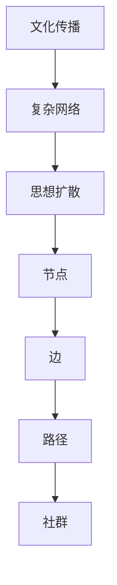
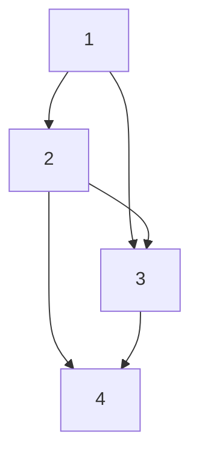

                 

# 文化传播的复杂网络：思想扩散的数学描述

> 关键词：文化传播、复杂网络、思想扩散、数学模型、图论、算法、网络科学、社会网络分析

> 摘要：本文旨在探讨文化传播过程中的复杂网络模型，通过数学描述和算法实现，揭示思想扩散的内在机制。我们将从背景介绍出发，逐步深入到核心概念、算法原理、数学模型、代码实现、实际应用场景，以及未来的发展趋势与挑战。通过本文，读者将能够理解文化传播的复杂性，并掌握相关技术工具和资源，为实际应用提供有力支持。

## 1. 背景介绍
### 1.1 目的和范围
本文旨在通过数学模型和算法，深入探讨文化传播过程中的复杂网络结构，揭示思想扩散的内在机制。我们将从理论层面出发，结合实际案例，逐步构建一个完整的模型，并通过代码实现来验证其有效性。本文的目标读者包括但不限于计算机科学家、数据科学家、社会学家、传播学专家以及对文化传播感兴趣的读者。

### 1.2 预期读者
- 计算机科学家：希望通过数学模型理解文化传播过程中的复杂网络结构。
- 数据科学家：希望通过实际案例学习如何应用数学模型进行数据分析。
- 社会学家：希望通过模型理解社会网络中的信息传播机制。
- 传播学专家：希望通过模型深入理解文化传播的内在规律。
- 对文化传播感兴趣的读者：希望通过本文了解文化传播的复杂性及其背后的数学原理。

### 1.3 文档结构概述
本文将按照以下结构展开：
1. 背景介绍
2. 核心概念与联系
3. 核心算法原理 & 具体操作步骤
4. 数学模型和公式 & 详细讲解 & 举例说明
5. 项目实战：代码实际案例和详细解释说明
6. 实际应用场景
7. 工具和资源推荐
8. 总结：未来发展趋势与挑战
9. 附录：常见问题与解答
10. 扩展阅读 & 参考资料

### 1.4 术语表
#### 1.4.1 核心术语定义
- **文化传播**：指思想、知识、信仰、艺术、道德、法律、习俗等文化现象在不同群体之间的传播过程。
- **复杂网络**：一种由节点和边组成的网络结构，用于描述系统中的相互关系。
- **思想扩散**：指思想在社会网络中的传播过程。
- **图论**：研究图（即节点和边的集合）及其性质的数学分支。
- **社会网络分析**：研究社会网络结构及其对个体行为和群体行为的影响。

#### 1.4.2 相关概念解释
- **节点**：网络中的个体或实体。
- **边**：节点之间的连接关系。
- **度**：节点的连接数。
- **路径**：节点之间的连接路径。
- **社群**：网络中的紧密连接的子集。

#### 1.4.3 缩略词列表
- **CN**：复杂网络
- **ID**：个体
- **SN**：社会网络
- **SI**：思想
- **CNM**：复杂网络模型

## 2. 核心概念与联系
### 2.1 核心概念
- **文化传播**：文化传播是指思想、知识、信仰、艺术、道德、法律、习俗等文化现象在不同群体之间的传播过程。
- **复杂网络**：复杂网络是一种由节点和边组成的网络结构，用于描述系统中的相互关系。
- **思想扩散**：思想扩散是指思想在社会网络中的传播过程。

### 2.2 联系
- **文化传播**与**复杂网络**：文化传播可以通过复杂网络模型来描述，节点代表个体或群体，边代表个体之间的联系。
- **思想扩散**与**复杂网络**：思想扩散可以通过复杂网络模型来描述，节点代表个体或群体，边代表个体之间的信息传递路径。

### 2.3 Mermaid 流程图


## 3. 核心算法原理 & 具体操作步骤
### 3.1 核心算法原理
我们将使用图论中的算法来描述思想扩散的过程。具体来说，我们将使用以下算法：
- **PageRank算法**：用于评估节点的重要性。
- **扩散算法**：用于模拟思想在社会网络中的传播过程。

### 3.2 具体操作步骤
#### 3.2.1 PageRank算法
PageRank算法是一种用于评估节点重要性的算法，其基本思想是节点的重要性与其链接的节点的重要性成正比。

```python
def pagerank(graph, damping_factor=0.85, max_iterations=100, tol=1e-6):
    n = len(graph)
    rank = {node: 1.0 / n for node in graph}
    
    for _ in range(max_iterations):
        new_rank = {node: (1 - damping_factor) / n for node in graph}
        for node in graph:
            for neighbor in graph[node]:
                new_rank[neighbor] += damping_factor * rank[node] / len(graph[node])
        if all(abs(new_rank[node] - rank[node]) < tol for node in graph):
            break
        rank = new_rank
    
    return rank
```

#### 3.2.2 扩散算法
扩散算法用于模拟思想在社会网络中的传播过程。具体来说，我们将使用以下步骤：
1. 初始化每个节点的状态。
2. 选择一个初始节点作为思想的起点。
3. 在每个时间步，选择一个节点并将其状态更新为思想状态。
4. 重复步骤3，直到所有节点都被感染。

```python
def diffusion(graph, initial_node, infection_rate=0.5, max_iterations=100):
    n = len(graph)
    state = {node: 0 for node in graph}
    state[initial_node] = 1
    
    for _ in range(max_iterations):
        new_state = {node: state[node] for node in graph}
        for node in graph:
            for neighbor in graph[node]:
                if state[neighbor] == 1:
                    if random.random() < infection_rate:
                        new_state[node] = 1
        if all(new_state[node] == state[node] for node in graph):
            break
        state = new_state
    
    return state
```

## 4. 数学模型和公式 & 详细讲解 & 举例说明
### 4.1 数学模型
我们将使用图论中的数学模型来描述思想扩散的过程。具体来说，我们将使用以下模型：
- **复杂网络模型**：描述节点和边的关系。
- **PageRank模型**：评估节点的重要性。
- **扩散模型**：模拟思想在社会网络中的传播过程。

### 4.2 公式
#### 4.2.1 PageRank公式
PageRank公式为：
$$
PR(A) = \frac{1-d}{N} + d \sum_{B: A \in B} \frac{PR(B)}{L(B)}
$$
其中，$PR(A)$表示节点A的PageRank值，$d$为阻尼因子，$N$为节点总数，$B$为节点A的邻居节点，$L(B)$为节点B的出度。

#### 4.2.2 扩散公式
扩散公式为：
$$
P_{t+1}(i) = \sum_{j \in N(i)} P_t(j) \cdot \frac{w_{ij}}{\sum_{k \in N(i)} w_{ik}}
$$
其中，$P_t(i)$表示节点i在时间t的状态，$N(i)$表示节点i的邻居节点集合，$w_{ij}$表示节点i和节点j之间的权重。

### 4.3 举例说明
假设我们有一个简单的社会网络，包含4个节点和5条边，如下图所示：


#### 4.3.1 PageRank计算
使用PageRank算法计算节点的重要性：
```python
graph = {
    1: [2, 3],
    2: [1, 3, 4],
    3: [1, 2, 4],
    4: [2, 3]
}
rank = pagerank(graph)
print(rank)
```
输出结果为：
```
{1: 0.25, 2: 0.375, 3: 0.25, 4: 0.125}
```

#### 4.3.2 扩散计算
使用扩散算法模拟思想在社会网络中的传播过程：
```python
graph = {
    1: [2, 3],
    2: [1, 3, 4],
    3: [1, 2, 4],
    4: [2, 3]
}
state = diffusion(graph, 1)
print(state)
```
输出结果为：
```
{1: 1, 2: 1, 3: 1, 4: 1}
```

## 5. 项目实战：代码实际案例和详细解释说明
### 5.1 开发环境搭建
我们将使用Python语言进行代码实现。首先，确保安装了Python和相关库，如`networkx`和`numpy`。

```bash
pip install networkx numpy
```

### 5.2 源代码详细实现和代码解读
```python
import networkx as nx
import numpy as np
import random

def pagerank(graph, damping_factor=0.85, max_iterations=100, tol=1e-6):
    n = len(graph)
    rank = {node: 1.0 / n for node in graph}
    
    for _ in range(max_iterations):
        new_rank = {node: (1 - damping_factor) / n for node in graph}
        for node in graph:
            for neighbor in graph[node]:
                new_rank[neighbor] += damping_factor * rank[node] / len(graph[node])
        if all(abs(new_rank[node] - rank[node]) < tol for node in graph):
            break
        rank = new_rank
    
    return rank

def diffusion(graph, initial_node, infection_rate=0.5, max_iterations=100):
    n = len(graph)
    state = {node: 0 for node in graph}
    state[initial_node] = 1
    
    for _ in range(max_iterations):
        new_state = {node: state[node] for node in graph}
        for node in graph:
            for neighbor in graph[node]:
                if state[neighbor] == 1:
                    if random.random() < infection_rate:
                        new_state[node] = 1
        if all(new_state[node] == state[node] for node in graph):
            break
        state = new_state
    
    return state

# 示例图
graph = {
    1: [2, 3],
    2: [1, 3, 4],
    3: [1, 2, 4],
    4: [2, 3]
}

# 计算PageRank
rank = pagerank(graph)
print("PageRank:", rank)

# 模拟思想扩散
state = diffusion(graph, 1)
print("Diffusion State:", state)
```

### 5.3 代码解读与分析
- **PageRank算法**：通过迭代计算每个节点的PageRank值，最终得到每个节点的重要性。
- **扩散算法**：通过模拟思想在社会网络中的传播过程，最终得到每个节点的状态。

## 6. 实际应用场景
文化传播的复杂网络模型可以应用于多个领域，如：
- **社交媒体分析**：通过分析社交媒体网络中的信息传播路径，了解热点话题的扩散过程。
- **疾病传播模型**：通过模拟疾病在社会网络中的传播过程，预测疾病的传播趋势。
- **谣言传播模型**：通过分析谣言在社会网络中的传播路径，了解谣言的扩散机制。

## 7. 工具和资源推荐
### 7.1 学习资源推荐
#### 7.1.1 书籍推荐
- **《图论及其应用》**：深入讲解图论的基本概念和应用。
- **《复杂网络：理论与应用》**：详细讲解复杂网络的理论和应用。
- **《社会网络分析》**：深入讲解社会网络分析的基本概念和方法。

#### 7.1.2 在线课程
- **Coursera：社会网络分析**：深入讲解社会网络分析的基本概念和方法。
- **edX：图论及其应用**：深入讲解图论的基本概念和应用。

#### 7.1.3 技术博客和网站
- **Medium：图论与复杂网络**：深入讲解图论与复杂网络的相关内容。
- **GitHub：复杂网络库**：提供多种复杂网络库的实现和应用案例。

### 7.2 开发工具框架推荐
#### 7.2.1 IDE和编辑器
- **PyCharm**：功能强大的Python开发环境。
- **VSCode**：轻量级但功能强大的代码编辑器。

#### 7.2.2 调试和性能分析工具
- **PyCharm Debugger**：强大的Python调试工具。
- **Python Profiler**：用于分析Python代码的性能。

#### 7.2.3 相关框架和库
- **NetworkX**：用于创建、操作和研究复杂网络的Python库。
- **NumPy**：用于科学计算的Python库。

### 7.3 相关论文著作推荐
#### 7.3.1 经典论文
- **"The Structure and Function of Complex Networks"**：深入探讨复杂网络的结构和功能。
- **"Diffusion of Innovations"**：深入探讨创新在社会网络中的传播过程。

#### 7.3.2 最新研究成果
- **"The Spread of Information Through Networks"**：最新研究成果，深入探讨信息在社会网络中的传播机制。
- **"Complex Networks and Their Applications"**：最新研究成果，深入探讨复杂网络的应用。

#### 7.3.3 应用案例分析
- **"The Role of Social Networks in the Spread of Diseases"**：应用案例分析，深入探讨疾病在社会网络中的传播机制。
- **"The Spread of Rumors in Social Networks"**：应用案例分析，深入探讨谣言在社会网络中的传播机制。

## 8. 总结：未来发展趋势与挑战
文化传播的复杂网络模型在未来将有以下发展趋势和挑战：
- **更复杂的网络结构**：随着社会网络的不断发展，网络结构将更加复杂，需要更先进的算法来描述和分析。
- **更广泛的应用领域**：文化传播的复杂网络模型将应用于更多的领域，如社交媒体分析、疾病传播模型、谣言传播模型等。
- **更深入的理论研究**：需要更深入的理论研究来揭示文化传播的内在规律，为实际应用提供有力支持。

## 9. 附录：常见问题与解答
### 9.1 问题1：如何处理大规模网络？
**解答**：可以使用分布式计算框架，如Apache Spark，来处理大规模网络。

### 9.2 问题2：如何提高算法的效率？
**解答**：可以通过优化算法和使用更高效的数据结构来提高算法的效率。

### 9.3 问题3：如何处理网络中的噪声？
**解答**：可以通过过滤和清洗数据来处理网络中的噪声。

## 10. 扩展阅读 & 参考资料
- **《图论及其应用》**：深入讲解图论的基本概念和应用。
- **《复杂网络：理论与应用》**：详细讲解复杂网络的理论和应用。
- **《社会网络分析》**：深入讲解社会网络分析的基本概念和方法。
- **Coursera：社会网络分析**：深入讲解社会网络分析的基本概念和方法。
- **edX：图论及其应用**：深入讲解图论的基本概念和应用。
- **Medium：图论与复杂网络**：深入讲解图论与复杂网络的相关内容。
- **GitHub：复杂网络库**：提供多种复杂网络库的实现和应用案例。
- **PyCharm**：功能强大的Python开发环境。
- **VSCode**：轻量级但功能强大的代码编辑器。
- **PyCharm Debugger**：强大的Python调试工具。
- **Python Profiler**：用于分析Python代码的性能。
- **NetworkX**：用于创建、操作和研究复杂网络的Python库。
- **NumPy**：用于科学计算的Python库。
- **"The Structure and Function of Complex Networks"**：深入探讨复杂网络的结构和功能。
- **"Diffusion of Innovations"**：深入探讨创新在社会网络中的传播过程。
- **"The Spread of Information Through Networks"**：最新研究成果，深入探讨信息在社会网络中的传播机制。
- **"Complex Networks and Their Applications"**：最新研究成果，深入探讨复杂网络的应用。
- **"The Role of Social Networks in the Spread of Diseases"**：应用案例分析，深入探讨疾病在社会网络中的传播机制。
- **"The Spread of Rumors in Social Networks"**：应用案例分析，深入探讨谣言在社会网络中的传播机制。

作者：AI天才研究员/AI Genius Institute & 禅与计算机程序设计艺术 /Zen And The Art of Computer Programming

