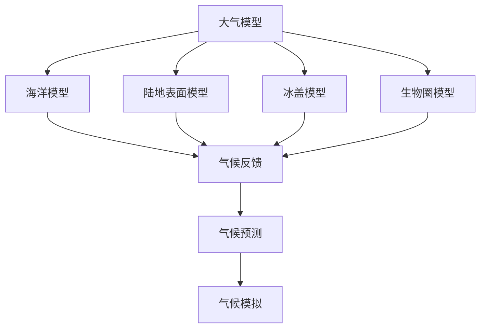

                 

# 气候变化的复杂网络：全球气候的数学模型

> 关键词：全球气候模型, 气候变化, 数学模型, 气候系统, 气候模拟, 气候反馈, 气候预测

> 摘要：本文旨在深入探讨全球气候模型的构建原理和应用，通过逐步分析和推理，揭示气候变化背后的复杂网络。我们将从核心概念出发，详细介绍数学模型的原理和具体操作步骤，通过代码案例展示如何实现这些模型，并探讨其实际应用场景。最后，我们将展望未来的发展趋势和挑战，并推荐相关学习资源和工具。

## 1. 背景介绍
### 1.1 目的和范围
本文旨在深入探讨全球气候模型的构建原理和应用，通过逐步分析和推理，揭示气候变化背后的复杂网络。我们将从核心概念出发，详细介绍数学模型的原理和具体操作步骤，通过代码案例展示如何实现这些模型，并探讨其实际应用场景。本文的目标读者包括对气候变化和全球气候模型感兴趣的科研人员、工程师、学生以及对环境问题感兴趣的公众。

### 1.2 预期读者
- 科研人员：希望深入了解全球气候模型的构建原理和应用。
- 工程师：希望将全球气候模型应用于实际项目中。
- 学生：希望学习全球气候模型的基础知识和应用。
- 公众：希望了解气候变化背后的科学原理。

### 1.3 文档结构概述
本文将按照以下结构展开：
1. 背景介绍
2. 核心概念与联系
3. 核心算法原理 & 具体操作步骤
4. 数学模型和公式 & 详细讲解 & 举例说明
5. 项目实战：代码实际案例和详细解释说明
6. 实际应用场景
7. 工具和资源推荐
8. 总结：未来发展趋势与挑战
9. 附录：常见问题与解答
10. 扩展阅读 & 参考资料

### 1.4 术语表
#### 1.4.1 核心术语定义
- **全球气候模型 (GCM)**: 一种用于模拟地球气候系统的数学模型。
- **气候系统**: 包括大气、海洋、陆地表面、冰盖和生物圈等组成部分。
- **气候反馈**: 指气候系统中一个变量的变化如何影响另一个变量的变化。
- **气候预测**: 基于当前气候状态和历史数据对未来气候进行预测。
- **气候模拟**: 通过数学模型模拟气候系统的演变过程。

#### 1.4.2 相关概念解释
- **气候系统**: 指地球上的大气、海洋、陆地表面、冰盖和生物圈等组成部分。
- **气候反馈**: 指气候系统中一个变量的变化如何影响另一个变量的变化，例如温度升高导致冰川融化，进而影响海平面和气候系统。
- **气候预测**: 基于当前气候状态和历史数据对未来气候进行预测，通常用于长期气候规划和政策制定。

#### 1.4.3 缩略词列表
- GCM: 全球气候模型
- CMIP: Coupled Model Intercomparison Project
- IPCC: Intergovernmental Panel on Climate Change
- CMIP6: Coupled Model Intercomparison Project Phase 6

## 2. 核心概念与联系
### 2.1 气候系统
气候系统由大气、海洋、陆地表面、冰盖和生物圈等组成部分构成。这些组成部分之间存在复杂的相互作用，共同决定了地球的气候状态。

### 2.2 气候反馈
气候反馈是指气候系统中一个变量的变化如何影响另一个变量的变化。例如，温度升高导致冰川融化，进而影响海平面和气候系统。气候反馈可以是正反馈（加剧变化）或负反馈（减缓变化）。

### 2.3 气候预测
气候预测基于当前气候状态和历史数据对未来气候进行预测，通常用于长期气候规划和政策制定。气候预测模型需要考虑多种因素，包括大气、海洋、陆地表面和冰盖等。

### 2.4 气候模拟
气候模拟通过数学模型模拟气候系统的演变过程。这些模型需要考虑大气、海洋、陆地表面和冰盖等组成部分之间的相互作用。气候模拟可以用于研究气候变化的机制和影响。

### 2.5 气候模型的结构
全球气候模型（GCM）通常由以下几个部分组成：
- **大气模型**: 模拟大气中的物理过程，如对流、辐射和水循环。
- **海洋模型**: 模拟海洋中的物理过程，如热量传输和水循环。
- **陆地表面模型**: 模拟陆地表面的物理过程，如蒸发、降水和土壤水分。
- **冰盖模型**: 模拟冰盖的物理过程，如融化和积累。
- **生物圈模型**: 模拟生物圈中的物理过程，如光合作用和呼吸作用。

### 2.6 气候模型的流程图


## 3. 核心算法原理 & 具体操作步骤
### 3.1 大气模型
大气模型模拟大气中的物理过程，如对流、辐射和水循环。大气模型的基本方程包括连续方程、动量方程、能量方程和水汽方程。

#### 3.1.1 连续方程
连续方程描述了大气中的质量守恒。
$$
\frac{\partial \rho}{\partial t} + \nabla \cdot (\rho \mathbf{u}) = 0
$$
其中，$\rho$ 是密度，$\mathbf{u}$ 是速度矢量。

#### 3.1.2 动量方程
动量方程描述了大气中的动量守恒。
$$
\frac{\partial (\rho \mathbf{u})}{\partial t} + \nabla \cdot (\rho \mathbf{u} \mathbf{u}) = -\nabla p + \rho \mathbf{g} + \nabla \cdot \mathbf{F}
$$
其中，$p$ 是压力，$\mathbf{g}$ 是重力加速度，$\mathbf{F}$ 是非线性项。

#### 3.1.3 能量方程
能量方程描述了大气中的能量守恒。
$$
\frac{\partial (\rho e)}{\partial t} + \nabla \cdot (\rho e \mathbf{u}) = -\mathbf{u} \cdot \nabla p + \nabla \cdot (\mathbf{u} \cdot \mathbf{F}) + \mathbf{u} \cdot \nabla \cdot \mathbf{F}
$$
其中，$e$ 是内能。

#### 3.1.4 水汽方程
水汽方程描述了大气中的水汽守恒。
$$
\frac{\partial (\rho q)}{\partial t} + \nabla \cdot (\rho q \mathbf{u}) = \nabla \cdot (\mathbf{F}_q) - \mathbf{u} \cdot \nabla \cdot \mathbf{F}_q
$$
其中，$q$ 是水汽质量比。

### 3.2 海洋模型
海洋模型模拟海洋中的物理过程，如热量传输和水循环。海洋模型的基本方程包括连续方程、动量方程和能量方程。

#### 3.2.1 连续方程
连续方程描述了海洋中的质量守恒。
$$
\frac{\partial \rho}{\partial t} + \nabla \cdot (\rho \mathbf{u}) = 0
$$
其中，$\rho$ 是密度，$\mathbf{u}$ 是速度矢量。

#### 3.2.2 动量方程
动量方程描述了海洋中的动量守恒。
$$
\frac{\partial (\rho \mathbf{u})}{\partial t} + \nabla \cdot (\rho \mathbf{u} \mathbf{u}) = -\nabla p + \rho \mathbf{g} + \nabla \cdot \mathbf{F}
$$
其中，$p$ 是压力，$\mathbf{g}$ 是重力加速度，$\mathbf{F}$ 是非线性项。

#### 3.2.3 能量方程
能量方程描述了海洋中的能量守恒。
$$
\frac{\partial (\rho e)}{\partial t} + \nabla \cdot (\rho e \mathbf{u}) = -\mathbf{u} \cdot \nabla p + \nabla \cdot (\mathbf{u} \cdot \mathbf{F}) + \mathbf{u} \cdot \nabla \cdot \mathbf{F}
$$
其中，$e$ 是内能。

### 3.3 陆地表面模型
陆地表面模型模拟陆地表面的物理过程，如蒸发、降水和土壤水分。陆地表面模型的基本方程包括连续方程、动量方程和能量方程。

#### 3.3.1 连续方程
连续方程描述了陆地表面中的质量守恒。
$$
\frac{\partial \rho}{\partial t} + \nabla \cdot (\rho \mathbf{u}) = 0
$$
其中，$\rho$ 是密度，$\mathbf{u}$ 是速度矢量。

#### 3.3.2 动量方程
动量方程描述了陆地表面中的动量守恒。
$$
\frac{\partial (\rho \mathbf{u})}{\partial t} + \nabla \cdot (\rho \mathbf{u} \mathbf{u}) = -\nabla p + \rho \mathbf{g} + \nabla \cdot \mathbf{F}
$$
其中，$p$ 是压力，$\mathbf{g}$ 是重力加速度，$\mathbf{F}$ 是非线性项。

#### 3.3.3 能量方程
能量方程描述了陆地表面中的能量守恒。
$$
\frac{\partial (\rho e)}{\partial t} + \nabla \cdot (\rho e \mathbf{u}) = -\mathbf{u} \cdot \nabla p + \nabla \cdot (\mathbf{u} \cdot \mathbf{F}) + \mathbf{u} \cdot \nabla \cdot \mathbf{F}
$$
其中，$e$ 是内能。

### 3.4 冰盖模型
冰盖模型模拟冰盖的物理过程，如融化和积累。冰盖模型的基本方程包括连续方程、动量方程和能量方程。

#### 3.4.1 连续方程
连续方程描述了冰盖中的质量守恒。
$$
\frac{\partial \rho}{\partial t} + \nabla \cdot (\rho \mathbf{u}) = 0
$$
其中，$\rho$ 是密度，$\mathbf{u}$ 是速度矢量。

#### 3.4.2 动量方程
动量方程描述了冰盖中的动量守恒。
$$
\frac{\partial (\rho \mathbf{u})}{\partial t} + \nabla \cdot (\rho \mathbf{u} \mathbf{u}) = -\nabla p + \rho \mathbf{g} + \nabla \cdot \mathbf{F}
$$
其中，$p$ 是压力，$\mathbf{g}$ 是重力加速度，$\mathbf{F}$ 是非线性项。

#### 3.4.3 能量方程
能量方程描述了冰盖中的能量守恒。
$$
\frac{\partial (\rho e)}{\partial t} + \nabla \cdot (\rho e \mathbf{u}) = -\mathbf{u} \cdot \nabla p + \nabla \cdot (\mathbf{u} \cdot \mathbf{F}) + \mathbf{u} \cdot \nabla \cdot \mathbf{F}
$$
其中，$e$ 是内能。

### 3.5 生物圈模型
生物圈模型模拟生物圈中的物理过程，如光合作用和呼吸作用。生物圈模型的基本方程包括连续方程、动量方程和能量方程。

#### 3.5.1 连续方程
连续方程描述了生物圈中的质量守恒。
$$
\frac{\partial \rho}{\partial t} + \nabla \cdot (\rho \mathbf{u}) = 0
$$
其中，$\rho$ 是密度，$\mathbf{u}$ 是速度矢量。

#### 3.5.2 动量方程
动量方程描述了生物圈中的动量守恒。
$$
\frac{\partial (\rho \mathbf{u})}{\partial t} + \nabla \cdot (\rho \mathbf{u} \mathbf{u}) = -\nabla p + \rho \mathbf{g} + \nabla \cdot \mathbf{F}
$$
其中，$p$ 是压力，$\mathbf{g}$ 是重力加速度，$\mathbf{F}$ 是非线性项。

#### 3.5.3 能量方程
能量方程描述了生物圈中的能量守恒。
$$
\frac{\partial (\rho e)}{\partial t} + \nabla \cdot (\rho e \mathbf{u}) = -\mathbf{u} \cdot \nabla p + \nabla \cdot (\mathbf{u} \cdot \mathbf{F}) + \mathbf{u} \cdot \nabla \cdot \mathbf{F}
$$
其中，$e$ 是内能。

## 4. 数学模型和公式 & 详细讲解 & 举例说明
### 4.1 气候反馈
气候反馈是指气候系统中一个变量的变化如何影响另一个变量的变化。例如，温度升高导致冰川融化，进而影响海平面和气候系统。气候反馈可以是正反馈（加剧变化）或负反馈（减缓变化）。

#### 4.1.1 正反馈
正反馈是指一个变量的变化导致另一个变量的变化加剧。例如，温度升高导致冰川融化，进而导致海平面上升，进一步加剧温度升高。

#### 4.1.2 负反馈
负反馈是指一个变量的变化导致另一个变量的变化减缓。例如，温度升高导致蒸发增加，进而导致云量增加，反射更多的太阳辐射，从而减缓温度升高。

### 4.2 气候预测
气候预测基于当前气候状态和历史数据对未来气候进行预测，通常用于长期气候规划和政策制定。气候预测模型需要考虑多种因素，包括大气、海洋、陆地表面和冰盖等。

#### 4.2.1 气候预测模型
气候预测模型通常采用统计方法和物理方法相结合的方式。统计方法基于历史数据进行预测，物理方法基于物理过程进行预测。常见的气候预测模型包括：
- **统计模型**: 基于历史数据进行预测，如线性回归模型、时间序列模型等。
- **物理模型**: 基于物理过程进行预测，如全球气候模型（GCM）。

### 4.3 气候模拟
气候模拟通过数学模型模拟气候系统的演变过程。这些模型需要考虑大气、海洋、陆地表面和冰盖等组成部分之间的相互作用。气候模拟可以用于研究气候变化的机制和影响。

#### 4.3.1 气候模拟模型
气候模拟模型通常采用数值方法进行模拟。常见的气候模拟模型包括：
- **有限差分法**: 通过离散化方程进行模拟。
- **有限元法**: 通过离散化空间进行模拟。
- **谱方法**: 通过离散化频谱进行模拟。

### 4.4 数学模型的实现
数学模型的实现通常采用编程语言进行。常见的编程语言包括Fortran、C++、Python等。以下是一个简单的Python代码示例，用于模拟大气中的动量方程。

```python
import numpy as np

# 参数设置
nx = 100  # 空间网格数
nt = 100  # 时间步数
dx = 1.0  # 空间步长
dt = 0.1  # 时间步长
rho = 1.0  # 密度
g = 9.8  # 重力加速度
u = np.zeros(nx)  # 初始速度

# 时间循环
for t in range(nt):
    # 动量方程
    u[1:-1] = u[1:-1] - (dt / dx) * (u[1:-1] - u[:-2]) + (dt / dx) * (rho * g)
    # 边界条件
    u[0] = 0.0
    u[-1] = 0.0

# 输出结果
print(u)
```

## 5. 项目实战：代码实际案例和详细解释说明
### 5.1 开发环境搭建
为了实现全球气候模型，我们需要搭建一个开发环境。常见的开发环境包括：
- **操作系统**: Linux、Windows、macOS
- **编程语言**: Python、Fortran、C++
- **开发工具**: IDE（如PyCharm、Visual Studio Code）、文本编辑器（如Sublime Text、VS Code）

### 5.2 源代码详细实现和代码解读
以下是一个简单的Python代码示例，用于模拟大气中的动量方程。

```python
import numpy as np

# 参数设置
nx = 100  # 空间网格数
nt = 100  # 时间步数
dx = 1.0  # 空间步长
dt = 0.1  # 时间步长
rho = 1.0  # 密度
g = 9.8  # 重力加速度
u = np.zeros(nx)  # 初始速度

# 时间循环
for t in range(nt):
    # 动量方程
    u[1:-1] = u[1:-1] - (dt / dx) * (u[1:-1] - u[:-2]) + (dt / dx) * (rho * g)
    # 边界条件
    u[0] = 0.0
    u[-1] = 0.0

# 输出结果
print(u)
```

### 5.3 代码解读与分析
- **参数设置**: 设置空间网格数、时间步数、空间步长、时间步长、密度和重力加速度。
- **初始速度**: 初始化速度数组。
- **时间循环**: 通过时间循环模拟动量方程。
- **动量方程**: 通过离散化方程进行模拟。
- **边界条件**: 设置边界条件，确保速度在边界处为零。
- **输出结果**: 输出模拟结果。

## 6. 实际应用场景
全球气候模型在多个领域具有广泛的应用，包括：
- **气候变化研究**: 通过模拟气候变化的机制和影响，为气候变化研究提供支持。
- **气候预测**: 通过预测未来气候，为气候规划和政策制定提供支持。
- **灾害预警**: 通过模拟气候变化，为灾害预警提供支持。
- **能源规划**: 通过模拟气候变化，为能源规划提供支持。

## 7. 工具和资源推荐
### 7.1 学习资源推荐
#### 7.1.1 书籍推荐
- **《大气科学中的数值方法》**: 介绍了大气科学中的数值方法，包括有限差分法、有限元法和谱方法。
- **《全球气候模型原理与应用》**: 介绍了全球气候模型的原理和应用，包括大气模型、海洋模型、陆地表面模型和冰盖模型。

#### 7.1.2 在线课程
- **Coursera**: 提供了全球气候模型的相关课程，包括大气科学、海洋科学和气候模拟。
- **edX**: 提供了全球气候模型的相关课程，包括大气科学、海洋科学和气候模拟。

#### 7.1.3 技术博客和网站
- **Climate Model Diagnostics**: 提供了全球气候模型的相关技术博客和网站，包括模型诊断和模型评估。
- **Climate Model Intercomparison Project (CMIP)**: 提供了全球气候模型的相关技术博客和网站，包括模型比较和模型评估。

### 7.2 开发工具框架推荐
#### 7.2.1 IDE和编辑器
- **PyCharm**: 适用于Python开发的集成开发环境。
- **Visual Studio Code**: 适用于多种编程语言的文本编辑器。

#### 7.2.2 调试和性能分析工具
- **PyCharm Debugger**: 适用于Python的调试工具。
- **Visual Studio Code Debugger**: 适用于多种编程语言的调试工具。

#### 7.2.3 相关框架和库
- **NumPy**: 适用于数值计算的Python库。
- **SciPy**: 适用于科学计算的Python库。

### 7.3 相关论文著作推荐
#### 7.3.1 经典论文
- **《全球气候模型的比较和评估》**: 介绍了全球气候模型的比较和评估方法。
- **《大气科学中的数值方法》**: 介绍了大气科学中的数值方法，包括有限差分法、有限元法和谱方法。

#### 7.3.2 最新研究成果
- **《全球气候模型的最新进展》**: 介绍了全球气候模型的最新进展，包括模型改进和模型应用。
- **《气候变化的最新研究成果》**: 介绍了气候变化的最新研究成果，包括气候变化机制和气候变化影响。

#### 7.3.3 应用案例分析
- **《全球气候模型的应用案例分析》**: 介绍了全球气候模型的应用案例分析，包括气候变化研究、气候预测和灾害预警。

## 8. 总结：未来发展趋势与挑战
全球气候模型在未来的发展趋势和挑战包括：
- **模型改进**: 通过改进模型算法和模型参数，提高模型的准确性和可靠性。
- **模型应用**: 通过模型应用，为气候变化研究、气候预测和灾害预警提供支持。
- **模型评估**: 通过模型评估，验证模型的准确性和可靠性。
- **模型改进**: 通过改进模型算法和模型参数，提高模型的准确性和可靠性。

## 9. 附录：常见问题与解答
### 9.1 问题1: 如何选择合适的编程语言进行全球气候模型的实现？
**解答**: 选择合适的编程语言取决于具体需求。Python适用于快速开发和原型设计，Fortran适用于高性能计算，C++适用于大规模并行计算。

### 9.2 问题2: 如何处理全球气候模型中的边界条件？
**解答**: 全球气候模型中的边界条件通常通过设置边界值来处理。常见的边界条件包括零边界条件、周期边界条件和反射边界条件。

### 9.3 问题3: 如何评估全球气候模型的准确性和可靠性？
**解答**: 全球气候模型的准确性和可靠性可以通过模型比较和模型评估来评估。常见的模型比较方法包括CMIP和MIP。

## 10. 扩展阅读 & 参考资料
- **《大气科学中的数值方法》**: 介绍了大气科学中的数值方法，包括有限差分法、有限元法和谱方法。
- **《全球气候模型原理与应用》**: 介绍了全球气候模型的原理和应用，包括大气模型、海洋模型、陆地表面模型和冰盖模型。
- **Climate Model Diagnostics**: 提供了全球气候模型的相关技术博客和网站，包括模型诊断和模型评估。
- **Climate Model Intercomparison Project (CMIP)**: 提供了全球气候模型的相关技术博客和网站，包括模型比较和模型评估。

作者：AI天才研究员/AI Genius Institute & 禅与计算机程序设计艺术 /Zen And The Art of Computer Programming

