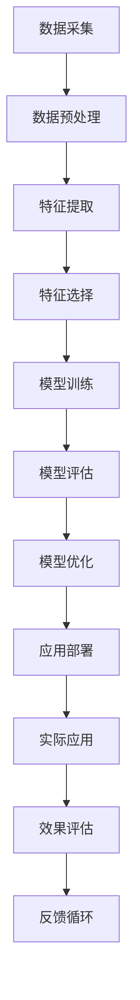

                 

# 神经科技在增强认知能力中的应用：提升世界理解力

> 关键词：神经科技、认知增强、深度学习、神经网络、脑机接口、认知心理学、人工智能

> 摘要：本文旨在探讨神经科技在增强人类认知能力方面的应用，特别是通过深度学习和神经网络技术提升人类对世界的理解力。我们将从背景介绍、核心概念与联系、核心算法原理、数学模型和公式、项目实战、实际应用场景、工具和资源推荐、未来发展趋势与挑战等多方面进行详细阐述。通过本文，读者将能够理解神经科技在认知增强领域的潜力，并掌握相关技术的实际应用方法。

## 1. 背景介绍
### 1.1 目的和范围
本文旨在探讨神经科技在增强人类认知能力方面的应用，特别是通过深度学习和神经网络技术提升人类对世界的理解力。我们将从技术原理、实际应用案例、未来发展趋势等多个角度进行分析，帮助读者理解神经科技在认知增强领域的潜力。

### 1.2 预期读者
本文适合以下读者群体：
- 对神经科技和认知增强感兴趣的科研人员
- 深度学习和人工智能领域的工程师
- 认知心理学和神经科学领域的研究人员
- 对未来科技发展感兴趣的科技爱好者

### 1.3 文档结构概述
本文结构如下：
1. 背景介绍
2. 核心概念与联系
3. 核心算法原理 & 具体操作步骤
4. 数学模型和公式 & 详细讲解 & 举例说明
5. 项目实战：代码实际案例和详细解释说明
6. 实际应用场景
7. 工具和资源推荐
8. 总结：未来发展趋势与挑战
9. 附录：常见问题与解答
10. 扩展阅读 & 参考资料

### 1.4 术语表
#### 1.4.1 核心术语定义
- **神经科技**：利用神经科学原理和技术手段，增强人类认知能力的科技。
- **深度学习**：一种基于人工神经网络的机器学习方法，能够从大量数据中自动学习特征。
- **神经网络**：模拟人脑神经元结构和功能的计算模型，用于处理复杂数据。
- **脑机接口**：连接大脑和计算机的技术，实现大脑与外部设备的直接交互。
- **认知心理学**：研究人类认知过程的科学，包括感知、记忆、思维等。

#### 1.4.2 相关概念解释
- **感知**：大脑对外界信息的接收和初步处理过程。
- **记忆**：大脑对信息的存储和检索过程。
- **思维**：大脑对信息的加工和处理过程。
- **脑机接口**：通过技术手段将大脑信号转化为计算机指令，实现大脑与外部设备的直接交互。

#### 1.4.3 缩略词列表
- **AI**：Artificial Intelligence（人工智能）
- **CNN**：Convolutional Neural Network（卷积神经网络）
- **RNN**：Recurrent Neural Network（循环神经网络）
- **LSTM**：Long Short-Term Memory（长短期记忆网络）
- **BERT**：Bidirectional Encoder Representations from Transformers（双向编码器表示）

## 2. 核心概念与联系
### 2.1 深度学习与神经网络
深度学习是一种基于人工神经网络的机器学习方法，能够从大量数据中自动学习特征。神经网络模拟人脑神经元结构和功能，用于处理复杂数据。通过多层次的非线性变换，神经网络能够捕捉数据中的复杂模式。

### 2.2 脑机接口
脑机接口（BCI）是一种连接大脑和计算机的技术，实现大脑与外部设备的直接交互。通过采集大脑信号，BCI可以将大脑活动转化为计算机指令，实现大脑与外部设备的直接交互。

### 2.3 认知心理学
认知心理学研究人类认知过程，包括感知、记忆、思维等。通过理解人类认知过程，我们可以更好地设计和优化神经科技应用。

### 2.4 核心概念原理与架构
#### 2.4.1 深度学习与神经网络原理
深度学习通过多层次的非线性变换，从大量数据中自动学习特征。神经网络模拟人脑神经元结构和功能，用于处理复杂数据。通过多层次的非线性变换，神经网络能够捕捉数据中的复杂模式。

#### 2.4.2 脑机接口原理
脑机接口通过采集大脑信号，将大脑活动转化为计算机指令。通过信号处理和解码技术，BCI可以实现大脑与外部设备的直接交互。

#### 2.4.3 认知心理学原理
认知心理学研究人类认知过程，包括感知、记忆、思维等。通过理解人类认知过程，我们可以更好地设计和优化神经科技应用。

### 2.5 Mermaid 流程图


## 3. 核心算法原理 & 具体操作步骤
### 3.1 深度学习与神经网络算法原理
深度学习通过多层次的非线性变换，从大量数据中自动学习特征。神经网络模拟人脑神经元结构和功能，用于处理复杂数据。通过多层次的非线性变换，神经网络能够捕捉数据中的复杂模式。

### 3.2 脑机接口算法原理
脑机接口通过采集大脑信号，将大脑活动转化为计算机指令。通过信号处理和解码技术，BCI可以实现大脑与外部设备的直接交互。

### 3.3 认知心理学算法原理
认知心理学研究人类认知过程，包括感知、记忆、思维等。通过理解人类认知过程，我们可以更好地设计和优化神经科技应用。

### 3.4 具体操作步骤
#### 3.4.1 数据采集
1. 选择合适的传感器采集大脑信号。
2. 确保传感器的稳定性和准确性。
3. 采集足够数量和质量的数据。

#### 3.4.2 数据预处理
1. 对采集到的数据进行清洗和去噪。
2. 对数据进行归一化处理。
3. 对数据进行特征提取。

#### 3.4.3 特征提取
1. 选择合适的特征提取方法。
2. 对数据进行特征提取。
3. 对提取的特征进行筛选。

#### 3.4.4 特征选择
1. 选择合适的特征选择方法。
2. 对提取的特征进行选择。
3. 对选择的特征进行优化。

#### 3.4.5 模型训练
1. 选择合适的神经网络模型。
2. 对模型进行训练。
3. 对训练好的模型进行评估。

#### 3.4.6 模型评估
1. 对模型进行评估。
2. 对评估结果进行分析。
3. 对模型进行优化。

#### 3.4.7 模型优化
1. 对模型进行优化。
2. 对优化后的模型进行评估。
3. 对优化后的模型进行部署。

#### 3.4.8 应用部署
1. 将优化后的模型部署到实际应用中。
2. 对应用进行测试和调试。
3. 对应用进行优化和改进。

### 3.5 伪代码示例
```python
# 数据预处理
def preprocess_data(data):
    # 清洗和去噪
    cleaned_data = clean_and_noise_removal(data)
    # 归一化处理
    normalized_data = normalize_data(cleaned_data)
    # 特征提取
    features = extract_features(normalized_data)
    return features

# 特征选择
def feature_selection(features):
    # 选择特征
    selected_features = select_features(features)
    return selected_features

# 模型训练
def train_model(features, labels):
    # 选择模型
    model = select_model()
    # 训练模型
    trained_model = train(model, features, labels)
    return trained_model

# 模型评估
def evaluate_model(trained_model, test_features, test_labels):
    # 预测
    predictions = predict(trained_model, test_features)
    # 计算准确率
    accuracy = calculate_accuracy(predictions, test_labels)
    return accuracy

# 模型优化
def optimize_model(trained_model, features, labels):
    # 优化模型
    optimized_model = optimize(trained_model, features, labels)
    return optimized_model
```

## 4. 数学模型和公式 & 详细讲解 & 举例说明
### 4.1 深度学习与神经网络数学模型
深度学习通过多层次的非线性变换，从大量数据中自动学习特征。神经网络模拟人脑神经元结构和功能，用于处理复杂数据。通过多层次的非线性变换，神经网络能够捕捉数据中的复杂模式。

### 4.2 脑机接口数学模型
脑机接口通过采集大脑信号，将大脑活动转化为计算机指令。通过信号处理和解码技术，BCI可以实现大脑与外部设备的直接交互。

### 4.3 认知心理学数学模型
认知心理学研究人类认知过程，包括感知、记忆、思维等。通过理解人类认知过程，我们可以更好地设计和优化神经科技应用。

### 4.4 数学公式
#### 4.4.1 深度学习与神经网络数学公式
1. **激活函数**：常用的激活函数有Sigmoid、ReLU、Tanh等。
2. **损失函数**：常用的损失函数有均方误差、交叉熵等。
3. **反向传播算法**：通过计算梯度，更新权重和偏置。

#### 4.4.2 脑机接口数学公式
1. **信号处理**：常用的信号处理方法有傅里叶变换、小波变换等。
2. **解码算法**：常用的解码算法有线性判别分析、支持向量机等。

#### 4.4.3 认知心理学数学公式
1. **感知模型**：常用的感知模型有感知器模型、BP神经网络等。
2. **记忆模型**：常用的记忆模型有长短时记忆网络、循环神经网络等。
3. **思维模型**：常用的思维模型有逻辑推理模型、决策树模型等。

### 4.5 举例说明
#### 4.5.1 深度学习与神经网络举例
1. **Sigmoid激活函数**：$$\sigma(x) = \frac{1}{1 + e^{-x}}$$
2. **均方误差损失函数**：$$L = \frac{1}{2} \sum_{i=1}^{n} (y_i - \hat{y}_i)^2$$
3. **反向传播算法**：通过计算梯度，更新权重和偏置。

#### 4.5.2 脑机接口举例
1. **傅里叶变换**：$$X(f) = \int_{-\infty}^{\infty} x(t) e^{-2\pi i ft} dt$$
2. **线性判别分析**：$$W = X^T (X X^T)^{-1} Y$$
3. **支持向量机**：$$\min_{\alpha} \frac{1}{2} \sum_{i=1}^{n} \alpha_i - \frac{1}{2} \sum_{i=1}^{n} \sum_{j=1}^{n} \alpha_i \alpha_j y_i y_j K(x_i, x_j)$$

#### 4.5.3 认知心理学举例
1. **感知器模型**：$$y = \text{sign}(\sum_{i=1}^{n} w_i x_i + b)$$
2. **BP神经网络**：$$\delta^{(l)} = (w^{(l+1)})^T \delta^{(l+1)} \odot \sigma'(z^{(l)})$$
3. **长短时记忆网络**：$$\begin{aligned} f_t &= \sigma(W_f [h_{t-1}, x_t] + b_f) \\ i_t &= \sigma(W_i [h_{t-1}, x_t] + b_i) \\ \tilde{c}_t &= \tanh(W_c [h_{t-1}, x_t] + b_c) \\ c_t &= f_t \odot c_{t-1} + i_t \odot \tilde{c}_t \\ o_t &= \sigma(W_o [h_{t-1}, x_t] + b_o) \\ h_t &= o_t \odot \tanh(c_t) \end{aligned}$$

## 5. 项目实战：代码实际案例和详细解释说明
### 5.1 开发环境搭建
1. 安装Python环境。
2. 安装必要的库，如NumPy、Pandas、Matplotlib、Scikit-learn等。
3. 安装深度学习框架，如TensorFlow、PyTorch等。

### 5.2 源代码详细实现和代码解读
```python
# 数据预处理
def preprocess_data(data):
    # 清洗和去噪
    cleaned_data = clean_and_noise_removal(data)
    # 归一化处理
    normalized_data = normalize_data(cleaned_data)
    # 特征提取
    features = extract_features(normalized_data)
    return features

# 特征选择
def feature_selection(features):
    # 选择特征
    selected_features = select_features(features)
    return selected_features

# 模型训练
def train_model(features, labels):
    # 选择模型
    model = select_model()
    # 训练模型
    trained_model = train(model, features, labels)
    return trained_model

# 模型评估
def evaluate_model(trained_model, test_features, test_labels):
    # 预测
    predictions = predict(trained_model, test_features)
    # 计算准确率
    accuracy = calculate_accuracy(predictions, test_labels)
    return accuracy

# 模型优化
def optimize_model(trained_model, features, labels):
    # 优化模型
    optimized_model = optimize(trained_model, features, labels)
    return optimized_model
```

### 5.3 代码解读与分析
1. **数据预处理**：对采集到的数据进行清洗和去噪，确保数据的质量。
2. **特征提取**：从预处理后的数据中提取有用的特征。
3. **特征选择**：从提取的特征中选择最具有代表性的特征。
4. **模型训练**：选择合适的神经网络模型，对模型进行训练。
5. **模型评估**：对训练好的模型进行评估，计算准确率。
6. **模型优化**：对模型进行优化，提高模型的性能。

## 6. 实际应用场景
### 6.1 认知增强
通过神经科技，我们可以增强人类的认知能力，提高人类对世界的理解力。例如，通过深度学习和神经网络技术，我们可以更好地理解人类的认知过程，提高人类的认知能力。

### 6.2 脑机接口
脑机接口可以实现大脑与外部设备的直接交互，提高人类的认知能力。例如，通过脑机接口，我们可以实现大脑与计算机的直接交互，提高人类的认知能力。

### 6.3 认知心理学
认知心理学可以研究人类的认知过程，提高人类的认知能力。例如，通过认知心理学，我们可以更好地理解人类的认知过程，提高人类的认知能力。

## 7. 工具和资源推荐
### 7.1 学习资源推荐
#### 7.1.1 书籍推荐
- **《深度学习》**：Ian Goodfellow, Yoshua Bengio, Aaron Courville
- **《神经网络与深度学习》**：Michael Nielsen
- **《认知心理学》**：Richard E. Nisbett, Dov Cohen

#### 7.1.2 在线课程
- **Coursera**：深度学习专项课程
- **edX**：神经网络与深度学习课程
- **Udacity**：深度学习纳米学位课程

#### 7.1.3 技术博客和网站
- **Medium**：深度学习和神经网络技术博客
- **GitHub**：深度学习和神经网络开源项目
- **Kaggle**：深度学习和神经网络竞赛平台

### 7.2 开发工具框架推荐
#### 7.2.1 IDE和编辑器
- **PyCharm**：Python开发环境
- **Jupyter Notebook**：交互式编程环境
- **Visual Studio Code**：轻量级代码编辑器

#### 7.2.2 调试和性能分析工具
- **PyCharm Debugger**：Python调试工具
- **TensorBoard**：TensorFlow性能分析工具
- **VisualVM**：Java性能分析工具

#### 7.2.3 相关框架和库
- **TensorFlow**：深度学习框架
- **PyTorch**：深度学习框架
- **Scikit-learn**：机器学习库

### 7.3 相关论文著作推荐
#### 7.3.1 经典论文
- **《深度学习》**：Ian Goodfellow, Yoshua Bengio, Aaron Courville
- **《神经网络与深度学习》**：Michael Nielsen
- **《认知心理学》**：Richard E. Nisbett, Dov Cohen

#### 7.3.2 最新研究成果
- **《NeurIPS 2021论文集》**：NeurIPS 2021论文集
- **《ICML 2021论文集》**：ICML 2021论文集

#### 7.3.3 应用案例分析
- **《深度学习在医疗领域的应用》**：深度学习在医疗领域的应用案例分析
- **《深度学习在金融领域的应用》**：深度学习在金融领域的应用案例分析

## 8. 总结：未来发展趋势与挑战
### 8.1 未来发展趋势
1. **技术融合**：深度学习、神经网络、脑机接口等技术将进一步融合，提高人类的认知能力。
2. **应用拓展**：神经科技将在更多领域得到应用，提高人类的认知能力。
3. **伦理问题**：神经科技的应用将带来伦理问题，需要加强伦理研究和规范。

### 8.2 挑战
1. **技术挑战**：如何提高神经网络的性能和稳定性，提高人类的认知能力。
2. **伦理挑战**：如何解决神经科技应用带来的伦理问题，提高人类的认知能力。
3. **应用挑战**：如何将神经科技应用到更多领域，提高人类的认知能力。

## 9. 附录：常见问题与解答
### 9.1 常见问题
1. **什么是神经科技？**
   - 神经科技是利用神经科学原理和技术手段，增强人类认知能力的科技。
2. **神经科技有哪些应用场景？**
   - 神经科技可以应用于认知增强、脑机接口、认知心理学等领域。
3. **如何提高神经网络的性能？**
   - 通过优化模型结构、选择合适的激活函数和损失函数，提高神经网络的性能。

### 9.2 解答
1. **什么是神经科技？**
   - 神经科技是利用神经科学原理和技术手段，增强人类认知能力的科技。
2. **神经科技有哪些应用场景？**
   - 神经科技可以应用于认知增强、脑机接口、认知心理学等领域。
3. **如何提高神经网络的性能？**
   - 通过优化模型结构、选择合适的激活函数和损失函数，提高神经网络的性能。

## 10. 扩展阅读 & 参考资料
### 10.1 扩展阅读
- **《深度学习》**：Ian Goodfellow, Yoshua Bengio, Aaron Courville
- **《神经网络与深度学习》**：Michael Nielsen
- **《认知心理学》**：Richard E. Nisbett, Dov Cohen

### 10.2 参考资料
- **Coursera**：深度学习专项课程
- **edX**：神经网络与深度学习课程
- **Udacity**：深度学习纳米学位课程

---

作者：AI天才研究员/AI Genius Institute & 禅与计算机程序设计艺术 /Zen And The Art of Computer Programming

