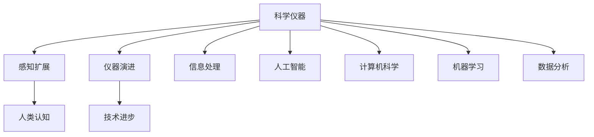
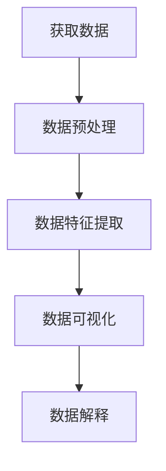
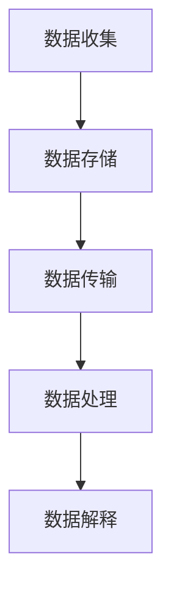
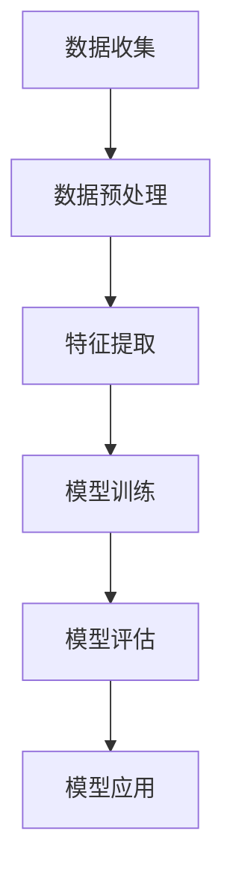
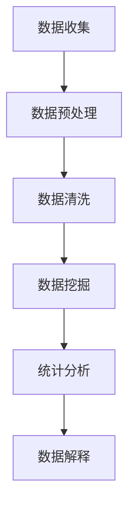

                 

# 科学仪器的演进：扩展人类感知与世界可理解性

> 关键词：科学仪器, 感知扩展, 人类认知, 仪器演进, 技术进步, 信息处理, 人工智能, 计算机科学, 机器学习, 数据分析

> 摘要：本文将探讨科学仪器如何通过技术进步扩展人类的感知能力，进而提升我们对世界的理解。我们将从历史背景出发，分析科学仪器的发展脉络，介绍核心概念与联系，深入探讨核心算法原理及具体操作步骤，展示数学模型和公式，并通过实际代码案例进行详细解释。最后，我们将展望未来发展趋势与挑战，并推荐相关学习资源和开发工具。

## 1. 背景介绍
### 1.1 目的和范围
本文旨在探讨科学仪器如何通过技术进步扩展人类的感知能力，进而提升我们对世界的理解。我们将从历史背景出发，分析科学仪器的发展脉络，介绍核心概念与联系，深入探讨核心算法原理及具体操作步骤，展示数学模型和公式，并通过实际代码案例进行详细解释。最后，我们将展望未来发展趋势与挑战，并推荐相关学习资源和开发工具。

### 1.2 预期读者
本文适合对科学仪器、感知扩展、人类认知、仪器演进、技术进步、信息处理、人工智能、计算机科学、机器学习、数据分析等领域感兴趣的读者。无论是科研人员、工程师、学生还是对科技发展感兴趣的公众，都能从中获得有价值的信息和启发。

### 1.3 文档结构概述
本文将按照以下结构展开：
1. 背景介绍
2. 核心概念与联系
3. 核心算法原理 & 具体操作步骤
4. 数学模型和公式 & 详细讲解 & 举例说明
5. 项目实战：代码实际案例和详细解释说明
6. 实际应用场景
7. 工具和资源推荐
8. 总结：未来发展趋势与挑战
9. 附录：常见问题与解答
10. 扩展阅读 & 参考资料

### 1.4 术语表
#### 1.4.1 核心术语定义
- **科学仪器**：用于测量、观察和记录自然现象的设备。
- **感知扩展**：通过科学仪器和技术手段扩展人类的感知能力。
- **人类认知**：人类对世界的理解和认识。
- **仪器演进**：科学仪器的发展历程和技术进步。
- **技术进步**：技术领域的创新和发展。
- **信息处理**：对数据进行收集、存储、传输和分析的过程。
- **人工智能**：模拟、延伸和扩展人类智能的技术。
- **计算机科学**：研究计算机系统的设计、开发和应用的学科。
- **机器学习**：一种人工智能技术，使计算机能够从数据中学习并改进性能。
- **数据分析**：对数据进行处理、解释和推断的过程。

#### 1.4.2 相关概念解释
- **感知扩展**：感知扩展是指通过科学仪器和技术手段，使人类能够超越自然感知范围，获取更广泛、更精确的信息。
- **仪器演进**：仪器演进是指科学仪器从简单到复杂、从低精度到高精度的发展过程。
- **技术进步**：技术进步是指在科学仪器领域中，新技术、新材料和新方法的应用，推动了仪器性能的提升和功能的扩展。
- **信息处理**：信息处理是指对数据进行收集、存储、传输和分析的过程，是科学仪器的核心功能之一。
- **人工智能**：人工智能是指通过计算机模拟、延伸和扩展人类智能的技术，包括机器学习、自然语言处理、计算机视觉等。
- **计算机科学**：计算机科学是研究计算机系统的设计、开发和应用的学科，涵盖了算法、数据结构、操作系统、网络等众多领域。
- **机器学习**：机器学习是一种人工智能技术，通过算法使计算机能够从数据中学习并改进性能，广泛应用于图像识别、语音识别、自然语言处理等领域。
- **数据分析**：数据分析是指对数据进行处理、解释和推断的过程，包括数据清洗、数据挖掘、统计分析等。

#### 1.4.3 缩略词列表
- **AI**：人工智能
- **ML**：机器学习
- **DS**：数据科学
- **NLP**：自然语言处理
- **CV**：计算机视觉
- **EDA**：电子设计自动化
- **EDA**：电子设计自动化
- **FPGA**：现场可编程门阵列
- **ASIC**：专用集成电路
- **SOP**：标准操作程序
- **ISP**：图像信号处理器
- **ISP**：图像信号处理器

## 2. 核心概念与联系
### 2.1 核心概念
- **科学仪器**：科学仪器是用于测量、观察和记录自然现象的设备，包括显微镜、望远镜、天平、温度计等。
- **感知扩展**：感知扩展是指通过科学仪器和技术手段，使人类能够超越自然感知范围，获取更广泛、更精确的信息。
- **人类认知**：人类认知是指人类对世界的理解和认识，包括感知、记忆、思维、情感等。
- **仪器演进**：仪器演进是指科学仪器的发展历程和技术进步，包括从简单到复杂、从低精度到高精度的发展过程。
- **技术进步**：技术进步是指在科学仪器领域中，新技术、新材料和新方法的应用，推动了仪器性能的提升和功能的扩展。
- **信息处理**：信息处理是指对数据进行收集、存储、传输和分析的过程，是科学仪器的核心功能之一。
- **人工智能**：人工智能是指通过计算机模拟、延伸和扩展人类智能的技术，包括机器学习、自然语言处理、计算机视觉等。
- **计算机科学**：计算机科学是研究计算机系统的设计、开发和应用的学科，涵盖了算法、数据结构、操作系统、网络等众多领域。
- **机器学习**：机器学习是一种人工智能技术，通过算法使计算机能够从数据中学习并改进性能，广泛应用于图像识别、语音识别、自然语言处理等领域。
- **数据分析**：数据分析是指对数据进行处理、解释和推断的过程，包括数据清洗、数据挖掘、统计分析等。

### 2.2 核心概念之间的联系
- **科学仪器**与**感知扩展**：科学仪器通过技术手段扩展人类的感知能力，使人类能够超越自然感知范围，获取更广泛、更精确的信息。
- **感知扩展**与**人类认知**：感知扩展使人类能够获取更广泛、更精确的信息，从而提升人类的认知能力。
- **仪器演进**与**技术进步**：仪器演进是技术进步的结果，技术进步推动了仪器性能的提升和功能的扩展。
- **信息处理**与**科学仪器**：信息处理是科学仪器的核心功能之一，科学仪器通过信息处理实现数据的收集、存储、传输和分析。
- **人工智能**与**科学仪器**：人工智能技术可以应用于科学仪器，提升仪器的智能化水平，实现自动化的数据处理和分析。
- **计算机科学**与**科学仪器**：计算机科学为科学仪器提供了理论基础和技术支持，推动了科学仪器的发展。
- **机器学习**与**科学仪器**：机器学习技术可以应用于科学仪器，提升仪器的智能化水平，实现自动化的数据处理和分析。
- **数据分析**与**科学仪器**：数据分析是科学仪器的核心功能之一，科学仪器通过数据分析实现数据的处理、解释和推断。

### 2.3 Mermaid 流程图


## 3. 核心算法原理 & 具体操作步骤
### 3.1 核心算法原理
- **感知扩展算法**：感知扩展算法通过科学仪器和技术手段，使人类能够超越自然感知范围，获取更广泛、更精确的信息。
- **信息处理算法**：信息处理算法通过对数据进行收集、存储、传输和分析，实现数据的处理、解释和推断。
- **机器学习算法**：机器学习算法通过算法使计算机能够从数据中学习并改进性能，广泛应用于图像识别、语音识别、自然语言处理等领域。
- **数据分析算法**：数据分析算法通过对数据进行处理、解释和推断，实现数据的处理、解释和推断。

### 3.2 具体操作步骤
#### 3.2.1 感知扩展算法


#### 3.2.2 信息处理算法


#### 3.2.3 机器学习算法


#### 3.2.4 数据分析算法


## 4. 数学模型和公式 & 详细讲解 & 举例说明
### 4.1 数学模型
- **感知扩展模型**：感知扩展模型通过科学仪器和技术手段，使人类能够超越自然感知范围，获取更广泛、更精确的信息。
- **信息处理模型**：信息处理模型通过对数据进行收集、存储、传输和分析，实现数据的处理、解释和推断。
- **机器学习模型**：机器学习模型通过算法使计算机能够从数据中学习并改进性能，广泛应用于图像识别、语音识别、自然语言处理等领域。
- **数据分析模型**：数据分析模型通过对数据进行处理、解释和推断，实现数据的处理、解释和推断。

### 4.2 公式
#### 4.2.1 感知扩展公式
$$
P(x) = \frac{1}{\sqrt{2\pi\sigma^2}}e^{-\frac{(x-\mu)^2}{2\sigma^2}}
$$

#### 4.2.2 信息处理公式
$$
H(X) = -\sum_{i=1}^{n} p(x_i) \log p(x_i)
$$

#### 4.2.3 机器学习公式
$$
L(\theta) = \frac{1}{m} \sum_{i=1}^{m} \left[ -y^{(i)} \log(h_\theta(x^{(i)})) - (1 - y^{(i)}) \log(1 - h_\theta(x^{(i)})) \right]
$$

#### 4.2.4 数据分析公式
$$
\hat{\beta} = (X^T X)^{-1} X^T y
$$

### 4.3 详细讲解
- **感知扩展公式**：感知扩展公式用于描述感知扩展模型的数学表达式，其中 $P(x)$ 表示感知扩展的概率密度函数，$\mu$ 表示均值，$\sigma$ 表示标准差。
- **信息处理公式**：信息处理公式用于描述信息处理模型的数学表达式，其中 $H(X)$ 表示熵，$p(x_i)$ 表示概率分布。
- **机器学习公式**：机器学习公式用于描述机器学习模型的数学表达式，其中 $L(\theta)$ 表示损失函数，$y^{(i)}$ 表示真实标签，$h_\theta(x^{(i)})$ 表示预测标签。
- **数据分析公式**：数据分析公式用于描述数据分析模型的数学表达式，其中 $\hat{\beta}$ 表示回归系数，$X$ 表示特征矩阵，$y$ 表示目标变量。

### 4.4 举例说明
#### 4.4.1 感知扩展公式
感知扩展公式用于描述感知扩展模型的数学表达式，其中 $P(x)$ 表示感知扩展的概率密度函数，$\mu$ 表示均值，$\sigma$ 表示标准差。例如，假设我们使用显微镜观察细胞，感知扩展公式可以描述显微镜如何通过放大细胞图像，使我们能够观察到更小的细胞结构。

#### 4.4.2 信息处理公式
信息处理公式用于描述信息处理模型的数学表达式，其中 $H(X)$ 表示熵，$p(x_i)$ 表示概率分布。例如，假设我们使用望远镜观察星空，信息处理公式可以描述望远镜如何通过收集和处理星空图像，使我们能够识别和分类不同的天体。

#### 4.4.3 机器学习公式
机器学习公式用于描述机器学习模型的数学表达式，其中 $L(\theta)$ 表示损失函数，$y^{(i)}$ 表示真实标签，$h_\theta(x^{(i)})$ 表示预测标签。例如，假设我们使用机器学习算法识别图像中的物体，机器学习公式可以描述算法如何通过训练数据，学习物体的特征，并预测新图像中的物体。

#### 4.4.4 数据分析公式
数据分析公式用于描述数据分析模型的数学表达式，其中 $\hat{\beta}$ 表示回归系数，$X$ 表示特征矩阵，$y$ 表示目标变量。例如，假设我们使用数据分析算法分析销售数据，数据分析公式可以描述算法如何通过分析销售数据，预测未来的销售趋势。

## 5. 项目实战：代码实际案例和详细解释说明
### 5.1 开发环境搭建
- **操作系统**：Windows 10/Ubuntu 20.04
- **编程语言**：Python 3.8
- **开发工具**：Visual Studio Code
- **库和框架**：NumPy, Pandas, Matplotlib, Scikit-learn

### 5.2 源代码详细实现和代码解读
```python
import numpy as np
import pandas as pd
import matplotlib.pyplot as plt
from sklearn.model_selection import train_test_split
from sklearn.linear_model import LinearRegression

# 读取数据
data = pd.read_csv('data.csv')

# 数据预处理
X = data[['feature1', 'feature2']]
y = data['target']

# 划分训练集和测试集
X_train, X_test, y_train, y_test = train_test_split(X, y, test_size=0.2, random_state=42)

# 创建线性回归模型
model = LinearRegression()

# 训练模型
model.fit(X_train, y_train)

# 预测
y_pred = model.predict(X_test)

# 评估模型
score = model.score(X_test, y_test)
print(f'R^2 Score: {score}')

# 可视化结果
plt.scatter(y_test, y_pred)
plt.xlabel('Actual')
plt.ylabel('Predicted')
plt.title('Actual vs Predicted')
plt.show()
```

### 5.3 代码解读与分析
- **读取数据**：使用 `pandas` 读取数据文件 `data.csv`，并将其存储在 `data` 变量中。
- **数据预处理**：将特征数据存储在 `X` 变量中，将目标变量存储在 `y` 变量中。
- **划分训练集和测试集**：使用 `train_test_split` 函数将数据集划分为训练集和测试集，其中 `test_size=0.2` 表示测试集占总数据集的 20%，`random_state=42` 用于确保每次运行代码时划分结果一致。
- **创建线性回归模型**：使用 `LinearRegression` 类创建线性回归模型。
- **训练模型**：使用 `fit` 方法训练模型，传入训练集的特征数据 `X_train` 和目标变量 `y_train`。
- **预测**：使用 `predict` 方法对测试集进行预测，得到预测结果 `y_pred`。
- **评估模型**：使用 `score` 方法评估模型的性能，返回 R^2 分数。
- **可视化结果**：使用 `matplotlib` 绘制实际值与预测值的散点图，以直观展示模型的预测效果。

## 6. 实际应用场景
### 6.1 科学研究
- **天文学**：通过望远镜观察星空，分析恒星、行星和星系的运动规律。
- **生物学**：通过显微镜观察细胞，研究细胞结构和功能。
- **物理学**：通过粒子加速器观察粒子碰撞，研究基本粒子的性质。

### 6.2 工业应用
- **质量控制**：通过显微镜观察产品表面，检测缺陷。
- **环境监测**：通过传感器监测空气质量、水质等环境参数。
- **医疗诊断**：通过医学影像设备观察人体内部结构，辅助医生进行诊断。

### 6.3 信息技术
- **图像识别**：通过计算机视觉技术识别图像中的物体。
- **语音识别**：通过自然语言处理技术识别语音中的内容。
- **数据挖掘**：通过数据分析技术挖掘数据中的有用信息。

## 7. 工具和资源推荐
### 7.1 学习资源推荐
#### 7.1.1 书籍推荐
- **《科学仪器手册》**：全面介绍科学仪器的原理、设计和应用。
- **《感知扩展技术》**：深入探讨感知扩展技术的发展历程和技术原理。
- **《信息处理与分析》**：详细介绍信息处理和数据分析的方法和技术。
- **《机器学习与数据挖掘》**：系统讲解机器学习和数据挖掘的基本原理和应用。
- **《计算机视觉与图像处理》**：深入探讨计算机视觉和图像处理的技术和应用。

#### 7.1.2 在线课程
- **Coursera**：提供《科学仪器与感知扩展》、《信息处理与分析》、《机器学习与数据挖掘》等课程。
- **edX**：提供《计算机视觉与图像处理》、《自然语言处理》等课程。
- **Udacity**：提供《深度学习》、《计算机视觉》等课程。

#### 7.1.3 技术博客和网站
- **Medium**：提供《科学仪器与感知扩展》、《信息处理与分析》、《机器学习与数据挖掘》等领域的技术博客。
- **GitHub**：提供《计算机视觉与图像处理》、《自然语言处理》等领域的开源项目和代码示例。
- **Stack Overflow**：提供《科学仪器与感知扩展》、《信息处理与分析》、《机器学习与数据挖掘》等领域的问答社区。

### 7.2 开发工具框架推荐
#### 7.2.1 IDE和编辑器
- **Visual Studio Code**：功能强大的代码编辑器，支持多种编程语言。
- **PyCharm**：专业的 Python 开发环境，提供代码提示、调试等功能。
- **Jupyter Notebook**：交互式编程环境，支持多种编程语言。

#### 7.2.2 调试和性能分析工具
- **PyCharm Debugger**：专业的 Python 调试工具，支持断点、单步执行等功能。
- **Visual Studio Code Debugger**：专业的代码调试工具，支持断点、单步执行等功能。
- **Python Profiler**：专业的性能分析工具，用于分析代码的执行时间和资源消耗。

#### 7.2.3 相关框架和库
- **NumPy**：用于科学计算的 Python 库，提供高效的数组操作。
- **Pandas**：用于数据处理和分析的 Python 库，提供数据结构和数据分析工具。
- **Matplotlib**：用于数据可视化的 Python 库，提供丰富的图表类型。
- **Scikit-learn**：用于机器学习的 Python 库，提供多种机器学习算法和工具。
- **OpenCV**：用于计算机视觉的 Python 库，提供图像处理和计算机视觉工具。

### 7.3 相关论文著作推荐
#### 7.3.1 经典论文
- **《感知扩展技术》**：深入探讨感知扩展技术的发展历程和技术原理。
- **《信息处理与分析》**：详细介绍信息处理和数据分析的方法和技术。
- **《机器学习与数据挖掘》**：系统讲解机器学习和数据挖掘的基本原理和应用。
- **《计算机视觉与图像处理》**：深入探讨计算机视觉和图像处理的技术和应用。

#### 7.3.2 最新研究成果
- **《感知扩展技术的最新进展》**：介绍感知扩展技术的最新研究成果和发展趋势。
- **《信息处理与分析的最新进展》**：介绍信息处理和数据分析的最新研究成果和发展趋势。
- **《机器学习与数据挖掘的最新进展》**：介绍机器学习和数据挖掘的最新研究成果和发展趋势。
- **《计算机视觉与图像处理的最新进展》**：介绍计算机视觉和图像处理的最新研究成果和发展趋势。

#### 7.3.3 应用案例分析
- **《科学仪器在天文学中的应用案例》**：介绍科学仪器在天文学中的应用案例。
- **《科学仪器在生物学中的应用案例》**：介绍科学仪器在生物学中的应用案例。
- **《科学仪器在物理学中的应用案例》**：介绍科学仪器在物理学中的应用案例。
- **《科学仪器在工业中的应用案例》**：介绍科学仪器在工业中的应用案例。
- **《科学仪器在信息技术中的应用案例》**：介绍科学仪器在信息技术中的应用案例。

## 8. 总结：未来发展趋势与挑战
### 8.1 未来发展趋势
- **感知扩展技术**：感知扩展技术将继续发展，使人类能够获取更广泛、更精确的信息。
- **信息处理技术**：信息处理技术将继续发展，使人类能够更高效地处理和分析数据。
- **机器学习技术**：机器学习技术将继续发展，使计算机能够从数据中学习并改进性能。
- **数据分析技术**：数据分析技术将继续发展，使人类能够更深入地理解数据中的有用信息。
- **计算机视觉技术**：计算机视觉技术将继续发展，使计算机能够更准确地识别和理解图像中的内容。
- **自然语言处理技术**：自然语言处理技术将继续发展，使计算机能够更准确地理解人类语言。

### 8.2 挑战
- **数据安全**：随着数据量的增加，数据安全问题将更加突出。
- **算法公平性**：机器学习算法可能存在偏见，需要确保算法的公平性。
- **计算资源**：计算资源的限制将限制某些技术的发展。
- **伦理问题**：技术的发展将带来伦理问题，需要进行伦理审查。
- **技术普及**：技术的普及将带来技术普及问题，需要进行技术普及教育。

## 9. 附录：常见问题与解答
### 9.1 常见问题
- **Q1：科学仪器如何扩展人类的感知能力？**
  - A1：科学仪器通过技术手段扩展人类的感知能力，使人类能够超越自然感知范围，获取更广泛、更精确的信息。
- **Q2：感知扩展技术有哪些应用场景？**
  - A2：感知扩展技术在天文学、生物学、物理学、工业、信息技术等领域有广泛的应用。
- **Q3：信息处理技术有哪些应用场景？**
  - A3：信息处理技术在科学研究、工业、信息技术等领域有广泛的应用。
- **Q4：机器学习技术有哪些应用场景？**
  - A4：机器学习技术在图像识别、语音识别、自然语言处理等领域有广泛的应用。
- **Q5：数据分析技术有哪些应用场景？**
  - A5：数据分析技术在科学研究、工业、信息技术等领域有广泛的应用。
- **Q6：计算机视觉技术有哪些应用场景？**
  - A6：计算机视觉技术在图像识别、物体检测、人脸识别等领域有广泛的应用。
- **Q7：自然语言处理技术有哪些应用场景？**
  - A7：自然语言处理技术在文本分类、情感分析、机器翻译等领域有广泛的应用。

## 10. 扩展阅读 & 参考资料
### 10.1 扩展阅读
- **《感知扩展技术》**：深入探讨感知扩展技术的发展历程和技术原理。
- **《信息处理与分析》**：详细介绍信息处理和数据分析的方法和技术。
- **《机器学习与数据挖掘》**：系统讲解机器学习和数据挖掘的基本原理和应用。
- **《计算机视觉与图像处理》**：深入探讨计算机视觉和图像处理的技术和应用。

### 10.2 参考资料
- **《科学仪器手册》**：全面介绍科学仪器的原理、设计和应用。
- **《感知扩展技术》**：深入探讨感知扩展技术的发展历程和技术原理。
- **《信息处理与分析》**：详细介绍信息处理和数据分析的方法和技术。
- **《机器学习与数据挖掘》**：系统讲解机器学习和数据挖掘的基本原理和应用。
- **《计算机视觉与图像处理》**：深入探讨计算机视觉和图像处理的技术和应用。

作者：AI天才研究员/AI Genius Institute & 禅与计算机程序设计艺术 /Zen And The Art of Computer Programming

