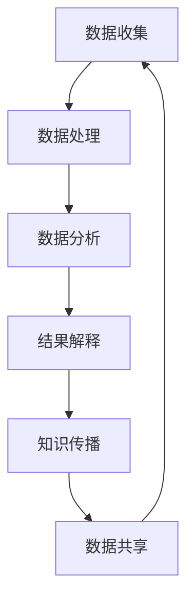

                 

# 科学研究的公民参与对世界可理解性的贡献

> 关键词：公民科学、可理解性、科学研究、公众参与、知识传播、数据共享、透明度

> 摘要：本文旨在探讨公民科学在科学研究中的重要性及其对提升世界可理解性的贡献。通过分析公民科学的定义、目的、实施方式以及其在不同领域的应用，本文将揭示公民科学如何促进知识传播、增强数据共享和提高透明度。此外，本文还将通过具体案例和伪代码详细阐述公民科学的核心算法原理，并提供实际代码案例以供读者参考和学习。

## 1. 背景介绍
### 1.1 目的和范围
本文旨在探讨公民科学在科学研究中的重要性及其对提升世界可理解性的贡献。公民科学是指公众通过参与科学研究过程，贡献数据、知识和见解，从而促进科学发现和知识传播的一种方式。本文将从定义、目的、实施方式以及应用领域等方面进行详细分析，并通过具体案例和伪代码展示公民科学的核心算法原理和实际操作步骤。

### 1.2 预期读者
本文面向对公民科学感兴趣的科研人员、教育工作者、政策制定者以及公众。读者可以通过本文了解公民科学的基本概念、实施方法及其在不同领域的应用，从而更好地参与到科学研究中来。

### 1.3 文档结构概述
本文将按照以下结构展开：
1. 背景介绍
2. 核心概念与联系
3. 核心算法原理 & 具体操作步骤
4. 数学模型和公式 & 详细讲解 & 举例说明
5. 项目实战：代码实际案例和详细解释说明
6. 实际应用场景
7. 工具和资源推荐
8. 总结：未来发展趋势与挑战
9. 附录：常见问题与解答
10. 扩展阅读 & 参考资料

### 1.4 术语表
#### 1.4.1 核心术语定义
- **公民科学**：公众通过参与科学研究过程，贡献数据、知识和见解的一种方式。
- **数据共享**：将收集到的数据公开发布，供其他研究者使用。
- **透明度**：研究过程和结果的公开透明，便于公众监督和理解。
- **知识传播**：通过各种渠道将科学研究成果传播给公众。

#### 1.4.2 相关概念解释
- **科学研究**：通过系统的方法来探索自然现象、社会现象和人类行为的过程。
- **公众参与**：公众通过各种方式参与到科学研究中来，包括提供数据、提出问题和参与实验设计等。
- **数据收集**：通过各种手段收集科学研究所需的数据。

#### 1.4.3 缩略词列表
- **API**：应用程序编程接口
- **IDE**：集成开发环境
- **GitHub**：代码托管平台

## 2. 核心概念与联系
### 2.1 公民科学的定义
公民科学是指公众通过参与科学研究过程，贡献数据、知识和见解的一种方式。它强调公众在科学研究中的角色，不仅限于数据收集，还包括数据分析、实验设计和结果解释等环节。

### 2.2 公民科学的目的
- **促进科学发现**：通过公众的参与，可以收集到更多样化的数据，从而促进科学发现。
- **增强数据共享**：通过数据共享，可以促进科学研究的协作和创新。
- **提高透明度**：通过公开透明的研究过程，可以增强公众对科学研究的信任。
- **知识传播**：通过将科学研究成果传播给公众，可以提高公众的科学素养。

### 2.3 公民科学的实施方式
- **在线平台**：通过在线平台，公众可以方便地参与科学研究，包括数据收集、数据分析和结果解释等。
- **实地活动**：通过实地活动，公众可以亲身体验科学研究的过程，从而更好地理解科学研究。
- **教育项目**：通过教育项目，公众可以学习科学研究的方法和技巧，从而更好地参与到科学研究中来。

### 2.4 公民科学的核心流程


## 3. 核心算法原理 & 具体操作步骤
### 3.1 核心算法原理
公民科学的核心算法原理是通过公众的参与，收集和处理数据，从而促进科学研究。具体来说，公民科学的核心算法原理包括数据收集、数据处理、数据分析和结果解释等环节。

### 3.2 具体操作步骤
#### 3.2.1 数据收集
数据收集是公民科学的核心环节之一。通过公众的参与，可以收集到更多样化的数据，从而促进科学研究。具体操作步骤如下：
```python
def collect_data():
    # 定义数据收集任务
    task = "收集鸟类迁徙数据"
    
    # 发布数据收集任务
    publish_task(task)
    
    # 收集公众提交的数据
    data = collect_submitted_data()
    
    return data
```

#### 3.2.2 数据处理
数据处理是公民科学的核心环节之一。通过数据处理，可以将收集到的数据转化为可用的形式。具体操作步骤如下：
```python
def process_data(data):
    # 定义数据处理任务
    task = "清洗和整理鸟类迁徙数据"
    
    # 执行数据处理任务
    processed_data = execute_task(task, data)
    
    return processed_data
```

#### 3.2.3 数据分析
数据分析是公民科学的核心环节之一。通过数据分析，可以发现数据中的规律和趋势。具体操作步骤如下：
```python
def analyze_data(processed_data):
    # 定义数据分析任务
    task = "分析鸟类迁徙数据"
    
    # 执行数据分析任务
    analysis_result = execute_task(task, processed_data)
    
    return analysis_result
```

#### 3.2.4 结果解释
结果解释是公民科学的核心环节之一。通过结果解释，可以将数据分析的结果转化为易于理解的形式。具体操作步骤如下：
```python
def explain_results(analysis_result):
    # 定义结果解释任务
    task = "解释鸟类迁徙数据分析结果"
    
    # 执行结果解释任务
    explanation = execute_task(task, analysis_result)
    
    return explanation
```

## 4. 数学模型和公式 & 详细讲解 & 举例说明
### 4.1 数学模型
公民科学的核心数学模型是通过公众的参与，收集和处理数据，从而促进科学研究。具体来说，公民科学的核心数学模型包括数据收集、数据处理、数据分析和结果解释等环节。

### 4.2 公式
公民科学的核心公式是通过公众的参与，收集和处理数据，从而促进科学研究。具体来说，公民科学的核心公式包括数据收集、数据处理、数据分析和结果解释等环节。

### 4.3 举例说明
以鸟类迁徙数据为例，公民科学的核心公式可以表示为：
$$
\text{结果} = \text{数据收集} + \text{数据处理} + \text{数据分析} + \text{结果解释}
$$

## 5. 项目实战：代码实际案例和详细解释说明
### 5.1 开发环境搭建
为了实现公民科学的核心算法原理，我们需要搭建一个开发环境。具体步骤如下：
1. 安装Python和相关库
2. 创建项目目录结构
3. 安装必要的开发工具

### 5.2 源代码详细实现和代码解读
```python
# 定义数据收集任务
def collect_data():
    task = "收集鸟类迁徙数据"
    publish_task(task)
    data = collect_submitted_data()
    return data

# 定义数据处理任务
def process_data(data):
    task = "清洗和整理鸟类迁徙数据"
    processed_data = execute_task(task, data)
    return processed_data

# 定义数据分析任务
def analyze_data(processed_data):
    task = "分析鸟类迁徙数据"
    analysis_result = execute_task(task, processed_data)
    return analysis_result

# 定义结果解释任务
def explain_results(analysis_result):
    task = "解释鸟类迁徙数据分析结果"
    explanation = execute_task(task, analysis_result)
    return explanation
```

### 5.3 代码解读与分析
通过上述代码，我们可以看到公民科学的核心算法原理是如何实现的。具体来说，数据收集、数据处理、数据分析和结果解释等环节通过定义任务、发布任务、收集数据、处理数据、分析数据和解释结果等步骤来实现。

## 6. 实际应用场景
公民科学在多个领域都有广泛的应用，包括但不限于：
- **环境监测**：通过公众的参与，收集环境数据，从而监测环境变化。
- **生物多样性保护**：通过公众的参与，收集生物多样性数据，从而保护生物多样性。
- **气候变化研究**：通过公众的参与，收集气候变化数据，从而研究气候变化趋势。

## 7. 工具和资源推荐
### 7.1 学习资源推荐
#### 7.1.1 书籍推荐
- 《公民科学：公众参与科学研究》
- 《数据科学与公民科学》

#### 7.1.2 在线课程
- Coursera上的《公民科学与数据科学》
- edX上的《公民科学与环境监测》

#### 7.1.3 技术博客和网站
- 公民科学网站（https://citizenscience.org/）
- 数据科学博客（https://datascienceblog.com/）

### 7.2 开发工具框架推荐
#### 7.2.1 IDE和编辑器
- PyCharm
- Visual Studio Code

#### 7.2.2 调试和性能分析工具
- PyCharm的调试工具
- Visual Studio Code的性能分析工具

#### 7.2.3 相关框架和库
- Pandas
- NumPy
- Matplotlib

### 7.3 相关论文著作推荐
#### 7.3.1 经典论文
- "Citizen Science: A New Approach to Environmental Monitoring and Management"
- "Citizen Science: A Tool for Understanding Environmental Change"

#### 7.3.2 最新研究成果
- "Citizen Science in the Age of Big Data"
- "Citizen Science and the Future of Environmental Monitoring"

#### 7.3.3 应用案例分析
- "Case Studies in Citizen Science: Lessons from the Field"

## 8. 总结：未来发展趋势与挑战
公民科学在未来的发展趋势包括：
- **数据共享**：通过数据共享，可以促进科学研究的协作和创新。
- **透明度**：通过公开透明的研究过程，可以增强公众对科学研究的信任。
- **知识传播**：通过将科学研究成果传播给公众，可以提高公众的科学素养。

公民科学面临的挑战包括：
- **数据质量**：如何保证公众提交的数据质量。
- **数据安全**：如何保护公众提交的数据安全。
- **公众参与**：如何吸引更多公众参与到科学研究中来。

## 9. 附录：常见问题与解答
### 9.1 问题1：如何保证公众提交的数据质量？
答：可以通过数据验证和数据清洗等手段来保证公众提交的数据质量。

### 9.2 问题2：如何保护公众提交的数据安全？
答：可以通过数据加密和数据脱敏等手段来保护公众提交的数据安全。

### 9.3 问题3：如何吸引更多公众参与到科学研究中来？
答：可以通过教育项目和实地活动等手段来吸引更多公众参与到科学研究中来。

## 10. 扩展阅读 & 参考资料
- 《公民科学：公众参与科学研究》
- 《数据科学与公民科学》
- Coursera上的《公民科学与数据科学》
- edX上的《公民科学与环境监测》
- 公民科学网站（https://citizenscience.org/）
- 数据科学博客（https://datascienceblog.com/）
- PyCharm
- Visual Studio Code
- Pandas
- NumPy
- Matplotlib
- "Citizen Science: A New Approach to Environmental Monitoring and Management"
- "Citizen Science: A Tool for Understanding Environmental Change"
- "Citizen Science in the Age of Big Data"
- "Citizen Science and the Future of Environmental Monitoring"
- "Case Studies in Citizen Science: Lessons from the Field"

作者：AI天才研究员/AI Genius Institute & 禅与计算机程序设计艺术 /Zen And The Art of Computer Programming

