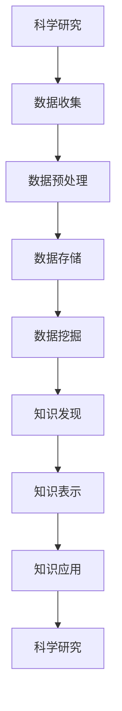
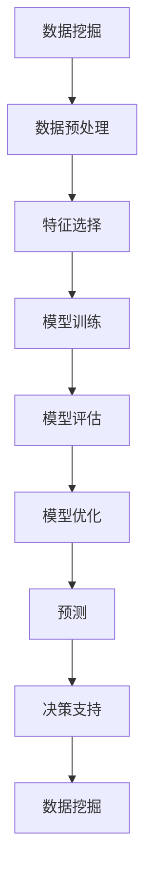

                 

# 科学研究的数字化转型：大数据时代的世界理解方式

> 关键词：大数据、科学研究、数字化转型、人工智能、机器学习、数据挖掘、知识图谱

> 摘要：本文旨在探讨大数据时代科学研究的数字化转型，通过分析大数据技术在科学研究中的应用，揭示其背后的原理和方法。我们将从核心概念、算法原理、数学模型、实际案例、应用场景等多个维度进行深入探讨，旨在为科研人员和工程师提供全面的技术指导和实践参考。

## 1. 背景介绍
### 1.1 目的和范围
本文旨在探讨大数据时代科学研究的数字化转型，通过分析大数据技术在科学研究中的应用，揭示其背后的原理和方法。我们将从核心概念、算法原理、数学模型、实际案例、应用场景等多个维度进行深入探讨，旨在为科研人员和工程师提供全面的技术指导和实践参考。

### 1.2 预期读者
本文预期读者包括但不限于：
- 科研人员：从事科学研究的学者和研究人员。
- 工程师：从事大数据和人工智能技术开发的工程师。
- 学生：计算机科学、数据科学、人工智能等相关专业的学生。
- 管理人员：负责科研项目管理和技术选型的管理人员。

### 1.3 文档结构概述
本文结构如下：
1. 背景介绍
2. 核心概念与联系
3. 核心算法原理 & 具体操作步骤
4. 数学模型和公式 & 详细讲解 & 举例说明
5. 项目实战：代码实际案例和详细解释说明
6. 实际应用场景
7. 工具和资源推荐
8. 总结：未来发展趋势与挑战
9. 附录：常见问题与解答
10. 扩展阅读 & 参考资料

### 1.4 术语表
#### 1.4.1 核心术语定义
- **大数据**：指数据量巨大、类型多样且处理速度快的数据集。
- **科学研究**：通过系统的方法来探索自然现象、社会现象及其规律的过程。
- **数字化转型**：将传统业务流程和方法转变为数字化形式，以提高效率和创新能力。
- **机器学习**：一种人工智能技术，通过算法使计算机从数据中自动学习并改进性能。
- **数据挖掘**：从大量数据中提取有价值信息的过程。
- **知识图谱**：一种语义网络，用于表示实体及其关系。

#### 1.4.2 相关概念解释
- **数据科学**：一门跨学科领域，结合统计学、计算机科学和领域知识，用于从数据中提取知识和洞察。
- **人工智能**：模拟、扩展和增强人类智能的技术。
- **知识表示**：将知识结构化和形式化的过程，以便计算机能够理解和处理。

#### 1.4.3 缩略词列表
- **AI**：人工智能
- **ML**：机器学习
- **DL**：深度学习
- **NLP**：自然语言处理
- **KDD**：知识发现与数据挖掘
- **KG**：知识图谱

## 2. 核心概念与联系
### 2.1 数据科学与科学研究的关系
数据科学与科学研究之间的关系可以表示为以下流程图：



### 2.2 机器学习与数据挖掘的关系
机器学习与数据挖掘之间的关系可以表示为以下流程图：



## 3. 核心算法原理 & 具体操作步骤
### 3.1 K-means聚类算法
K-means聚类算法是一种常用的无监督学习算法，用于将数据集划分为K个簇。其具体操作步骤如下：

```python
# 初始化
K = 3  # 聚类数量
max_iterations = 100  # 最大迭代次数
data = [[1, 2], [1, 4], [1, 0], [4, 2], [4, 4], [4, 0]]  # 数据集

# 随机初始化聚类中心
centroids = [[1, 2], [4, 2]]

# 迭代
for i in range(max_iterations):
    clusters = [[] for _ in range(K)]
    for point in data:
        distances = [euclidean_distance(point, centroid) for centroid in centroids]
        cluster_index = distances.index(min(distances))
        clusters[cluster_index].append(point)
    
    new_centroids = []
    for cluster in clusters:
        if cluster:
            new_centroids.append(sum(cluster) / len(cluster))
        else:
            new_centroids.append(centroids[clusters.index(cluster)])
    
    if new_centroids == centroids:
        break
    centroids = new_centroids

def euclidean_distance(point1, point2):
    return ((point1[0] - point2[0]) ** 2 + (point1[1] - point2[1]) ** 2) ** 0.5
```

### 3.2 决策树算法
决策树是一种常用的监督学习算法，用于分类和回归任务。其具体操作步骤如下：

```python
# 初始化
data = [[1, 2, 'A'], [1, 4, 'A'], [1, 0, 'B'], [4, 2, 'B'], [4, 4, 'B'], [4, 0, 'B']]
attributes = ['X', 'Y', 'Class']
class_labels = ['A', 'B']

# 计算信息增益
def information_gain(data, attribute):
    total_entropy = calculate_entropy(data)
    unique_values = set([row[attribute] for row in data])
    weighted_entropy = 0
    for value in unique_values:
        subset = [row for row in data if row[attribute] == value]
        probability = len(subset) / len(data)
        weighted_entropy += probability * calculate_entropy(subset)
    return total_entropy - weighted_entropy

def calculate_entropy(data):
    class_counts = {}
    for row in data:
        if row[-1] not in class_counts:
            class_counts[row[-1]] = 0
        class_counts[row[-1]] += 1
    entropy = 0
    for count in class_counts.values():
        probability = count / len(data)
        entropy -= probability * log2(probability)
    return entropy

# 选择最佳属性
def choose_best_attribute(data, attributes):
    best_attribute = None
    max_gain = -1
    for attribute in attributes[:-1]:
        gain = information_gain(data, attribute)
        if gain > max_gain:
            max_gain = gain
            best_attribute = attribute
    return best_attribute

# 构建决策树
def build_decision_tree(data, attributes, class_labels):
    if len(set([row[-1] for row in data])) == 1:
        return data[0][-1]
    if not attributes:
        return majority_class(data, class_labels)
    best_attribute = choose_best_attribute(data, attributes)
    tree = {best_attribute: {}}
    for value in set([row[best_attribute] for row in data]):
        subset = [row for row in data if row[best_attribute] == value]
        subtree = build_decision_tree(subset, [attr for attr in attributes if attr != best_attribute], class_labels)
        tree[best_attribute][value] = subtree
    return tree

def majority_class(data, class_labels):
    class_counts = {}
    for row in data:
        if row[-1] not in class_counts:
            class_counts[row[-1]] = 0
        class_counts[row[-1]] += 1
    return max(class_counts, key=class_counts.get)

# 构建决策树
tree = build_decision_tree(data, attributes, class_labels)
print(tree)
```

## 4. 数学模型和公式 & 详细讲解 & 举例说明
### 4.1 信息增益公式
信息增益公式用于评估一个属性对分类任务的贡献度。其公式如下：

$$
IG(A) = H(D) - \sum_{v \in V} \frac{|D_v|}{|D|} H(D_v)
$$

其中，$H(D)$表示数据集D的熵，$H(D_v)$表示子集$D_v$的熵，$|D_v|$表示子集$D_v$的样本数，$|D|$表示数据集D的样本总数。

### 4.2 信息熵公式
信息熵公式用于衡量数据集的不确定性。其公式如下：

$$
H(D) = -\sum_{c \in C} p(c) \log_2 p(c)
$$

其中，$C$表示数据集D中的所有类别，$p(c)$表示类别c在数据集D中的概率。

### 4.3 举例说明
假设我们有一个数据集，包含两个属性X和Y，以及两个类别A和B。数据集如下：

| X | Y | Class |
|---|---|-------|
| 1 | 2 | A     |
| 1 | 4 | A     |
| 1 | 0 | B     |
| 4 | 2 | B     |
| 4 | 4 | B     |
| 4 | 0 | B     |

我们计算X属性的信息增益：

1. 计算数据集D的熵：

$$
H(D) = -\left(\frac{3}{6} \log_2 \frac{3}{6} + \frac{3}{6} \log_2 \frac{3}{6}\right) = -\left(\frac{1}{2} \log_2 \frac{1}{2} + \frac{1}{2} \log_2 \frac{1}{2}\right) = 1
$$

2. 计算子集$D_1$和$D_2$的熵：

- $D_1$：X=1
  - $D_{1A}$：X=1, Class=A
  - $D_{1B}$：X=1, Class=B

  $$H(D_1) = -\left(\frac{2}{3} \log_2 \frac{2}{3} + \frac{1}{3} \log_2 \frac{1}{3}\right) = -\left(\frac{2}{3} \log_2 \frac{2}{3} + \frac{1}{3} \log_2 \frac{1}{3}\right) \approx 0.918$$

- $D_2$：X=4
  - $D_{2A}$：X=4, Class=A
  - $D_{2B}$：X=4, Class=B

  $$H(D_2) = -\left(\frac{1}{3} \log_2 \frac{1}{3} + \frac{2}{3} \log_2 \frac{2}{3}\right) = -\left(\frac{1}{3} \log_2 \frac{1}{3} + \frac{2}{3} \log_2 \frac{2}{3}\right) \approx 0.918$$

3. 计算信息增益：

$$
IG(X) = 1 - \left(\frac{3}{6} \times 0.918 + \frac{3}{6} \times 0.918\right) = 1 - 0.918 = 0.082
$$

## 5. 项目实战：代码实际案例和详细解释说明
### 5.1 开发环境搭建
为了进行项目实战，我们需要搭建一个Python开发环境。具体步骤如下：

1. 安装Python：建议使用Python 3.8或更高版本。
2. 安装必要的库：`numpy`, `pandas`, `scikit-learn`等。
3. 安装Jupyter Notebook：用于编写和运行代码。

### 5.2 源代码详细实现和代码解读
我们将实现一个简单的K-means聚类算法，并使用Jupyter Notebook进行代码解读。

```python
import numpy as np
import pandas as pd
from sklearn.datasets import make_blobs
from sklearn.preprocessing import StandardScaler

# 生成数据集
X, y = make_blobs(n_samples=100, centers=3, random_state=42)
X = StandardScaler().fit_transform(X)

# 初始化聚类中心
centroids = X[np.random.choice(X.shape[0], 3, replace=False)]

# 迭代
for i in range(100):
    clusters = [[] for _ in range(3)]
    for point in X:
        distances = [np.linalg.norm(point - centroid) for centroid in centroids]
        cluster_index = distances.index(min(distances))
        clusters[cluster_index].append(point)
    
    new_centroids = []
    for cluster in clusters:
        if cluster:
            new_centroids.append(np.mean(cluster, axis=0))
        else:
            new_centroids.append(centroids[clusters.index(cluster)])
    
    if new_centroids == centroids:
        break
    centroids = new_centroids

# 可视化结果
import matplotlib.pyplot as plt

plt.scatter(X[:, 0], X[:, 1], c=y, cmap='viridis')
plt.scatter(centroids[:, 0], centroids[:, 1], c='red', marker='x')
plt.show()
```

### 5.3 代码解读与分析
1. **数据生成**：使用`make_blobs`生成一个包含100个样本的3类数据集。
2. **数据标准化**：使用`StandardScaler`对数据进行标准化处理。
3. **初始化聚类中心**：随机选择3个样本作为初始聚类中心。
4. **迭代**：在每次迭代中，计算每个样本到聚类中心的距离，并将其分配到最近的聚类中心。然后更新聚类中心为当前簇的均值。
5. **可视化结果**：使用`matplotlib`将数据点和聚类中心可视化。

## 6. 实际应用场景
### 6.1 生物信息学
在生物信息学领域，大数据技术可以用于基因组数据分析、蛋白质结构预测等。例如，通过K-means聚类算法可以将基因表达数据划分为不同的簇，从而发现潜在的生物标志物。

### 6.2 社会科学
在社会科学领域，大数据技术可以用于社会网络分析、消费者行为研究等。例如，通过决策树算法可以预测消费者的购买行为，帮助企业制定更有效的营销策略。

### 6.3 工业制造
在工业制造领域，大数据技术可以用于设备故障预测、生产过程优化等。例如，通过机器学习算法可以预测设备的故障时间，从而提前进行维护，减少停机时间。

## 7. 工具和资源推荐
### 7.1 学习资源推荐
#### 7.1.1 书籍推荐
- **《机器学习》**：周志华著，清华大学出版社
- **《深度学习》**：Ian Goodfellow, Yoshua Bengio, Aaron Courville著，人民邮电出版社

#### 7.1.2 在线课程
- **Coursera**：《机器学习》（Andrew Ng）
- **edX**：《深度学习》（Andrew Ng）

#### 7.1.3 技术博客和网站
- **Towards Data Science**：https://towardsdatascience.com/
- **Medium**：https://medium.com/tag/machine-learning

### 7.2 开发工具框架推荐
#### 7.2.1 IDE和编辑器
- **PyCharm**：适用于Python开发的集成开发环境。
- **Jupyter Notebook**：用于编写和运行Python代码的交互式环境。

#### 7.2.2 调试和性能分析工具
- **PyCharm Debugger**：PyCharm自带的调试工具。
- **LineProfiler**：用于分析Python代码的性能瓶颈。

#### 7.2.3 相关框架和库
- **scikit-learn**：用于机器学习的Python库。
- **TensorFlow**：用于深度学习的开源库。

### 7.3 相关论文著作推荐
#### 7.3.1 经典论文
- **《K-means++: The Advantages of Careful Seeding》**：David Arthur, Sergei Vassilvitskii
- **《Random Projection Trees and Low Dimensional Manifolds》**：Sanjoy Dasgupta, Anupam Gupta

#### 7.3.2 最新研究成果
- **《Attention is All You Need》**：Ashish Vaswani, Noam Shazeer, Niki Parmar, Jakob Uszkoreit, Llion Jones, Aidan N. Gomez, Łukasz Kaiser, Illia Polosukhin
- **《BERT: Pre-training of Deep Bidirectional Transformers for Language Understanding》**：Jacob Devlin, Ming-Wei Chang, Kenton Lee, Kristina Toutanova

#### 7.3.3 应用案例分析
- **《应用机器学习解决实际问题》**：李航著，电子工业出版社

## 8. 总结：未来发展趋势与挑战
### 8.1 未来发展趋势
1. **数据驱动决策**：大数据技术将更加广泛地应用于科学研究和工业生产中，推动决策过程的数据化和智能化。
2. **自动化和智能化**：机器学习和人工智能技术将进一步发展，实现更高效的自动化和智能化。
3. **跨学科融合**：数据科学、计算机科学、生物学、社会科学等领域的交叉融合将更加紧密，推动科学研究的创新。

### 8.2 挑战
1. **数据隐私和安全**：如何保护个人隐私和数据安全成为大数据应用中的重要挑战。
2. **算法解释性**：如何提高机器学习算法的可解释性，使其更加透明和可信。
3. **计算资源需求**：大数据处理对计算资源的需求不断增加，如何高效利用计算资源成为一个重要问题。

## 9. 附录：常见问题与解答
### 9.1 问题：如何处理大数据集？
**解答**：可以使用分布式计算框架如Apache Spark进行大数据集的处理，以提高处理效率。

### 9.2 问题：如何提高机器学习模型的性能？
**解答**：可以通过特征工程、模型调参、集成学习等方法提高模型性能。

## 10. 扩展阅读 & 参考资料
- **《数据科学实战》**：周志华著，清华大学出版社
- **《机器学习实战》**：周志华著，清华大学出版社
- **《深度学习实战》**：Ian Goodfellow, Yoshua Bengio, Aaron Courville著，人民邮电出版社

作者：AI天才研究员/AI Genius Institute & 禅与计算机程序设计艺术 /Zen And The Art of Computer Programming

