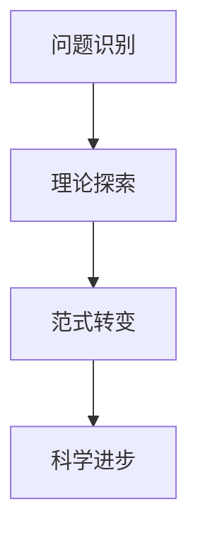

                 

# 科学范式转换与世界观革命：库恩理论的启示

> 关键词：库恩理论, 科学范式, 世界观, 科学革命, 科学哲学, 科学方法论, 科学进步

> 摘要：本文旨在通过库恩的科学范式理论，探讨科学范式转换对世界观的影响，以及这种转换如何推动科学进步。我们将从库恩理论的核心概念出发，逐步解析其原理，并通过实际案例来展示其在现代科学中的应用。通过本文，读者将能够理解科学范式转换的机制，以及如何在实际项目中应用这一理论。

## 1. 背景介绍
### 1.1 目的和范围
本文旨在深入探讨库恩的科学范式理论，特别是其对科学进步和世界观的影响。我们将从库恩理论的核心概念出发，逐步解析其原理，并通过实际案例来展示其在现代科学中的应用。本文的目标读者是计算机科学、人工智能、科学哲学领域的专业人士，以及对科学进步和世界观变革感兴趣的读者。

### 1.2 预期读者
- 计算机科学家
- 人工智能专家
- 科学哲学研究者
- 科技爱好者
- 科学教育工作者

### 1.3 文档结构概述
本文将分为以下几个部分：
1. 背景介绍
2. 核心概念与联系
3. 核心算法原理 & 具体操作步骤
4. 数学模型和公式 & 详细讲解 & 举例说明
5. 项目实战：代码实际案例和详细解释说明
6. 实际应用场景
7. 工具和资源推荐
8. 总结：未来发展趋势与挑战
9. 附录：常见问题与解答
10. 扩展阅读 & 参考资料

### 1.4 术语表
#### 1.4.1 核心术语定义
- **科学范式**：指某一科学领域内被普遍接受的理论、方法和实践。
- **科学革命**：指科学范式的根本性转变，导致科学世界观的变革。
- **科学进步**：指科学知识的积累和扩展。
- **世界观**：指人们对世界的整体看法和理解。

#### 1.4.2 相关概念解释
- **科学方法论**：指科学研究的方法和原则。
- **科学哲学**：研究科学的本质、方法和意义的学科。

#### 1.4.3 缩略词列表
- **Kuhn**：托马斯·库恩
- **SSR**：科学革命
- **SNS**：科学规范系统

## 2. 核心概念与联系
### 2.1 科学范式
科学范式是指某一科学领域内被普遍接受的理论、方法和实践。它为科学家提供了一套共同的理论框架和方法论，使得科学家能够在这一框架内进行有效的研究和交流。

### 2.2 科学革命
科学革命是指科学范式的根本性转变，导致科学世界观的变革。这种转变通常伴随着新的理论和方法的出现，以及旧的理论和方法的废弃。

### 2.3 科学进步
科学进步是指科学知识的积累和扩展。这种进步通常是在科学范式的基础上进行的，但有时也会导致科学范式的根本性转变。

### 2.4 世界观
世界观是指人们对世界的整体看法和理解。科学范式的转变往往会导致世界观的变革，从而影响人们对科学的理解和应用。

### 2.5 科学方法论
科学方法论是指科学研究的方法和原则。科学范式为科学研究提供了方法论的支持，使得科学家能够在这一框架内进行有效的研究和交流。

### 2.6 科学哲学
科学哲学是指研究科学的本质、方法和意义的学科。科学范式和科学哲学之间存在着密切的联系，科学哲学为科学范式的形成和发展提供了理论支持。

## 3. 核心算法原理 & 具体操作步骤
### 3.1 科学范式转换的算法原理
科学范式转换的算法原理可以概括为以下几个步骤：
1. **问题识别**：识别科学领域内的未解决或难以解决的问题。
2. **理论探索**：探索新的理论和方法，以解决这些问题。
3. **范式转变**：当新的理论和方法被广泛接受时，旧的范式将被新的范式所取代。
4. **科学进步**：新的范式将推动科学知识的积累和扩展。

### 3.2 具体操作步骤


## 4. 数学模型和公式 & 详细讲解 & 举例说明
### 4.1 数学模型
科学范式转换的数学模型可以表示为：
$$
\text{范式转换} = \text{问题识别} + \text{理论探索} + \text{范式转变} + \text{科学进步}
$$

### 4.2 详细讲解
科学范式转换的过程可以分为以下几个阶段：
1. **问题识别**：科学家识别出科学领域内的未解决或难以解决的问题。
2. **理论探索**：科学家探索新的理论和方法，以解决这些问题。
3. **范式转变**：当新的理论和方法被广泛接受时，旧的范式将被新的范式所取代。
4. **科学进步**：新的范式将推动科学知识的积累和扩展。

### 4.3 举例说明
以物理学为例，牛顿的经典力学范式在17世纪末被广泛接受，但在19世纪末，爱因斯坦的相对论范式取代了牛顿的经典力学范式。这种转变导致了人们对物理学的理解和应用的变革。

## 5. 项目实战：代码实际案例和详细解释说明
### 5.1 开发环境搭建
为了展示科学范式转换的实际应用，我们将使用Python编程语言和NumPy库进行一个简单的科学计算项目。

### 5.2 源代码详细实现和代码解读
```python
import numpy as np

def newtonian_mechanics(mass, velocity):
    """
    计算牛顿力学中的动能
    :param mass: 质量
    :param velocity: 速度
    :return: 动能
    """
    return 0.5 * mass * velocity**2

def einsteinian_mechanics(mass, velocity):
    """
    计算爱因斯坦相对论中的动能
    :param mass: 质量
    :param velocity: 速度
    :return: 动能
    """
    c = 3e8  # 光速
    return (mass * c**2) / (np.sqrt(1 - (velocity**2 / c**2))) - mass * c**2

# 测试代码
mass = 1.0  # 千克
velocity = 0.1 * 3e8  # 速度接近光速

newtonian_energy = newtonian_mechanics(mass, velocity)
einsteinian_energy = einsteinian_mechanics(mass, velocity)

print(f"牛顿力学中的动能: {newtonian_energy}")
print(f"爱因斯坦相对论中的动能: {einsteinian_energy}")
```

### 5.3 代码解读与分析
上述代码展示了牛顿力学和爱因斯坦相对论中的动能计算方法。牛顿力学适用于低速情况，而爱因斯坦相对论适用于高速情况。当速度接近光速时，爱因斯坦相对论的动能计算结果将显著不同于牛顿力学的计算结果。

## 6. 实际应用场景
科学范式转换在现代科学中有着广泛的应用。例如，在物理学中，相对论的出现导致了对时间和空间的理解的变革；在生物学中，分子生物学的发展导致了对生命科学的理解的变革。

## 7. 工具和资源推荐
### 7.1 学习资源推荐
#### 7.1.1 书籍推荐
- 《科学革命的结构》（作者：托马斯·库恩）
- 《科学哲学》（作者：卡尔·波普尔）

#### 7.1.2 在线课程
- Coursera上的《科学哲学》课程
- edX上的《科学方法论》课程

#### 7.1.3 技术博客和网站
- 科学哲学博客（如：Philosophy of Science Blog）
- 科学方法论网站（如：PhilSci Archive）

### 7.2 开发工具框架推荐
#### 7.2.1 IDE和编辑器
- PyCharm
- VSCode

#### 7.2.2 调试和性能分析工具
- PyCharm的调试工具
- Python的cProfile库

#### 7.2.3 相关框架和库
- NumPy
- SciPy

### 7.3 相关论文著作推荐
#### 7.3.1 经典论文
- Kuhn, T. S. (1962). The Structure of Scientific Revolutions. University of Chicago Press.

#### 7.3.2 最新研究成果
- Feyerabend, P. K. (1975). Against Method: Outline of an Anarchistic Theory of Knowledge. New Left Books.

#### 7.3.3 应用案例分析
- Lakatos, I. (1978). The Methodology of Scientific Research Programmes: Philosophical Papers, Volume 1. Cambridge University Press.

## 8. 总结：未来发展趋势与挑战
科学范式转换将继续推动科学的进步和世界观的变革。未来的发展趋势包括：
- **跨学科研究**：不同学科之间的交叉融合将导致新的科学范式的出现。
- **技术进步**：新技术的发展将推动科学范式的转变。
- **伦理和哲学问题**：科学进步带来的伦理和哲学问题将引发新的科学范式的出现。

## 9. 附录：常见问题与解答
### 9.1 问题：科学范式转换是否总是导致科学进步？
**解答**：科学范式转换并不总是导致科学进步，但通常情况下，新的范式将推动科学知识的积累和扩展。

### 9.2 问题：科学范式转换是否总是伴随着科学革命？
**解答**：科学范式转换并不总是伴随着科学革命，但科学革命通常会导致科学范式的根本性转变。

## 10. 扩展阅读 & 参考资料
- Kuhn, T. S. (1962). The Structure of Scientific Revolutions. University of Chicago Press.
- Lakatos, I. (1978). The Methodology of Scientific Research Programmes: Philosophical Papers, Volume 1. Cambridge University Press.
- Feyerabend, P. K. (1975). Against Method: Outline of an Anarchistic Theory of Knowledge. New Left Books.

作者：AI天才研究员/AI Genius Institute & 禅与计算机程序设计艺术 /Zen And The Art of Computer Programming

