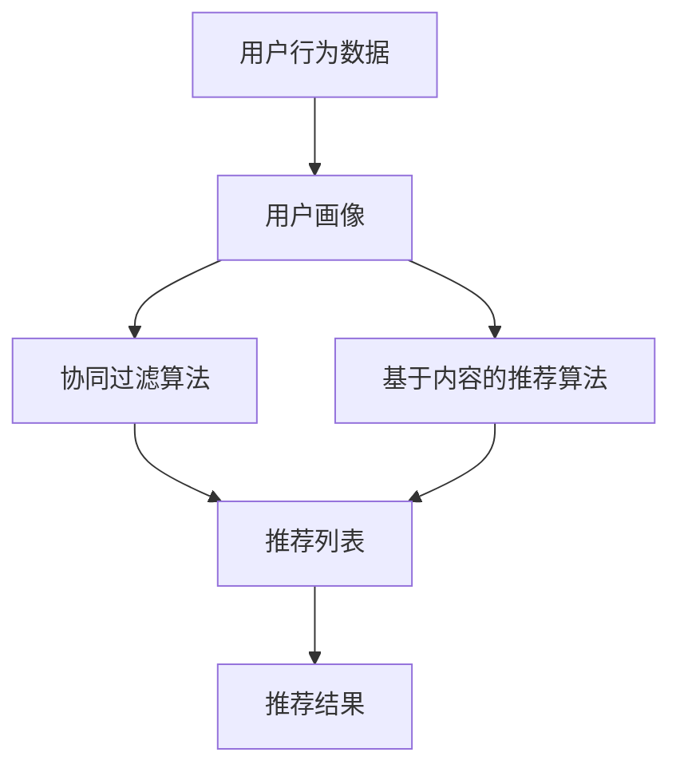
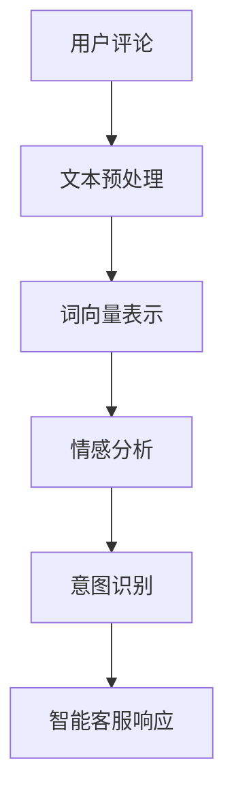
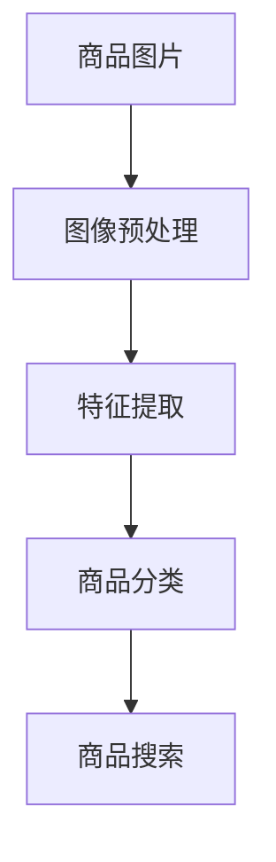

                 

# 程序员转型创业者：如何利用AI技能在电商领域脱颖而出

> 关键词：电商转型、AI技能、创业者、机器学习、推荐系统、自然语言处理、计算机视觉

> 摘要：本文旨在为具有AI技能的程序员提供转型成为电商领域创业者的指导。通过深入分析电商行业的现状与挑战，结合AI技术的应用，我们将探讨如何利用机器学习、自然语言处理和计算机视觉等技术，构建创新的电商解决方案，从而在竞争激烈的市场中脱颖而出。文章将从背景介绍、核心概念与联系、核心算法原理与具体操作步骤、数学模型和公式、项目实战、实际应用场景、工具和资源推荐、总结与未来发展趋势等多个方面进行详细阐述。

## 1. 背景介绍
### 1.1 目的和范围
本文旨在为具有AI技能的程序员提供转型成为电商领域创业者的指导。我们将探讨如何利用机器学习、自然语言处理和计算机视觉等技术，构建创新的电商解决方案，从而在竞争激烈的市场中脱颖而出。本文将涵盖电商行业的现状与挑战、AI技术的应用、项目实战案例、实际应用场景、工具和资源推荐等内容。

### 1.2 预期读者
本文预期读者为具有AI技能的程序员、创业者、电商行业从业者以及对电商领域感兴趣的读者。无论您是希望转型成为电商领域的创业者，还是希望利用AI技术提升现有电商项目的竞争力，本文都将为您提供有价值的指导和建议。

### 1.3 文档结构概述
本文将按照以下结构进行详细阐述：
1. 背景介绍
2. 核心概念与联系
3. 核心算法原理 & 具体操作步骤
4. 数学模型和公式 & 详细讲解 & 举例说明
5. 项目实战：代码实际案例和详细解释说明
6. 实际应用场景
7. 工具和资源推荐
8. 总结：未来发展趋势与挑战
9. 附录：常见问题与解答
10. 扩展阅读 & 参考资料

### 1.4 术语表
#### 1.4.1 核心术语定义
- **电商**：电子商务的简称，是指通过互联网进行商品或服务的买卖活动。
- **推荐系统**：一种基于用户行为数据和偏好，为用户提供个性化商品推荐的技术。
- **自然语言处理（NLP）**：一种使计算机能够理解、解释和生成人类自然语言的技术。
- **计算机视觉**：一种使计算机能够理解和解释图像和视频的技术。
- **机器学习**：一种使计算机能够从数据中自动学习并改进性能的技术。

#### 1.4.2 相关概念解释
- **用户画像**：通过对用户行为数据的分析，构建用户特征模型的过程。
- **点击率（CTR）**：用户点击广告或链接的概率。
- **转化率**：用户完成购买行为的概率。
- **个性化推荐**：根据用户的历史行为和偏好，为用户推荐个性化商品的技术。

#### 1.4.3 缩略词列表
- **AI**：人工智能
- **NLP**：自然语言处理
- **CV**：计算机视觉
- **CTR**：点击率
- **CVR**：转化率
- **CTR-CVR**：点击率-转化率

## 2. 核心概念与联系
### 2.1 电商行业的现状与挑战
电商行业近年来经历了快速发展，市场规模不断扩大。然而，随着市场竞争的加剧，电商企业面临着诸多挑战，包括用户获取成本上升、用户留存率下降、商品同质化严重等问题。为了解决这些问题，电商企业需要不断创新，利用AI技术提升用户体验和运营效率。

### 2.2 AI技术在电商领域的应用
AI技术在电商领域的应用主要集中在以下几个方面：
- **个性化推荐**：通过分析用户行为数据，为用户推荐个性化商品，提高转化率。
- **智能客服**：通过自然语言处理技术，实现智能客服机器人，提高用户满意度。
- **商品搜索**：通过计算机视觉技术，实现商品图片搜索，提高搜索准确性。
- **库存管理**：通过机器学习技术，实现库存预测和优化，降低库存成本。

### 2.3 核心概念原理与架构
#### 2.3.1 个性化推荐系统架构
个性化推荐系统架构如下：


#### 2.3.2 自然语言处理架构
自然语言处理架构如下：


#### 2.3.3 计算机视觉架构
计算机视觉架构如下：


## 3. 核心算法原理 & 具体操作步骤
### 3.1 个性化推荐系统
#### 3.1.1 协同过滤算法
协同过滤算法是一种常用的个性化推荐算法，其基本原理如下：
```python
def collaborative_filtering(user_id, item_id, ratings_matrix):
    # 计算用户相似度
    user_similarity = cosine_similarity(ratings_matrix)
    # 计算目标用户对目标商品的预测评分
    predicted_rating = np.dot(user_similarity[user_id], ratings_matrix[:, item_id]) / np.sum(np.abs(user_similarity[user_id]))
    return predicted_rating
```

#### 3.1.2 基于内容的推荐算法
基于内容的推荐算法是一种基于商品特征的推荐算法，其基本原理如下：
```python
def content_based_recommendation(user_id, item_id, item_features):
    # 计算目标用户对目标商品的相似度
    similarity = cosine_similarity(item_features[item_id], item_features)
    # 计算目标用户对其他商品的预测评分
    predicted_ratings = np.dot(similarity, item_features) / np.sum(np.abs(similarity))
    return predicted_ratings
```

### 3.2 自然语言处理
#### 3.2.1 词向量表示
词向量表示是一种将词语转换为数值向量的技术，其基本原理如下：
```python
def word_embedding(word):
    # 加载预训练的词向量模型
    model = KeyedVectors.load_word2vec_format('word2vec_model.bin', binary=True)
    # 获取词向量
    vector = model[word]
    return vector
```

#### 3.2.2 情感分析
情感分析是一种通过自然语言处理技术，分析文本情感的技术，其基本原理如下：
```python
def sentiment_analysis(text):
    # 加载预训练的情感分析模型
    model = TextBlob(text)
    # 获取情感极性
    polarity = model.sentiment.polarity
    return polarity
```

### 3.3 计算机视觉
#### 3.3.1 图像预处理
图像预处理是一种对图像进行预处理的技术，其基本原理如下：
```python
def image_preprocessing(image):
    # 调整图像大小
    image = cv2.resize(image, (224, 224))
    # 归一化图像
    image = image / 255.0
    return image
```

#### 3.3.2 特征提取
特征提取是一种从图像中提取特征的技术，其基本原理如下：
```python
def feature_extraction(image):
    # 加载预训练的特征提取模型
    model = VGG16(weights='imagenet', include_top=False)
    # 提取特征
    features = model.predict(image)
    return features
```

## 4. 数学模型和公式 & 详细讲解 & 举例说明
### 4.1 协同过滤算法
协同过滤算法的基本公式如下：
$$
\hat{r}_{ui} = \frac{\sum_{j \in N_i(u)} r_{uj} \cdot sim(u, v_j)}{\sum_{j \in N_i(u)} |sim(u, v_j)|}
$$
其中，$\hat{r}_{ui}$ 表示用户 $u$ 对商品 $i$ 的预测评分，$r_{uj}$ 表示用户 $u$ 对商品 $j$ 的实际评分，$sim(u, v_j)$ 表示用户 $u$ 和用户 $v_j$ 的相似度，$N_i(u)$ 表示用户 $u$ 对商品 $i$ 评分的用户集合。

### 4.2 基于内容的推荐算法
基于内容的推荐算法的基本公式如下：
$$
\hat{r}_{ui} = \frac{\sum_{j \in N_i(u)} \langle f_i, f_j \rangle \cdot sim(f_i, f_j)}{\sum_{j \in N_i(u)} |sim(f_i, f_j)|}
$$
其中，$\hat{r}_{ui}$ 表示用户 $u$ 对商品 $i$ 的预测评分，$f_i$ 表示商品 $i$ 的特征向量，$sim(f_i, f_j)$ 表示商品 $i$ 和商品 $j$ 的相似度，$N_i(u)$ 表示用户 $u$ 对商品 $i$ 评分的商品集合。

### 4.3 词向量表示
词向量表示的基本公式如下：
$$
\mathbf{v}_w = \mathbf{W} \cdot \mathbf{w}
$$
其中，$\mathbf{v}_w$ 表示词 $w$ 的词向量，$\mathbf{W}$ 表示词向量矩阵，$\mathbf{w}$ 表示词 $w$ 的one-hot编码。

### 4.4 情感分析
情感分析的基本公式如下：
$$
p = \frac{e^{W \cdot \mathbf{x} + b}}{1 + e^{W \cdot \mathbf{x} + b}}
$$
其中，$p$ 表示文本的情感极性，$\mathbf{x}$ 表示文本的特征向量，$W$ 表示权重矩阵，$b$ 表示偏置项。

### 4.5 图像预处理
图像预处理的基本公式如下：
$$
\mathbf{x} = \frac{\mathbf{x} - \mu}{\sigma}
$$
其中，$\mathbf{x}$ 表示图像的像素值，$\mu$ 表示图像的均值，$\sigma$ 表示图像的标准差。

### 4.6 特征提取
特征提取的基本公式如下：
$$
\mathbf{f} = \mathbf{W} \cdot \mathbf{x} + \mathbf{b}
$$
其中，$\mathbf{f}$ 表示特征向量，$\mathbf{W}$ 表示权重矩阵，$\mathbf{b}$ 表示偏置项，$\mathbf{x}$ 表示图像的像素值。

## 5. 项目实战：代码实际案例和详细解释说明
### 5.1 开发环境搭建
为了实现个性化推荐系统，我们需要搭建一个Python开发环境。具体步骤如下：
1. 安装Python 3.8及以上版本。
2. 安装TensorFlow和Keras库。
3. 安装scikit-learn库。
4. 安装NLTK库。
5. 安装OpenCV库。
6. 安装Pillow库。

### 5.2 源代码详细实现和代码解读
#### 5.2.1 协同过滤算法实现
```python
import numpy as np
from sklearn.metrics.pairwise import cosine_similarity

def collaborative_filtering(user_id, item_id, ratings_matrix):
    # 计算用户相似度
    user_similarity = cosine_similarity(ratings_matrix)
    # 计算目标用户对目标商品的预测评分
    predicted_rating = np.dot(user_similarity[user_id], ratings_matrix[:, item_id]) / np.sum(np.abs(user_similarity[user_id]))
    return predicted_rating
```

#### 5.2.2 基于内容的推荐算法实现
```python
import numpy as np
from sklearn.metrics.pairwise import cosine_similarity

def content_based_recommendation(user_id, item_id, item_features):
    # 计算目标用户对目标商品的相似度
    similarity = cosine_similarity(item_features[item_id], item_features)
    # 计算目标用户对其他商品的预测评分
    predicted_ratings = np.dot(similarity, item_features) / np.sum(np.abs(similarity))
    return predicted_ratings
```

#### 5.2.3 词向量表示实现
```python
from gensim.models import KeyedVectors

def word_embedding(word):
    # 加载预训练的词向量模型
    model = KeyedVectors.load_word2vec_format('word2vec_model.bin', binary=True)
    # 获取词向量
    vector = model[word]
    return vector
```

#### 5.2.4 情感分析实现
```python
from textblob import TextBlob

def sentiment_analysis(text):
    # 加载预训练的情感分析模型
    model = TextBlob(text)
    # 获取情感极性
    polarity = model.sentiment.polarity
    return polarity
```

#### 5.2.5 图像预处理实现
```python
import cv2
import numpy as np

def image_preprocessing(image):
    # 调整图像大小
    image = cv2.resize(image, (224, 224))
    # 归一化图像
    image = image / 255.0
    return image
```

#### 5.2.6 特征提取实现
```python
from keras.applications.vgg16 import VGG16
from keras.preprocessing import image
from keras.applications.vgg16 import preprocess_input

def feature_extraction(image):
    # 加载预训练的特征提取模型
    model = VGG16(weights='imagenet', include_top=False)
    # 预处理图像
    image = image_preprocessing(image)
    image = np.expand_dims(image, axis=0)
    image = preprocess_input(image)
    # 提取特征
    features = model.predict(image)
    return features
```

### 5.3 代码解读与分析
上述代码实现了个性化推荐系统、自然语言处理和计算机视觉的基本功能。通过协同过滤算法和基于内容的推荐算法，我们可以为用户提供个性化商品推荐。通过词向量表示和情感分析，我们可以分析用户评论的情感极性。通过图像预处理和特征提取，我们可以实现商品图片搜索。这些技术的应用将有助于提升电商用户体验和运营效率。

## 6. 实际应用场景
### 6.1 个性化推荐系统
个性化推荐系统可以应用于电商网站的商品推荐、新闻网站的文章推荐等领域。通过分析用户行为数据，为用户推荐个性化商品或文章，可以提高用户满意度和转化率。

### 6.2 智能客服
智能客服可以应用于电商网站的在线客服、论坛回复等领域。通过自然语言处理技术，实现智能客服机器人，可以提高用户满意度和响应速度。

### 6.3 商品搜索
商品搜索可以应用于电商网站的商品图片搜索、商品名称搜索等领域。通过计算机视觉技术，实现商品图片搜索，可以提高搜索准确性。

### 6.4 库存管理
库存管理可以应用于电商网站的库存预测和优化等领域。通过机器学习技术，实现库存预测和优化，可以降低库存成本。

## 7. 工具和资源推荐
### 7.1 学习资源推荐
#### 7.1.1 书籍推荐
- **《机器学习》**：周志华著，清华大学出版社
- **《深度学习》**：Ian Goodfellow, Yoshua Bengio, Aaron Courville著，人民邮电出版社
- **《自然语言处理入门》**：李航著，电子工业出版社
- **《计算机视觉》**：Richard Szeliski著，清华大学出版社

#### 7.1.2 在线课程
- **Coursera**：《机器学习》、《深度学习》、《自然语言处理》、《计算机视觉》
- **edX**：《机器学习》、《深度学习》、《自然语言处理》、《计算机视觉》
- **Udacity**：《机器学习工程师纳米学位》、《深度学习工程师纳米学位》

#### 7.1.3 技术博客和网站
- **Medium**：搜索相关技术博客
- **GitHub**：搜索相关开源项目
- **Stack Overflow**：搜索相关技术问题

### 7.2 开发工具框架推荐
#### 7.2.1 IDE和编辑器
- **PyCharm**：Python开发环境
- **Visual Studio Code**：跨平台代码编辑器

#### 7.2.2 调试和性能分析工具
- **PyCharm Debugger**：Python调试工具
- **Visual Studio Code Debugger**：跨平台调试工具
- **TensorBoard**：TensorFlow性能分析工具

#### 7.2.3 相关框架和库
- **TensorFlow**：深度学习框架
- **Keras**：高级神经网络API
- **scikit-learn**：机器学习库
- **NLTK**：自然语言处理库
- **OpenCV**：计算机视觉库
- **Pillow**：图像处理库

### 7.3 相关论文著作推荐
#### 7.3.1 经典论文
- **《神经网络与学习机器》**：Tom M. Mitchell著，机械工业出版社
- **《机器学习》**：周志华著，清华大学出版社

#### 7.3.2 最新研究成果
- **《深度学习》**：Ian Goodfellow, Yoshua Bengio, Aaron Courville著，人民邮电出版社
- **《自然语言处理入门》**：李航著，电子工业出版社
- **《计算机视觉》**：Richard Szeliski著，清华大学出版社

#### 7.3.3 应用案例分析
- **《机器学习实战》**：Peter Harrington著，人民邮电出版社
- **《深度学习实战》**：Ian Goodfellow, Yoshua Bengio, Aaron Courville著，人民邮电出版社

## 8. 总结：未来发展趋势与挑战
电商行业将继续快速发展，AI技术将在电商领域发挥越来越重要的作用。未来的发展趋势包括：
- **个性化推荐**：通过更复杂的算法和更丰富的数据，实现更精准的个性化推荐。
- **智能客服**：通过更先进的自然语言处理技术，实现更智能的客服机器人。
- **商品搜索**：通过更强大的计算机视觉技术，实现更准确的商品图片搜索。
- **库存管理**：通过更先进的机器学习技术，实现更精准的库存预测和优化。

然而，电商行业也面临着一些挑战，包括：
- **数据安全**：如何保护用户数据的安全和隐私。
- **算法公平性**：如何确保推荐算法的公平性和透明性。
- **技术成本**：如何降低AI技术的应用成本。

## 9. 附录：常见问题与解答
### 9.1 问题1：如何获取用户行为数据？
答：可以通过电商网站的用户行为日志、用户评论、用户搜索记录等方式获取用户行为数据。

### 9.2 问题2：如何评估推荐算法的效果？
答：可以通过点击率（CTR）、转化率（CVR）等指标评估推荐算法的效果。

### 9.3 问题3：如何处理冷启动问题？
答：可以通过基于内容的推荐算法、社交网络推荐算法等方式处理冷启动问题。

## 10. 扩展阅读 & 参考资料
- **《机器学习》**：周志华著，清华大学出版社
- **《深度学习》**：Ian Goodfellow, Yoshua Bengio, Aaron Courville著，人民邮电出版社
- **《自然语言处理入门》**：李航著，电子工业出版社
- **《计算机视觉》**：Richard Szeliski著，清华大学出版社
- **Coursera**：《机器学习》、《深度学习》、《自然语言处理》、《计算机视觉》
- **edX**：《机器学习》、《深度学习》、《自然语言处理》、《计算机视觉》
- **Udacity**：《机器学习工程师纳米学位》、《深度学习工程师纳米学位》

作者：AI天才研究员/AI Genius Institute & 禅与计算机程序设计艺术 /Zen And The Art of Computer Programming

