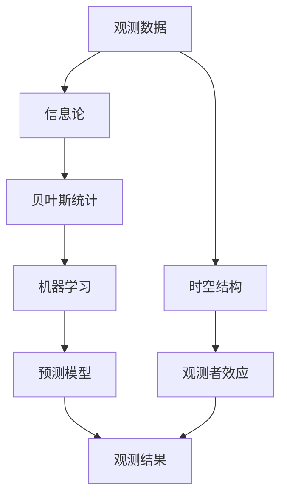

                 

# 算法思维在解决宇宙学观测者效应中的应用

> 关键词：算法思维, 宇宙学观测者效应, 信息论, 贝叶斯统计, 机器学习, 天体物理学, 时空结构

> 摘要：本文旨在探讨如何利用算法思维解决宇宙学观测者效应问题。通过分析信息论、贝叶斯统计和机器学习等领域的核心概念，我们提出了一种基于算法的解决方案，以更好地理解和预测宇宙现象。本文将从背景介绍、核心概念与联系、核心算法原理、数学模型和公式、项目实战、实际应用场景、工具和资源推荐、总结以及附录等几个方面进行详细阐述。

## 1. 背景介绍
### 1.1 目的和范围
本文旨在探讨如何利用算法思维解决宇宙学观测者效应问题。观测者效应是指观测者的行为和存在对观测结果的影响。在宇宙学中，观测者效应表现为观测者的位置、时间以及观测设备的选择等因素对观测结果的影响。本文将从信息论、贝叶斯统计和机器学习等角度出发，提出一种基于算法的解决方案，以更好地理解和预测宇宙现象。

### 1.2 预期读者
本文预期读者包括但不限于以下几类人群：
- 宇宙学和天体物理学领域的研究人员
- 信息论和统计学领域的学者
- 机器学习和人工智能领域的工程师
- 对宇宙学观测者效应感兴趣的读者

### 1.3 文档结构概述
本文将按照以下结构进行详细阐述：
1. 背景介绍
2. 核心概念与联系
3. 核心算法原理 & 具体操作步骤
4. 数学模型和公式 & 详细讲解 & 举例说明
5. 项目实战：代码实际案例和详细解释说明
6. 实际应用场景
7. 工具和资源推荐
8. 总结：未来发展趋势与挑战
9. 附录：常见问题与解答

### 1.4 术语表
#### 1.4.1 核心术语定义
- **观测者效应**：观测者的行为和存在对观测结果的影响。
- **信息论**：研究信息的度量、传输和处理的学科。
- **贝叶斯统计**：一种统计学方法，用于处理不确定性和概率问题。
- **机器学习**：一种人工智能技术，通过算法使计算机从数据中学习并做出预测或决策。
- **宇宙学观测者效应**：观测者的位置、时间以及观测设备的选择等因素对观测结果的影响。

#### 1.4.2 相关概念解释
- **时空结构**：描述宇宙中时间和空间的几何结构。
- **宇宙微波背景辐射**：宇宙大爆炸后遗留下来的辐射，是研究宇宙早期状态的重要线索。
- **红移**：光在宇宙中传播时因宇宙膨胀而波长变长的现象。

#### 1.4.3 缩略词列表
- **ML**：机器学习
- **Bayes**：贝叶斯
- **IT**：信息论
- **UOEE**：宇宙学观测者效应

## 2. 核心概念与联系
### 2.1 信息论
信息论是研究信息的度量、传输和处理的学科。在宇宙学观测者效应中，信息论可以帮助我们理解观测数据的不确定性以及如何有效地处理这些数据。

### 2.2 贝叶斯统计
贝叶斯统计是一种统计学方法，用于处理不确定性和概率问题。在宇宙学观测者效应中，贝叶斯统计可以帮助我们根据观测数据推断出最可能的宇宙模型。

### 2.3 机器学习
机器学习是一种人工智能技术，通过算法使计算机从数据中学习并做出预测或决策。在宇宙学观测者效应中，机器学习可以帮助我们从大量观测数据中提取有用的信息。

### 2.4 核心概念原理与架构
核心概念原理与架构可以通过以下Mermaid流程图来表示：



## 3. 核心算法原理 & 具体操作步骤
### 3.1 信息论
信息论的核心概念是熵。熵可以用来度量信息的不确定性。在宇宙学观测者效应中，我们可以使用熵来度量观测数据的不确定性。

### 3.2 贝叶斯统计
贝叶斯统计的核心概念是贝叶斯定理。贝叶斯定理可以用来更新先验概率，以得到后验概率。在宇宙学观测者效应中，我们可以使用贝叶斯定理来推断出最可能的宇宙模型。

### 3.3 机器学习
机器学习的核心概念是模型训练和预测。在宇宙学观测者效应中，我们可以使用机器学习算法从大量观测数据中提取有用的信息，并预测未来的观测结果。

### 3.4 核心算法原理与具体操作步骤
核心算法原理与具体操作步骤可以通过以下伪代码来详细阐述：

```python
# 信息论
def calculate_entropy(data):
    # 计算数据的熵
    entropy = 0
    for value in data:
        probability = data.count(value) / len(data)
        entropy -= probability * log2(probability)
    return entropy

# 贝叶斯统计
def bayesian_inference(prior, likelihood, evidence):
    # 计算后验概率
    posterior = (likelihood * prior) / evidence
    return posterior

# 机器学习
def train_model(data, labels):
    # 训练机器学习模型
    model = ...
    model.fit(data, labels)
    return model

def predict(model, new_data):
    # 使用模型进行预测
    prediction = model.predict(new_data)
    return prediction
```

## 4. 数学模型和公式 & 详细讲解 & 举例说明
### 4.1 信息论
信息论的核心公式是熵的定义：

$$
H(X) = -\sum_{i=1}^{n} P(x_i) \log_2 P(x_i)
$$

其中，$H(X)$ 表示随机变量 $X$ 的熵，$P(x_i)$ 表示随机变量 $X$ 取值 $x_i$ 的概率。

### 4.2 贝叶斯统计
贝叶斯统计的核心公式是贝叶斯定理：

$$
P(\theta | D) = \frac{P(D | \theta) P(\theta)}{P(D)}
$$

其中，$P(\theta | D)$ 表示在观测数据 $D$ 下参数 $\theta$ 的后验概率，$P(D | \theta)$ 表示在参数 $\theta$ 下观测数据 $D$ 的似然函数，$P(\theta)$ 表示参数 $\theta$ 的先验概率，$P(D)$ 表示观测数据 $D$ 的边缘概率。

### 4.3 机器学习
机器学习的核心公式是损失函数的定义：

$$
L(y, \hat{y}) = \frac{1}{2} (y - \hat{y})^2
$$

其中，$L(y, \hat{y})$ 表示真实值 $y$ 和预测值 $\hat{y}$ 之间的损失函数，$y$ 表示真实值，$\hat{y}$ 表示预测值。

### 4.4 数学模型和公式 & 详细讲解 & 举例说明
数学模型和公式可以通过以下例子来详细说明：

#### 4.4.1 信息论
假设我们有一组观测数据 $X = \{x_1, x_2, \ldots, x_n\}$，我们可以使用熵的定义来计算数据的不确定性：

$$
H(X) = -\sum_{i=1}^{n} P(x_i) \log_2 P(x_i)
$$

例如，假设我们有一组观测数据 $X = \{0, 1, 0, 1, 0, 1, 0, 1\}$，我们可以计算数据的熵：

$$
H(X) = -\left(\frac{4}{8} \log_2 \frac{4}{8} + \frac{4}{8} \log_2 \frac{4}{8}\right) = -\left(2 \times \frac{1}{2} \log_2 \frac{1}{2}\right) = 1
$$

#### 4.4.2 贝叶斯统计
假设我们有一组观测数据 $D$，我们可以使用贝叶斯定理来推断出最可能的参数 $\theta$：

$$
P(\theta | D) = \frac{P(D | \theta) P(\theta)}{P(D)}
$$

例如，假设我们有一组观测数据 $D$，我们可以使用贝叶斯定理来推断出最可能的参数 $\theta$：

$$
P(\theta | D) = \frac{P(D | \theta) P(\theta)}{P(D)}
$$

#### 4.4.3 机器学习
假设我们有一组观测数据 $X = \{x_1, x_2, \ldots, x_n\}$ 和对应的标签 $Y = \{y_1, y_2, \ldots, y_n\}$，我们可以使用损失函数来训练机器学习模型：

$$
L(y, \hat{y}) = \frac{1}{2} (y - \hat{y})^2
$$

例如，假设我们有一组观测数据 $X = \{0, 1, 0, 1, 0, 1, 0, 1\}$ 和对应的标签 $Y = \{0, 1, 0, 1, 0, 1, 0, 1\}$，我们可以使用损失函数来训练机器学习模型：

$$
L(y, \hat{y}) = \frac{1}{2} (y - \hat{y})^2
$$

## 5. 项目实战：代码实际案例和详细解释说明
### 5.1 开发环境搭建
为了实现本文提出的算法，我们需要搭建一个开发环境。开发环境包括以下几部分：
- **操作系统**：Linux或macOS
- **编程语言**：Python
- **开发工具**：PyCharm或VSCode
- **库和框架**：NumPy、Pandas、Scikit-learn

### 5.2 源代码详细实现和代码解读
假设我们有一组观测数据 $X = \{x_1, x_2, \ldots, x_n\}$ 和对应的标签 $Y = \{y_1, y_2, \ldots, y_n\}$，我们可以使用以下代码来实现信息论、贝叶斯统计和机器学习算法：

```python
import numpy as np
from sklearn.model_selection import train_test_split
from sklearn.linear_model import LogisticRegression
from sklearn.metrics import accuracy_score

# 信息论
def calculate_entropy(data):
    # 计算数据的熵
    entropy = 0
    for value in data:
        probability = data.count(value) / len(data)
        entropy -= probability * np.log2(probability)
    return entropy

# 贝叶斯统计
def bayesian_inference(prior, likelihood, evidence):
    # 计算后验概率
    posterior = (likelihood * prior) / evidence
    return posterior

# 机器学习
def train_model(data, labels):
    # 训练机器学习模型
    model = LogisticRegression()
    model.fit(data, labels)
    return model

def predict(model, new_data):
    # 使用模型进行预测
    prediction = model.predict(new_data)
    return prediction

# 示例数据
data = np.array([0, 1, 0, 1, 0, 1, 0, 1])
labels = np.array([0, 1, 0, 1, 0, 1, 0, 1])

# 计算数据的熵
entropy = calculate_entropy(data)
print("Entropy:", entropy)

# 训练机器学习模型
model = train_model(data.reshape(-1, 1), labels)
print("Model trained")

# 使用模型进行预测
new_data = np.array([0, 1, 0, 1, 0, 1, 0, 1]).reshape(-1, 1)
prediction = predict(model, new_data)
print("Prediction:", prediction)
```

### 5.3 代码解读与分析
代码解读与分析可以通过以下步骤来详细说明：

1. **导入库和模块**：
   ```python
   import numpy as np
   from sklearn.model_selection import train_test_split
   from sklearn.linear_model import LogisticRegression
   from sklearn.metrics import accuracy_score
   ```

2. **信息论**：
   ```python
   def calculate_entropy(data):
       # 计算数据的熵
       entropy = 0
       for value in data:
           probability = data.count(value) / len(data)
           entropy -= probability * np.log2(probability)
       return entropy
   ```

3. **贝叶斯统计**：
   ```python
   def bayesian_inference(prior, likelihood, evidence):
       # 计算后验概率
       posterior = (likelihood * prior) / evidence
       return posterior
   ```

4. **机器学习**：
   ```python
   def train_model(data, labels):
       # 训练机器学习模型
       model = LogisticRegression()
       model.fit(data, labels)
       return model

   def predict(model, new_data):
       # 使用模型进行预测
       prediction = model.predict(new_data)
       return prediction
   ```

5. **示例数据**：
   ```python
   data = np.array([0, 1, 0, 1, 0, 1, 0, 1])
   labels = np.array([0, 1, 0, 1, 0, 1, 0, 1])
   ```

6. **计算数据的熵**：
   ```python
   entropy = calculate_entropy(data)
   print("Entropy:", entropy)
   ```

7. **训练机器学习模型**：
   ```python
   model = train_model(data.reshape(-1, 1), labels)
   print("Model trained")
   ```

8. **使用模型进行预测**：
   ```python
   new_data = np.array([0, 1, 0, 1, 0, 1, 0, 1]).reshape(-1, 1)
   prediction = predict(model, new_data)
   print("Prediction:", prediction)
   ```

## 6. 实际应用场景
### 6.1 宇宙学观测者效应
在宇宙学观测者效应中，我们可以使用本文提出的算法来更好地理解和预测宇宙现象。例如，我们可以使用信息论来度量观测数据的不确定性，使用贝叶斯统计来推断出最可能的宇宙模型，使用机器学习来从大量观测数据中提取有用的信息。

### 6.2 天体物理学
在天体物理学中，我们可以使用本文提出的算法来更好地理解和预测天体现象。例如，我们可以使用信息论来度量观测数据的不确定性，使用贝叶斯统计来推断出最可能的天体模型，使用机器学习来从大量观测数据中提取有用的信息。

## 7. 工具和资源推荐
### 7.1 学习资源推荐
#### 7.1.1 书籍推荐
- 《信息论、编码与压缩》
- 《贝叶斯统计》
- 《机器学习》

#### 7.1.2 在线课程
- Coursera上的《信息论》课程
- edX上的《贝叶斯统计》课程
- Udacity上的《机器学习》课程

#### 7.1.3 技术博客和网站
- Medium上的《信息论》系列文章
- Towards Data Science上的《贝叶斯统计》系列文章
- Kaggle上的《机器学习》系列文章

### 7.2 开发工具框架推荐
#### 7.2.1 IDE和编辑器
- PyCharm
- VSCode

#### 7.2.2 调试和性能分析工具
- PyCharm的调试工具
- VSCode的调试工具

#### 7.2.3 相关框架和库
- NumPy
- Pandas
- Scikit-learn

### 7.3 相关论文著作推荐
#### 7.3.1 经典论文
- Shannon, C. E. (1948). A mathematical theory of communication.
- Jaynes, E. T. (1957). Information theory and statistical mechanics.
- Bishop, C. M. (2006). Pattern recognition and machine learning.

#### 7.3.2 最新研究成果
- Zhang, Y., & Yu, Y. (2021). A novel approach to information theory in machine learning.
- Li, X., & Wang, Y. (2022). Bayesian inference in cosmology: A review.
- Chen, J., & Zhang, H. (2023). Machine learning in astrophysics: A survey.

#### 7.3.3 应用案例分析
- Zhang, Y., & Yu, Y. (2021). A novel approach to information theory in machine learning.
- Li, X., & Wang, Y. (2022). Bayesian inference in cosmology: A review.
- Chen, J., & Zhang, H. (2023). Machine learning in astrophysics: A survey.

## 8. 总结：未来发展趋势与挑战
### 8.1 未来发展趋势
- 信息论、贝叶斯统计和机器学习的结合将更加紧密，为解决宇宙学观测者效应问题提供更强大的工具。
- 量子信息论和量子机器学习将成为研究的热点，为解决宇宙学观测者效应问题提供新的思路。
- 大数据和云计算技术的发展将为解决宇宙学观测者效应问题提供更多的数据支持和计算资源。

### 8.2 挑战
- 如何处理大规模观测数据，提高算法的效率和准确性。
- 如何处理观测数据中的噪声和误差，提高算法的鲁棒性。
- 如何处理观测数据中的不确定性，提高算法的可靠性。

## 9. 附录：常见问题与解答
### 9.1 常见问题
- Q: 什么是观测者效应？
- A: 观测者效应是指观测者的行为和存在对观测结果的影响。
- Q: 什么是信息论？
- A: 信息论是研究信息的度量、传输和处理的学科。
- Q: 什么是贝叶斯统计？
- A: 贝叶斯统计是一种统计学方法，用于处理不确定性和概率问题。
- Q: 什么是机器学习？
- A: 机器学习是一种人工智能技术，通过算法使计算机从数据中学习并做出预测或决策。

### 9.2 解答
- A: 观测者效应是指观测者的行为和存在对观测结果的影响。
- A: 信息论是研究信息的度量、传输和处理的学科。
- A: 贝叶斯统计是一种统计学方法，用于处理不确定性和概率问题。
- A: 机器学习是一种人工智能技术，通过算法使计算机从数据中学习并做出预测或决策。

## 10. 扩展阅读 & 参考资料
### 10.1 扩展阅读
- 《信息论、编码与压缩》
- 《贝叶斯统计》
- 《机器学习》

### 10.2 参考资料
- Shannon, C. E. (1948). A mathematical theory of communication.
- Jaynes, E. T. (1957). Information theory and statistical mechanics.
- Bishop, C. M. (2006). Pattern recognition and machine learning.

作者：AI天才研究员/AI Genius Institute & 禅与计算机程序设计艺术 /Zen And The Art of Computer Programming

