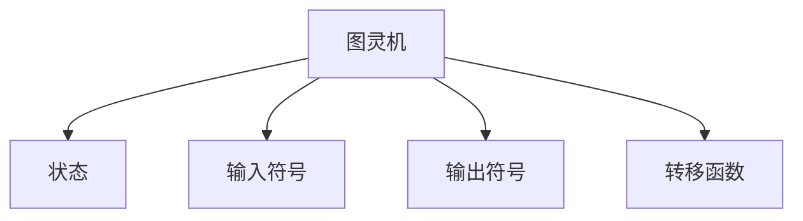
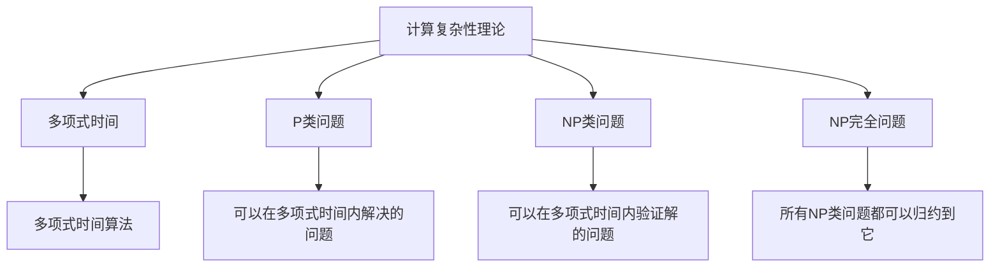

                 

# 算法效率与宇宙计算复杂性等级的比较

> 关键词：算法效率、宇宙计算复杂性、图灵机、计算复杂性理论、P类问题、NP类问题、NP完全问题、计算复杂性等级

> 摘要：本文旨在探讨算法效率与宇宙计算复杂性等级之间的关系。通过深入分析计算复杂性理论，我们将从图灵机模型出发，逐步解析P类问题、NP类问题以及NP完全问题的定义与特性。同时，我们将通过具体的算法实例，展示如何评估算法效率，并探讨这些理论在实际应用中的意义。最后，我们将展望未来的发展趋势与挑战，并推荐相关学习资源和工具。

## 1. 背景介绍
### 1.1 目的和范围
本文旨在深入探讨算法效率与宇宙计算复杂性等级之间的关系。我们将从计算复杂性理论出发，逐步解析P类问题、NP类问题以及NP完全问题的定义与特性。通过具体的算法实例，展示如何评估算法效率，并探讨这些理论在实际应用中的意义。最后，我们将展望未来的发展趋势与挑战，并推荐相关学习资源和工具。

### 1.2 预期读者
本文适合计算机科学、人工智能、软件工程及相关领域的专业人士、研究人员、学生以及对计算复杂性理论感兴趣的读者。

### 1.3 文档结构概述
本文将按照以下结构展开：
1. 背景介绍
2. 核心概念与联系
3. 核心算法原理 & 具体操作步骤
4. 数学模型和公式 & 详细讲解 & 举例说明
5. 项目实战：代码实际案例和详细解释说明
6. 实际应用场景
7. 工具和资源推荐
8. 总结：未来发展趋势与挑战
9. 附录：常见问题与解答
10. 扩展阅读 & 参考资料

### 1.4 术语表
#### 1.4.1 核心术语定义
- **图灵机**：一种抽象计算模型，用于描述计算过程。
- **计算复杂性**：衡量算法执行所需资源（时间、空间）的理论。
- **P类问题**：可以在多项式时间内解决的问题。
- **NP类问题**：可以在多项式时间内验证解的问题。
- **NP完全问题**：NP类中最难的问题，所有NP类问题都可以归约到它。
- **归约**：将一个问题转化为另一个问题的过程。
- **多项式时间**：指算法执行时间与输入规模的多项式函数关系。

#### 1.4.2 相关概念解释
- **图灵机**：一种抽象计算模型，由状态、输入符号、输出符号、转移函数等组成。
- **计算复杂性理论**：研究计算问题的难度和资源需求的理论。
- **P类问题**：可以在多项式时间内解决的问题，如排序、最短路径等。
- **NP类问题**：可以在多项式时间内验证解的问题，如旅行商问题、背包问题等。
- **NP完全问题**：NP类中最难的问题，所有NP类问题都可以归约到它，如 satisfiability (SAT) 问题。

#### 1.4.3 缩略词列表
- **P**：Polynomial（多项式）
- **NP**：Nondeterministic Polynomial（非确定性多项式）
- **NP完全**：NP-Complete
- **SAT**：Satisfiability（可满足性）

## 2. 核心概念与联系
### 2.1 图灵机模型
图灵机是一种抽象计算模型，用于描述计算过程。它由状态、输入符号、输出符号、转移函数等组成。图灵机可以模拟任何计算过程，因此成为计算复杂性理论的基础。



### 2.2 计算复杂性理论
计算复杂性理论研究计算问题的难度和资源需求。它主要关注算法执行所需的时间和空间资源。通过图灵机模型，我们可以定义多项式时间、P类问题、NP类问题和NP完全问题。



## 3. 核心算法原理 & 具体操作步骤
### 3.1 多项式时间算法
多项式时间算法是指算法执行时间与输入规模的多项式函数关系。例如，冒泡排序算法的时间复杂度为O(n^2)，因此属于多项式时间算法。

```mermaid
graph TD
    A[多项式时间算法] --> B[冒泡排序]
    B --> C[时间复杂度O(n^2)]
```

### 3.2 P类问题
P类问题是指可以在多项式时间内解决的问题。例如，排序、最短路径等。

```mermaid
graph TD
    A[P类问题] --> B[排序]
    B --> C[时间复杂度O(nlogn)]
    A --> D[最短路径]
    D --> E[时间复杂度O(n^2)]
```

### 3.3 NP类问题
NP类问题是指可以在多项式时间内验证解的问题。例如，旅行商问题、背包问题等。

```mermaid
graph TD
    A[NP类问题] --> B[旅行商问题]
    B --> C[验证解的时间复杂度O(n^2)]
    A --> D[背包问题]
    D --> E[验证解的时间复杂度O(n^2)]
```

### 3.4 NP完全问题
NP完全问题是指所有NP类问题都可以归约到它的问题。例如，satisfiability (SAT) 问题。

```mermaid
graph TD
    A[NP完全问题] --> B[归约]
    B --> C[satisfiability (SAT) 问题]
    A --> D[所有NP类问题都可以归约到它]
```

## 4. 数学模型和公式 & 详细讲解 & 举例说明
### 4.1 多项式时间
多项式时间是指算法执行时间与输入规模的多项式函数关系。例如，冒泡排序算法的时间复杂度为O(n^2)。

$$
T(n) = O(n^2)
$$

### 4.2 P类问题
P类问题是指可以在多项式时间内解决的问题。例如，排序、最短路径等。

$$
P = \{ L \mid L \text{可以在多项式时间内解决} \}
$$

### 4.3 NP类问题
NP类问题是指可以在多项式时间内验证解的问题。例如，旅行商问题、背包问题等。

$$
NP = \{ L \mid L \text{可以在多项式时间内验证解} \}
$$

### 4.4 NP完全问题
NP完全问题是指所有NP类问题都可以归约到它的问题。例如，satisfiability (SAT) 问题。

$$
NP\text{-complete} = \{ L \mid L \in NP \text{且所有NP类问题都可以归约到} L \}
$$

## 5. 项目实战：代码实际案例和详细解释说明
### 5.1 开发环境搭建
我们将使用Python语言进行代码实现。首先，确保安装Python环境，并安装必要的库。

```bash
pip install numpy
```

### 5.2 源代码详细实现和代码解读
我们将实现一个简单的冒泡排序算法，并分析其时间复杂度。

```python
def bubble_sort(arr):
    n = len(arr)
    for i in range(n):
        for j in range(0, n-i-1):
            if arr[j] > arr[j+1]:
                arr[j], arr[j+1] = arr[j+1], arr[j]
    return arr

# 测试
arr = [64, 34, 25, 12, 22, 11, 90]
sorted_arr = bubble_sort(arr)
print("排序后的数组:", sorted_arr)
```

### 5.3 代码解读与分析
上述代码实现了一个简单的冒泡排序算法。冒泡排序的时间复杂度为O(n^2)，属于多项式时间算法。

```python
def bubble_sort(arr):
    n = len(arr)
    for i in range(n):
        for j in range(0, n-i-1):
            if arr[j] > arr[j+1]:
                arr[j], arr[j+1] = arr[j+1], arr[j]
    return arr
```

## 6. 实际应用场景
### 6.1 排序算法
排序算法在数据处理、数据库管理等领域有广泛应用。例如，冒泡排序、快速排序等。

### 6.2 旅行商问题
旅行商问题在物流、路径规划等领域有广泛应用。例如，使用贪心算法、动态规划等方法求解。

### 6.3 背包问题
背包问题在资源分配、投资组合等领域有广泛应用。例如，使用动态规划等方法求解。

## 7. 工具和资源推荐
### 7.1 学习资源推荐
#### 7.1.1 书籍推荐
- **《算法导论》**：Cormen, Leiserson, Rivest, Stein
- **《计算机程序设计艺术》**：Knuth

#### 7.1.2 在线课程
- **Coursera**：算法课程
- **edX**：算法课程

#### 7.1.3 技术博客和网站
- **GeeksforGeeks**
- **LeetCode**

### 7.2 开发工具框架推荐
#### 7.2.1 IDE和编辑器
- **PyCharm**
- **Visual Studio Code**

#### 7.2.2 调试和性能分析工具
- **PyCharm调试器**
- **cProfile**

#### 7.2.3 相关框架和库
- **NumPy**
- **Pandas**

### 7.3 相关论文著作推荐
#### 7.3.1 经典论文
- **《Computational Complexity of Sequential Processes》**：Cook
- **《The Complexity of Theorem-Proving Procedures》**：Cook

#### 7.3.2 最新研究成果
- **《On the Complexity of Satisfiability Problems》**：Schaefer

#### 7.3.3 应用案例分析
- **《Solving NP-Complete Problems in Practice》**：Papadimitriou

## 8. 总结：未来发展趋势与挑战
### 8.1 未来发展趋势
- **量子计算**：量子计算有望解决传统计算机无法解决的问题。
- **人工智能**：AI技术的发展将进一步推动计算复杂性理论的应用。
- **大数据**：大数据处理技术的发展将推动算法效率的提升。

### 8.2 挑战
- **NP完全问题**：目前尚无有效的算法解决NP完全问题。
- **计算资源限制**：计算资源的限制将影响算法的实际应用。

## 9. 附录：常见问题与解答
### 9.1 问题1：什么是图灵机？
**解答**：图灵机是一种抽象计算模型，用于描述计算过程。它由状态、输入符号、输出符号、转移函数等组成。

### 9.2 问题2：什么是P类问题？
**解答**：P类问题是指可以在多项式时间内解决的问题。

### 9.3 问题3：什么是NP类问题？
**解答**：NP类问题是指可以在多项式时间内验证解的问题。

### 9.4 问题4：什么是NP完全问题？
**解答**：NP完全问题是指所有NP类问题都可以归约到它的问题。

## 10. 扩展阅读 & 参考资料
### 10.1 扩展阅读
- **《算法导论》**：Cormen, Leiserson, Rivest, Stein
- **《计算机程序设计艺术》**：Knuth

### 10.2 参考资料
- **《Computational Complexity of Sequential Processes》**：Cook
- **《The Complexity of Theorem-Proving Procedures》**：Cook

---

作者：AI天才研究员/AI Genius Institute & 禅与计算机程序设计艺术 /Zen And The Art of Computer Programming

