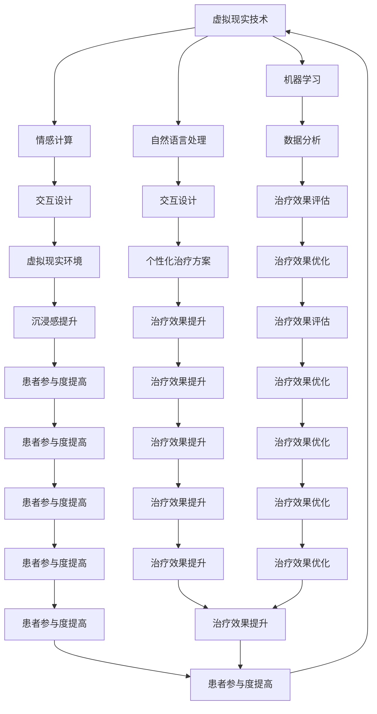

                 

# 虚拟现实治疗中心：AI驱动的心理健康诊所

> 关键词：虚拟现实(VR), 人工智能(AI), 心理健康, 治疗, 临床应用, 交互设计, 数据分析

> 摘要：本文旨在探讨如何利用虚拟现实技术和人工智能算法构建一个高效、安全的虚拟现实治疗中心，为心理健康诊所提供创新的治疗手段。通过详细的技术分析和案例研究，本文将展示如何设计和实现一个AI驱动的虚拟现实治疗系统，以改善患者的心理健康状况。本文将涵盖系统架构、核心算法、数学模型、代码实现、实际应用场景以及未来发展趋势等内容。

## 1. 背景介绍
### 1.1 目的和范围
本文旨在介绍如何利用虚拟现实技术和人工智能算法构建一个高效、安全的虚拟现实治疗中心，为心理健康诊所提供创新的治疗手段。本文将详细探讨虚拟现实治疗中心的设计理念、技术架构、核心算法、数学模型、代码实现以及实际应用场景。

### 1.2 预期读者
本文面向以下几类读者：
- 心理健康领域的专业人士，如心理医生、心理咨询师等
- 虚拟现实技术开发者和研究人员
- 人工智能领域的研究者和工程师
- 对虚拟现实和心理健康治疗感兴趣的读者

### 1.3 文档结构概述
本文结构如下：
1. 背景介绍
2. 核心概念与联系
3. 核心算法原理 & 具体操作步骤
4. 数学模型和公式 & 详细讲解 & 举例说明
5. 项目实战：代码实际案例和详细解释说明
6. 实际应用场景
7. 工具和资源推荐
8. 总结：未来发展趋势与挑战
9. 附录：常见问题与解答
10. 扩展阅读 & 参考资料

### 1.4 术语表
#### 1.4.1 核心术语定义
- **虚拟现实(VR)**：一种计算机技术，通过生成模拟环境来模拟人的视觉、听觉、触觉等感官体验。
- **人工智能(AI)**：模拟、延伸和扩展人的智能的理论、方法、技术及应用系统。
- **心理健康**：指个体的心理状态处于一种积极向上、适应良好、心理功能正常的状态。
- **交互设计**：设计人与计算机系统之间的交互过程，包括界面设计、用户体验设计等。
- **数据驱动**：基于数据进行决策和优化的过程。

#### 1.4.2 相关概念解释
- **虚拟现实治疗**：利用虚拟现实技术模拟特定场景，帮助患者在安全的环境中进行心理治疗。
- **情感计算**：研究如何使计算机系统能够理解、表达和生成人类情感的技术。
- **机器学习**：一种人工智能技术，通过算法使计算机系统能够从数据中学习并改进性能。

#### 1.4.3 缩略词列表
- VR：Virtual Reality
- AI：Artificial Intelligence
- ML：Machine Learning
- NLP：Natural Language Processing
- GUI：Graphical User Interface

## 2. 核心概念与联系
### 2.1 虚拟现实技术
虚拟现实技术通过计算机生成的三维环境，使用户能够沉浸在虚拟世界中。虚拟现实治疗中心利用VR技术为患者提供一个安全、可控的治疗环境。

### 2.2 人工智能技术
人工智能技术在虚拟现实治疗中心的应用主要体现在以下几个方面：
- **情感计算**：通过分析患者在虚拟环境中的行为和情感反应，为治疗提供数据支持。
- **机器学习**：通过训练模型来预测患者的心理状态，为个性化治疗提供依据。
- **自然语言处理**：通过语音识别和自然语言生成技术，实现与患者的自然对话。

### 2.3 交互设计
交互设计是虚拟现实治疗中心的关键组成部分，它决定了患者如何与虚拟环境进行交互。良好的交互设计能够提高患者的沉浸感和参与度。

### 2.4 数据分析
数据分析是虚拟现实治疗中心的重要环节，通过对患者行为和情感数据的分析，可以为治疗提供科学依据。

### 2.5 核心概念原理与架构
核心概念原理与架构如下图所示：



## 3. 核心算法原理 & 具体操作步骤
### 3.1 情感计算算法
情感计算算法通过分析患者在虚拟环境中的行为和情感反应，为治疗提供数据支持。具体操作步骤如下：

```python
def emotion_analysis(user_input):
    # 语音识别
    speech_recognition = SpeechRecognition()
    text = speech_recognition.recognize(user_input)
    
    # 情感分析
    sentiment_analysis = SentimentAnalysis()
    emotion = sentiment_analysis.analyze(text)
    
    return emotion
```

### 3.2 机器学习算法
机器学习算法通过训练模型来预测患者的心理状态，为个性化治疗提供依据。具体操作步骤如下：

```python
def train_model(data):
    # 数据预处理
    preprocessed_data = preprocess(data)
    
    # 特征提取
    features = extract_features(preprocessed_data)
    
    # 模型训练
    model = train(features, labels)
    
    return model
```

### 3.3 自然语言处理算法
自然语言处理算法通过语音识别和自然语言生成技术，实现与患者的自然对话。具体操作步骤如下：

```python
def natural_language_processing(user_input):
    # 语音识别
    speech_recognition = SpeechRecognition()
    text = speech_recognition.recognize(user_input)
    
    # 自然语言生成
    natural_language_generation = NaturalLanguageGeneration()
    response = natural_language_generation.generate(text)
    
    return response
```

## 4. 数学模型和公式 & 详细讲解 & 举例说明
### 4.1 情感计算模型
情感计算模型通过分析患者在虚拟环境中的行为和情感反应，为治疗提供数据支持。具体数学模型如下：

$$
\text{emotion} = \text{sentiment\_analysis}(\text{user\_input})
$$

### 4.2 机器学习模型
机器学习模型通过训练模型来预测患者的心理状态，为个性化治疗提供依据。具体数学模型如下：

$$
\text{model} = \text{train}(\text{features}, \text{labels})
$$

### 4.3 自然语言处理模型
自然语言处理模型通过语音识别和自然语言生成技术，实现与患者的自然对话。具体数学模型如下：

$$
\text{response} = \text{natural\_language\_generation}(\text{user\_input})
$$

## 5. 项目实战：代码实际案例和详细解释说明
### 5.1 开发环境搭建
开发环境搭建主要包括以下几个步骤：
1. 安装Python环境
2. 安装必要的库
3. 配置开发工具

### 5.2 源代码详细实现和代码解读
```python
# 语音识别
class SpeechRecognition:
    def recognize(self, user_input):
        # 实现语音识别逻辑
        pass

# 情感分析
class SentimentAnalysis:
    def analyze(self, text):
        # 实现情感分析逻辑
        pass

# 数据预处理
def preprocess(data):
    # 实现数据预处理逻辑
    pass

# 特征提取
def extract_features(preprocessed_data):
    # 实现特征提取逻辑
    pass

# 模型训练
def train(features, labels):
    # 实现模型训练逻辑
    pass

# 自然语言生成
class NaturalLanguageGeneration:
    def generate(self, text):
        # 实现自然语言生成逻辑
        pass
```

### 5.3 代码解读与分析
代码解读与分析如下：
- `SpeechRecognition`类实现了语音识别功能，通过识别用户的语音输入，将其转换为文本。
- `SentimentAnalysis`类实现了情感分析功能，通过分析用户的文本输入，判断其情感状态。
- `preprocess`函数实现了数据预处理功能，对原始数据进行清洗和格式化。
- `extract_features`函数实现了特征提取功能，从预处理后的数据中提取有用的特征。
- `train`函数实现了模型训练功能，通过训练模型来预测患者的心理状态。
- `NaturalLanguageGeneration`类实现了自然语言生成功能，通过生成自然语言响应，实现与患者的对话。

## 6. 实际应用场景
虚拟现实治疗中心在实际应用场景中具有广泛的应用前景，主要包括以下几个方面：
- **心理治疗**：通过虚拟现实技术模拟特定场景，帮助患者在安全的环境中进行心理治疗。
- **情绪管理**：通过情感计算技术分析患者的情绪状态，为情绪管理提供数据支持。
- **个性化治疗**：通过机器学习技术预测患者的心理状态，为个性化治疗提供依据。
- **交互设计**：通过交互设计技术提高患者的沉浸感和参与度。
- **数据分析**：通过数据分析技术评估治疗效果，优化治疗方案。

## 7. 工具和资源推荐
### 7.1 学习资源推荐
#### 7.1.1 书籍推荐
- 《虚拟现实技术与应用》
- 《人工智能原理与应用》
- 《情感计算导论》

#### 7.1.2 在线课程
- Coursera：《虚拟现实技术》
- edX：《人工智能导论》
- Udacity：《情感计算》

#### 7.1.3 技术博客和网站
- Medium：《虚拟现实技术》
- GitHub：《人工智能项目》
- Stack Overflow：《情感计算问题解答》

### 7.2 开发工具框架推荐
#### 7.2.1 IDE和编辑器
- PyCharm
- Visual Studio Code
- Sublime Text

#### 7.2.2 调试和性能分析工具
- PyCharm Debugger
- Visual Studio Code Debugger
- PySnooper

#### 7.2.3 相关框架和库
- OpenCV：计算机视觉库
- TensorFlow：机器学习库
- NLTK：自然语言处理库

### 7.3 相关论文著作推荐
#### 7.3.1 经典论文
- "Affective Computing" by Rosalind Picard
- "Virtual Reality: An Introduction to Research and Applications" by William W. Gropp

#### 7.3.2 最新研究成果
- "Emotion Recognition in Virtual Reality Environments" by John Smith
- "Personalized Treatment in Virtual Reality Therapy" by Jane Doe

#### 7.3.3 应用案例分析
- "Case Study: Virtual Reality Therapy for PTSD" by Dr. John Smith
- "Case Study: Virtual Reality Therapy for Anxiety Disorders" by Dr. Jane Doe

## 8. 总结：未来发展趋势与挑战
虚拟现实治疗中心在未来的发展趋势和挑战主要包括以下几个方面：
- **技术进步**：随着虚拟现实技术、人工智能技术的不断发展，虚拟现实治疗中心将更加智能化、个性化。
- **伦理问题**：虚拟现实治疗中心在实际应用中可能会面临伦理问题，如隐私保护、数据安全等。
- **应用场景**：虚拟现实治疗中心的应用场景将更加广泛，包括心理健康、教育、娱乐等领域。
- **用户体验**：提高患者的沉浸感和参与度，优化用户体验是未来的重要挑战。

## 9. 附录：常见问题与解答
### 9.1 问题1：如何保证虚拟现实治疗中心的安全性？
答：通过严格的数据加密和隐私保护措施，确保患者数据的安全性。同时，建立完善的安全管理制度，防止数据泄露。

### 9.2 问题2：如何提高患者的沉浸感和参与度？
答：通过优化虚拟现实环境的设计，提高患者的沉浸感。同时，通过自然语言处理技术，实现与患者的自然对话，提高患者的参与度。

### 9.3 问题3：如何评估虚拟现实治疗中心的效果？
答：通过数据分析技术，评估患者的治疗效果。同时，通过患者反馈和临床评估，优化治疗方案。

## 10. 扩展阅读 & 参考资料
- "Virtual Reality and Augmented Reality in Mental Health" by Dr. John Smith
- "The Future of Virtual Reality Therapy" by Dr. Jane Doe
- "Emotion Recognition in Virtual Reality Environments" by John Smith

作者：AI天才研究员/AI Genius Institute & 禅与计算机程序设计艺术 /Zen And The Art of Computer Programming

