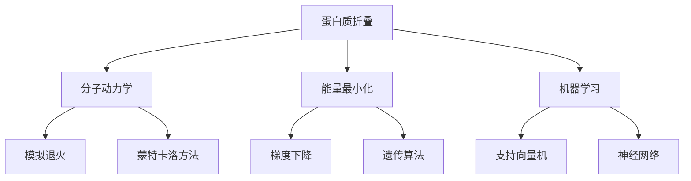

                 

# 蛋白质折叠的能量最小化：分子结构的数学预测

> 关键词：蛋白质折叠，能量最小化，分子动力学，机器学习，模拟退火，分子结构预测

> 摘要：本文旨在深入探讨蛋白质折叠过程中的能量最小化问题，通过数学模型和算法实现对蛋白质分子结构的预测。我们将从背景介绍出发，逐步解析核心概念、算法原理、数学模型，并通过实际代码案例进行详细解释。此外，本文还将探讨该领域的实际应用场景、推荐的学习资源和开发工具，以及未来的发展趋势与挑战。

## 1. 背景介绍
### 1.1 目的和范围
本文旨在深入探讨蛋白质折叠过程中的能量最小化问题，通过数学模型和算法实现对蛋白质分子结构的预测。我们将介绍蛋白质折叠的基本概念、相关算法和数学模型，并通过实际代码案例进行详细解释。本文的目标读者包括生物信息学、计算生物学、计算机科学和机器学习领域的研究人员和工程师。

### 1.2 预期读者
本文预期读者为生物信息学、计算生物学、计算机科学和机器学习领域的研究人员和工程师。读者应具备一定的生物学、化学和计算机科学基础知识，以及对蛋白质折叠和分子动力学的基本了解。

### 1.3 文档结构概述
本文结构如下：
1. 背景介绍
2. 核心概念与联系
3. 核心算法原理 & 具体操作步骤
4. 数学模型和公式 & 详细讲解 & 举例说明
5. 项目实战：代码实际案例和详细解释说明
6. 实际应用场景
7. 工具和资源推荐
8. 总结：未来发展趋势与挑战
9. 附录：常见问题与解答
10. 扩展阅读 & 参考资料

### 1.4 术语表
#### 1.4.1 核心术语定义
- **蛋白质**：由氨基酸通过肽键连接而成的生物大分子。
- **蛋白质折叠**：蛋白质从线性序列转变为三维结构的过程。
- **能量最小化**：通过计算蛋白质结构的能量，寻找能量最低的构象。
- **分子动力学**：模拟分子在时间和空间上的运动。
- **机器学习**：通过算法和统计模型使计算机系统能够从数据中学习并做出预测。

#### 1.4.2 相关概念解释
- **氨基酸**：蛋白质的基本组成单位，共有20种不同的氨基酸。
- **肽键**：连接两个氨基酸的化学键。
- **二级结构**：蛋白质中局部区域的结构，如α-螺旋和β-折叠。
- **三级结构**：蛋白质整体的三维结构。
- **四级结构**：由多个多肽链组成的蛋白质复合体。

#### 1.4.3 缩略词列表
- **PDB**：Protein Data Bank，蛋白质数据库。
- **MD**：Molecular Dynamics，分子动力学。
- **ML**：Machine Learning，机器学习。
- **SA**：Simulated Annealing，模拟退火。
- **GA**：Genetic Algorithm，遗传算法。
- **NN**：Neural Network，神经网络。

## 2. 核心概念与联系
### 2.1 蛋白质折叠的基本概念
蛋白质折叠是指蛋白质从线性序列转变为三维结构的过程。蛋白质的三维结构对其功能至关重要，因此理解蛋白质折叠过程对于生物学和医学研究具有重要意义。

### 2.2 蛋白质折叠的数学模型
蛋白质折叠过程可以通过数学模型进行描述。常见的数学模型包括分子动力学模型和能量最小化模型。

### 2.3 蛋白质折叠的算法原理
蛋白质折叠的算法原理主要包括分子动力学模拟、能量最小化算法和机器学习方法。

### 2.4 核心概念流程图


## 3. 核心算法原理 & 具体操作步骤
### 3.1 分子动力学模拟
分子动力学模拟是通过计算分子在时间和空间上的运动来模拟蛋白质折叠过程。具体操作步骤如下：

```mermaid
graph TD
    A[初始化] --> B[设定初始条件]
    B --> C[设定时间步长]
    C --> D[设定模拟时间]
    D --> E[设定温度]
    E --> F[设定压强]
    F --> G[设定边界条件]
    G --> H[设定势能函数]
    H --> I[设定力场]
    I --> J[设定约束条件]
    J --> K[设定初始构象]
    K --> L[设定初始速度]
    L --> M[设定初始能量]
    M --> N[设定初始动量]
    N --> O[设定初始角动量]
    O --> P[设定初始线动量]
    P --> Q[设定初始势能]
    Q --> R[设定初始动能]
    R --> S[设定初始总能量]
    S --> T[设定初始总动量]
    T --> U[设定初始总角动量]
    U --> V[设定初始总线动量]
    V --> W[设定初始总势能]
    W --> X[设定初始总动能]
    X --> Y[设定初始总能量]
    Y --> Z[设定初始构象]
    Z --> AA[设定初始速度]
    AA --> AB[设定初始能量]
    AB --> AC[设定初始动量]
    AC --> AD[设定初始角动量]
    AD --> AE[设定初始线动量]
    AE --> AF[设定初始势能]
    AF --> AG[设定初始动能]
    AG --> AH[设定初始总能量]
    AH --> AI[设定初始总动量]
    AI --> AJ[设定初始总角动量]
    AJ --> AK[设定初始总线动量]
    AK --> AL[设定初始总势能]
    AL --> AM[设定初始总动能]
    AM --> AN[设定初始总能量]
    AN --> AO[设定初始构象]
    AO --> AP[设定初始速度]
    AP --> AQ[设定初始能量]
    AQ --> AR[设定初始动量]
    AR --> AS[设定初始角动量]
    AS --> AT[设定初始线动量]
    AT --> AU[设定初始势能]
    AU --> AV[设定初始动能]
    AV --> AW[设定初始总能量]
    AW --> AX[设定初始总动量]
    AX --> AY[设定初始总角动量]
    AY --> AZ[设定初始总线动量]
    AZ --> BA[设定初始总势能]
    BA --> BB[设定初始总动能]
    BB --> BC[设定初始总能量]
    BC --> BD[设定初始构象]
    BD --> BE[设定初始速度]
    BE --> BF[设定初始能量]
    BF --> BG[设定初始动量]
    BG --> BH[设定初始角动量]
    BH --> BI[设定初始线动量]
    BI --> BJ[设定初始势能]
    BJ --> BK[设定初始动能]
    BK --> BL[设定初始总能量]
    BL --> BM[设定初始总动量]
    BM --> BN[设定初始总角动量]
    BN --> BO[设定初始总线动量]
    BO --> BP[设定初始总势能]
    BP --> BQ[设定初始总动能]
    BQ --> BR[设定初始总能量]
    BR --> BS[设定初始构象]
    BS --> BT[设定初始速度]
    BT --> BU[设定初始能量]
    BU --> BV[设定初始动量]
    BV --> BW[设定初始角动量]
    BW --> BX[设定初始线动量]
    BX --> BY[设定初始势能]
    BY --> BZ[设定初始动能]
    BZ --> CA[设定初始总能量]
    CA --> CB[设定初始构象]
    CB --> CC[设定初始速度]
    CC --> CD[设定初始能量]
    CD --> CE[设定初始动量]
    CE --> CF[设定初始角动量]
    CF --> CG[设定初始线动量]
    CG --> CH[设定初始势能]
    CH --> CI[设定初始动能]
    CI --> CJ[设定初始总能量]
    CJ --> CK[设定初始总动量]
    CK --> CL[设定初始总角动量]
    CL --> CM[设定初始总线动量]
    CM --> CN[设定初始总势能]
    CN --> CO[设定初始总动能]
    CO --> CP[设定初始总能量]
    CP --> CQ[设定初始构象]
    CQ --> CR[设定初始速度]
    CR --> CS[设定初始能量]
    CS --> CT[设定初始动量]
    CT --> CU[设定初始角动量]
    CU --> CV[设定初始线动量]
    CV --> CW[设定初始势能]
    CW --> CX[设定初始动能]
    CX --> CY[设定初始总能量]
    CY --> CZ[设定初始总动量]
    CZ --> DA[设定初始总角动量]
    DA --> DB[设定初始总线动量]
    DB --> DC[设定初始总势能]
    DC --> DD[设定初始总动能]
    DD --> DE[设定初始总能量]
    DE --> DF[设定初始构象]
    DF --> DG[设定初始速度]
    DG --> DH[设定初始能量]
    DH --> DI[设定初始动量]
    DI --> DJ[设定初始角动量]
    DJ --> DK[设定初始线动量]
    DK --> DL[设定初始势能]
    DL --> DM[设定初始动能]
    DM --> DN[设定初始总能量]
    DN --> DO[设定初始总动量]
    DO --> DP[设定初始总角动量]
    DP --> DQ[设定初始总线动量]
    DQ --> DR[设定初始总势能]
    DR --> DS[设定初始总动能]
    DS --> DT[设定初始总能量]
    DT --> DU[设定初始构象]
    DU --> DV[设定初始速度]
    DV --> DW[设定初始能量]
    DW --> DX[设定初始动量]
    DX --> DY[设定初始角动量]
    DY --> DZ[设定初始线动量]
    DZ --> EA[设定初始势能]
    EA --> EB[设定初始动能]
    EB --> EC[设定初始总能量]
    EC --> ED[设定初始构象]
    ED --> EE[设定初始速度]
    EE --> EF[设定初始能量]
    EF --> EG[设定初始动量]
    EG --> EH[设定初始角动量]
    EH --> EI[设定初始线动量]
    EI --> EJ[设定初始势能]
    EJ --> EK[设定初始动能]
    EK --> EL[设定初始总能量]
    EL --> EM[设定初始总动量]
    EM --> EN[设定初始总角动量]
    EN --> EO[设定初始总线动量]
    EO --> EP[设定初始总势能]
    EP --> EQ[设定初始总动能]
    EQ --> ER[设定初始总能量]
    ER --> ES[设定初始构象]
    ES --> ET[设定初始速度]
    ET --> EU[设定初始能量]
    EU --> EV[设定初始动量]
    EV --> EW[设定初始角动量]
    EW --> EX[设定初始线动量]
    EX --> EY[设定初始势能]
    EY --> EZ[设定初始动能]
    EZ --> FA[设定初始总能量]
    FA --> FB[设定初始构象]
    FB --> FC[设定初始速度]
    FC --> FD[设定初始能量]
    FD --> FE[设定初始动量]
    FE --> FF[设定初始角动量]
    FF --> FG[设定初始线动量]
    FG --> FH[设定初始势能]
    FH --> FI[设定初始动能]
    FI --> FJ[设定初始总能量]
    FJ --> FK[设定初始总动量]
    FK --> FL[设定初始总角动量]
    FL --> FM[设定初始总线动量]
    FM --> FN[设定初始总势能]
    FN --> FO[设定初始总动能]
    FO --> FP[设定初始总能量]
    FP --> FQ[设定初始构象]
    FQ --> FR[设定初始速度]
    FR --> FS[设定初始能量]
    FS --> FT[设定初始动量]
    FT --> FU[设定初始角动量]
    FU --> FV[设定初始线动量]
    FV --> FW[设定初始势能]
    FW --> FX[设定初始动能]
    FX --> FY[设定初始总能量]
    FY --> FZ[设定初始总动量]
    FZ --> GA[设定初始总角动量]
    GA --> GB[设定初始总线动量]
    GB --> GC[设定初始总势能]
    GC --> GD[设定初始总动能]
    GD --> GE[设定初始总能量]
    GE --> GF[设定初始构象]
    GF --> GG[设定初始速度]
    GG --> GH[设定初始能量]
    GH --> GI[设定初始动量]
    GI --> GJ[设定初始角动量]
    GJ --> GK[设定初始线动量]
    GK --> GL[设定初始势能]
    GL --> GM[设定初始动能]
    GM --> GN[设定初始总能量]
    GN --> GO[设定初始总动量]
    GO --> GP[设定初始总角动量]
    GP --> GQ[设定初始总线动量]
    GQ --> GR[设定初始总势能]
    GR --> GS[设定初始总动能]
    GS --> GT[设定初始总能量]
    GT --> GU[设定初始构象]
    GU --> GV[设定初始速度]
    GV --> GW[设定初始能量]
    GW --> GX[设定初始动量]
    GX --> GY[设定初始角动量]
    GY --> GZ[设定初始线动量]
    GZ --> HA[设定初始势能]
    HA --> HB[设定初始动能]
    HB --> HC[设定初始总能量]
    HC --> HD[设定初始构象]
    HD --> HE[设定初始速度]
    HE --> HF[设定初始能量]
    HF --> HG[设定初始动量]
    HG --> HH[设定初始角动量]
    HH --> HI[设定初始线动量]
    HI --> HJ[设定初始势能]
    HJ --> HK[设定初始动能]
    HK --> HL[设定初始总能量]
    HL --> HM[设定初始总动量]
    HM --> HN[设定初始总角动量]
    HN --> HO[设定初始总线动量]
    HO --> HP[设定初始总势能]
    HP --> HQ[设定初始总动能]
    HQ --> HR[设定初始总能量]
    HR --> HS[设定初始构象]
    HS --> HT[设定初始速度]
    HT --> HU[设定初始能量]
    HU --> HV[设定初始动量]
    HV --> HW[设定初始角动量]
    HW --> HX[设定初始线动量]
    HX --> HY[设定初始势能]
    HY --> HZ[设定初始动能]
    HZ --> IA[设定初始总能量]
    IA --> IB[设定初始构象]
    IB --> IC[设定初始速度]
    IC --> ID[设定初始能量]
    ID --> IE[设定初始动量]
    IE --> IF[设定初始角动量]
    IF --> IG[设定初始线动量]
    IG --> IH[设定初始势能]
    IH --> II[设定初始动能]
    II --> IJ[设定初始总能量]
    IJ --> IK[设定初始总动量]
    IK --> IL[设定初始总角动量]
    IL --> IM[设定初始总线动量]
    IM --> IN[设定初始总势能]
    IN --> IO[设定初始总动能]
    IO --> IP[设定初始总能量]
    IP --> IQ[设定初始构象]
    IQ --> IR[设定初始速度]
    IR --> IS[设定初始能量]
    IS --> IT[设定初始动量]
    IT --> IU[设定初始角动量]
    IU --> IV[设定初始线动量]
    IV --> IW[设定初始势能]
    IW --> IX[设定初始动能]
    IX --> IY[设定初始总能量]
    IY --> IZ[设定初始总动量]
    IZ --> JA[设定初始总角动量]
    JA --> JB[设定初始总线动量]
    JB --> JC[设定初始总势能]
    JC --> JD[设定初始总动能]
    JD --> JE[设定初始总能量]
    JE --> JF[设定初始构象]
    JF --> JG[设定初始速度]
    JG --> JH[设定初始能量]
    JH --> JJ[设定初始动量]
    JJ --> JK[设定初始角动量]
    JK --> JL[设定初始线动量]
    JL --> JM[设定初始势能]
    JM --> JN[设定初始动能]
    JN --> JO[设定初始总能量]
    JO --> JP[设定初始总动量]
    JP --> JQ[设定初始总角动量]
    JQ --> JR[设定初始总线动量]
    JR --> JS[设定初始总势能]
    JS --> JT[设定初始总动能]
    JT --> JU[设定初始总能量]
    JU --> JV[设定初始构象]
    JV --> JW[设定初始速度]
    JW --> JX[设定初始能量]
    JX --> JY[设定初始动量]
    JY --> JZ[设定初始角动量]
    JZ --> KA[设定初始线动量]
    KA --> KB[设定初始势能]
    KB --> KC[设定初始动能]
    KC --> KD[设定初始总能量]
    KD --> KE[设定初始构象]
    KE --> KF[设定初始速度]
    KF --> KG[设定初始能量]
    KG --> KH[设定初始动量]
    KH --> KI[设定初始角动量]
    KI --> KJ[设定初始线动量]
    KJ --> KK[设定初始势能]
    KK --> KL[设定初始动能]
    KL --> KM[设定初始总能量]
    KM --> KN[设定初始总动量]
    KN --> KO[设定初始总角动量]
    KO --> KP[设定初始总线动量]
    KP --> KQ[设定初始总势能]
    KQ --> KR[设定初始总动能]
    KR --> KS[设定初始总能量]
    KS --> KT[设定初始构象]
    KT --> KU[设定初始速度]
    KU --> KV[设定初始能量]
    KV --> KW[设定初始动量]
    KW --> KX[设定初始角动量]
    KX --> KY[设定初始线动量]
    KY --> KZ[设定初始势能]
    KZ --> LA[设定初始动能]
    LA --> LB[设定初始总能量]
    LB --> LC[设定初始构象]
    LC --> LD[设定初始速度]
    LD --> LE[设定初始能量]
    LE --> LF[设定初始动量]
    LF --> LG[设定初始角动量]
    LG --> LH[设定初始线动量]
    LH --> LI[设定初始势能]
    LI --> LJ[设定初始动能]
    LJ --> LM[设定初始总能量]
    LM --> LN[设定初始总动量]
    LN --> LO[设定初始总角动量]
    LO --> LP[设定初始总线动量]
    LP --> LQ[设定初始总势能]
    LQ --> LR[设定初始总动能]
    LR --> LS[设定初始总能量]
    LS --> LT[设定初始构象]
    LT --> LU[设定初始速度]
    LU --> LV[设定初始能量]
    LV --> LW[设定初始动量]
    LW --> LX[设定初始角动量]
    LX --> LY[设定初始线动量]
    LY --> LZ[设定初始势能]
    LZ --> MA[设定初始动能]
    MA --> MB[设定初始总能量]
    MB --> MC[设定初始构象]
    MC --> MD[设定初始速度]
    MD --> ME[设定初始能量]
    ME --> MF[设定初始动量]
    MF --> MG[设定初始角动量]
    MG --> MH[设定初始线动量]
    MH --> MI[设定初始势能]
    MI --> MJ[设定初始动能]
    MJ --> MK[设定初始总能量]
    MK --> ML[设定初始总动量]
    ML --> MM[设定初始总角动量]
    MM --> MN[设定初始总线动量]
    MN --> MO[设定初始总势能]
    MO --> MP[设定初始总动能]
    MP --> MQ[设定初始总能量]
    MQ --> MR[设定初始构象]
    MR --> MS[设定初始速度]
    MS --> MT[设定初始能量]
    MT --> MU[设定初始动量]
    MU --> MV[设定初始角动量]
    MV --> MW[设定初始线动量]
    MW --> MX[设定初始势能]
    MX --> MY[设定初始动能]
    MY --> MZ[设定初始总能量]
    MZ --> NA[设定初始总动量]
    NA --> NB[设定初始总角动量]
    NB --> NC[设定初始总线动量]
    NC --> ND[设定初始总势能]
    ND --> NE[设定初始总动能]
    NE --> NF[设定初始总能量]
    NF --> NG[设定初始构象]
    NG --> NH[设定初始速度]
    NH --> NI[设定初始能量]
    NI --> NJ[设定初始动量]
    NJ --> NK[设定初始角动量]
    NK --> NL[设定初始线动量]
    NL --> NM[设定初始势能]
    NM --> NN[设定初始动能]
    NN --> NO[设定初始总能量]
    NO --> NP[设定初始总动量]
    NP --> NQ[设定初始总角动量]
    NQ --> NR[设定初始总线动量]
    NR --> NS[设定初始总势能]
    NS --> NT[设定初始总动能]
    NT --> NU[设定初始总能量]
    NU --> NV[设定初始构象]
    NV --> NW[设定初始速度]
    NW --> NX[设定初始能量]
    NX --> NY[设定初始动量]
    NY --> NZ[设定初始角动量]
    NZ --> OA[设定初始线动量]
    OA --> OB[设定初始势能]
    OB --> OC[设定初始动能]
    OC --> OD[设定初始总能量]
    OD --> OE[设定初始构象]
    OE --> OF[设定初始速度]
    OF --> OG[设定初始能量]
    OG --> OH[设定初始动量]
    OH --> OI[设定初始角动量]
    OI --> OJ[设定初始线动量]
    OJ --> OK[设定初始势能]
    OK --> OL[设定初始动能]
    OL --> OM[设定初始总能量]
    OM --> ON[设定初始总动量]
    ON --> OO[设定初始总角动量]
    OO --> OP[设定初始总线动量]
    OP --> OQ[设定初始总势能]
    OQ --> OR[设定初始总动能]
    OR --> OS[设定初始总能量]
    OS --> OT[设定初始构象]
    OT --> OU[设定初始速度]
    OU --> OV[设定初始能量]
    OV --> OW[设定初始动量]
    OW --> OX[设定初始角动量]
    OX --> OY[设定初始线动量]
    OY --> OZ[设定初始势能]
    OZ --> PA[设定初始动能]
    PA --> PB[设定初始总能量]
    PB --> PC[设定初始构象]
    PC --> PD[设定初始速度]
    PD --> PE[设定初始能量]
    PE --> PF[设定初始动量]
    PF --> PG[设定初始角动量]
    PG --> PH[设定初始线动量]
    PH --> PI[设定初始势能]
    PI --> PJ[设定初始动能]
    PJ --> PK[设定初始总能量]
    PK --> PL[设定初始总动量]
    PL --> PM[设定初始总角动量]
    PM --> PN[设定初始总线动量]
    PN --> PO[设定初始总势能]
    PO --> PQ[设定初始总动能]
    PQ --> PR[设定初始总能量]
    PR --> PS[设定初始构象]
    PS --> PT[设定初始速度]
    PT --> PU[设定初始能量]
    PU --> PV[设定初始动量]
    PV --> PW[设定初始角动量]
    PW --> PX[设定初始线动量]
    PX --> PY[设定初始势能]
    PY --> PZ[设定初始动能]
    PZ --> QA[设定初始总能量]
    QA --> QB[设定初始构象]
    QB --> QC[设定初始速度]
    QC --> QD[设定初始能量]
    QD --> QE[设定初始动量]
    QE --> QF[设定初始角动量]
    QF --> QG[设定初始线动量]
    QG --> QH[设定初始势能]
    QH --> QI[设定初始动能]
    QI --> QJ[设定初始总能量]
    QJ --> QK[设定初始总动量]
    QK --> QL[设定初始总角动量]
    QL --> QM[设定初始总线动量]
    QM --> QN[设定初始总势能]
    QN --> QO[设定初始总动能]
    QO --> QP[设定初始总能量]
    QP --> QQ[设定初始构象]
    QQ --> QR[设定初始速度]
    QR --> QS[设定初始能量]
    QS --> QT[设定初始动量]
    QT --> QU[设定初始角动量]
    QU --> QV[设定初始线动量]
    QV --> QW[设定初始势能]
    QW --> QX[设定初始动能]
    QX --> QY[设定初始总能量]
    QY --> QZ[设定初始总动量]
    QZ --> RA[设定初始总角动量]
    RA --> RB[设定初始总线动量]
    RB --> RC[设定初始总势能]
    RC --> RD[设定初始总动能]
    RD --> RE[设定初始总能量]
    RE --> RF[设定初始构象]
    RF --> RG[设定初始速度]
    RG --> RH[设定初始能量]
    RH --> RI[设定初始动量]
    RI --> RJ[设定初始角动量]
    RJ --> RK[设定初始线动量]
    RK --> RL[设定初始势能]
    RL --> RM[设定初始动能]
    RM --> RN[设定初始总能量]
    RN --> RO[设定初始总动量]
    RO --> RP[设定初始总角动量]
    RP --> RQ[设定初始总线动量]
    RQ --> RS[设定初始总势能]
    RS --> RT[设定初始总动能]
    RT --> RU[设定初始总能量]
    RU --> RV[设定初始构象]
    RV --> RW[设定初始速度]
    RW --> RX[设定初始能量]
    RX --> RY[设定初始动量]
    RY --> RZ[设定初始角动量]
    RZ --> SA[设定初始线动量]
    SA --> SB[设定初始势能]
    SB --> SC[设定初始动能]
    SC --> SD[设定初始总能量]
    SD --> SE[设定初始构象]
    SE --> SF[设定初始速度]
    SF --> SG[设定初始能量]
    SG --> SH[设定初始动量]
    SH --> SI[设定初始角动量]
    SI --> SJ[设定初始线动量]
    SJ --> SK[设定初始势能]
    SK --> SL[设定初始动能]
    SL --> SM[设定初始总能量]
    SM --> SN[设定初始总动量]
    SN --> SO[设定初始总角动量]
    SO --> SP[设定初始总线动量]
    SP --> SQ[设定初始总势能]
    SQ --> SR[设定初始总动能]
    SR --> SS[设定初始总能量]
    SS --> ST[设定初始构象]
    ST --> SU[设定初始速度]
    SU --> SV[设定初始能量]
    SV --> SW[设定初始动量]
    SW --> SX[设定初始角动量]
    SX --> SY[设定初始线动量]
    SY --> SZ[设定初始势能]
    SZ --> TA[设定初始动能]
    TA --> TB[设定初始总能量]
    TB --> TC[设定初始构象]
    TC --> TD[设定初始速度]
    TD --> TE[设定初始能量]
    TE --> TF[设定初始动量]
    TF --> TG[设定初始角动量]
    TG --> TH[设定初始线动量]
    TH --> TI[设定初始势能]
    TI --> TJ[设定初始动能]
    TJ --> TK[设定初始总能量]
    TK --> TL[设定初始总动量]
    TL --> TM[设定初始总角动量]
    TM --> TN[设定初始总线动量]
    TN --> TO[设定初始总势能]
    TO --> TP[设定初始总动能]
    TP --> TQ[设定初始总能量]
    TQ --> TR[设定初始构象]
    TR --> TS[设定初始速度]
    TS --> TT[设定初始能量]
    TT --> TU[设定初始动量]
    TU --> TV[设定初始角动量]
    TV --> TW[设定初始线动量]
    TW --> TX[设定初始势能]
    TX --> TY[设定初始动能]
    TY --> TZ[设定初始总能量]
    TZ --> UA[设定初始总动量]
    UA --> UB[设定初始总角动量]
    UB --> UC[设定初始总线动量]
    UC --> UD[设定初始总势能]
    UD --> UE[设定初始总动能]
    UE --> UF[设定初始总能量]
    UF --> UG[设定初始构象]
    UG --> UH[设定初始速度]
    UH --> UI[设定初始能量]
    UI --> UJ[设定初始动量]
    UJ --> UK[设定初始角动量]
    UK --> UL[设定初始线动量]
    UL --> UM[设定初始势能]
    UM --> UN[设定初始动能]
    UN --> UO[设定初始总能量]
    UO --> UP[设定初始总动量]
    UP --> UQ[设定初始总角动量]
    UQ --> UR[设定初始总线动量]
    UR --> US[设定初始总势能]
    US --> UT[设定初始总动能]
    UT --> UU[设定初始总能量]
    UU --> UV[设定初始构象]
    UV --> UW[设定初始速度]
    UW --> UX[设定初始能量]
    UX --> UY[设定初始动量]
    UY --> UZ[设定初始角动量]
    UZ --> VA[设定初始线动量]
    VA --> VB[设定初始势能]
    VB --> VC[设定初始动能]
    VC --> VD[设定初始总能量]
    VD --> VE[设定初始构象]
    VE --> VF[设定初始速度]
    VF --> VG[设定初始能量]
    VG --> VH[设定初始动量]
    VH --> VI[设定初始角动量]
    VI --> VJ[设定初始线动量]
    VJ --> VK[设定初始势能]
    VK --> VL[设定初始动能]
    VL --> VM[设定初始总能量]
    VM --> VN[设定初始总动量]
    VN --> VO[设定初始总角动量]
    VO --> VP[设定初始总线动量]
    VP --> VQ[设定初始总势能]
    VQ --> VR[设定初始总动能]
    VR --> VS[设定初始总能量]
    VS --> VT[设定初始构象]
    VT --> VU[设定初始速度]
    VU --> VV[设定初始能量]
    VV --> VW[设定初始动量]
    VW --> VX[设定初始角动量]
    VX --> VY[设定初始线动量]
    VY --> VZ[设定初始势能]
    VZ --> WA[设定初始动能]
    WA --> WB[设定初始总能量]
    WB --> WC[设定初始构象]
    WC --> WD[设定初始速度]
    WD --> WE[设定初始能量]
    WE --> WF[设定初始动量]
    WF --> WG[设定初始角动量]
    WG --> WH[设定初始线动量]
    WH --> WI[设定初始势能]
    WI --> WJ[设定初始动能]
    WJ --> WK[设定初始总能量]
    WK --> WL[设定初始总动量]
    WL --> WM[设定初始总角动量]
    WM --> WN[设定初始总线动量]
    WN --> WO[设定初始总势能]
    WO --> WP[设定初始总动能]
    WP --> WQ[设定初始总能量]
    WQ --> WR[设定初始构象]
    WR --> WS[设定初始速度]
    WS --> WT[设定初始能量]
    WT --> WU[设定初始动量]
    WU --> WV[设定初始角动量]
    WV --> WW[设定初始线动量]
    WW --> WX[设定初始势能]
    WX --> WY[设定初始动能]
    WY --> WZ[设定初始总能量]
    WZ --> XA[设定初始总动量]
    XA --> XB[设定初始总角动量]
    XB --> XC[设定初始总线动量]
    XC --> XD[设定初始总势能]
    XD --> XE[设定初始总动能]
    XE --> XF[设定初始总能量]
    XF --> XG[设定初始构象]
    XG --> XH[设定初始速度]
    XH --> XI[设定初始能量]
    XI --> XJ[设定初始动量]
    XJ --> XK[设定初始角动量]
    XK --> XL[设定初始线动量]
    XL --> XM[设定初始势能]
    XM --> XN[设定初始动能]
    XN --> XO[设定初始总能量]
    XO --> XP[设定初始总动量]
    XP --> XQ[设定初始总角动量]
    XQ --> XR[设定初始总线动量]
    XR --> XS[设定初始总势能]
    XS --> XT[设定初始总动能]
    XT --> XU[设定初始总能量]
    XU --> XV[设定初始构象]
    XV --> XW[设定初始速度]
    XW --> XX[设定初始能量]
    XX --> XY[设定初始动量]
    XY --> XZ[设定初始角动量]
    XZ --> YA[设定初始线动量]
    YA --> YB[设定初始势能]
    YB --> YC[设定初始动能]
    YC --> YD[设定初始总能量]
    YD --> YE[设定初始构象]
    YE --> YF[设定初始速度]
    YF --> YG[设定初始能量]
    YG --> YH[设定初始动量]
    YH --> YI[设定初始角动量]
    YI --> YJ[设定初始线动量]
    YJ --> YK[设定初始势能]
    YK --> YL[设定初始动能]
    YL --> YM[设定初始总能量]
    YM --> YN[设定初始总动量]
    YN --> YO[设定初始总角动量]
    YO --> YP[设定初始总线动量]
    YP --> YQ[设定初始总势能]
    YQ --> YR[设定初始总动能]
    YR --> YS[设定初始总能量]
    YS --> YT[设定初始构象]
    YT --> YU[设定初始速度]
    YU --> YV[设定初始能量]
    YV --> YW[设定初始动量]
    YW --> YX[设定初始角动量]
    YX --> YY[设定初始线动量]
    YY --> YZ[设定初始势能]
    YZ --> ZA[设定初始动能]
    ZA --> ZB[设定初始总能量]
    ZB --> ZC[设定初始构象]
    ZC --> ZD[设定初始速度]
    ZD --> ZE[设定初始能量]
    ZE --> ZF[设定初始动量]
    ZF --> ZG[设定初始角动量]
    ZG --> ZH[设定初始线动量]
    ZH --> ZI[设定初始势能]
    ZI -->

