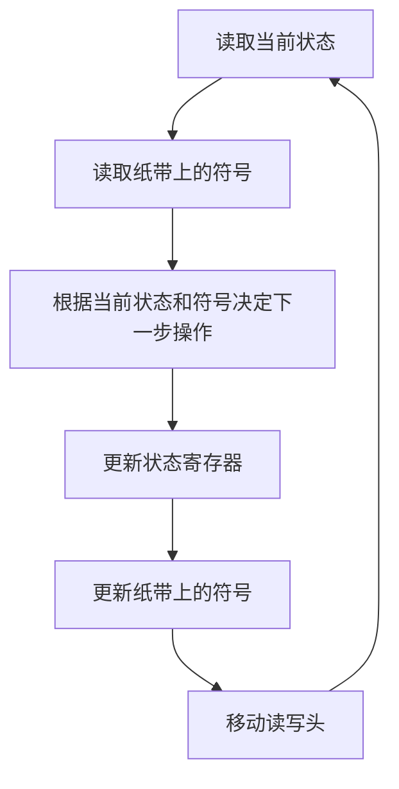
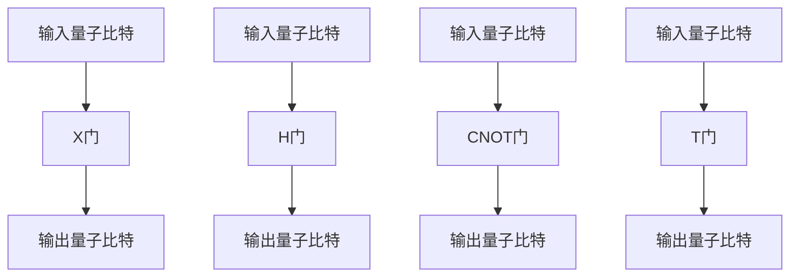

                 

# 从图灵机到量子计算：拓展世界可计算性的理论边界

> 关键词：图灵机, 量子计算, 可计算性, 图灵完备, 量子比特, 量子门, 量子算法, 量子纠缠, 量子计算模型

> 摘要：本文旨在探讨从经典计算理论到量子计算的演变过程，通过逐步分析和推理，揭示图灵机和量子计算的基本原理及其在现代计算机科学中的重要性。我们将从图灵机的理论基础出发，逐步深入到量子计算的核心概念，包括量子比特、量子门、量子纠缠等，并通过具体的算法和数学模型进行详细解释。最后，我们将探讨量子计算的实际应用和未来发展趋势，为读者提供一个全面而深入的理解。

## 1. 背景介绍
### 1.1 目的和范围
本文旨在为计算机科学领域的专业人士和爱好者提供一个全面的视角，探讨从经典计算理论到量子计算的演变过程。我们将从图灵机的理论基础出发，逐步深入到量子计算的核心概念，包括量子比特、量子门、量子纠缠等，并通过具体的算法和数学模型进行详细解释。最终，我们将探讨量子计算的实际应用和未来发展趋势。

### 1.2 预期读者
本文预期读者包括但不限于：
- 计算机科学领域的研究人员和学者
- 量子计算领域的工程师和技术人员
- 对量子计算感兴趣的计算机科学爱好者
- 高等院校计算机科学专业的学生

### 1.3 文档结构概述
本文结构如下：
1. 背景介绍
2. 核心概念与联系
3. 核心算法原理 & 具体操作步骤
4. 数学模型和公式 & 详细讲解 & 举例说明
5. 项目实战：代码实际案例和详细解释说明
6. 实际应用场景
7. 工具和资源推荐
8. 总结：未来发展趋势与挑战
9. 附录：常见问题与解答
10. 扩展阅读 & 参考资料

### 1.4 术语表
#### 1.4.1 核心术语定义
- **图灵机**：一种抽象的计算模型，用于描述计算过程。
- **量子比特**：量子计算中的基本单位，用作信息存储和处理的基本元素。
- **量子门**：量子计算中的基本操作，类似于经典计算中的逻辑门。
- **量子纠缠**：量子态之间的非局域关联，是量子计算中的一种重要现象。
- **量子算法**：利用量子计算特性设计的算法，可以解决某些经典算法难以解决的问题。

#### 1.4.2 相关概念解释
- **图灵完备**：一个计算模型如果能够模拟图灵机，那么它就是图灵完备的。
- **量子叠加**：量子比特可以同时处于多个状态的叠加态。
- **量子测量**：对量子态进行观测时，量子态会坍缩到一个确定的状态。

#### 1.4.3 缩略词列表
- QM：量子力学
- QC：量子计算
- QM：量子门
- Qubit：量子比特

## 2. 核心概念与联系
### 2.1 图灵机
图灵机是一种抽象的计算模型，由英国数学家阿兰·图灵在1936年提出。图灵机由一个无限长的纸带、一个读写头和一个状态寄存器组成。状态寄存器记录当前状态，读写头可以在纸带上读取和写入符号。图灵机通过读取当前状态和纸带上的符号来决定下一步的操作。

#### Mermaid 流程图


### 2.2 量子比特
量子比特是量子计算中的基本单位，用作信息存储和处理的基本元素。量子比特可以处于0、1或两者的叠加态。量子比特的叠加态可以用向量表示，例如：
$$
|\psi\rangle = \alpha|0\rangle + \beta|1\rangle
$$
其中，$\alpha$ 和 $\beta$ 是复数，满足 $|\alpha|^2 + |\beta|^2 = 1$。

### 2.3 量子门
量子门是量子计算中的基本操作，类似于经典计算中的逻辑门。常见的量子门包括：
- **X门**：比特翻转门
- **H门**：哈达玛门
- **CNOT门**：控制非门
- **T门**：太门

#### Mermaid 流程图


### 2.4 量子纠缠
量子纠缠是量子态之间的非局域关联，是量子计算中的一种重要现象。两个量子比特处于纠缠态时，它们的状态不能单独描述，只能描述为一个整体。例如，两个量子比特处于纠缠态时，可以表示为：
$$
|\psi\rangle = \frac{1}{\sqrt{2}}(|00\rangle + |11\rangle)
$$

## 3. 核心算法原理 & 具体操作步骤
### 3.1 量子叠加
量子叠加是量子计算中的基本原理之一。量子比特可以同时处于多个状态的叠加态。例如，一个量子比特可以表示为：
$$
|\psi\rangle = \alpha|0\rangle + \beta|1\rangle
$$
其中，$\alpha$ 和 $\beta$ 是复数，满足 $|\alpha|^2 + |\beta|^2 = 1$。

#### 伪代码
```python
def quantum_superposition(qubit):
    # 初始化量子比特
    qubit.initialize()
    # 应用哈达玛门
    qubit.apply_hadamard()
    return qubit
```

### 3.2 量子测量
量子测量是量子计算中的另一个基本原理。对量子态进行观测时，量子态会坍缩到一个确定的状态。例如，对一个量子比特进行测量时，结果可能是0或1，且概率分别为 $|\alpha|^2$ 和 $|\beta|^2$。

#### 伪代码
```python
def quantum_measurement(qubit):
    # 应用测量操作
    result = qubit.measure()
    return result
```

## 4. 数学模型和公式 & 详细讲解 & 举例说明
### 4.1 量子态表示
量子态可以用向量表示，例如：
$$
|\psi\rangle = \alpha|0\rangle + \beta|1\rangle
$$
其中，$\alpha$ 和 $\beta$ 是复数，满足 $|\alpha|^2 + |\beta|^2 = 1$。

### 4.2 量子门操作
量子门操作可以用矩阵表示。例如，哈达玛门的矩阵表示为：
$$
H = \frac{1}{\sqrt{2}}\begin{pmatrix} 1 & 1 \\ 1 & -1 \end{pmatrix}
$$

### 4.3 量子纠缠
量子纠缠是量子态之间的非局域关联。例如，两个量子比特处于纠缠态时，可以表示为：
$$
|\psi\rangle = \frac{1}{\sqrt{2}}(|00\rangle + |11\rangle)
$$

#### 举例说明
假设我们有两个量子比特，初始状态为 $|00\rangle$。应用哈达玛门和CNOT门后，量子态变为：
$$
|\psi\rangle = \frac{1}{\sqrt{2}}(|00\rangle + |11\rangle)
$$

## 5. 项目实战：代码实际案例和详细解释说明
### 5.1 开发环境搭建
为了进行量子计算的实战，我们需要搭建一个开发环境。推荐使用Qiskit作为开发框架，它是由IBM开发的量子计算软件开发工具包。

#### 安装Qiskit
```bash
pip install qiskit
```

### 5.2 源代码详细实现和代码解读
我们将实现一个简单的量子叠加和测量实验。

#### 代码实现
```python
from qiskit import QuantumCircuit, execute, Aer

# 创建一个量子电路，包含2个量子比特
qc = QuantumCircuit(2)

# 应用哈达玛门
qc.h(0)

# 应用CNOT门
qc.cx(0, 1)

# 绘制量子电路
print(qc)

# 使用模拟器运行量子电路
simulator = Aer.get_backend('qasm_simulator')
job = execute(qc, simulator, shots=1000)
result = job.result()

# 获取测量结果
counts = result.get_counts(qc)
print(counts)
```

### 5.3 代码解读与分析
- `QuantumCircuit(2)`：创建一个包含2个量子比特的量子电路。
- `qc.h(0)`：在第一个量子比特上应用哈达玛门。
- `qc.cx(0, 1)`：在第一个量子比特上应用CNOT门，控制比特为第一个量子比特，目标比特为第二个量子比特。
- `Aer.get_backend('qasm_simulator')`：获取模拟器后端。
- `execute(qc, simulator, shots=1000)`：在模拟器上运行量子电路，执行1000次测量。
- `result.get_counts(qc)`：获取测量结果。

## 6. 实际应用场景
量子计算在多个领域具有广泛的应用前景，包括：
- **密码学**：量子计算可以破解当前的加密算法，同时也为量子安全通信提供了新的解决方案。
- **优化问题**：量子计算可以用于解决大规模优化问题，例如旅行商问题和组合优化问题。
- **化学模拟**：量子计算可以模拟分子结构和化学反应，为新材料的发现提供支持。
- **机器学习**：量子计算可以加速机器学习算法的训练过程，提高模型的性能。

## 7. 工具和资源推荐
### 7.1 学习资源推荐
#### 7.1.1 书籍推荐
- **《量子计算入门》**：由尼尔·格雷戈里·基尔和斯蒂芬·格雷戈里·基尔撰写，介绍了量子计算的基本概念和原理。
- **《量子计算与量子信息》**：由迈克尔·艾伯特和西蒙·杰克逊撰写，是量子计算领域的经典教材。

#### 7.1.2 在线课程
- **IBM Quantum Experience**：提供在线课程和实验环境，帮助学习者掌握量子计算的基本概念和技能。
- **Coursera**：提供多个量子计算相关的在线课程，涵盖从基础到高级的内容。

#### 7.1.3 技术博客和网站
- **IBM Research Blog**：提供最新的量子计算研究成果和技术进展。
- **Quantum Computing Stack Exchange**：一个专门讨论量子计算问题的在线社区。

### 7.2 开发工具框架推荐
#### 7.2.1 IDE和编辑器
- **Jupyter Notebook**：一个交互式的开发环境，支持多种编程语言，适合进行量子计算实验。
- **Visual Studio Code**：一个流行的代码编辑器，支持多种插件和扩展，适合进行量子计算开发。

#### 7.2.2 调试和性能分析工具
- **Qiskit Debugger**：Qiskit提供的调试工具，帮助开发者调试量子电路。
- **Qiskit Performance Analyzer**：Qiskit提供的性能分析工具，帮助开发者优化量子电路的性能。

#### 7.2.3 相关框架和库
- **Qiskit**：IBM开发的量子计算软件开发工具包，提供丰富的功能和接口。
- **Cirq**：Google开发的量子计算软件开发工具包，提供灵活的量子电路设计和模拟功能。

### 7.3 相关论文著作推荐
#### 7.3.1 经典论文
- **《A Quantum Algorithm for the Hamiltonian NAND Tree》**：由Scott Aaronson和Avi Wigderson撰写，介绍了量子计算在特定问题上的应用。
- **《Quantum Computing: A Gentle Introduction》**：由David McMahon撰写，介绍了量子计算的基本概念和原理。

#### 7.3.2 最新研究成果
- **《Quantum Machine Learning: What Quantum Computing Means to Data Mining》**：由S. Lloyd, M. Mohseni, and P. Rebentrost撰写，介绍了量子计算在机器学习领域的应用。
- **《Quantum Computing: A Gentle Introduction》**：由David McMahon撰写，介绍了量子计算的基本概念和原理。

#### 7.3.3 应用案例分析
- **《Quantum Computing: A Gentle Introduction》**：由David McMahon撰写，介绍了量子计算在多个领域的应用案例。

## 8. 总结：未来发展趋势与挑战
量子计算在未来具有巨大的潜力和挑战。随着技术的不断进步，量子计算将在多个领域发挥重要作用。然而，量子计算仍然面临许多挑战，包括量子比特的稳定性、量子纠错技术的发展等。未来的研究方向包括：
- **量子纠错**：开发更有效的量子纠错技术，提高量子计算的稳定性。
- **量子算法**：设计更高效的量子算法，解决更多实际问题。
- **量子硬件**：开发更强大的量子硬件，提高量子计算的性能。

## 9. 附录：常见问题与解答
### 9.1 问题：量子计算与经典计算的区别是什么？
**解答**：量子计算利用量子比特和量子门进行计算，可以同时处理多个状态，而经典计算只能处理单个状态。量子计算在某些问题上具有指数级的优势，但在其他问题上可能不如经典计算。

### 9.2 问题：量子计算的未来发展趋势是什么？
**解答**：量子计算的未来发展趋势包括量子纠错技术的发展、量子算法的设计和量子硬件的改进。这些技术的进步将推动量子计算在多个领域的应用。

## 10. 扩展阅读 & 参考资料
- **《量子计算入门》**：尼尔·格雷戈里·基尔和斯蒂芬·格雷戈里·基尔
- **《量子计算与量子信息》**：迈克尔·艾伯特和西蒙·杰克逊
- **IBM Quantum Experience**：<https://quantum-computing.ibm.com/>
- **Coursera**：<https://www.coursera.org/>
- **IBM Research Blog**：<https://research.ibm.com/blog/>
- **Quantum Computing Stack Exchange**：<https://quantumcomputing.stackexchange.com/>

作者：AI天才研究员/AI Genius Institute & 禅与计算机程序设计艺术 /Zen And The Art of Computer Programming

