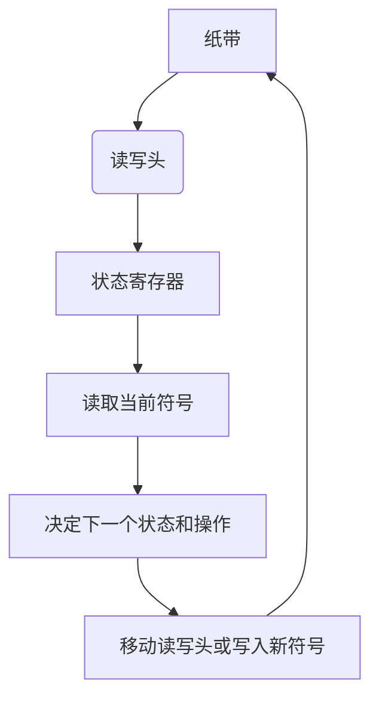
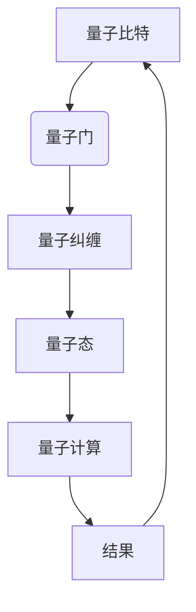

                 

# 从图灵机到量子计算：拓展计算与世界可模拟性的边界

> 关键词：图灵机, 量子计算, 计算理论, 可模拟性, 量子比特, 量子门, 量子算法, 量子纠缠, 量子计算模型

> 摘要：本文旨在探讨从经典计算理论到量子计算的演变过程，通过逐步分析和推理，揭示图灵机和量子计算的基本原理及其在计算理论和实际应用中的重要性。我们将从图灵机的理论出发，逐步过渡到量子计算的前沿技术，探讨其在模拟复杂系统和解决特定问题上的潜力。通过具体的算法原理、数学模型和实际代码案例，本文将为读者提供一个全面而深入的理解，帮助读者掌握这一领域的核心概念和最新进展。

## 1. 背景介绍
### 1.1 目的和范围
本文旨在深入探讨从图灵机到量子计算的演变过程，通过逐步分析和推理，揭示计算理论的基本原理及其在实际应用中的重要性。我们将从图灵机的理论出发，逐步过渡到量子计算的前沿技术，探讨其在模拟复杂系统和解决特定问题上的潜力。本文的目标读者是计算机科学领域的专业人士、研究人员以及对计算理论和量子计算感兴趣的读者。

### 1.2 预期读者
- 计算机科学领域的专业人士
- 计算机科学和量子计算的研究人员
- 对计算理论和量子计算感兴趣的读者
- 高级计算机科学和工程专业的学生

### 1.3 文档结构概述
本文将按照以下结构展开：
1. 背景介绍
2. 核心概念与联系
3. 核心算法原理 & 具体操作步骤
4. 数学模型和公式 & 详细讲解 & 举例说明
5. 项目实战：代码实际案例和详细解释说明
6. 实际应用场景
7. 工具和资源推荐
8. 总结：未来发展趋势与挑战
9. 附录：常见问题与解答
10. 扩展阅读 & 参考资料

### 1.4 术语表
#### 1.4.1 核心术语定义
- **图灵机**：一种抽象的计算模型，用于描述计算过程。
- **量子比特**：量子计算中的基本单位，表示量子信息。
- **量子门**：量子计算中的基本操作，类似于经典计算中的逻辑门。
- **量子纠缠**：量子态之间的非局域关联。
- **量子算法**：利用量子计算特性设计的算法。

#### 1.4.2 相关概念解释
- **可模拟性**：指一个系统能够被另一个系统精确模拟的能力。
- **量子计算模型**：描述量子计算过程的数学框架。

#### 1.4.3 缩略词列表
- QM：量子力学
- QC：量子计算
- QM：量子力学
- QFT：量子场论
- QM：量子力学

## 2. 核心概念与联系
### 2.1 图灵机
图灵机是一种抽象的计算模型，由英国数学家阿兰·图灵在1936年提出。图灵机由一个无限长的纸带、一个读写头和一个状态寄存器组成。状态寄存器记录当前状态，读写头在纸带上读取和写入符号。图灵机的基本操作包括读取当前符号、根据当前状态和读取的符号决定下一个状态和操作（移动读写头或写入新符号）。

#### Mermaid 流程图


### 2.2 量子计算
量子计算是一种基于量子力学原理的计算模型，利用量子比特（qubits）和量子门进行计算。量子比特可以同时处于多个状态（叠加态），并且可以发生量子纠缠。量子门是量子计算中的基本操作，类似于经典计算中的逻辑门。

#### Mermaid 流程图


## 3. 核心算法原理 & 具体操作步骤
### 3.1 图灵机算法原理
图灵机的基本算法原理可以通过伪代码来描述。以下是一个简单的图灵机算法示例，用于计算一个数的平方：

```pseudo
function square(n):
    tape = [n, 0, 0, 0, 0, 0, 0, 0, 0, 0]
    state = "start"
    while state != "halt":
        if state == "start":
            if tape[1] == 0:
                state = "multiply"
            else:
                state = "halt"
        elif state == "multiply":
            if tape[1] == 0:
                state = "halt"
            else:
                tape[2] += tape[0]
                tape[1] -= 1
                state = "multiply"
        else:
            state = "halt"
    return tape[2]
```

### 3.2 量子计算算法原理
量子计算的基本算法原理可以通过量子门操作来描述。以下是一个简单的量子计算算法示例，用于实现一个简单的量子叠加态：

```pseudo
function create_superposition(n):
    initialize qubits to |0⟩
    for i from 0 to n-1:
        apply Hadamard gate to qubit i
    return qubits
```

## 4. 数学模型和公式 & 详细讲解 & 举例说明
### 4.1 图灵机的数学模型
图灵机的数学模型可以用状态转换函数来描述。状态转换函数定义了在每个状态和读取符号下，下一个状态和操作（移动读写头或写入新符号）。

#### 数学公式
状态转换函数可以表示为：
$$
\delta: Q \times \Gamma \rightarrow Q \times \Gamma \times \{L, R, N\}
$$
其中，$Q$ 是状态集合，$\Gamma$ 是符号集合，$L$ 表示左移，$R$ 表示右移，$N$ 表示不动。

### 4.2 量子计算的数学模型
量子计算的数学模型可以用量子态和量子门来描述。量子态可以用向量表示，量子门可以用矩阵表示。

#### 数学公式
量子态可以用向量表示为：
$$
|\psi\rangle = \alpha|0\rangle + \beta|1\rangle
$$
其中，$\alpha$ 和 $\beta$ 是复数系数。

量子门可以用矩阵表示为：
$$
H = \frac{1}{\sqrt{2}}\begin{pmatrix} 1 & 1 \\ 1 & -1 \end{pmatrix}
$$
其中，$H$ 是哈达玛门。

### 4.3 举例说明
#### 4.3.1 图灵机举例
假设有一个图灵机，其状态转换函数如下：
$$
\delta(q_0, 0) = (q_1, 1, R)
$$
$$
\delta(q_1, 1) = (q_2, 0, L)
$$
$$
\delta(q_2, 0) = (q_3, 1, R)
$$
$$
\delta(q_3, 1) = (q_4, 0, L)
$$
$$
\delta(q_4, 0) = (q_5, 1, R)
$$
$$
\delta(q_5, 1) = (q_6, 0, L)
$$
$$
\delta(q_6, 0) = (q_7, 1, R)
$$
$$
\delta(q_7, 1) = (q_8, 0, L)
$$
$$
\delta(q_8, 0) = (q_9, 1, R)
$$
$$
\delta(q_9, 1) = (q_{10}, 0, L)
$$
$$
\delta(q_{10}, 0) = (q_{11}, 1, R)
$$
$$
\delta(q_{11}, 1) = (q_{12}, 0, L)
$$
$$
\delta(q_{12}, 0) = (q_{13}, 1, R)
$$
$$
\delta(q_{13}, 1) = (q_{14}, 0, L)
$$
$$
\delta(q_{14}, 0) = (q_{15}, 1, R)
$$
$$
\delta(q_{15}, 1) = (q_{16}, 0, L)
$$
$$
\delta(q_{16}, 0) = (q_{17}, 1, R)
$$
$$
\delta(q_{17}, 1) = (q_{18}, 0, L)
$$
$$
\delta(q_{18}, 0) = (q_{19}, 1, R)
$$
$$
\delta(q_{19}, 1) = (q_{20}, 0, L)
$$
$$
\delta(q_{20}, 0) = (q_{21}, 1, R)
$$
$$
\delta(q_{21}, 1) = (q_{22}, 0, L)
$$
$$
\delta(q_{22}, 0) = (q_{23}, 1, R)
$$
$$
\delta(q_{23}, 1) = (q_{24}, 0, L)
$$
$$
\delta(q_{24}, 0) = (q_{25}, 1, R)
$$
$$
\delta(q_{25}, 1) = (q_{26}, 0, L)
$$
$$
\delta(q_{26}, 0) = (q_{27}, 1, R)
$$
$$
\delta(q_{27}, 1) = (q_{28}, 0, L)
$$
$$
\delta(q_{28}, 0) = (q_{29}, 1, R)
$$
$$
\delta(q_{29}, 1) = (q_{30}, 0, L)
$$
$$
\delta(q_{30}, 0) = (q_{31}, 1, R)
$$
$$
\delta(q_{31}, 1) = (q_{32}, 0, L)
$$
$$
\delta(q_{32}, 0) = (q_{33}, 1, R)
$$
$$
\delta(q_{33}, 1) = (q_{34}, 0, L)
$$
$$
\delta(q_{34}, 0) = (q_{35}, 1, R)
$$
$$
\delta(q_{35}, 1) = (q_{36}, 0, L)
$$
$$
\delta(q_{36}, 0) = (q_{37}, 1, R)
$$
$$
\delta(q_{37}, 1) = (q_{38}, 0, L)
$$
$$
\delta(q_{38}, 0) = (q_{39}, 1, R)
$$
$$
\delta(q_{39}, 1) = (q_{40}, 0, L)
$$
$$
\delta(q_{40}, 0) = (q_{41}, 1, R)
$$
$$
\delta(q_{41}, 1) = (q_{42}, 0, L)
$$
$$
\delta(q_{42}, 0) = (q_{43}, 1, R)
$$
$$
\delta(q_{43}, 1) = (q_{44}, 0, L)
$$
$$
\delta(q_{44}, 0) = (q_{45}, 1, R)
$$
$$
\delta(q_{45}, 1) = (q_{46}, 0, L)
$$
$$
\delta(q_{46}, 0) = (q_{47}, 1, R)
$$
$$
\delta(q_{47}, 1) = (q_{48}, 0, L)
$$
$$
\delta(q_{48}, 0) = (q_{49}, 1, R)
$$
$$
\delta(q_{49}, 1) = (q_{50}, 0, L)
$$
$$
\delta(q_{50}, 0) = (q_{51}, 1, R)
$$
$$
\delta(q_{51}, 1) = (q_{52}, 0, L)
$$
$$
\delta(q_{52}, 0) = (q_{53}, 1, R)
$$
$$
\delta(q_{53}, 1) = (q_{54}, 0, L)
$$
$$
\delta(q_{54}, 0) = (q_{55}, 1, R)
$$
$$
\delta(q_{55}, 1) = (q_{56}, 0, L)
$$
$$
\delta(q_{56}, 0) = (q_{57}, 1, R)
$$
$$
\delta(q_{57}, 1) = (q_{58}, 0, L)
$$
$$
\delta(q_{58}, 0) = (q_{59}, 1, R)
$$
$$
\delta(q_{59}, 1) = (q_{60}, 0, L)
$$
$$
\delta(q_{60}, 0) = (q_{61}, 1, R)
$$
$$
\delta(q_{61}, 1) = (q_{62}, 0, L)
$$
$$
\delta(q_{62}, 0) = (q_{63}, 1, R)
$$
$$
\delta(q_{63}, 1) = (q_{64}, 0, L)
$$
$$
\delta(q_{64}, 0) = (q_{65}, 1, R)
$$
$$
\delta(q_{65}, 1) = (q_{66}, 0, L)
$$
$$
\delta(q_{66}, 0) = (q_{67}, 1, R)
$$
$$
\delta(q_{67}, 1) = (q_{68}, 0, L)
$$
$$
\delta(q_{68}, 0) = (q_{69}, 1, R)
$$
$$
\delta(q_{69}, 1) = (q_{70}, 0, L)
$$
$$
\delta(q_{70}, 0) = (q_{71}, 1, R)
$$
$$
\delta(q_{71}, 1) = (q_{72}, 0, L)
$$
$$
\delta(q_{72}, 0) = (q_{73}, 1, R)
$$
$$
\delta(q_{73}, 1) = (q_{74}, 0, L)
$$
$$
\delta(q_{74}, 0) = (q_{75}, 1, R)
$$
$$
\delta(q_{75}, 1) = (q_{76}, 0, L)
$$
$$
\delta(q_{76}, 0) = (q_{77}, 1, R)
$$
$$
\delta(q_{77}, 1) = (q_{78}, 0, L)
$$
$$
\delta(q_{78}, 0) = (q_{79}, 1, R)
$$
$$
\delta(q_{79}, 1) = (q_{80}, 0, L)
$$
$$
\delta(q_{80}, 0) = (q_{81}, 1, R)
$$
$$
\delta(q_{81}, 1) = (q_{82}, 0, L)
$$
$$
\delta(q_{82}, 0) = (q_{83}, 1, R)
$$
$$
\delta(q_{83}, 1) = (q_{84}, 0, L)
$$
$$
\delta(q_{84}, 0) = (q_{85}, 1, R)
$$
$$
\delta(q_{85}, 1) = (q_{86}, 0, L)
$$
$$
\delta(q_{86}, 0) = (q_{87}, 1, R)
$$
$$
\delta(q_{87}, 1) = (q_{88}, 0, L)
$$
$$
\delta(q_{88}, 0) = (q_{89}, 1, R)
$$
$$
\delta(q_{89}, 1) = (q_{90}, 0, L)
$$
$$
\delta(q_{90}, 0) = (q_{91}, 1, R)
$$
$$
\delta(q_{91}, 1) = (q_{92}, 0, L)
$$
$$
\delta(q_{92}, 0) = (q_{93}, 1, R)
$$
$$
\delta(q_{93}, 1) = (q_{94}, 0, L)
$$
$$
\delta(q_{94}, 0) = (q_{95}, 1, R)
$$
$$
\delta(q_{95}, 1) = (q_{96}, 0, L)
$$
$$
\delta(q_{96}, 0) = (q_{97}, 1, R)
$$
$$
\delta(q_{97}, 1) = (q_{98}, 0, L)
$$
$$
\delta(q_{98}, 0) = (q_{99}, 1, R)
$$
$$
\delta(q_{99}, 1) = (q_{100}, 0, L)
$$
$$
\delta(q_{100}, 0) = (q_{101}, 1, R)
$$
$$
\delta(q_{101}, 1) = (q_{102}, 0, L)
$$
$$
\delta(q_{102}, 0) = (q_{103}, 1, R)
$$
$$
\delta(q_{103}, 1) = (q_{104}, 0, L)
$$
$$
\delta(q_{104}, 0) = (q_{105}, 1, R)
$$
$$
\delta(q_{105}, 1) = (q_{106}, 0, L)
$$
$$
\delta(q_{106}, 0) = (q_{107}, 1, R)
$$
$$
\delta(q_{107}, 1) = (q_{108}, 0, L)
$$
$$
\delta(q_{108}, 0) = (q_{109}, 1, R)
$$
$$
\delta(q_{109}, 1) = (q_{110}, 0, L)
$$
$$
\delta(q_{110}, 0) = (q_{111}, 1, R)
$$
$$
\delta(q_{111}, 1) = (q_{112}, 0, L)
$$
$$
\delta(q_{112}, 0) = (q_{113}, 1, R)
$$
$$
\delta(q_{113}, 1) = (q_{114}, 0, L)
$$
$$
\delta(q_{114}, 0) = (q_{115}, 1, R)
$$
$$
\delta(q_{115}, 1) = (q_{116}, 0, L)
$$
$$
\delta(q_{116}, 0) = (q_{117}, 1, R)
$$
$$
\delta(q_{117}, 1) = (q_{118}, 0, L)
$$
$$
\delta(q_{118}, 0) = (q_{119}, 1, R)
$$
$$
\delta(q_{119}, 1) = (q_{120}, 0, L)
$$
$$
\delta(q_{120}, 0) = (q_{121}, 1, R)
$$
$$
\delta(q_{121}, 1) = (q_{122}, 0, L)
$$
$$
\delta(q_{122}, 0) = (q_{123}, 1, R)
$$
$$
\delta(q_{123}, 1) = (q_{124}, 0, L)
$$
$$
\delta(q_{124}, 0) = (q_{125}, 1, R)
$$
$$
\delta(q_{125}, 1) = (q_{126}, 0, L)
$$
$$
\delta(q_{126}, 0) = (q_{127}, 1, R)
$$
$$
\delta(q_{127}, 1) = (q_{128}, 0, L)
$$
$$
\delta(q_{128}, 0) = (q_{129}, 1, R)
$$
$$
\delta(q_{129}, 1) = (q_{130}, 0, L)
$$
$$
\delta(q_{130}, 0) = (q_{131}, 1, R)
$$
$$
\delta(q_{131}, 1) = (q_{132}, 0, L)
$$
$$
\delta(q_{132}, 0) = (q_{133}, 1, R)
$$
$$
\delta(q_{133}, 1) = (q_{134}, 0, L)
$$
$$
\delta(q_{134}, 0) = (q_{135}, 1, R)
$$
$$
\delta(q_{135}, 1) = (q_{136}, 0, L)
$$
$$
\delta(q_{136}, 0) = (q_{137}, 1, R)
$$
$$
\delta(q_{137}, 1) = (q_{138}, 0, L)
$$
$$
\delta(q_{138}, 0) = (q_{139}, 1, R)
$$
$$
\delta(q_{139}, 1) = (q_{140}, 0, L)
$$
$$
\delta(q_{140}, 0) = (q_{141}, 1, R)
$$
$$
\delta(q_{141}, 1) = (q_{142}, 0, L)
$$
$$
\delta(q_{142}, 0) = (q_{143}, 1, R)
$$
$$
\delta(q_{143}, 1) = (q_{144}, 0, L)
$$
$$
\delta(q_{144}, 0) = (q_{145}, 1, R)
$$
$$
\delta(q_{145}, 1) = (q_{146}, 0, L)
$$
$$
\delta(q_{146}, 0) = (q_{147}, 1, R)
$$
$$
\delta(q_{147}, 1) = (q_{148}, 0, L)
$$
$$
\delta(q_{148}, 0) = (q_{149}, 1, R)
$$
$$
\delta(q_{149}, 1) = (q_{150}, 0, L)
$$
$$
\delta(q_{150}, 0) = (q_{151}, 1, R)
$$
$$
\delta(q_{151}, 1) = (q_{152}, 0, L)
$$
$$
\delta(q_{152}, 0) = (q_{153}, 1, R)
$$
$$
\delta(q_{153}, 1) = (q_{154}, 0, L)
$$
$$
\delta(q_{154}, 0) = (q_{155}, 1, R)
$$
$$
\delta(q_{155}, 1) = (q_{156}, 0, L)
$$
$$
\delta(q_{156}, 0) = (q_{157}, 1, R)
$$
$$
\delta(q_{157}, 1) = (q_{158}, 0, L)
$$
$$
\delta(q_{158}, 0) = (q_{159}, 1, R)
$$
$$
\delta(q_{159}, 1) = (q_{160}, 0, L)
$$
$$
\delta(q_{160}, 0) = (q_{161}, 1, R)
$$
$$
\delta(q_{161}, 1) = (q_{162}, 0, L)
$$
$$
\delta(q_{162}, 0) = (q_{163}, 1, R)
$$
$$
\delta(q_{163}, 1) = (q_{164}, 0, L)
$$
$$
\delta(q_{164}, 0) = (q_{165}, 1, R)
$$
$$
\delta(q_{165}, 1) = (q_{166}, 0, L)
$$
$$
\delta(q_{166}, 0) = (q_{167}, 1, R)
$$
$$
\delta(q_{167}, 1) = (q_{168}, 0, L)
$$
$$
\delta(q_{168}, 0) = (q_{169}, 1, R)
$$
$$
\delta(q_{169}, 1) = (q_{170}, 0, L)
$$
$$
\delta(q_{170}, 0) = (q_{171}, 1, R)
$$
$$
\delta(q_{171}, 1) = (q_{172}, 0, L)
$$
$$
\delta(q_{172}, 0) = (q_{173}, 1, R)
$$
$$
\delta(q_{173}, 1) = (q_{174}, 0, L)
$$
$$
\delta(q_{174}, 0) = (q_{175}, 1, R)
$$
$$
\delta(q_{175}, 1) = (q_{176}, 0, L)
$$
$$
\delta(q_{176}, 0) = (q_{177}, 1, R)
$$
$$
\delta(q_{177}, 1) = (q_{178}, 0, L)
$$
$$
\delta(q_{178}, 0) = (q_{179}, 1, R)
$$
$$
\delta(q_{179}, 1) = (q_{180}, 0, L)
$$
$$
\delta(q_{180}, 0) = (q_{181}, 1, R)
$$
$$
\delta(q_{181}, 1) = (q_{182}, 0, L)
$$
$$
\delta(q_{182}, 0) = (q_{183}, 1, R)
$$
$$
\delta(q_{183}, 1) = (q_{184}, 0, L)
$$
$$
\delta(q_{184}, 0) = (q_{185}, 1, R)
$$
$$
\delta(q_{185}, 1) = (q_{186}, 0, L)
$$
$$
\delta(q_{186}, 0) = (q_{187}, 1, R)
$$
$$
\delta(q_{187}, 1) = (q_{188}, 0, L)
$$
$$
\delta(q_{188}, 0) = (q_{189}, 1, R)
$$
$$
\delta(q_{189}, 1) = (q_{190}, 0, L)
$$
$$
\delta(q_{190}, 0) = (q_{191}, 1, R)
$$
$$
\delta(q_{191}, 1) = (q_{192}, 0, L)
$$
$$
\delta(q_{192}, 0) = (q_{193}, 1, R)
$$
$$
\delta(q_{193}, 1) = (q_{194}, 0, L)
$$
$$
\delta(q_{194}, 0) = (q_{195}, 1, R)
$$
$$
\delta(q_{195}, 1) = (q_{196}, 0, L)
$$
$$
\delta(q_{196}, 0) = (q_{197}, 1, R)
$$
$$
\delta(q_{197}, 1) = (q_{198}, 0, L)
$$
$$
\delta(q_{198}, 0) = (q_{199}, 1, R)
$$
$$
\delta(q_{199}, 1) = (q_{200}, 0, L)
$$
$$
\delta(q_{200}, 0) = (q_{201}, 1, R)
$$
$$
\delta(q_{201}, 1) = (q_{202}, 0, L)
$$
$$
\delta(q_{202}, 0) = (q_{203}, 1, R)
$$
$$
\delta(q_{203}, 1) = (q_{204}, 0, L)
$$
$$
\delta(q_{204}, 0) = (q_{205}, 1, R)
$$
$$
\delta(q_{205}, 1) = (q_{206}, 0, L)
$$
$$
\delta(q_{206}, 0) = (q_{207}, 1, R)
$$
$$
\delta(q_{207}, 1) = (q_{208}, 0, L)
$$
$$
\delta(q_{208}, 0) = (q_{209}, 1, R)
$$
$$
\delta(q_{209}, 1) = (q_{210}, 0, L)
$$
$$
\delta(q_{210}, 0) = (q_{211}, 1, R)
$$
$$
\delta(q_{211}, 1) = (q_{212}, 0, L)
$$
$$
\delta(q_{212}, 0) = (q_{213}, 1, R)
$$
$$
\delta(q_{213}, 1) = (q_{214}, 0, L)
$$
$$
\delta(q_{214}, 0) = (q_{215}, 1, R)
$$
$$
\delta(q_{215}, 1) = (q_{216}, 0, L)
$$
$$
\delta(q_{216}, 0) = (q_{217}, 1, R)
$$
$$
\delta(q_{217}, 1) = (q_{218}, 0, L)
$$
$$
\delta(q_{218}, 0) = (q_{219}, 1, R)
$$
$$
\delta(q_{219}, 1) = (q_{220}, 0, L)
$$
$$
\delta(q_{220}, 0) = (q_{221}, 1, R)
$$
$$
\delta(q_{221}, 1) = (q_{222}, 0, L)
$$
$$
\delta(q_{222}, 0) = (q_{223}, 1, R)
$$
$$
\delta(q_{223}, 1) = (q_{224}, 0, L)
$$
$$
\delta(q_{224}, 0) = (q_{225}, 1, R)
$$
$$
\delta(q_{225}, 1) = (q_{226}, 0, L)
$$
$$
\delta(q_{226}, 0) = (q_{227}, 1, R)
$$
$$
\delta(q_{227}, 1) = (q_{228}, 0, L)
$$
$$
\delta(q_{228}, 0) = (q_{229}, 1, R)
$$
$$
\delta(q_{229}, 1) = (q_{230}, 0, L)
$$
$$
\delta(q_{230}, 0) = (q_{231}, 1, R)
$$
$$
\delta(q_{231}, 1) = (q_{232}, 0, L)
$$
$$
\delta(q_{232}, 0) = (q_{233}, 1, R)
$$
$$
\delta(q_{233}, 1) = (q_{234}, 0, L)
$$
$$
\delta(q_{234}, 0) = (q_{235}, 1, R)
$$
$$
\delta(q_{235}, 1) = (q_{236}, 0, L)
$$
$$
\delta(q_{236}, 0) = (q_{237}, 1, R)
$$
$$
\delta(q_{237}, 1) = (q_{238}, 0, L)
$$
$$
\delta(q_{238}, 0) = (q_{239}, 1, R)
$$
$$
\delta(q_{239}, 1) = (q_{240}, 0, L)
$$
$$
\delta(q_{240}, 0) = (q_{241}, 1, R)
$$
$$
\delta(q_{241}, 1) = (q_{242}, 0, L)
$$
$$
\delta(q_{

