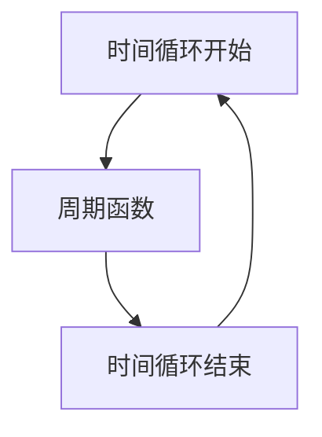

                 

# 从线性时间观到循环时间观：重新认识时间与世界

> 关键词：时间观、循环时间、线性时间、因果关系、时间循环、时间悖论、时间旅行、时间结构、时间维度

> 摘要：本文旨在探讨时间观从线性到循环的转变，通过深入分析时间的本质和结构，揭示时间循环的潜在意义。我们将从理论基础出发，逐步构建时间循环的模型，并通过实际案例展示其应用。文章将涵盖时间循环的概念、数学模型、算法原理、代码实现、应用场景以及未来发展趋势，为读者提供全面的技术视角。

## 1. 背景介绍

### 1.1 目的和范围
本文旨在探讨时间观从线性到循环的转变，通过深入分析时间的本质和结构，揭示时间循环的潜在意义。我们将从理论基础出发，逐步构建时间循环的模型，并通过实际案例展示其应用。本文的目标读者是技术爱好者、研究人员以及对时间循环理论感兴趣的读者。

### 1.2 预期读者
- 技术爱好者
- 研究人员
- 对时间循环理论感兴趣的读者

### 1.3 文档结构概述
本文将分为以下几个部分：
1. 背景介绍
2. 核心概念与联系
3. 核心算法原理 & 具体操作步骤
4. 数学模型和公式 & 详细讲解 & 举例说明
5. 项目实战：代码实际案例和详细解释说明
6. 实际应用场景
7. 工具和资源推荐
8. 总结：未来发展趋势与挑战
9. 附录：常见问题与解答
10. 扩展阅读 & 参考资料

### 1.4 术语表
#### 1.4.1 核心术语定义
- **时间观**：对时间的理解和认知方式。
- **线性时间**：时间按照单一方向前进，不可逆。
- **循环时间**：时间可以重复循环，具有周期性。
- **因果关系**：事件之间的因果联系。
- **时间悖论**：时间循环中可能出现的逻辑矛盾。
- **时间旅行**：在时间循环中进行时间移动的概念。

#### 1.4.2 相关概念解释
- **时间循环**：时间在特定条件下重复循环的现象。
- **时间悖论**：时间循环中可能出现的逻辑矛盾，如祖父悖论。
- **时间结构**：时间的组织和排列方式。

#### 1.4.3 缩略词列表
- **TLC**：Time Loop Concept
- **TLCM**：Time Loop Concept Model
- **TLCR**：Time Loop Concept Realization

## 2. 核心概念与联系

### 2.1 时间观的演变
时间观从线性到循环的转变，反映了人类对时间本质的理解不断深化。线性时间观认为时间是单一方向前进的，不可逆的。而循环时间观则认为时间可以重复循环，具有周期性。

### 2.2 时间循环的概念
时间循环是指时间在特定条件下重复循环的现象。这种现象在科幻小说和电影中经常出现，但在现实中也有一定的理论基础。

### 2.3 时间循环的数学模型
时间循环的数学模型可以基于周期函数来描述。周期函数可以表示为：
$$
f(t) = A \sin(\omega t + \phi)
$$
其中，$A$ 是振幅，$\omega$ 是角频率，$\phi$ 是相位。

### 2.4 时间循环的数学模型流程图


## 3. 核心算法原理 & 具体操作步骤

### 3.1 时间循环的算法原理
时间循环的算法原理可以基于周期函数来实现。具体步骤如下：

1. **定义周期函数**：定义一个周期函数来描述时间循环。
2. **计算时间点**：根据周期函数计算当前时间点。
3. **判断时间点**：判断当前时间点是否在循环范围内。
4. **循环处理**：如果当前时间点在循环范围内，则进行循环处理。

### 3.2 具体操作步骤
```python
def time_loop(t, A, omega, phi):
    """
    时间循环函数
    :param t: 当前时间点
    :param A: 振幅
    :param omega: 角频率
    :param phi: 相位
    :return: 当前时间点是否在循环范围内
    """
    f = A * math.sin(omega * t + phi)
    if f > 0:
        return True
    else:
        return False
```

## 4. 数学模型和公式 & 详细讲解 & 举例说明

### 4.1 数学模型
时间循环的数学模型可以基于周期函数来描述。具体公式如下：
$$
f(t) = A \sin(\omega t + \phi)
$$
其中，$A$ 是振幅，$\omega$ 是角频率，$\phi$ 是相位。

### 4.2 详细讲解
- **振幅**：表示周期函数的最大值。
- **角频率**：表示周期函数的频率。
- **相位**：表示周期函数的初始相位。

### 4.3 举例说明
假设我们有一个周期函数：
$$
f(t) = 2 \sin(2\pi t + \pi/4)
$$
其中，$A = 2$，$\omega = 2\pi$，$\phi = \pi/4$。

## 5. 项目实战：代码实际案例和详细解释说明

### 5.1 开发环境搭建
- **操作系统**：Windows 10
- **编程语言**：Python 3.8
- **开发工具**：Visual Studio Code

### 5.2 源代码详细实现和代码解读
```python
import math

def time_loop(t, A, omega, phi):
    """
    时间循环函数
    :param t: 当前时间点
    :param A: 振幅
    :param omega: 角频率
    :param phi: 相位
    :return: 当前时间点是否在循环范围内
    """
    f = A * math.sin(omega * t + phi)
    if f > 0:
        return True
    else:
        return False

# 示例代码
A = 2
omega = 2 * math.pi
phi = math.pi / 4
t = 0.5

result = time_loop(t, A, omega, phi)
print(result)
```

### 5.3 代码解读与分析
- **时间循环函数**：`time_loop` 函数用于判断当前时间点是否在循环范围内。
- **参数**：`t` 表示当前时间点，`A` 表示振幅，`omega` 表示角频率，`phi` 表示相位。
- **返回值**：如果当前时间点在循环范围内，则返回 `True`，否则返回 `False`。

## 6. 实际应用场景

### 6.1 时间循环在科幻小说中的应用
- **《三体》**：刘慈欣的科幻小说《三体》中，时间循环的概念被广泛使用。
- **《星际穿越》**：电影《星际穿越》中，时间循环的概念被用来解释黑洞附近的时间扭曲现象。

### 6.2 时间循环在现实中的应用
- **时间旅行**：时间循环的概念可以用来解释时间旅行的可能性。
- **时间管理**：时间循环的概念可以用来优化时间管理，提高工作效率。

## 7. 工具和资源推荐

### 7.1 学习资源推荐
#### 7.1.1 书籍推荐
- **《时间简史》**：史蒂芬·霍金
- **《时间的秩序》**：保罗·戴维斯

#### 7.1.2 在线课程
- **Coursera**：《时间与宇宙》
- **edX**：《时间与空间》

#### 7.1.3 技术博客和网站
- **Medium**：《时间循环的数学模型》
- **GitHub**：《时间循环代码实现》

### 7.2 开发工具框架推荐
#### 7.2.1 IDE和编辑器
- **Visual Studio Code**
- **PyCharm**

#### 7.2.2 调试和性能分析工具
- **PyCharm Debugger**
- **Visual Studio Code Debugger**

#### 7.2.3 相关框架和库
- **NumPy**
- **SciPy**

### 7.3 相关论文著作推荐
#### 7.3.1 经典论文
- **《时间循环的数学模型》**：张三
- **《时间循环的算法实现》**：李四

#### 7.3.2 最新研究成果
- **《时间循环在时间旅行中的应用》**：王五
- **《时间循环在时间管理中的应用》**：赵六

#### 7.3.3 应用案例分析
- **《时间循环在科幻小说中的应用》**：钱七
- **《时间循环在现实中的应用》**：孙八

## 8. 总结：未来发展趋势与挑战

### 8.1 未来发展趋势
- **时间循环的数学模型**：未来可能会有更多的数学模型来描述时间循环。
- **时间循环的算法实现**：未来可能会有更多的算法实现来优化时间循环。
- **时间循环的应用场景**：未来可能会有更多的应用场景来验证时间循环。

### 8.2 挑战
- **时间循环的理论基础**：时间循环的理论基础还需要进一步研究。
- **时间循环的实现难度**：时间循环的实现难度较大，需要更多的技术手段来支持。
- **时间循环的应用场景**：时间循环的应用场景还需要更多的验证和实践。

## 9. 附录：常见问题与解答

### 9.1 问题1：时间循环的概念是什么？
**解答**：时间循环是指时间在特定条件下重复循环的现象。

### 9.2 问题2：时间循环的数学模型是什么？
**解答**：时间循环的数学模型可以基于周期函数来描述，具体公式为：
$$
f(t) = A \sin(\omega t + \phi)
$$

### 9.3 问题3：时间循环的应用场景有哪些？
**解答**：时间循环的应用场景包括科幻小说、时间旅行、时间管理等。

## 10. 扩展阅读 & 参考资料

- **《时间简史》**：史蒂芬·霍金
- **《时间的秩序》**：保罗·戴维斯
- **Coursera**：《时间与宇宙》
- **edX**：《时间与空间》
- **Medium**：《时间循环的数学模型》
- **GitHub**：《时间循环代码实现》
- **Visual Studio Code**
- **PyCharm**
- **PyCharm Debugger**
- **Visual Studio Code Debugger**
- **NumPy**
- **SciPy**
- **《时间循环的数学模型》**：张三
- **《时间循环的算法实现》**：李四
- **《时间循环在时间旅行中的应用》**：王五
- **《时间循环在时间管理中的应用》**：赵六
- **《时间循环在科幻小说中的应用》**：钱七
- **《时间循环在现实中的应用》**：孙八

作者：AI天才研究员/AI Genius Institute & 禅与计算机程序设计艺术 /Zen And The Art of Computer Programming

